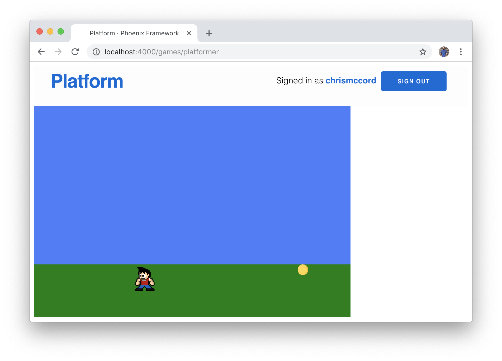
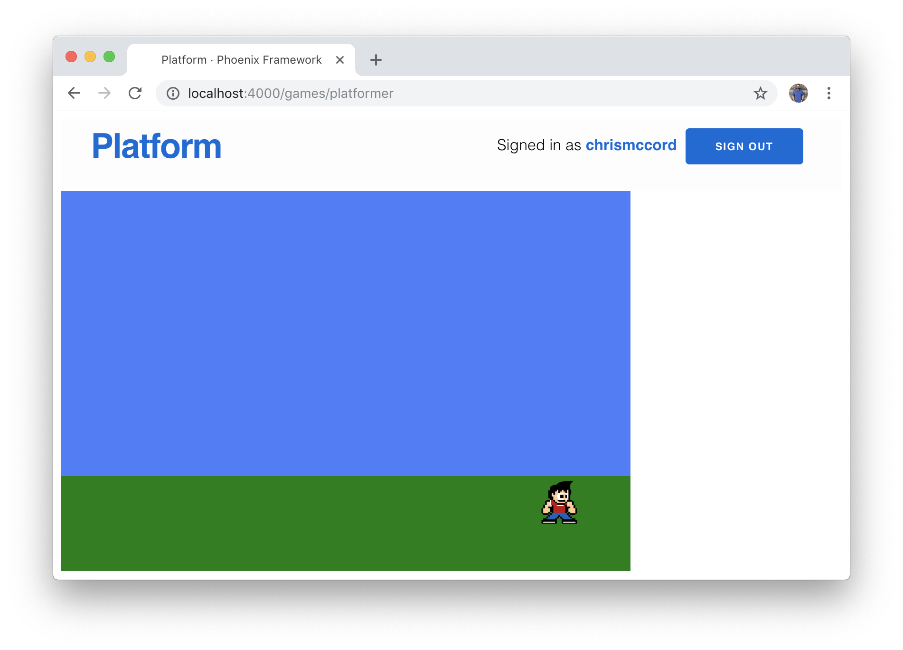
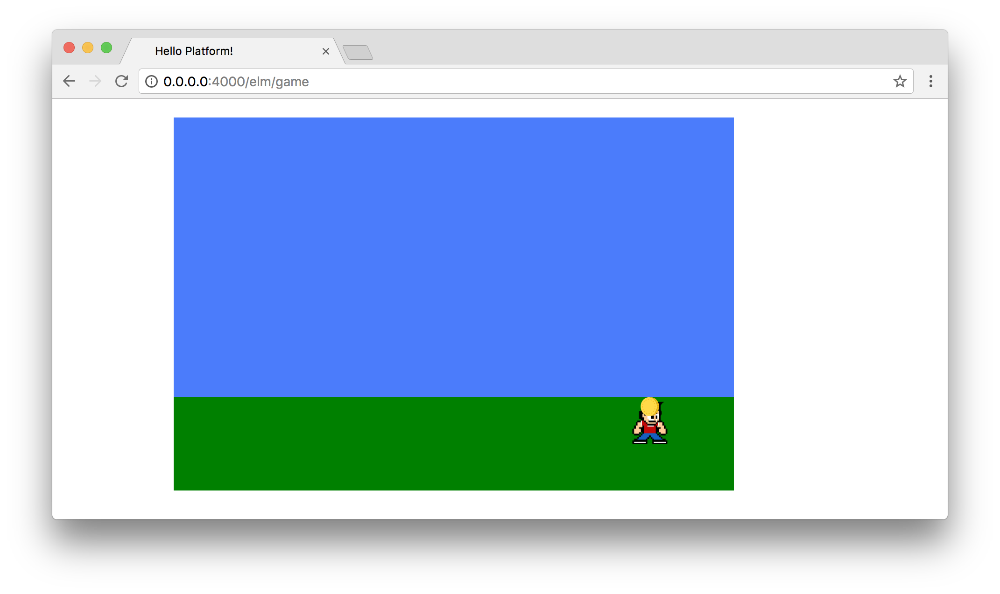
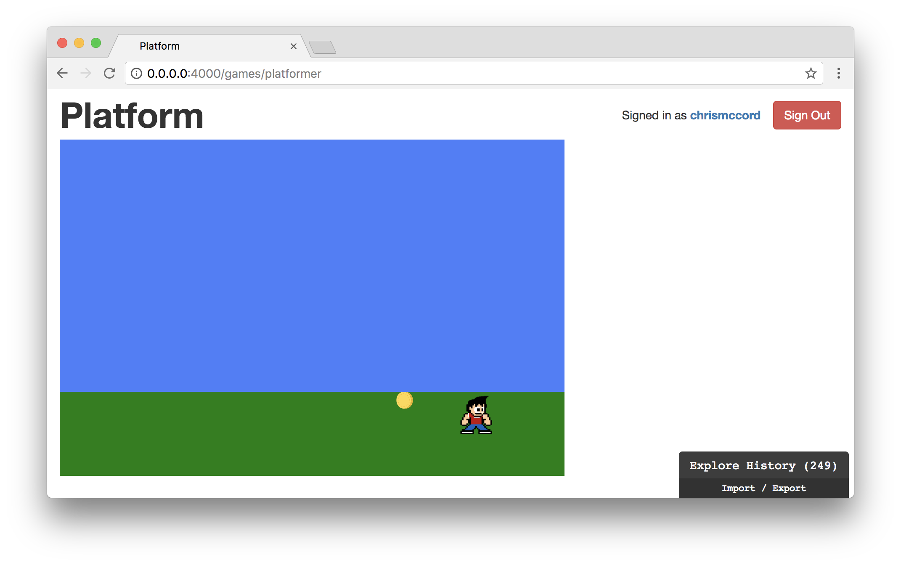
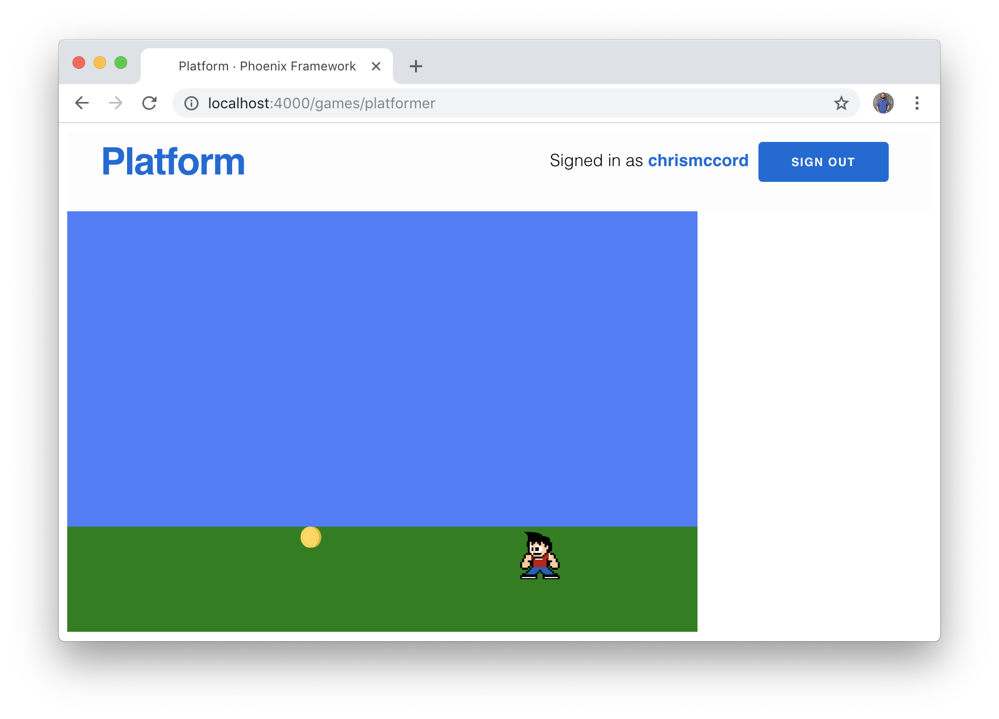

# Adding Interaction

In the last chapter, we managed to set up our first game. Now, we can start
adding interactivity to make it come to life. We're going to allow our players
to interact with our character via keyboard input, and we'll learn about Elm
subscriptions along the way.

## Subscriptions

When working with the Elm Architecture, subscriptions allow us to use streams
of data and subscribe to a sequence of events. Keyboard and mouse input from
users are a great examples of how this works. For instance, we can "subscribe"
to the user's mouse position, and it will allow to track the mouse location as
it changes over time. Don't worry if it sounds a little confusing, we'll take a
look at how we can subscribe to keyboard input now.

## Subscribing to Keyboard Input

In order to work with user keyboard input, we'll need to work with the
[`Browser.Events`](https://package.elm-lang.org/packages/elm/browser/latest/Browser-Events)
module. We'll subscribe to "key down" events for when players press the arrow
keys on their keyboard. And we'll also need to use `Json.Decode` to decode the
"key" responses, which are strings like `"ArrowRight"` that represent keys on
the keyboard.

As an example, we're going to want our character to move right when we press
the right arrow key on the keyboard. In our application, we'll be able to
determine that users are pressing the right arrow key, and adjust our
character's position accordingly.

Let's update the top of our `Platformer.elm` file with the following for the
`Browser.Events` and `Json.Decode` features:

```elm
module Games.Platformer exposing (main)

import Browser
import Browser.Events
import Html exposing (Html, div)
import Json.Decode as Decode
import Svg exposing (..)
import Svg.Attributes exposing (..)
```

## Tracking Key Presses

In order to track key presses, we'll need to make three changes:

- subscribe to key presses in our `subscriptions` function
- decode the key presses with a new `keyDecoder` function
- handle the key presses in our `update` function

Let's start with the `subscriptions` function. Instead of `Sub.none`, let's
subscribe to key presses with the following code:

```elm
subscriptions : Model -> Sub Msg
subscriptions model =
    Sub.batch
        [ Browser.Events.onKeyDown (Decode.map KeyDown keyDecoder)
        ]
```

One thing to keep in mind is that this code won't work until we add `KeyDown`
to our `update` function. The `Sub.batch` function allows us to batch together
different subscriptions, so we could also subscribe to mouse input if we needed
to. For now, all we need to know is that we're using the Elm Architecture to
subscribe to keyboard input via the `onKeyDown` function. We'll decode the
keys that are pressed, and then handle them with the `KeyDown` message in the
`update` function.

Below the `subscriptions` function, we'll add our decoder to handle the keys
pressed. We touched briefly on JSON decoding earlier in the book, but here
we're just decoding a single field for string values like `"ArrowUp"` for arrow
keys and strings like `"a"` for letters that are pressed on the keyboard. In
other words, `onKeyDown` creates the subscription for us using the
`keyDecoder`, and we'll handle the response in the `KeyDown` update.

```elm
keyDecoder : Decode.Decoder String
keyDecoder =
    Decode.field "key" Decode.string
```

As an initial way to get keyboard input working, we're going to set things up
so that _any_ key press will move the character slightly to the right on the
screen (towards the coin item). To accomplish this, we'll start by adding
`KeyDown` (which takes the key as a `String` argument) to our `Msg` type:

```elm
type Msg
    = KeyDown String
    | NoOp
```

We have two possibilities in our `Msg` type. One is to perform no operation
with `NoOp`, and the second will perform an update to the model based on
`KeyDown` actions from the user.

Let's finish getting things working again with a big change to our `update`
function:

```elm
update : Msg -> Model -> ( Model, Cmd Msg )
update msg model =
    case msg of
        KeyDown key ->
            ( { model | characterPositionX = model.characterPositionX + 15 }, Cmd.none )

        NoOp ->
            ( model, Cmd.none )
```

There's a lot going on here, so don't worry if it seems a little overwhelming
at first. The best way to think about the `update` function is that it takes in
the existing model as an argument, applies an update, and returns the new
updated version of the model. In this case, we start with our character at the
initial starting position, and with each key press we're going to update that
position and see that value change through the model.

The key part to focus on for now is Elm's record update syntax, which looks
like this:

```elm
{ model | characterPositionX = model.characterPositionX + 15 }
```

We set up our model as a record with several fields in it. With this syntax, we
can change the value of the `characterPositionX` field in the model. It takes
some getting used to, but for now all we need to know is that we're setting a
new value to `characterPositionX` every time we press a key on the keyboard.

In the `initialModel`, we set our `characterPositionX` value to `50`. Now with
every key press we're increasing that value by `15`. In other words, if you
press any key four times, the character will move to the right by a total of 60
pixels.

## Setting the Correct Keys

It's exciting to see our character moving around the screen, but we want to
be able to change direction based on the specific key we're pressing.

In order to accomplish this, let's add another `case` expression inside our
`update` function. We only want our character to move to the right when we
press the right arrow key (`"ArrowRight"`) on our keyboard. We're already
passing the `key` to our `KeyDown` message, so we can use our `case`
expression to check which key is being pressed and respond with the following:

```elm
update : Msg -> Model -> ( Model, Cmd Msg )
update msg model =
    case msg of
        KeyDown key ->
            case key of
                "ArrowRight" ->
                    ( { model | characterPositionX = model.characterPositionX + 15 }, Cmd.none )

                _ ->
                    ( model, Cmd.none )

        NoOp ->
            ( model, Cmd.none )
```

Our game is basically performing the same way it was before, where the
character can move to the right. But now that action should only be triggered
when we press down on the right arrow key.

In other words, we're adding `15` to the `characterPositionX` value every time
we press the right arrow key on the keyboard. And the `_` part of the `case`
expression allows us to handle all other scenarios (any other key presses).
We'll make no change to the model when any other key than the right arrow is
pressed.

One of the reasons that Elm is such a strong language and offers so many
guarantees is that it forces us to account for all possibilities. So when we
define the behavior we want for the right arrow key, it makes sure that we
don't forget all the other keys and wants us to think about what other behavior
we would want when other keys are pressed. In this case, it's fairly
straightforward because we want the character to move right when the right
arrow key is pressed and for no action to happen with any other keys.

As an aside, it's normally considered good practice to explicitly account for
possibilities. So if we were creating a `case` expression that only had a few
possibilities, we'd try to add a separate conditions for each one to handle
them thoughtfully. But in the case of a keyboard we're only hoping to use a
couple of the keys for now, so we're going to default to no action when most of
the keys are pressed.

## Changing Direction

Let's go ahead and add the ability for our character to move in the left
direction as well. This will involve some familiar changes to `KeyDown`, where
we're going to add a case for the left arrow key (`"ArrowLeft"`) and subtract
from the character's horizontal position value:

```elm
KeyDown key ->
    case key of
        "ArrowLeft" ->
            ( { model | characterPositionX = model.characterPositionX - 15 }, Cmd.none )

        "ArrowRight" ->
            ( { model | characterPositionX = model.characterPositionX + 15 }, Cmd.none )

        _ ->
            ( model, Cmd.none )
```

## Character Direction

We now have the ability to move our character to the left and the right on the
screen. Let's add a new `Direction` type so that the character can face the
correct direction when moving left and right.

```elm
type Direction
    = Left
    | Right
```

This allows us to set a direction with only two possible values. Similarly, the
definition for `Bool` in Elm allows us to select only from `True` and `False`
as values:

```elm
type Bool
    = True
    | False
```

Let's add a `characterDirection` field to our `Model`, and then set its initial
value to `Right` in the `initialModel`.

```elm
type alias Model =
    { characterDirection : Direction
    , characterPositionX : Int
    , characterPositionY : Int
    , itemPositionX : Int
    , itemPositionY : Int
    }


initialModel : Model
initialModel =
    { characterDirection = Right
    , characterPositionX = 50
    , characterPositionY = 300
    , itemPositionX = 500
    , itemPositionY = 300
    }
```

Now, we can update the `KeyDown` case in our `update` function so that the
character's direction will change when the left and right arrow keys are
pressed.

The format of the record update syntax may look a little different than what
we've been used to seeing so far, but we're still doing the same thing. When
players press the left arrow key (`"ArrowLeft"`), the character will move `15`
pixels to the left and the `characterDirection` will be set to `Left`.
Similarly, when players press the right arrow key (`"ArrowRight"`), the
character will move `15` pixels to the right and the `characterDirection` will
be set to `Right`.

```elm
KeyDown key ->
    case key of
        "ArrowLeft" ->
            ( { model
                | characterDirection = Left
                , characterPositionX = model.characterPositionX - 15
                }
            , Cmd.none
            )

        "ArrowRight" ->
            ( { model
                | characterDirection = Right
                , characterPositionX = model.characterPositionX + 15
                }
            , Cmd.none
            )

        _ ->
            ( model, Cmd.none )
```

Now that we're going to have our character change direction, we'll also want
to update the assets so that the character looks like he or she is facing in
the correct direction too. Let's create two new copies of the `character.gif`
file in the `/assets/static/images` folder. We'll create one called
`character-right.gif` which will be exactly the same as `character.gif`. And
we'll also create `character-left.gif`, which is the same image flipped along
the horizontal axis. If you're using macOS, you can open the file in Preview
and click the Tools > Flip Horizontal option.


These assets are also available in the repository for this book if you'd like
to download them from GitHub.

- [character-left.gif](https://github.com/elixir-elm-tutorial/elixir-elm-tutorial-book/tree/master/manuscript/images/adding_interaction/character-left.gif)
- [character-right.gif](https://github.com/elixir-elm-tutorial/elixir-elm-tutorial-book/tree/master/manuscript/images/adding_interaction/character-right.gif)

Once we have these two files available in our `assets/static/images` folder, we
just need to update our `viewCharacter` function and everything should work as
intended.

We'll use a `let` expression to determine which image to load based on the
value of `model.characterDirection`. Here's our updated `viewCharacter`
function:

```elm
viewCharacter : Model -> Svg Msg
viewCharacter model =
    let
        characterImage =
            case model.characterDirection of
                Left ->
                    "/images/character-left.gif"

                Right ->
                    "/images/character-right.gif"
    in
    image
        [ xlinkHref characterImage
        , x (String.fromInt model.characterPositionX)
        , y (String.fromInt model.characterPositionY)
        , width "50"
        , height "50"
        ]
        []
```

And with that change, we should be able to see our character changing direction
successfully in the browser:



## Collecting Items

We can move our character to the left and right, and we already added an item
that our character will be able to pick up. Currently, our character can move
over to the item, but nothing happens when we get there.

What we'd like to do at this point is to be able to move the character to the
item, increment our score, and spawn a new item.

One way that we can start thinking about this is to figure out what we want to
do when the character reaches the item. Let's add a `characterFoundItem`
function below our `update` function that will return a boolean value about
whether or not the character has discovered the item. We'll use the position of
both the character and the item to see if they match, which will return `True`
if the character's position matches the item's position.

```elm
characterFoundItem : Model -> Bool
characterFoundItem model =
    model.characterPositionX == model.itemPositionX
```

This seems like a good idea initially, but it uncovers some limitations of our
current approach. To see this in action, let's temporarily update the
`viewItem` function to account for our new `characterFoundItem` function. If
the character has found the item, we'll simply return an empty `svg` element to
effectively hide the coin image. Otherwise, we'll continue showing the item if
the character has not found the item.

```elm
viewItem : Model -> Svg Msg
viewItem model =
    if characterFoundItem model then
        svg [] []

    else
        image
            [ xlinkHref "/images/coin.svg"
            , x (String.fromInt model.itemPositionX)
            , y (String.fromInt model.itemPositionY)
            , width "20"
            , height "20"
            ]
            []
```

If you try this out in the browser, you'll see that it _roughly_ accomplishes
our goal of having the character be able to "find" the item and have it
disappear. But you'll notice there's a small problem where the character needs
to arrive at a particular position to find the item.





We _could_ spend time looking for an ideal long-term fix for this issue, but
for now let's keep in mind that our current goal is to just make the game
playable and to track the player's score. So let's find a workable solution
that will involve giving the item a _range_ instead of an exact position. And
we'll use this opportunity to learn to use a few new functions from the
[`List`](http://package.elm-lang.org/packages/elm-lang/core/latest/List)
module.

Instead of using the exact `model.itemPositionX` value like we did above, we
want to add a lower and upper bound for where the character should be able to
find the item. We'll use a `let` expression inside our `characterFoundItem`
function to set values for the `approximateItemLowerBound` and
`approximateItemUpperBound`. Then we'll use the
[`List.range`](http://package.elm-lang.org/packages/elm-lang/core/latest/List#range)
function to create a range of numbers where the character can discover the
item.

After we create a range of values where our character can find the item, we use
the
[`List.member`](http://package.elm-lang.org/packages/elm-lang/core/latest/List#member)
function to determine whether or not the character position is currently
somewhere inside the item's range. Let's update our `characterFoundItem`
function to see how this works:

```elm
characterFoundItem : Model -> Bool
characterFoundItem model =
    let
        approximateItemLowerBound =
            model.itemPositionX - 35

        approximateItemUpperBound =
            model.itemPositionX

        approximateItemRange =
            List.range approximateItemLowerBound approximateItemUpperBound
    in
        List.member model.characterPositionX approximateItemRange
```

This is generally not great programming practice to use a "magic number" value
like `35` here, which is just a rough approximation of where the character
position meets the item position. But tinkering with these values in the
browser looks like it's just good enough to keep moving since the character
is able to discover the item at the correct position, and should improve our
gameplay until we can find a better approach.

## Spawning Items

In order to animate our scene, we'll start working with animation frames from
the `Browser.Events` module.

We currently have mechanisms for moving our character around the screen, and we
managed to add some initial code for the character to find items. But we don't
just want to hide the item when the character finds it. We'd like to create new
coins in new locations, and this is an opportunity to start making our game
come to life.

Let's get started by working with a function called
[`onAnimationFrameDelta`](https://package.elm-lang.org/packages/elm/browser/latest/Browser-Events#onAnimationFrameDelta).
This will be helpful for our game, because it enables us to render smooth
animations and subscribe to differences over time (in milliseconds).

Let's update our `subscriptions` function to include
`Browser.Events.onAnimationFrameDelta` below the existing subscription to user
keyboard input:

```elm
subscriptions : Model -> Sub Msg
subscriptions model =
    Sub.batch
        [ Browser.Events.onKeyDown (Decode.map KeyDown keyDecoder)
        , Browser.Events.onAnimationFrameDelta GameLoop
        ]
```

This means we'll need to add a new `GameLoop` message along with a change to
our `update` function:

```elm
type Msg
    = GameLoop Float
    | KeyDown String
    | NoOp


update : Msg -> Model -> ( Model, Cmd Msg )
update msg model =
    case msg of
        GameLoop time ->
            ( model, Cmd.none )

        -- ...
```

This may not seem like a big deal, but it is. We now have the ability to change
things over time in our game, so we could have items and enemies moving around
as time moves forward. Let's update our `GameLoop` inside the `update` function
to perform some action. We want to change the position of our item when our
character finds it, so let's use our `characterFoundItem` function to make
changes to the `model`:

```elm
GameLoop time ->
    if characterFoundItem model then
        ( { model | itemPositionX = model.itemPositionX - 100 }, Cmd.none )

    else
        ( model, Cmd.none )
```

Now that we're using our `characterFoundItem` condition in the `update`
function, we can simplify the `viewItem` function we had temporarily changed
before:

```elm
viewItem : Model -> Svg Msg
viewItem model =
    image
        [ xlinkHref "/images/coin.svg"
        , x (String.fromInt model.itemPositionX)
        , y (String.fromInt model.itemPositionY)
        , width "20"
        , height "20"
        ]
        []
```

This basically allows the player to move the character to the item's location,
and it will give the appearance that a new coin is being "spawned" in a new
location `100` pixels to the left.



## Working with Randomness

Instead of manually moving the coin to the left, let's take a look at the
`Random` library to move it to a random new location on the x-axis.

First, we'll need to import the `Random` module at the top of `Platformer.elm`.
Here is our full list of imports:

```elm
import Browser
import Browser.Events
import Html exposing (Html, div)
import Json.Decode as Decode
import Random
import Svg exposing (..)
import Svg.Attributes exposing (..)
```

Next, we'll need to change the `GameLoop` in our `update` function, and then
we'll add a new `SetNewItemPositionX` message to change the position of the
item in the model.

First, let's change our `GameLoop` message to remove the manual shifting of
the coin, and replace it with a new random number generator (note that we're
using `50` and `500` as values because that's the range where the item will
be visible on the screen):

```elm
GameLoop time ->
    if characterFoundItem model then
        ( model, Random.generate SetNewItemPositionX (Random.int 50 500) )
    else
        ( model, Cmd.none )
```

We're using two different functions from the `Random` library here. We'll use
`Random.int`, which takes two integer values and gives us a random number in
between those values. Then, we use the `Random.generate` function, which takes
another message (which we'll use to update the model) along with the random
integer we're creating. It's admittedly confusing, but keep in mind that
generating a random number is actually an effect, because a function that
returns different values depending on the inputs is by nature impure. Working
with random numbers this way allows us to have _managed_ effects and make sure
they don't wreak havoc on our application.

Now that we have a new value, we can use it to update the model with the
`SetNewItemPositionX` message. Here are the changes in context with the message
types and full `update` function:

```elm
type Msg
    = GameLoop Time
    | KeyDown KeyCode
    | NoOp
    | SetNewItemPositionX Int


update : Msg -> Model -> ( Model, Cmd Msg )
update msg model =
    case msg of
        GameLoop time ->
            if characterFoundItem model then
                ( model, Random.generate SetNewItemPositionX (Random.int 50 500) )
            else
                ( model, Cmd.none )

        -- ...

        SetNewItemPositionX newPositionX ->
            ( { model | itemPositionX = newPositionX }, Cmd.none )
```



## Summary

These may not be the most fun game mechanics ever, but we've come a _long_ way
towards building our first game. This is a good stopping point to reflect on
what we've accomplished so far.

We learned about Elm subscriptions and handling keyboard input, allowing the
player to adjust the position of the character on the screen. Then, we imported
new libraries to allow our character to "collect" items and spawn new ones in
different locations.

What's missing is the ability to track the number of items we're collecting.
In the next chapter, we'll cover some basics for tracking game data and
rendering it inside our game window.
