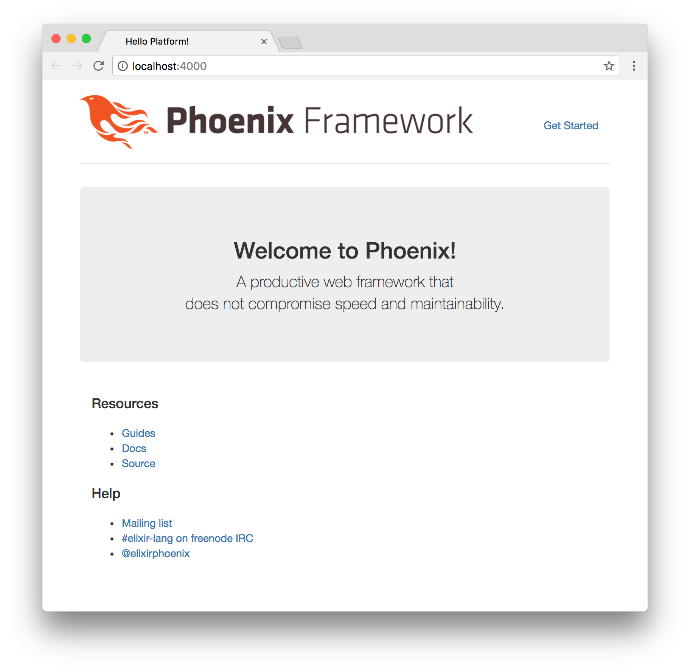
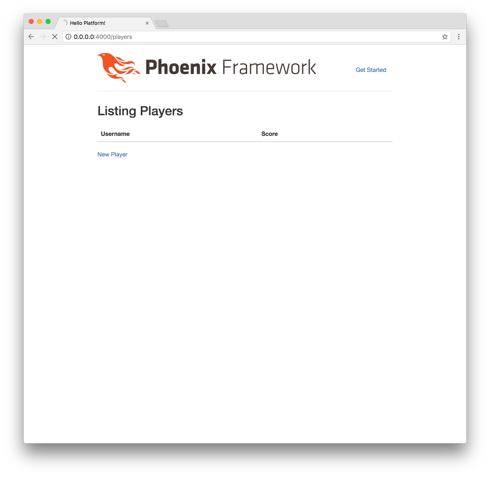
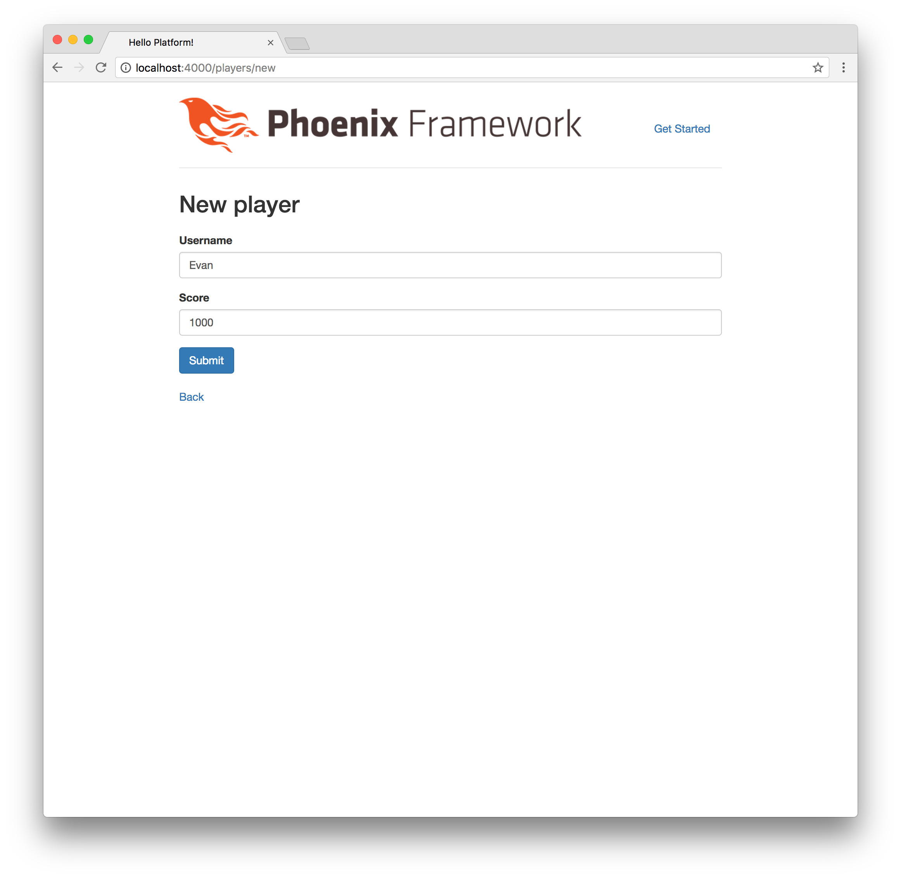
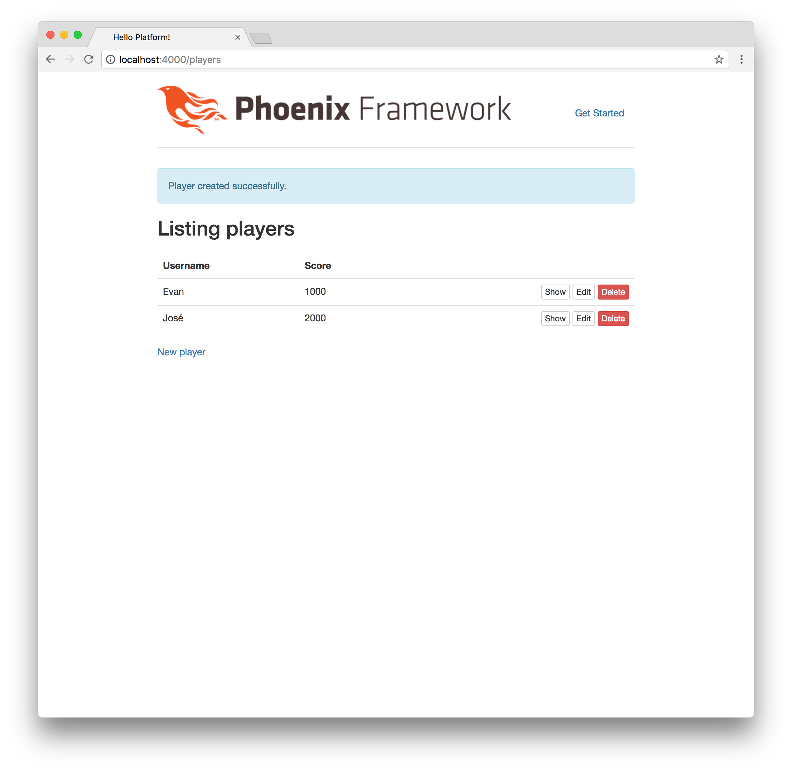
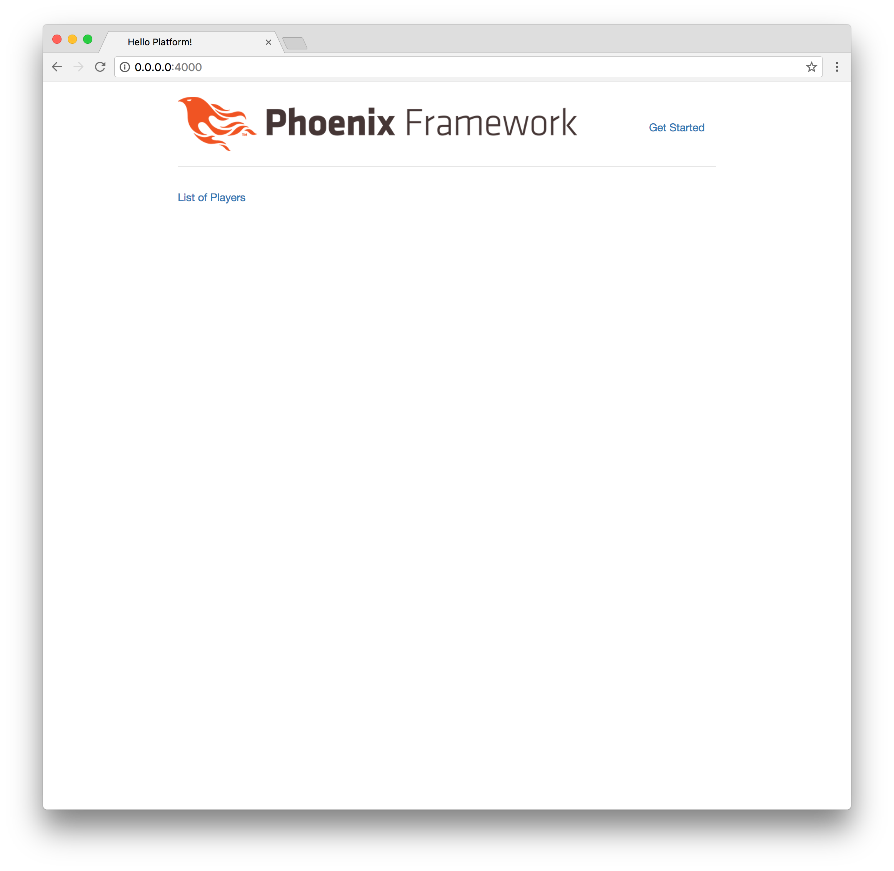

# Chapter 1: Diving In

Instead of talking about Elixir and Elm, let's just dive in and _experience_
what these languages have to offer. In this chapter, we're going to avoid
seeking an explanation behind the theory, and instead focus on running the
commands and editing the files that will help us create our application. Then
later we'll go back and find out what everything means. For now, just focus on
following along and getting a glimpse of how to get an application up and
running. If you haven't already set up your development environment with
Elixir, Phoenix, and PostgreSQL, then check out the Appendix for more
information.

## Creating the Platform

The first step we need to take is to create the foundation for our application.
To do that, let's open up our Terminal and run the following command:

```bash
$ mix phoenix.new platform
```

It will ask the following question:

> Fetch and install dependencies?

Enter the letter `Y` and we should be all set. The following output should be
displayed:

```bash
$ mix phoenix.new platform
* creating platform/config/config.exs
* creating platform/config/dev.exs
* creating platform/config/prod.exs
* creating platform/config/prod.secret.exs
* creating platform/config/test.exs
* creating platform/lib/platform.ex
* creating platform/lib/platform/endpoint.ex
* creating platform/test/views/error_view_test.exs
* creating platform/test/support/conn_case.ex
* creating platform/test/support/channel_case.ex
* creating platform/test/test_helper.exs
* creating platform/web/channels/user_socket.ex
* creating platform/web/router.ex
* creating platform/web/views/error_view.ex
* creating platform/web/web.ex
* creating platform/mix.exs
* creating platform/README.md
* creating platform/web/gettext.ex
* creating platform/priv/gettext/errors.pot
* creating platform/priv/gettext/en/LC_MESSAGES/errors.po
* creating platform/web/views/error_helpers.ex
* creating platform/lib/platform/repo.ex
* creating platform/test/support/model_case.ex
* creating platform/priv/repo/seeds.exs
* creating platform/.gitignore
* creating platform/brunch-config.js
* creating platform/package.json
* creating platform/web/static/css/app.css
* creating platform/web/static/css/phoenix.css
* creating platform/web/static/js/app.js
* creating platform/web/static/js/socket.js
* creating platform/web/static/assets/robots.txt
* creating platform/web/static/assets/images/phoenix.png
* creating platform/web/static/assets/favicon.ico
* creating platform/test/controllers/page_controller_test.exs
* creating platform/test/views/layout_view_test.exs
* creating platform/test/views/page_view_test.exs
* creating platform/web/controllers/page_controller.ex
* creating platform/web/templates/layout/app.html.eex
* creating platform/web/templates/page/index.html.eex
* creating platform/web/views/layout_view.ex
* creating platform/web/views/page_view.ex

Fetch and install dependencies? [Yn] Y
* running mix deps.get
* running npm install && node node_modules/brunch/bin/brunch build

We are all set! Run your Phoenix application:

    $ cd platform
    $ mix phoenix.server

You can also run your app inside IEx (Interactive Elixir) as:

    $ iex -S mix phoenix.server

Before moving on, configure your database in config/dev.exs and run:

    $ mix ecto.create
```

You'll notice that Phoenix displays a lot of helpful information here. First it
shows all the files that were created (don't worry if it seems overwhelming at
first; we're only going to need to start with a handful of these files). Then
we see some information about how to configure our database and run the web
server.

## Configuring the Database

Now that we've created the files for our Phoenix application, let's change into
that directory:

```bash
$ cd platform
```

We can set up the database for our project by running the following command:

```bash
$ mix ecto.create
```

If we run into issues here, it means we'll have to configure our database in in
the `config/dev.exs` file. Since this is the first time we're running a command
with our new application, you'll see that it takes some time for the source
code to compile. Elixir is based on the Erlang virtual machine, and needs to
compile the source to bytecode before we can run our programs. Don't worry if
this seems to take a while at first, you'll notice that subsequent commands
will run much more quickly after this.

If the database creation was successful, we'll see the following message at the
bottom:

```bash
$ mix ecto.create
Compiling files (.ex) ...
Generated platform app
The database for Platform.Repo has already been created
```

Nice! That means we have successfully created our Phoenix application, compiled
it, and set up our database.

## Running the Server

Let's see what our new application looks like in the browser. To start the web
server, we'll run the following command:

```bash
$ mix phoenix.server
```

This will start a server and allow us to visit
[`http://localhost:4000`](http://localhost:4000) to see our new
application running live! Here is what the output will look like:

```bash
$ mix phoenix.server
[info] Running Platform.Endpoint with Cowboy using http://localhost:4000
```



At this point, you might be thinking to yourself, "Whoa! That was quick and we
already have a full back-end up and running!" Or you might be thinking, "Hmm.
I'm not impressed yet." Either way, you're right. We're going to start adding
features to our application, but it's worth taking a moment to appreciate just
how much we already have going for us with just a few commands.

Feel free to take a look around at some of the great documentation available.
Before we move on, let's stop the Phoenix web server. Go back to the Terminal
where the server is running, and press Control + C on your keyboard twice to
stop the server:

```bash
$ mix phoenix.server
[info] Running Platform.Endpoint with Cowboy using http://localhost:4000
[info] Compiled 6 files into 2 files, copied 3 in 2.1 sec
[info] GET /
[debug] Processing by Platform.PageController.index/2
  Parameters: %{}
  Pipelines: [:browser]
[info] Sent 200 in 67ms
^C
BREAK: (a)bort (c)ontinue (p)roc info (i)nfo (l)oaded
       (v)ersion (k)ill (D)b-tables (d)istribution
^C
$ 
```

## Our First Resource

Since we want to build a video game platform, there are two main resources that
we want to start out with:

- Players
- Games

We're going to start out using something called a generator to keep moving
quickly. It's going to create a lot of the files we need to work with. Then,
we'll talk more about how it all works later.

Let's generate the resource for our players with the following command:

```bash
$ mix phoenix.gen.html Player players username:string score:integer
```

What we're doing here is creating players for our video game platform. We want
to be able to use our browser to interact with the data, so we're starting out
with an HTML resource. That means we wanted to use
[phoenix.gen.html](https://hexdocs.pm/phoenix/Mix.Tasks.Phoenix.Gen.Html.html).
Each player will have a **username**, and a **score**. We'll eventually extend
the capabilities of our players with additional fields, but for now this will
give us a good start to start creating a list of players.

You'll see that the generator creates quite a few files for us, and once again
gives us some helpful tips about what to do next:

```bash
$ mix phoenix.gen.html Player players username:string score:integer
* creating web/controllers/player_controller.ex
* creating web/templates/player/edit.html.eex
* creating web/templates/player/form.html.eex
* creating web/templates/player/index.html.eex
* creating web/templates/player/new.html.eex
* creating web/templates/player/show.html.eex
* creating web/views/player_view.ex
* creating test/controllers/player_controller_test.exs
* creating web/models/player.ex
* creating test/models/player_test.exs
* creating priv/repo/migrations/20170205220430_create_player.exs

Add the resource to your browser scope in web/router.ex:

    resources "/players", PlayerController

Remember to update your repository by running migrations:

    $ mix ecto.migrate
```

## Routing

Don't worry too much about all those files just yet, but the information at the
bottom is important. In order to configure our application to work with our new
players, we'll need to add them to the **router**, and then run a **migration**
to update the database with our new data.

Phoenix makes things easy on us with the helpful Terminal notes. Let's go ahead
and follow along. There's a file named `router.ex` inside the `web` folder.
Let's open that file and see what it looks like:

```elixir
defmodule Platform.Router do
  use Platform.Web, :router

  pipeline :browser do
    plug :accepts, ["html"]
    plug :fetch_session
    plug :fetch_flash
    plug :protect_from_forgery
    plug :put_secure_browser_headers
  end

  pipeline :api do
    plug :accepts, ["json"]
  end

  scope "/", Platform do
    pipe_through :browser # Use the default browser stack

    get "/", PageController, :index
  end

  # Other scopes may use custom stacks.
  # scope "/api", Platform do
  #   pipe_through :api
  # end
end
```

The Phoenix router comes with two separate "pipelines" by default. One of them
is for HTML (which we're going to use now), and the other one is for JSON
(which we'll also use soon). And we can even see that the "scope" is already
set up for us to access the HTML with our browser. That's how we were able to
load up the `http://localhost:4000` URL and see the initial starter page.
Don't worry if it seems confusing at first. All you need to know is that this
block is where we'll focus for now:

```elixir
scope "/", Platform do
  pipe_through :browser # Use the default browser stack

  get "/", PageController, :index
end
```

And we're going to update it with our new players resource:

```elixir
scope "/", Platform do
  pipe_through :browser # Use the default browser stack

  get "/", PageController, :index
  resources "/players", PlayerController
end
```

That means when we access
[`http://localhost:4000/players`](http://localhost:4000/players), we'll
soon be able to start creating the players for our video game platform.

## Running a Migration

Our application has all the information it needs to render the player resource
that we created, but we still need to tell the database about the changes that
we made. The database will need to store our player data (with the
**username** and **score** fields that we created), and to do that we'll need
to run a migration. Go back to the Terminal, and run the following command:

```bash
$ mix ecto.migrate
```

This will create a new database table called "players", and if everything goes
according to plan then we should see the following output:

```bash
$ mix ecto.migrate
17:23:02.349 [info]  == Running Platform.Repo.Migrations.CreatePlayer.change/0 forward
17:23:02.349 [info]  create table players
17:23:02.364 [info]  == Migrated in 0.0s
```

## Creating Players

Let's start our server again and see our new player resource in action:

```bash
mix phoenix.server
```

Now we can access
[http://localhost:4000/players](http://localhost:4000/players) and we should
see the following:



This is excellent! We can now add players to our platform using the web
browser. Click the **New Player** button and try creating a couple of new
players on the new player page
([http://localhost:4000/players/new](http://localhost:4000/players/new)).



And now we have some data to work with on our players page:



## Updating our Home Page

We have a working `/players` page. But when we go back to
[`http://localhost:4000`](http://localhost:4000), we see that it's not
listed anywhere as a link. Let's figure out where the HTML code is coming from
for our home page.

Inside the `web` folder, there's a `templates` folder. This is where we put
the HTML code that we want to render in the browser. And instead of standard
`.html` files, we'll see that the files end in the `.html.eex` extension.
That means we can enter standard HTML code in there, but we can also _embed_
Elixir code too.

Let's open the `web/templates/page/index.html.eex` file and take a look:

```html
<div class="jumbotron">
  <h2><%= gettext "Welcome to %{name}", name: "Phoenix!" %></h2>
  <p class="lead">A productive web framework that<br />does not compromise speed and maintainability.</p>
</div>

<div class="row marketing">
  <div class="col-lg-6">
    <h4>Resources</h4>
    <ul>
      <li>
        <a href="http://phoenixframework.org/docs/overview">Guides</a>
      </li>
      <li>
        <a href="https://hexdocs.pm/phoenix">Docs</a>
      </li>
      <li>
        <a href="https://github.com/phoenixframework/phoenix">Source</a>
      </li>
    </ul>
  </div>

  <div class="col-lg-6">
    <h4>Help</h4>
    <ul>
      <li>
        <a href="http://groups.google.com/group/phoenix-talk">Mailing list</a>
      </li>
      <li>
        <a href="http://webchat.freenode.net/?channels=elixir-lang">#elixir-lang on freenode IRC</a>
      </li>
      <li>
        <a href="https://twitter.com/elixirphoenix">@elixirphoenix</a>
      </li>
    </ul>
  </div>
</div>
```

This should look pretty familiar. It's the code that we're seeing when we load
[`http://localhost:4000`](http://localhost:4000). In fact, let's delete
all this code and create a simple link to our `/players` page. So we'll
remove _all_ the existing code in the `web/templates/page/index.html.eex` file,
and replace it with the following:

```html
<a href="/players">List of Players</a>
```

Save the file and let's go back to the browser to see the changes (make sure
the Phoenix web server is still running) at
[`http://localhost:4000`](http://localhost:4000):



Excellent! Phoenix comes with a **Live Reload** feature that automatically
refreshes our application in the browser. If the Phoenix server was still
running, then the home page was automatically regenerated and should now show
the link to the list of players. Try out the link and it should work properly
to send you to the `/players` page.

