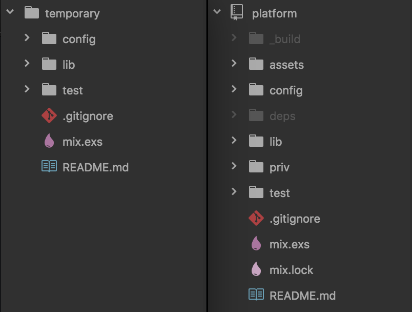

# Chapter 2: Elixir Intro

In the last chapter, we created a full Phoenix application. By default, Phoenix
applications contain a lot of Elixir code. But if we're just getting started
with Elixir, we should probably take a look at some simple examples and get a
better idea of how to work with the tools.

## Creating an Elixir Project

Let's create a temporary Elixir project. We'll use the same `mix` tool that we
used in the last chapter when we created our Phoenix application, but this time
we're just creating a small Elixir project called `temporary`. Run the following
command in the terminal:

```
$ mix new temporary
```

The `mix` tool is a simple build tool that ships with Elixir. Here's what the
output should look like when we create our project:

```
$ mix new temporary
* creating README.md
* creating .gitignore
* creating mix.exs
* creating config
* creating config/config.exs
* creating lib
* creating lib/temporary.ex
* creating test
* creating test/test_helper.exs
* creating test/temporary_test.exs

Your Mix project was created successfully.
You can use "mix" to compile it, test it, and more:

    cd temporary
    mix test

Run "mix help" for more commands.
```

Let's change into the new project's directory and take a look at the files that
were generated for us:

```
cd temporary
```

The first thing you might notice is that our Elixir project and our Phoenix
project look like they have a lot of similarities. The folder structure is
essentially the same:



The `temporary` project is a lot simpler, but shares a lot in common with how
Phoenix applications work. The `config` folder contains (wait for it...)
configuration settings, the `lib` folder is where we'll write most of our Elixir
code, and the `test` folder contains the tests that will let us know our
application is working as intended.

## Elixir Testing

Depending on which programming languages you've worked with in the past, you
might potentially have a lot of experience with writing tests, or perhaps even
none.

If you haven't written tests before, the basic idea is that tests give us a way
to feel some confidence that our code is actually working as expected. We write
our expectations (or "assertions"), and it gives us a quick way to check that
the code we're writing works (and doesn't break other code too). We'll delve
deeper into testing with our Phoenix app, but for now let's just try it out. Run
the `mix test` command inside the `temporary` folder:

```
$ mix test
```

The output should look something like this:

```
$ mix test
Compiling 1 file (.ex)
Generated temporary app
..

Finished in 0.05 seconds
2 tests, 0 failures

Randomized with seed 795854
```

## Elixir Compilation

Here's where we'll start to see some key features of Elixir. First, we can see
that Elixir is a *compiled* language. The first time we run our code after we've
made changes, Elixir needs to compile it to Erlang bytecode. This can be really
helpful because it means we'll catch errors early instead of having to debug our
app while we're using it.

In fact, if we run the `mix test` command again, we'll see that Elixir doesn't
need to recompile the code because we haven't made any changes:

```
$ mix test
..

Finished in 0.04 seconds
2 tests, 0 failures

Randomized with seed 807596
```

## Elixir Modules and Functions

The Elixir code that we'll write in this project is contained in the
`lib/temporary.ex` file. Files that end in `.ex` are Elixir files that will be
compiled and run (you'll also notice that we have files that end in `.exs`,
which are Elixir scripts).

Inside the `lib/temporary.ex` file, we see the basic structure for _all_ the
Elixir programs that we'll be writing.

```elixir
defmodule Temporary do
  @moduledoc """
  Documentation for Temporary.
  """

  @doc """
  Hello world.

  ## Examples

      iex> Temporary.hello
      :world

  """
  def hello do
    :world
  end
end
```

We start out with a **module** that encapsulates our related code:

```elixir
defmodule Temporary do
  ...
end
```

If we ignore the documentation for now, we'll see that we have one **function**:

```elixir
def hello do
  :world
end
```

And _inside_ that function, we have our **return value**:

```elixir
:world
```

Let's change things up. Rename the `hello` function to `add`. We'll pass two
parameters (`x` and `y`), and we'll return the addition using `x + y` inside
the function:

```elixir
- def hello do
-  :world
- end
+ def add(x, y) do
+   x + y
+ end
```

## Functions, Tests, and Documentation

The example above is admittedly simple, but it's good in the sense that we
know how to create a function now. So how do we use it?

We generally use the `Module.function(arguments)` syntax to invoke the
functions we've declared. If we look at the original documentation for our
`hello` function, we can see the example usage:

```elixir
defmodule Temporary do
  @moduledoc """
  Documentation for Temporary.
  """

  @doc """
  Hello world.

  ## Examples

      iex> Temporary.hello
      :world

  """
  def add(x, y) do
    x + y
  end
end
```

This tells us that we should be able to run `Temporary.hello` and it should
return `:world`. This is where things get interesting, so let's run `mix test`
again:

```
mix test
```

Since we no longer have our `hello` function, it's not surprising that our
test failed, but the reason the test failed is actually because of the example
in our documentation!

```
$ mix test
Compiling 1 file (.ex)


  1) test doc at Temporary.add/2 (1) (TemporaryTest)
     test/temporary_test.exs:3
     Doctest failed: got UndefinedFunctionError with message "function Temporary.hello/0 is undefined or private"
     code: Temporary.hello
     stacktrace:
       (temporary) Temporary.hello()
       (for doctest at) lib/temporary.ex:11: (test)

.

Finished in 0.07 seconds
2 tests, 1 failure

Randomized with seed 253463
```

Let's update the documentation so that it shows an example of how to use our
new `add` function:

```elixir
defmodule Temporary do
  @moduledoc """
  Documentation for Temporary.
  """

  @doc """
  Add two numbers together.

  ## Examples

      iex> Temporary.add(1, 1)
      2

  """
  def add(x, y) do
    x + y
  end
end
```

Now we can run our tests again and they should pass:

```
$ mix test
Compiling 1 file (.ex)
..

Finished in 0.08 seconds
2 tests, 0 failures

Randomized with seed 802915
```

This is an _awesome_ feature of Elixir. It means we can write our functions
_and_ document them _and_ test that they work all at once! It encourages us to
write and maintain our documentation, and gives us confidence that our code is
actually doing what we say it is.

### Next

- Write a test
- Use the pipe operator
- Use a guard?
- Assert the type?