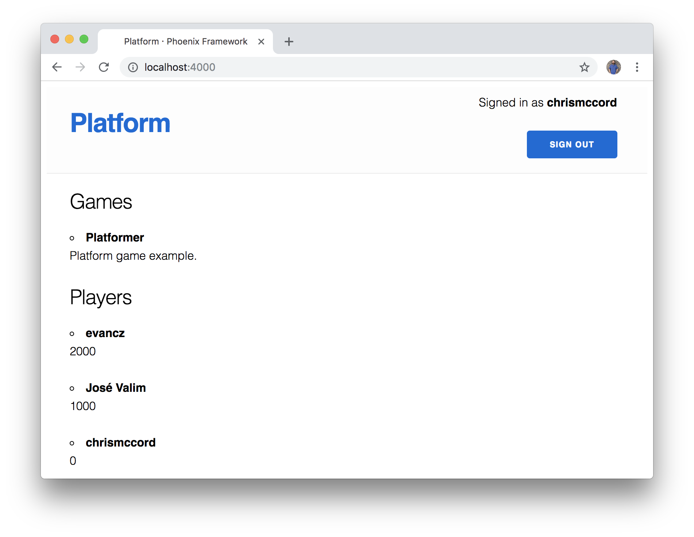
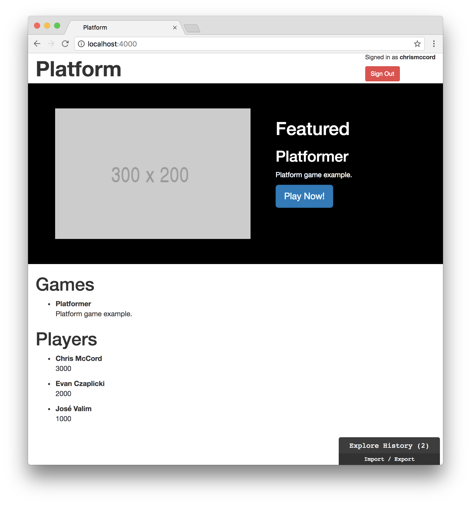
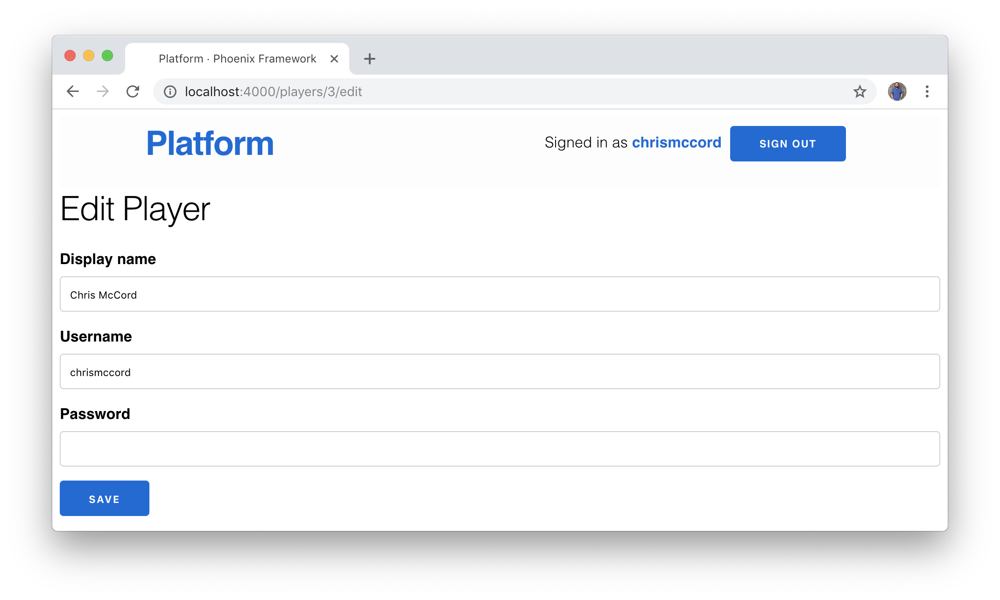
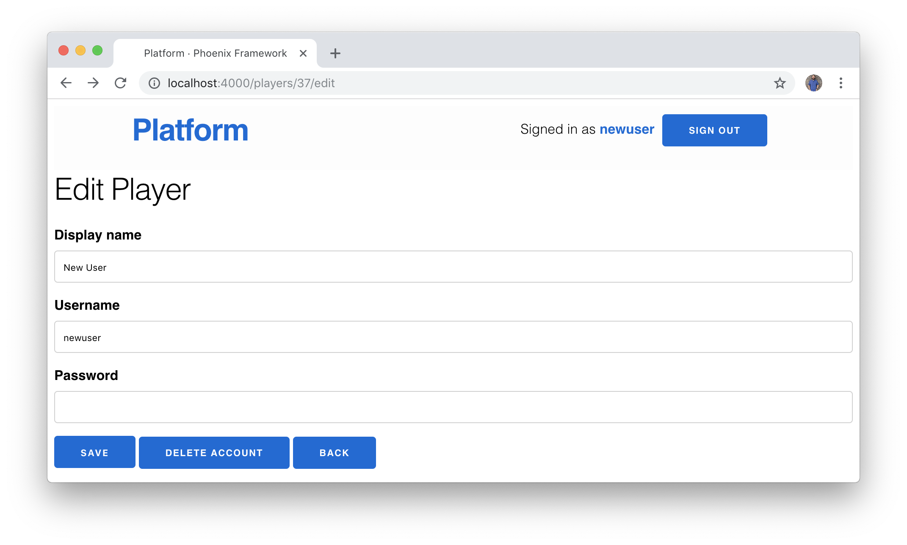
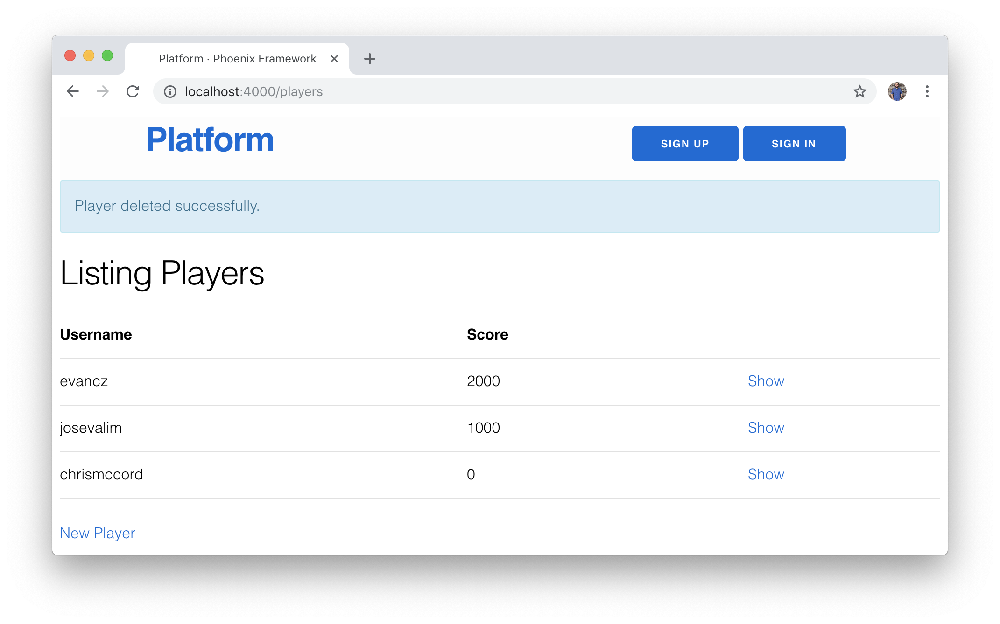
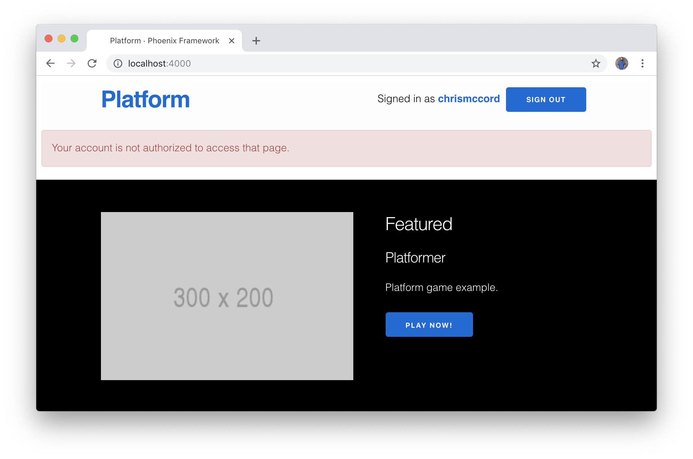
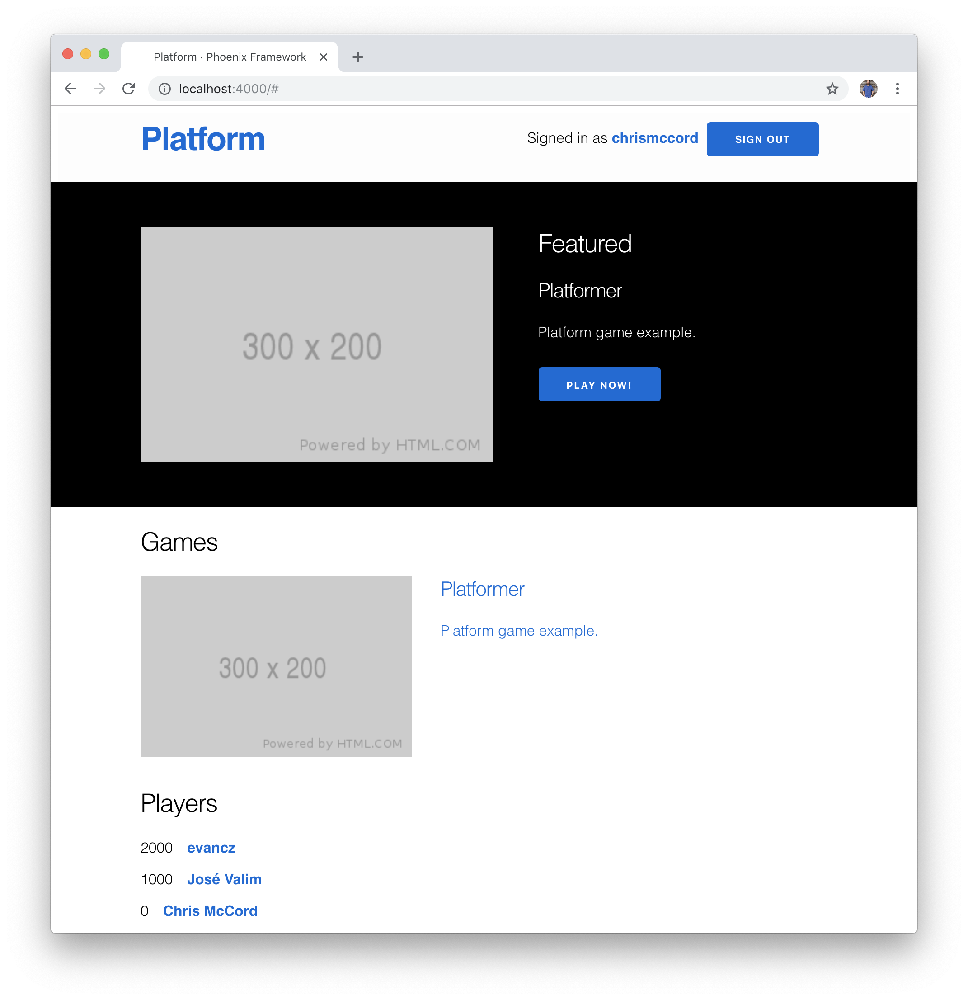

# Design and Usability

Although this isn't a book about design, our application could certainly
benefit from an effort to make it more usable and nicer to look at. In this
chapter, we'll do our best to improve the styling and usability for our
platform application.

## Pages

Let's start by taking a look at all the different pages we've created for our
application.

- Home Page (`/`)
- Players
  - Players Index Page (`/players`)
  - Players Index JSON Page (`/api/players`)
  - New Player Page (`/players/new`)
  - Show Player Page (`/players/:id`)
  - Show Player JSON Page (`/api/players/:id`)
  - Edit Player Page (`/players/:id/edit`)
- Games
  - Games Index JSON Page (`/api/games`)
  - Show Game JSON Page (`/api/games/:id`)
- Sessions
  - Player Sign In Page (`/sessions/new`)

Phoenix allows you to see a similar list of routes by running a `mix` command.
Inside the root folder of our platform project, try running the following from
the command line:

```shell
$ mix phx.routes
```

This can be useful to see the paths available, the HTTP requests associated
with them, and the controller actions as well. Here's what the output should
look like (note that this output has been trimmed for readability):

```shell
$ mix phx.routes
    page_path  GET     /                  PlatformWeb.PageController :index
  player_path  GET     /players           PlatformWeb.PlayerController :index
  player_path  GET     /players/:id/edit  PlatformWeb.PlayerController :edit
  player_path  GET     /players/new       PlatformWeb.PlayerController :new
  player_path  GET     /players/:id       PlatformWeb.PlayerController :show
  player_path  POST    /players           PlatformWeb.PlayerController :create
  player_path  PATCH   /players/:id       PlatformWeb.PlayerController :update
               PUT     /players/:id       PlatformWeb.PlayerController :update
  player_path  DELETE  /players/:id       PlatformWeb.PlayerController :delete
  # ...
```

We can simplify the pages we need for our application now that we're using Elm
to display our lists of players and games, but we'll start with our default
Phoenix layout and home page.

## Phoenix Layout

The template that contains our default Phoenix layout is located in the
`lib/platform_web/templates/layout` folder, and it's called `app.html.eex`. We
worked with this file briefly when we added our initial authentication
features in the header section. Let's open that file and take a look at the
contents (note that the content has been trimmed for readability):

```embedded_elixir
<!DOCTYPE html>
<html lang="en">
  <head>
    <!-- ... -->
    <title>Platform · Phoenix Framework</title>
    <link rel="stylesheet" href="<%= Routes.static_path(@conn, "/css/app.css") %>">
  </head>

  <body>
    <header><!-- ... --></header>
    <main role="main" class="container"><!-- ... --></main>
    <script src="<%= Routes.static_path(@conn, "/js/app.js") %>"></script>
  </body>
</html>
```

For the purposes of this book, we'll continue using the generic name "Platform"
for our application, but feel free to get creative and change the `<title>` tag
as you see fit.

Phoenix will bundle any CSS styles we write in the `/assets/css` folder and
include the `app.css` file here with the `<link>` tag.

Towards the bottom of the page, we can also see that any JavaScript code we
write in the `assets/js` folder will be bundled and included via the `app.js`
file in the `<script>` tag.

## Styling and Classes

Phoenix comes preloaded with a minimalist CSS framework called
[Milligram](https://milligram.io). We can use this to style our pages quickly
by adding classes to our HTML elements.

For example, in our `app.html.eex` file, we can see the `<section>` element and
`<main>` element both have a `.container` class, which explains why our header
section and main content area are centered on the page.

```html
<body>
  <header>
    <section class="container"><!-- ... --></section>
  </header>
  <main role="main" class="container"><!-- ... --></main>
</body>
```

Let's remove the `.container` class from our `<main>` element so our content
can stretch the full width of the page.

```html
<body>
  <header>
    <section class="container"><!-- ... --></section>
  </header>
  <main role="main"><!-- ... --></main>
</body>
```

This will allow our header content to stay centered in a container while our
player and game content stretches the full width of the page.

## Writing New Styles

Instead of displaying the Phoenix logo in our header, let's display a simple
link that we can use to navigate back to our home page.

Here are the lines in the `app.html.eex` file that are currently used to apply
a `.phx-logo` class (from the `assets/css/phoenix.css` file) and render the
default Phoenix logo:

```html
<a href="http://phoenixframework.org/" class="phx-logo">
  "
  alt="Phoenix Framework Logo"/>
</a>
```

Let's replace those lines with a Phoenix
[`link`](https://hexdocs.pm/phoenix_html/Phoenix.HTML.Link.html#link/2) that
routes back to our home page with `Routes.page_path(@conn, :index)`. We'll keep
it simple with the `"Platform"` text, and we'll add a `.logo` class so we can
adjust the styles with our own custom CSS.

```embdedded_elixir
<h1><%= link "Platform", to: Routes.page_path(@conn, :index), class: "logo" %></h1>
```

Next, open up the `assets/css/app.css` file that will contain all of our custom
CSS declarations. Below the `@import` line, add the following:

```css
header {
  border-bottom: none;
  margin-bottom: 0;
}

.logo {
  font-weight: bold;
}
```

These are minor style changes, but it's a good demonstration of how we can
write a mix of HTML, CSS, and Elixir to add features to our application. And we
now have a link at the top of every page in our application that will allow
users to navigate back to the home page.



## Featured Section

Now that we've updated our header section, let's move below that and back into
our Elm application where we handle our game data. Beneath the header, we're
going to add a "featured" section where we can feature a game that stands out
from the rest of the content.

Let's open up our `assets/elm/src/Main.elm` file, and we'll update the `view`
function while adding a new `featured` function just below it:

```elm
view : Model -> Html Msg
view model =
    div []
        [ featured model
        , gamesIndex model
        , playersIndex model
        ]


featured : Model -> Html msg
featured model =
    div [ class "row featured" ]
        [ h2 [] [ text "Featured" ] ]
```

Note that we added a `.featured` class so we can use CSS to style this section.
The `.row` class comes from our preloaded CSS framework, and allows this
section to stretch the full width of the window.

Open up the `assets/css/app.css` file where we can add our custom CSS and add
the following:

```css
.featured {
  height: 360px;
  background-color: black;
  color: white;
}
```

## Featured Game Data

Let's split our "featured" section into two parts and pull in our game data. On
the left side, we'll display a screenshot of our game using the featured game's
`thumbnail` field. On the right side, we'll display the game `title`, the game
`description`, and a call to action button that says "Play Now!" for users to
start playing the game.

For the first step, let's find a featured game to work with. Create a function
called `featuredGame` that takes in a list of games (`List Game`) and returns
the first featured game if there is one (`Maybe Game`). We can use this to pass
in our full list of games and then use `List.filter` to narrow down to the ones
that have `.featured` set to a `True` value. Then, we use `List.head` to return
the first game if there is one.

```elm
featuredGame : List Game -> Maybe Game
featuredGame games =
    games
        |> List.filter .featured
        |> List.head
```

Now we can use this new function in our `featured` function to display the data
from our featured game. We can use a `case` expression to show our featured
section when our `featuredGame` function returns a game for us to work with.
Otherwise, we'll just render an empty `div` element if there are no featured
games.

This is a great example of where `Maybe` is so powerful, because our
application won't compile unless we handle both of these possibilities where we
may or may not have a featured game to work with. In other languages and
frameworks, we might forget to handle situations where we have no featured game
data, and we wouldn't actually find out until our application threw an error.

```elm
featured : Model -> Html msg
featured model =
    case featuredGame model.gamesList of
        Just game ->
            div [ class "row featured" ]
                [ h1 [] [ text "Featured" ] ]

        Nothing ->
            div [] []
```

Let's break up our featured section into a `featured-img` section for the left
side and a `featured-data` section for the right side.

```elm
featured : Model -> Html msg
featured model =
    case featuredGame model.gamesList of
        Just game ->
            div [ class "row featured" ]
                [ div [ class "container" ]
                    [ div [ class "featured-img" ]
                        [ img [ class "featured-thumbnail", src game.thumbnail ] [] ]
                    , div [ class "featured-data" ]
                        [ h2 [] [ text "Featured" ]
                        , h3 [] [ text game.title ]
                        , p [] [ text game.description ]
                        , button [ class "button" ] [ text "Play Now!" ]
                        ]
                    ]
                ]

        Nothing ->
            div [] []
```

Note that we're adding quite a few class names so we can use CSS to style each
element. And we're rendering our game data using `game.thumbnail`,
`game.title`, and `game.description`.

Let's add a couple of CSS declarations to clean things up. Open the `app.css`
file and we'll add the following to our featured CSS declarations:

```css
.featured {
  height: 360px;
  background-color: black;
  color: white;
}

.featured-img {
  margin-top: 50px;
  margin-right: 50px;
  float: left;
}

.featured-thumbnail {
  height: 260px;
}

.featured-data {
  margin-top: 50px;
  overflow: hidden;
}
```

This applies spacing and sizing to our featured thumbnail image, and floats it
to the left so that our text data will appear on the right. We also apply an
`overflow` property to our game data so that it won't spill out of the featured
section on smaller screens.

These aren't the fanciest of styles, but our featured game section works well
for now:



## Authentication Section

You may have noticed that our authentication information at the top right of
the window doesn't look great. Let's open our `app.html.eex` file and we'll
make a few more changes.

Let's allow the currently signed in player to edit their account. Update the
`nav` element with the following:

```embedded_elixir
<nav role="navigation">
  <ul>
    <%= if @current_user do %>
      <p class="nav-text">
        Signed in as&nbsp;
        <strong><%= link @current_user.username, to: Routes.player_path(@conn, :edit, @current_user) %></strong>
      </p>
      <%= link "Sign Out", to: Routes.player_session_path(@conn, :delete, @current_user), method: "delete", class: "button" %>
    <% else %>
      <%= ...  %>
    <% end %>
  </ul>
</nav>
```

In the `assets/css/app.css` file, we'll add some CSS to the bottom of the file
and make our signed in player info look a little nicer:

```css
.nav-text {
  display: inline-flex;
  margin-right: 5px;
}
```

This adds a link for the current user to access their **Edit Player** page and
change their account. Keep in mind that we still haven't restricted access to
pages, so users can technically edit each other's accounts. But we'll fix this
issue soon.



## User Deletion

As long as we're paying attention to usability in this chapter, we should also
allow players to delete their accounts. Let's add a delete button to the **Edit
Player** page.

First, we'll open the `lib/platform_web/templates/player/index.html.eex` file
and remove the delete button from that page. While we're here, let's remove the
edit button too since we only want players to edit their own accounts.

Here's what the contents of the `<tbody>` tag should look like:

```embedded_elixir
<%= for player <- @players do %>
    <tr>
      <td><%= player.username %></td>
      <td><%= player.score %></td>

      <td>
        <%= link "Show", to: Routes.player_path(@conn, :show, player) %>
      </td>
    </tr>
<% end %>
```

In the `lib/platform_web/templates/player/edit.html.eex` file, we'll add the
delete button at the bottom of our **Edit Player** page. Note that we're also
adding `.button` classes so that all the buttons at the bottom of the page look
consistent.

```embedded_elixir
<h1>Edit Player</h1>

<%= form_for @changeset, Routes.player_path(@conn, :update, @player), fn f -> %>
  <%= ... %>

  <div>
    <%= submit "Save" %>
    <%= link "Delete Account", to: Routes.player_path(@conn, :delete, @player), method: :delete, data: [confirm: "Are you sure?"], class: "button" %>
    <%= link "Back", to: Routes.player_path(@conn, :index), class: "button" %>
  </div>
<% end %>
```

In the screenshot below, we created a `newuser` account to test that the delete
button works.



After verifying that a player wants to delete their account, the deletion
should be successful:



## Authorization

You may have noticed a serious issue with our account deletion approach.
Players can now delete their accounts, but players could delete the accounts of
other players too! For example, the `chrismccord` account could sign in to the
platform, and then use the `http://0.0.0.0:4000/players/1/edit` URL to
deviously delete José Valim's account.

For player authorization, we're going to take a simple approach similar to the
one we used to authenticate players on our platform. Let's open the
`lib/platform_web/controllers/player_controller.ex` file and take a look.

At the bottom of the file, let's add a new function called `authorize/2` that
takes in the `conn` and then decides whether players should be able to continue
or if they should see a message indicating that they're not authorized to
access the page. Add the following private function at the bottom of the
`PlayerController` module:

```elixir
defp authorize(conn, _opts) do
  current_player_id = conn.assigns.current_user().id

  requested_player_id =
    conn.path_params["id"]
    |> String.to_integer()

  if current_player_id == requested_player_id do
    conn
  else
    conn
    |> put_flash(:error, "Your account is not authorized to access that page.")
    |> redirect(to: Routes.page_path(conn, :index))
    |> halt()
  end
end
```

This function will compare the player that's currently signed in with the
player account that is currently being accessed. If an authenticated player is
trying to access their own account, we just return the `conn` and allow them to
continue. If a player is trying to access an account that's not theirs, then we
redirect back to the index page and provide the user a message telling them
their account is not authorized.

To get this working for the **Edit Player** page, we'll add our `authorize`
function as a `plug` at the top of the `PlayerController` module (between the
aliases and the `index` function).

```elixir
defmodule PlatformWeb.PlayerController do
  # ...

  plug(:authorize when action in [:edit])

  def index(conn, _params) do
    # ...
  end

  # ...
end
```

This is the same approach we took in the `PageController` when authenticating
users. Now, when players try to access the **Edit Player** page, it'll pipe
them through the `authorize/2` function.

To make the comparison, we get the currently signed in player's `id` from the
`current_user()`, and we also get the requested player's `id` from the
`path_params`. If those two `id` values are equal, it means a player is
accessing their own account (and they are allowed to continue). Otherwise, it
means a player is trying to access an account that doesn't belong to them (and
they are redirected).

Here's an example of how the currently signed in user (`chrismccord`) can view
the **Edit Player** page for their own account:


But if the player tries to access an account that does not belong to them
(`http://0.0.0.0:4000/players/1/edit`), they should be redirected back to the
home page and see a flash message:



## Fixing Our Tests

The `authorize/2` function we created above works well for what we need. But
this approach breaks our tests because the test environment won't have access
to the current user. In order to get our tests passing, we can add a quick hack
to return the `conn` when we're in the `Mix.env` test environment.

```elixir
defp authorize(conn, _opts) do
  if Mix.env == :test do
    conn
  else
    current_player_id =
      conn.assigns.current_user().id

    requested_player_id =
      conn.path_params["id"]
      |> String.to_integer()

    if current_player_id == requested_player_id do
      conn
    else
      conn
      |> put_flash(:error, "Your account is not authorized to access that page.")
      |> redirect(to: page_path(conn, :index))
      |> halt()
    end
  end
end
```

This isn't an ideal solution, but it's a quick way for us to get our tests
passing and keep moving.

We've taken an admittedly reductive approach to authorization, but it works well
for our simple application. If you're looking to build a more involved
authorization system, consider using an authorization library. A good approach
for finding libraries is to use the search feature on [hex.pm](https://hex.pm).
For example, you can search for "authorization" on hex.pm and find a list of
popular options.

## List of Games

For our list of games, it looks like Bootstrap has a
[media object component](https://getbootstrap.com/docs/3.3/components/#media)
that will work well for our needs.

We'll add a `media-list` class to our list of games, and then we'll use
`media-left` for the thumbnail and `media-body` for the text information. Feel
free to take a look at the examples in the Bootstrap documentation if you're
interested in tinkering around with the styles for our application.

We also want to wrap the each game in a link tag so that the clickable area is
large for users to click on and access the game. We don't have a game to send
users to yet, so we're just adding `href "#"` for now.

```elm
gamesList : List Game -> Html msg
gamesList games =
    ul [ class "games-list media-list" ] (List.map gamesListItem games)


gamesListItem : Game -> Html msg
gamesListItem game =
    a [ href "#" ]
        [ li [ class "game-item media" ]
            [ div [ class "media-left" ]
                [ img [ class "media-object", src game.thumbnail ] []
                ]
            , div [ class "media-body media-middle" ]
                [ h4 [ class "media-heading" ] [ text game.title ]
                , p [] [ text game.description ]
                ]
            ]
        ]
```

Bootstrap takes care of most of the heavy lifting for us, but let's add a
couple of custom styles to the `app.css` file. Add the following CSS code to
style our list of games:

```css
/* Games section */
.game-item {
  margin-bottom: 15px;
  border: 2px solid black;
  border-radius: 10px;
}

.media-object {
  height: 120px;
}
```

## List of Players

Lastly, let's style our list of players into a leaderboard. Bootstrap has a
[panel component](https://getbootstrap.com/docs/3.3/components/#panels) that we
can use to wrap around our player list. Then, we can use the
[list group component](https://getbootstrap.com/docs/3.3/components/#list-group)
to display each player along with their current score.

Update the `playersList` function and `playersListItem` function with the
following and Bootstrap will take care of the styling for us:

```elm
playersList : List Player -> Html msg
playersList players =
    div [ class "players-list panel panel-info" ]
        [ div [ class "panel-heading" ] [ text "Leaderboard" ]
        , ul [ class "list-group" ] (List.map playersListItem players)
        ]


playersListItem : Player -> Html msg
playersListItem player =
    let
        displayName =
            if player.displayName == Nothing then
                player.username
            else
                Maybe.withDefault "" player.displayName

        playerLink =
            "players/" ++ (toString player.id)
    in
        li [ class "player-item list-group-item" ]
            [ strong [] [ a [ href playerLink ] [ text displayName ] ]
            , span [ class "badge" ] [ text (toString player.score) ]
            ]
```

Looks like this works well for our purposes. We've got our sorted list of
players displaying inside a leaderboard with their display names and scores.
And we also added links to the individual player pages, which we can use to
track more detailed score data later.



## Summary

This book is primarily focused on working with Elixir and Elm, but this chapter
was a fun aside into seeing how we can still use a familiar approach to styling
with CSS and Bootstrap within the context of a Phoenix application.

We have our Phoenix API up and running, and our Elm application is pulling in
all the sample data. Let's move on to creating a game with Elm and pulling
everything together!
