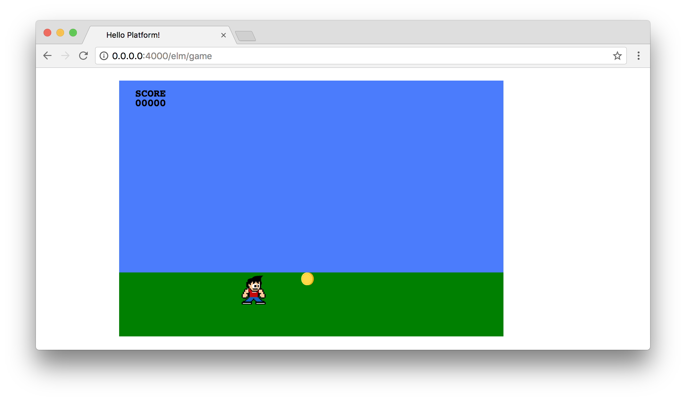
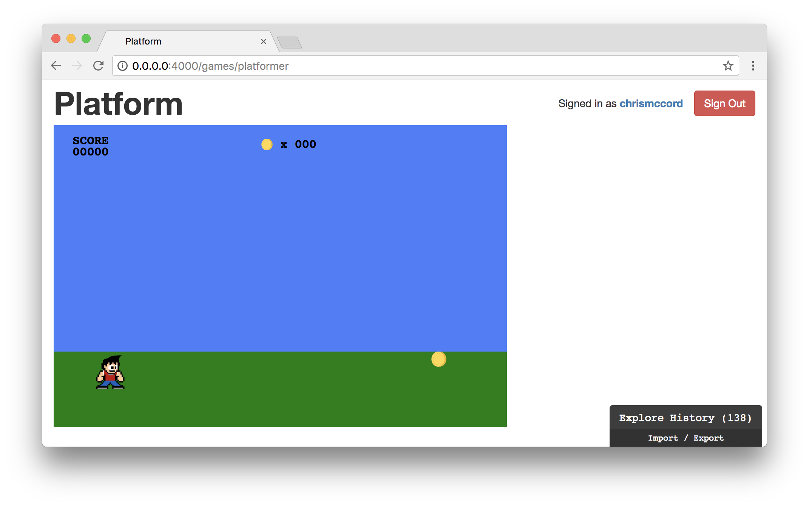
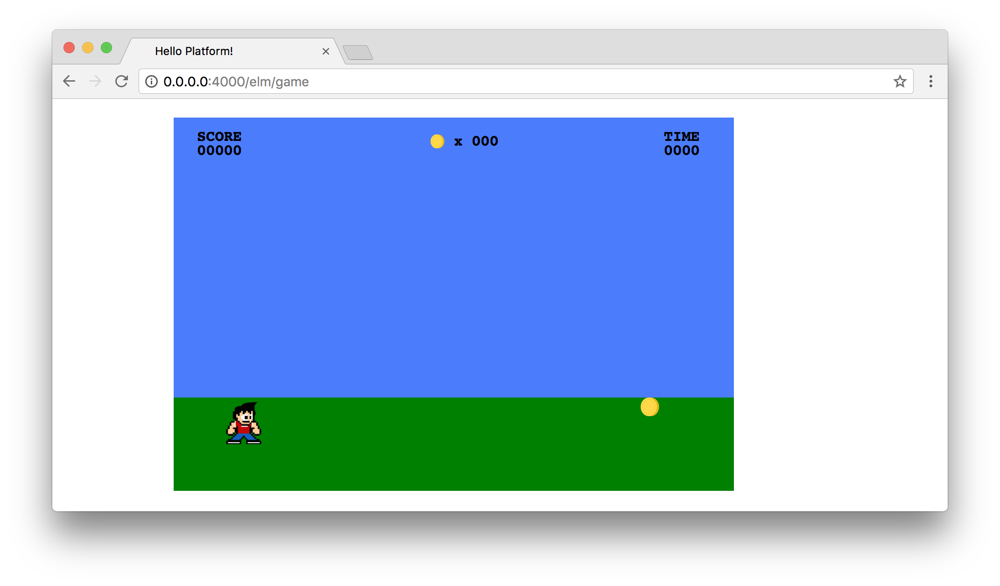
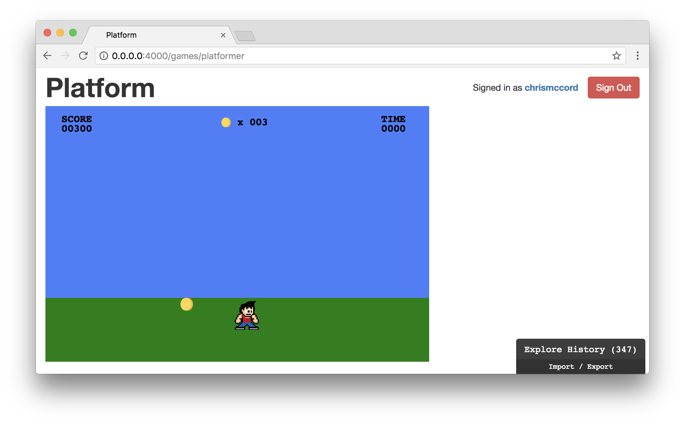
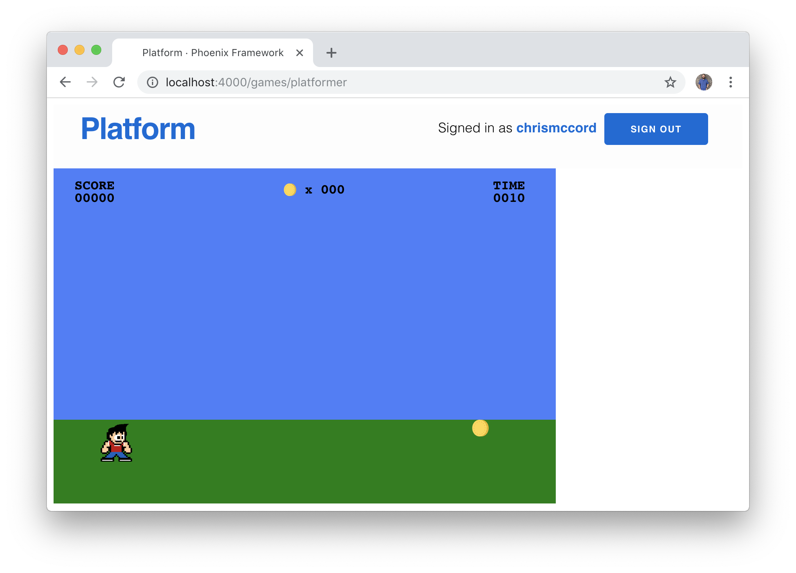

# Displaying Game Data

Let's start thinking about how we want to display game data to our players.
We'll add text to our game window to indicate the player's score and the number
of items collected. We'll also start working towards adding the concept of time
to our game.

## Scoring with Item Collection

Our player's score and the number of items collected are values that will
change, and any time we're dealing with changing values it's a good sign that
we want to track those values in our model.

Let's get started by adding a `playerScore` to our model. We start with an
initial value of `0`, and the player will increase this value while collecting
items. Now would also be a good time to add another field to track the number
of items the character has collected. Let's go ahead and add `playerScore` and
the `itemsCollected` field to our model:

```elm
type alias Model =
    { characterDirection : Direction
    , characterPositionX : Int
    , characterPositionY : Int
    , itemPositionX : Int
    , itemPositionY : Int
    , itemsCollected : Int
    , playerScore : Int
    }


initialModel : Model
initialModel =
    { characterDirection = Right
    , characterPositionX = 50
    , characterPositionY = 300
    , itemPositionX = 500
    , itemPositionY = 300
    , itemsCollected = 0
    , playerScore = 0
    }
```

## Rendering Text Data

Now that we have some initial values for our player's score and the number of
items collected, we can add a score indicator to the view for our game.

First, let's start by adding a view helper function that we can use to set some
standards for how we want our text to look. We'll create a function called
`viewGameText` that will allow us to render text in the game window, and we can
use arguments to indicate the position and the string of text that we want to
display:

```elm
viewGameText : Int -> Int -> String -> Svg Msg
viewGameText positionX positionY str =
    Svg.text_
        [ x (String.fromInt positionX)
        , y (String.fromInt positionY)
        , fontFamily "Courier"
        , fontWeight "bold"
        , fontSize "16"
        ]
        [ Svg.text str ]
```

The first thing to note about this function is that we're using `Svg.text_`,
which is the SVG `<text>` element (whereas `Svg.text` is to create the actual
string of text we're going to display). Then we set some simple font attributes
so our text will look nice. This function will allow us to move text around
easily without having to duplicate all this code over and over again as we add
new text indicators.

We want to start by displaying our player's score in the upper left area of the
game window. To accomplish this, we'll create a new `viewGameScore` function
that takes in the current `model` and return the SVG element with the text we
want to display.

There may be a handful of unfamiliar things that we're not accustomed to seeing
here, but what we're accomplishing is fairly straightforward. We want to start
with the `playerScore` integer value from the model (which starts out with a
value of `0`). We use a `let` expression to convert this into a string with the
`String.fromInt` function since we need to display it as text in our game
window. Then, we use the `String.padLeft` function from the `String` module to
display leading zero characters in our score. This isn't strictly necessary,
but helps make our score display look a little nicer. Lastly, we take the
`currentScore` value from our `let` expression, and we put that inside a group
of `viewGameText` functions that we'll use to display everything. As for how
the position values were determined, it was mainly just tinkering with those
numbers after adding this to the page and experimenting with what looks good.
Here's the `viewGameScore` function:

```elm
viewGameScore : Model -> Svg Msg
viewGameScore model =
    let
        currentScore =
            model.playerScore
                |> String.fromInt
                |> String.padLeft 5 '0'
    in
    Svg.svg []
        [ viewGameText 25 25 "SCORE"
        , viewGameText 25 40 currentScore
        ]
```

We can call this new function at the bottom of the `viewGame` function, and we
should be able to see the score rendered in the browser:

```elm
viewGame : Model -> Svg Msg
viewGame model =
    svg [ version "1.1", width "600", height "400" ]
        [ viewGameWindow
        , viewGameSky
        , viewGameGround
        , viewCharacter model
        , viewItem model
        , viewGameScore model
        ]
```



## Displaying Items Collected

We'll take a similar approach to show the number of coins the character has
collected.

Similar to our `viewGameScore` function, we'll create a new
`viewItemsCollected` function that takes in the `model` and returns the SVG
element we're looking to render for the player.

We start out with the `model.itemsCollected` value (initialized to `0`), and
then we convert it to a string that we'll display in the upper center location
of the game window. We use an SVG `image` element to display a small image of
the item, and then we'll show the number of items in text alongside it. Here's
the full `viewItemsCollected` function:

```elm
viewItemsCollected : Model -> Svg Msg
viewItemsCollected model =
    let
        currentItemCount =
            model.itemsCollected
                |> String.fromInt
                |> String.padLeft 3 '0'
    in
    Svg.svg []
        [ image
            [ xlinkHref "/images/coin.svg"
            , x "275"
            , y "18"
            , width "15"
            , height "15"
            ]
            []
        , viewGameText 300 30 ("x " ++ currentItemCount)
        ]
```

Now we can add this to our `viewGame` function to see it rendered to the game
screen. I also tinkered with the positioning for this one in hopes of making it
look nice for players to see.

```elm
viewGame : Model -> Svg Msg
viewGame model =
    svg [ version "1.1", width "600", height "400" ]
        [ viewGameWindow
        , viewGameSky
        , viewGameGround
        , viewCharacter model
        , viewItem model
        , viewGameScore model
        , viewItemsCollected model
        ]
```



## Displaying Time

Let's take the same approach so we can add a timer to our game and give our
players a sense of urgency. In the upper right corner of the game window, we'll
display the time remaining.

The first step will be to add a new field to our model like we did previously,
and we'll call this one `timeRemaining`:

```elm
type alias Model =
    { characterDirection : Direction
    , characterPositionX : Int
    , characterPositionY : Int
    , itemPositionX : Int
    , itemPositionY : Int
    , itemsCollected : Int
    , playerScore : Int
    , timeRemaining : Int
    }


initialModel : Model
initialModel =
    { characterDirection = Right
    , characterPositionX = 50
    , characterPositionY = 300
    , itemPositionX = 500
    , itemPositionY = 300
    , itemsCollected = 0
    , playerScore = 0
    , timeRemaining = 0
    }
```

Then, we'll add another function to our view called `viewGameTime` that will
convert the time in seconds to a string so we can render it.

```elm
viewGameTime : Model -> Svg Msg
viewGameTime model =
    let
        currentTime =
            model.timeRemaining
                |> String.fromInt
                |> String.padLeft 4 '0'
    in
    Svg.svg []
        [ viewGameText 525 25 "TIME"
        , viewGameText 525 40 currentTime
        ]
```

Lastly, we can add it to the bottom of our `viewGame` function to see it
rendered in the browser:

```elm
viewGame : Model -> Svg Msg
viewGame model =
    svg [ version "1.1", width "600", height "400" ]
        [ viewGameWindow
        , viewGameSky
        , viewGameGround
        , viewCharacter model
        , viewItem model
        , viewGameScore model
        , viewItemsCollected model
        , viewGameTime model
        ]
```



Keep in mind that we've managed to add text content to our game window that
will allow players to see changes in game data, but these fields don't actually
reflect the score, item collection count, and time yet. Let's take care of that
next.

## Updating the Player Score

Thankfully our game mechanics are simple, and we've already laid the foundation
for how we'll handle incrementing the player's item count and score. In the
current version of our game, we're using the `characterFoundItem` function to
determine when the character has stumbled upon a coin. And that gets triggered
in our `GameLoop` message so we can spawn a new coin. We can use this
existing feature to start updating our model.

When the character arrives at a coin, we want to increment our
`itemsCollected` field by a value of `1`, and we'll award `100` points to the
`playerScore` field at the same time. The scoring is arbitrary, but in the
future we could always add items with different scoring values.

Let's adjust the code in our `GameLoop` message. The syntax here will look a
little unfamiliar since it's broken up on different lines, but it's the same
record update syntax we've been using to update fields in the model.

```elm
GameLoop time ->
    if characterFoundItem model then
        ( { model
            | itemsCollected = model.itemsCollected + 1
            , playerScore = model.playerScore + 100
            }
        , Random.generate SetNewItemPositionX (Random.int 50 500)
        )
    else
        ( model, Cmd.none )
```

Now when the `characterFoundItem` function returns `True`, we're not only
generating a random integer to spawn a new coin item, we're also incrementing
the `itemsCollected` value and the `playerScore` value simultaneously. Check
it out in the browser and it looks like it works!



## Implementing a Countdown Timer

We have our player score and item counter working. Let's take a look at how we
can add a countdown timer to our game. This part will involve updating several
pieces of our application, but thankfully they're all simple changes.

We'll start by installing the `elm/time` package with the following:

```shell
$ elm install elm/time
```

Then, we can update our list of imports at the top of the `Platformer.elm`
file to include
[`Time`](https://package.elm-lang.org/packages/elm/time/latest/Time):

```elm
import Browser
import Browser.Events
import Html exposing (Html, div)
import Json.Decode as Decode
import Random
import Svg exposing (..)
import Svg.Attributes exposing (..)
import Time
```

Next, let's add to our `Msg` type to account for our timer with
`CountdownTimer`, which takes `Time.Posix` as an argument. You can read more
about the concept of Posix time in the
[documentation for the `Time` package](https://package.elm-lang.org/packages/elm/time/latest), but for what we're
building all you need to know is that we'll be subscribing to every second of
time as it passes and then using that to update our `timeRemaining` field in
the model. Here's our updated `Msg` type:

```elm
type Msg
    = CountdownTimer Time.Posix
    | GameLoop Float
    | NoOp
    | SetNewItemPositionX Int
```

In the `update` function, we'll set up a new case below the `GameLoop` with the
following code (we're not changing the model yet, we're just setting up our
message for now so we can use it momentarily).

```elm
CountdownTimer time ->
    ( model, Cmd.none )
```

And now we can update our `subscriptions` function to trigger the
`CountdownTimer` message that we created for every second (`1000` milliseconds)
that passes:

```elm
subscriptions : Model -> Sub Msg
subscriptions model =
    Sub.batch
        [ Browser.Events.onKeyDown (Decode.map KeyDown keyDecoder)
        , Browser.Events.onAnimationFrameDelta GameLoop
        , Time.every 1000 CountdownTimer
        ]
```

## Incorporating Time

Now that we're subscribing to time with every passing second, we can think
think about how we want to add this to our game. Let's try thinking of our game
as having small levels where players have to collect ten coins in ten seconds
to advance.

We'll start by updating our `initialModel` so that the `timeRemaining` field
starts with an initial value of `10`:

```elm
initialModel : Model
initialModel =
    { characterDirection = Right
    , characterPositionX = 50
    , characterPositionY = 300
    , itemPositionX = 500
    , itemPositionY = 300
    , itemsCollected = 0
    , playerScore = 0
    , timeRemaining = 10
    }
```

And now in the `update` function we can subtract one second from the timer for
as long as the `timeRemaining` field has a value of more than zero:

```elm
CountdownTimer time ->
    if model.timeRemaining > 0 then
        ( { model | timeRemaining = model.timeRemaining - 1 }, Cmd.none )

    else
        ( model, Cmd.none )
```

Granted, nothing will happen when the timer counts down to zero, but it looks
like it should be working at this point in terms of counting from `10` down to
`0`.



## Summary

We managed to accomplish our goal of displaying game data in this chapter. Our
game is inching its way closer to being fun to play, but we haven't created
much structure for our game yet.

In the next chapter, we'll start handling different states for our game and
we'll work towards improving gameplay.
