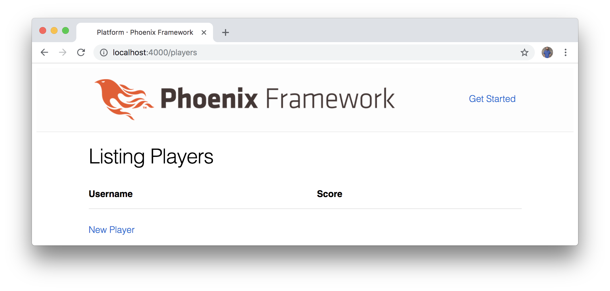
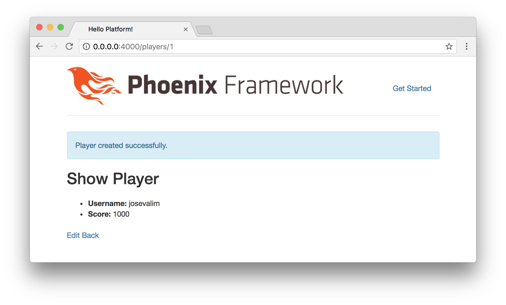

# Diving In

Instead of simply _reading_ about Elixir and Elm, let's dive in and
_experience_ what these languages have to offer. In this chapter, we're going
to avoid detailed explanations and theory in favor of quickly building the
foundation for our project. We'll focus on running the necessary commands in
the Terminal and writing the code we'll need to start creating our application.

Later in the book, we'll cover more about the fundamentals of Elixir, but for
now let's focus on following along and getting a glimpse of how to get an
application up and running.

## Installation

If you haven't already set up your development environment with Elixir,
Phoenix, and PostgreSQL, **check out the [Appendix](#appendix) in the back
of the book for quick installation instructions**.

Also note that we're working with the _latest_ version of Phoenix in this book.
Make sure you have **Phoenix 1.3** installed, or the commands and files will
all look different as you work through the material.

## Creating the Platform

The first step we need to take is to create the foundation for our application.
To do that, let's open up our Terminal and run the following command:

```shell
$ mix phx.new platform
```

It will ask the following question:

> Fetch and install dependencies?

Enter the letter `Y` and the following output will be displayed (note that some
of the file creation lines were trimmed for the sake of readability):

```shell
$ mix phx.new platform
* creating platform/mix.exs
* creating platform/README.md
* creating platform/assets/...
* creating platform/config/...
* creating platform/lib/platform/...
* creating platform/lib/platform_web/...
* creating platform/priv/...
* creating platform/test/...

Fetch and install dependencies? [Yn] Y
* running mix deps.get
* running mix deps.compile
* running cd assets && npm install && node node_modules/brunch/bin/brunch build

We are all set! Go into your application by running:

    $ cd platform

Then configure your database in config/dev.exs and run:

    $ mix ecto.create

Start your Phoenix app with:

    $ mix phx.server

You can also run your app inside IEx (Interactive Elixir) as:

    $ iex -S mix phx.server
```

Notice that Phoenix displays _a lot_ of helpful information. First, the output
shows all the files that were generated (don't worry if it seems overwhelming
at first; we're only going to start with a handful of these files). Then, we
see some information about how to configure our database and start the server.

## Configuring the Database

Now that we've created the files for our Phoenix application, let's change to
that directory:

```shell
$ cd platform
```

We can set up the database for our project by running the following command:

```shell
$ mix ecto.create
```

If you run into issues here, it likely means you'll have to configure your
PostgreSQL installation or adjust the database `username` and `password` fields
at the bottom of the `config/dev.exs` file. You can also check out the
[Appendix](#appendix) at the back of this book for more information on
PostgreSQL.

Since this is the first time we're running a command with our new application,
we'll see that it takes time for the source code to compile. Elixir is based on
the Erlang virtual machine, and needs to compile the source to bytecode before
we can run our programs. Don't worry if this seems to take a while at first,
because subsequent commands will run much more quickly after this.

If the database creation was successful, we'll see the following message at the
bottom:

```shell
$ mix ecto.create
Compiling files (.ex) ...
Generated platform app
The database for Platform.Repo has been created
```

We have successfully created our Phoenix application, compiled it, and set up
our database.

## Running the Server

Let's see what our new application looks like in the browser. To start the web
server, run the following command:

```shell
$ mix phx.server
```

This will start a server and allow us to visit
[`http://0.0.0.0:4000`](http://0.0.0.0:4000) in a browser to see our new
application running. Here is what the output will look like:

```shell
$ mix phx.server
[info] Running PlatformWeb.Endpoint with Cowboy using http://0.0.0.0:4000
```


At this point, you might be impressed that we managed to get a full back-end
up and running so quickly. Or you might have seen similar features in other
frameworks and you're nonplussed with our progress so far. We're going to start
adding features to our application, but it's worth taking a moment to
appreciate just how much we already have going for us with just a few commands.

Feel free to take a look at some of the great documentation listed on the
default Phoenix start page. Before we move on, let's stop the Phoenix web
server. Go back to the Terminal where the server is running, and press
`Control + C` on your keyboard twice to stop the server. This is what the
output will look like as you return from the running web server to a blank
command line:

```shell
$ mix phx.server
[info] Running Platform.Endpoint with Cowboy using http://0.0.0.0:4000
[info] Compiled 6 files into 2 files, copied 3 in 2.1 sec
[info] GET /
[debug] Processing by PlatformWeb.PageController.index/2
  Parameters: %{}
  Pipelines: [:browser]
[info] Sent 200 in 67ms
^C
BREAK: (a)bort (c)ontinue (p)roc info (i)nfo (l)oaded
       (v)ersion (k)ill (D)b-tables (d)istribution
^C
$ 
```

## Our First Resource

Since we are building a small game platform, there are two primary resources
that we'll want to get started with:

- Players
- Games

We're going to start by using something called a generator to keep moving
quickly. It's going to create a lot of the files we need to work with. Then,
we'll cover more about how it all works later.

Let's generate the resource for our players with the following command:

```shell
$ mix phx.gen.html Accounts Player players username:string score:integer
```

With this command, we're creating players for our game platform. We want to be
able to use our browser to interact with the data, so we're starting with
[`phx.gen.html`](https://hexdocs.pm/phoenix/Mix.Tasks.Phoenix.Gen.Html.html)
to generate an HTML resource.

Because we're creating player accounts for our application, we use `Accounts`
to provide a _context_ for our resource. Then, we use `Player` for the module
name and `players` to indicate the pluralized form, which will also be used
to create the database table.

For the player fields, each player account will have a `username` (stored as a
string), and a `score` (stored as an integer). We'll eventually extend the
capabilities of our players with additional fields, but for now this will
give us a good starting point to start creating a list of players.

You'll see that the generator creates quite a few files for us, and once again
Phoenix gives us some helpful tips about what to do next:

```shell
$ mix phx.gen.html Accounts Player players username:string score:integer
* creating lib/platform_web/controllers/player_controller.ex
* creating lib/platform_web/templates/player/edit.html.eex
* creating lib/platform_web/templates/player/form.html.eex
* creating lib/platform_web/templates/player/index.html.eex
* creating lib/platform_web/templates/player/new.html.eex
* creating lib/platform_web/templates/player/show.html.eex
* creating lib/platform_web/views/player_view.ex
* creating test/platform_web/controllers/player_controller_test.exs
* creating lib/platform/accounts/player.ex
* creating priv/repo/migrations/20170807120444_create_players.exs
* creating lib/platform/accounts/accounts.ex
* injecting lib/platform/accounts/accounts.ex
* creating test/platform/accounts/accounts_test.exs
* injecting test/platform/accounts/accounts_test.exs

Add the resource to your browser scope in lib/platform_web/router.ex:

    resources "/players", PlayerController

Remember to update your repository by running migrations:

    $ mix ecto.migrate
```

## Routing

Don't worry too much about all those files yet, but the information at the
bottom is important. In order to configure our application to work with our new
player accounts, we'll need to add them to the router first, and then run a
migration to update the database with a new `players` table.

Phoenix makes things easy on us with the helpful notes in the Terminal. Let's
go ahead and follow along. Open the `lib/platform_web/router.ex` file and see
what it looks like:

```elixir
defmodule PlatformWeb.Router do
  use PlatformWeb, :router

  pipeline :browser do
    plug :accepts, ["html"]
    plug :fetch_session
    plug :fetch_flash
    plug :protect_from_forgery
    plug :put_secure_browser_headers
  end

  pipeline :api do
    plug :accepts, ["json"]
  end

  scope "/", PlatformWeb do
    pipe_through :browser # Use the default browser stack

    get "/", PageController, :index
  end

  # Other scopes may use custom stacks.
  # scope "/api", PlatformWeb do
  #   pipe_through :api
  # end
end
```

The Phoenix router comes with two separate "pipelines" by default. One of them
is for HTML (which we're going to use now), and the other one is for JSON
(which we'll also use later). And we can even see that the `scope` is already
set up for us to access the HTML with our browser. That's how we were able to
load the `http://0.0.0.0:4000` URL and see the initial starter page. Don't
worry if it seems confusing at first. All you need to know is that this block
of code is where we'll focus for now:

```elixir
scope "/", PlatformWeb do
  pipe_through :browser # Use the default browser stack

  get "/", PageController, :index
end
```

And we're going to update it with our new players resource:

```elixir
scope "/", Platform.Web do
  pipe_through :browser # Use the default browser stack

  get "/", PageController, :index
  resources "/players", PlayerController
end
```

That means when we access
[`http://0.0.0.0:4000/players`](http://0.0.0.0:4000/players), we'll
soon be able to start creating the players for our game platform.

## Running a Migration

Our application has all the information it needs to render the players resource
that we created, but we still need to tell the database about the changes we
made. For the database to store our player data (with the `username` and
`score` fields), we'll need to run a migration. Go back to the Terminal, and
run the following command:

```shell
$ mix ecto.migrate
```

This will create a new database table called `players`. If everything
goes according to plan, then we should see the following output:

```shell
$ mix ecto.migrate
Compiling 10 files (.ex)
Generated platform app
08:18:44.181 [info]  == Running Platform.Repo.Migrations.CreatePlayers.change/0 forward
08:18:44.182 [info]  create table players
08:18:44.371 [info]  == Migrated in 0.1s
```

## Creating Players

Let's start our server again and see our new player resource in action:

```shell
$ mix phx.server
```

Now we can access
[http://0.0.0.0:4000/players](http://0.0.0.0:4000/players) and we should
see the following:



This is excellent. We can now add players to our platform using a web browser.
Click the **New Player** link at the bottom and try creating a player on the
[`http://0.0.0.0:4000/players/new`](http://0.0.0.0:4000/players/new) page.


After we successfully create a new player account, we'll see the "show" page
with the individual player's data (notice the player `id` number is displayed
in the URL too):



Feel free to create additional player accounts so we have data to work with on
our players page:


## Updating our Home Page

We have a working players resource with an index of all the players, a show
page to view a single player, an edit page to update a single player, and the
ability to delete players. But when we go back to our home page at
[`http://0.0.0.0:4000`](http://0.0.0.0:4000), these pages aren't accessible.
Our users wouldn't know that they need to visit the `/players/new` page to
create their account. At some point, we will only want our users to be able to
create their accounts without being able to edit or delete others. To get
started, let's figure out where the HTML code is coming from for our home page.

Inside the `lib/platform_web` folder, there is a `templates` folder. This is
where we put the HTML code that we want to render in the browser. And instead
of standard `.html` files, we'll see that the files have a `.html.eex`
extension. That means we can write standard HTML code, and we can also embed
Elixir code too.

Let's open the `lib/platform_web/templates/page/index.html.eex` file and take a
look:

```embedded_elixir
<div class="jumbotron">
  <h2><%= gettext "Welcome to %{name}!", name: "Phoenix" %></h2>
  <p class="lead">A productive web framework that<br />does not compromise speed
  and maintainability.</p>
</div>

<div class="row marketing">
  <div class="col-lg-6">
    <h4>Resources</h4>
    <ul>
      <li>
        <a href="http://phoenixframework.org/docs/overview">Guides</a>
      </li>
      <li>
        <a href="https://hexdocs.pm/phoenix">Docs</a>
      </li>
      <li>
        <a href="https://github.com/phoenixframework/phoenix">Source</a>
      </li>
    </ul>
  </div>

  <div class="col-lg-6">
    <h4>Help</h4>
    <ul>
      <li>
        <a href="http://groups.google.com/group/phoenix-talk">Mailing list</a>
      </li>
      <li>
        <a href="http://webchat.freenode.net/?channels=elixir-lang">#elixir-lang
        on freenode IRC</a>
      </li>
      <li>
        <a href="https://twitter.com/elixirphoenix">@elixirphoenix</a>
      </li>
    </ul>
  </div>
</div>
```

This should look familiar in that it's mostly comprised of standard HTML code.
It's the HTML that we're seeing when we load
[`http://0.0.0.0:4000`](http://0.0.0.0:4000). Let's delete this code and create
a couple of simple links to our player pages. First, remove _all_ the existing
code in the `lib/platform_web/templates/page/index.html.eex` file. Then,
replace it with the following:

```html
<div class="container">
  <a class="btn btn-success" href="/players/new">Create Player Account</a>
  <a class="btn btn-info" href="/players">List All Players</a>
</div>
```

Save the file and go back to the browser to see the changes (make sure the
Phoenix web server is still running or restart the server with
`mix phx.server`) at [`http://0.0.0.0:4000`](http://0.0.0.0:4000):


Phoenix comes with a **Live Reload** feature that automatically refreshes our
application in the browser. If the Phoenix server was still running, then the
home page was automatically regenerated and should now display the buttons that
we created. Try them out, and they should enable users to successfully navigate
to the player pages in our application.

## Writing Elixir Code

Lastly, let's get some experience with writing Elixir code in our templates
by converting our buttons to use embedded Elixir code instead of simple HTML.
The page will work the same way, but this will give us a chance to use a
Phoenix feature instead of writing HTML.

Phoenix gives us a
[link](https://hexdocs.pm/phoenix_html/Phoenix.HTML.Link.html#link/2) function
we can use, and we can see a handful of examples provided in the documentation.

Since we're working with a `.eex` file, that means we can embed Elixir code by
surrounding it with tags like this: `<%= ... %>`. The Elixir code that we put
inside those tags will be evaluated, and then rendered onto the page.

A helpful debugging technique while working with Elixir is to use the
[`IO.inspect`](https://hexdocs.pm/elixir/IO.html#inspect/2) function to display
results. In this example, we're using the `IO` module with the `inspect`
function, and we're passing it the string `"Hello World!"`:

```embedded_elixir
<div class="container">
  <a class="btn btn-success" href="/players/new">Create Player Account</a>
  <a class="btn btn-info" href="/players">List All Players</a>

  <%= IO.inspect("Hello World!") %>
</div>
```

Let's take a look at the results in our browser:


We can do something similar to embed a link on our page. We won't need to
explicitly mention the module (`Phoenix.HTML.Link`), because we already have
access to some helpful Phoenix functions in this context. We can recreate
our existing HTML links with the following code by passing the link text, the
location, and some extra classes for Bootstrap (which comes preloaded with
Phoenix by default) to make it look nice:

```embedded_elixir
<div class="container">
  <%= link("Create Player Account", to: "/players/new", class: "btn btn-success") %>
  <%= link("List All Players", to: "/players", class: "btn btn-info") %>
</div>
```

We can now verify that our links still work the same way they did previously:


## Summary

In this chapter, we managed to cover _a lot_ of ground. We were able to create
the entire foundation for our application with a Phoenix back-end. We leveraged
the Phoenix generators to create our players resource. We also started getting
an idea of what the Phoenix folder structure looks like, and started editing
files. We also learned a little about routing and worked with the database.

We've gotten an introductory look at how to create a full Elixir and Phoenix
web platform, and we even created a couple of player records that we can use as
we continue building. But we moved quickly through these steps, and we don't
have a solid understanding of how all these pieces fit together yet. In the
next chapter, we'll delve into some Elixir basics. And instead of using
generators like we did in this chapter, we'll manually create features in our
application so we can continue increasing our experience.
