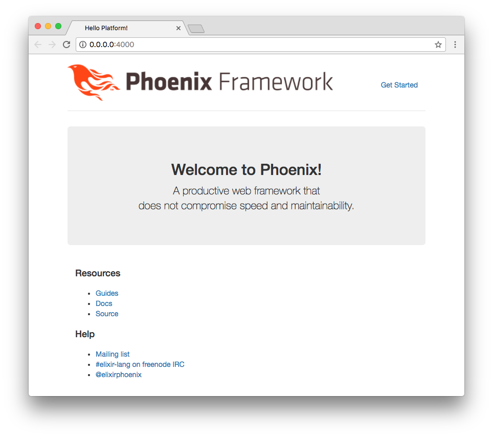
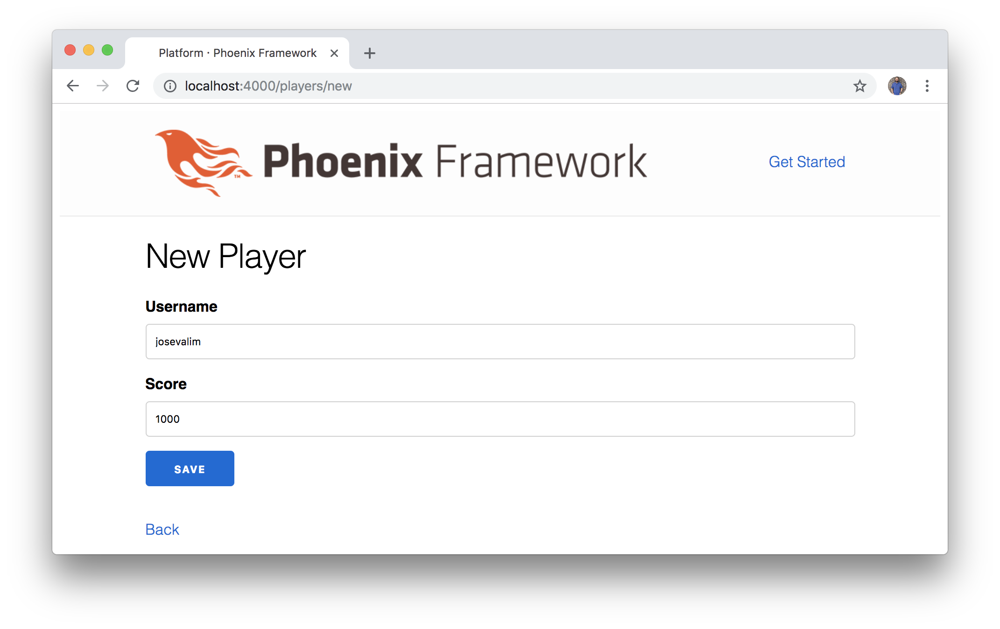
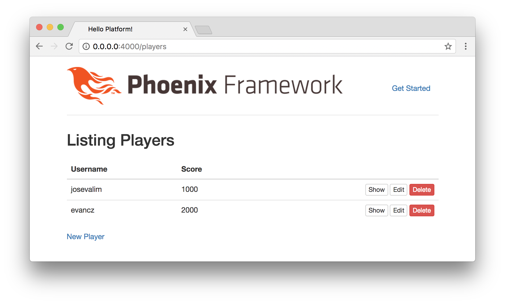
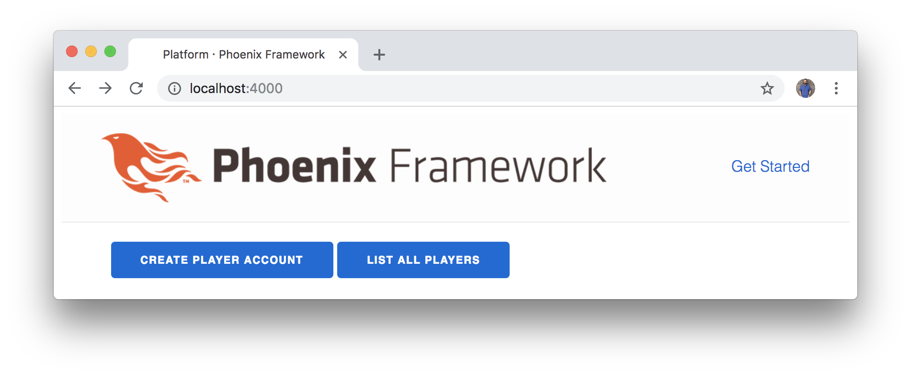

# Diving In

Instead of simply _reading_ about Elixir and Elm, let's dive in and
_experience_ what these languages have to offer. In this chapter, we're going
to avoid detailed explanations and theory in favor of quickly building the
foundation for our project. We'll focus on running the right console commands
and writing the code we'll need to start creating our application.

Later in the book, we'll cover more about the fundamentals of Elixir, but for
now let's focus on following along and getting a glimpse of how to get an
application up and running. If you haven't already set up your development
environment with Elixir, Phoenix, and PostgreSQL, then check out the Appendix
in the back of the book for more information.

## Note on Phoenix Versions

In this book, we're using the _latest_ version of Phoenix available. Make sure
you're working with **Phoenix 1.3**, or the commands and files will all look
different as you work through the instructions.

To fetch the latest version of Phoenix, use the following command:

```shell
$ mix archive.install \
https://github.com/phoenixframework/archives/raw/master/phx_new.ez
```

After installation, run the `mix help` command and verify that some examples
start with `mix phx` instead of `mix phoenix`.

## Creating the Platform

The first step we need to take is to create the foundation for our application.
To do that, let's open up our Terminal and run the following command:

```shell
$ mix phx.new platform
```

It will ask the following question:

> Fetch and install dependencies?

Enter the letter `Y` and the following output will be displayed:

```shell
$ mix phx.new platform
* creating platform/config/config.exs
* creating platform/config/dev.exs
* creating platform/config/prod.exs
* creating platform/config/prod.secret.exs
* creating platform/config/test.exs
* creating platform/lib/platform/application.ex
* creating platform/lib/platform/web/channels/user_socket.ex
* creating platform/lib/platform/web/views/error_helpers.ex
* creating platform/lib/platform/web/views/error_view.ex
* creating platform/lib/platform/web/endpoint.ex
* creating platform/lib/platform/web/router.ex
* creating platform/lib/platform/web/web.ex
* creating platform/mix.exs
* creating platform/README.md
* creating platform/test/support/channel_case.ex
* creating platform/test/support/conn_case.ex
* creating platform/test/test_helper.exs
* creating platform/test/web/views/error_view_test.exs
* creating platform/lib/platform/web/gettext.ex
* creating platform/priv/gettext/en/LC_MESSAGES/errors.po
* creating platform/priv/gettext/errors.pot
* creating platform/lib/platform/repo.ex
* creating platform/priv/repo/seeds.exs
* creating platform/test/support/data_case.ex
* creating platform/lib/platform/web/controllers/page_controller.ex
* creating platform/lib/platform/web/templates/layout/app.html.eex
* creating platform/lib/platform/web/templates/page/index.html.eex
* creating platform/lib/platform/web/views/layout_view.ex
* creating platform/lib/platform/web/views/page_view.ex
* creating platform/test/web/controllers/page_controller_test.exs
* creating platform/test/web/views/layout_view_test.exs
* creating platform/test/web/views/page_view_test.exs
* creating platform/.gitignore
* creating platform/assets/brunch-config.js
* creating platform/assets/css/app.css
* creating platform/assets/css/phoenix.css
* creating platform/assets/js/app.js
* creating platform/assets/js/socket.js
* creating platform/assets/package.json
* creating platform/assets/static/robots.txt
* creating platform/assets/static/images/phoenix.png
* creating platform/assets/static/favicon.ico

Fetch and install dependencies? [Yn] Y
* running mix deps.get
* running mix deps.compile
* running cd assets && npm install && node node_modules/brunch/bin/brunch build

We are all set! Run your Phoenix application:

    $ cd platform
    $ mix phx.server

You can also run your app inside IEx (Interactive Elixir) as:

    $ iex -S mix phx.server

Before moving on, configure your database in config/dev.exs and run:

    $ mix ecto.create
```

Notice that Phoenix displays _a lot_ of helpful information. First, the output
shows all the files that were generated (don't worry if it seems overwhelming
at first; we're only going to start with a handful of these files). Then we see
some information about how to configure our database and run the web server.

## Configuring the Database

Now that we've created the files for our Phoenix application, let's change into
that directory:

```shell
$ cd platform
```

We can set up the database for our project by running the following command:

```shell
$ mix ecto.create
```

If you run into any issues here, it likely means you'll have to configure the
database in the `config/dev.exs` file.

Since this is the first time we're running a command with our new application,
we'll see that it takes time for the source code to compile. Elixir is based on
the Erlang virtual machine, and needs to compile the source to bytecode before
we can run our programs. Don't worry if this seems to take a while at first,
because subsequent commands will run much more quickly after this.

If the database creation was successful, we'll see the following message at the
bottom:

```shell
$ mix ecto.create
Compiling files (.ex) ...
Generated platform app
The database for Platform.Repo has been created
```

Nice! That means we have successfully created our Phoenix application, compiled
it, and set up our database.

## Running the Server

Let's see what our new application looks like in the browser. To start the web
server, run the following command:

```shell
$ mix phx.server
```

This will start a server and allow us to visit
[`http://0.0.0.0:4000`](http://0.0.0.0:4000) in a browser to see our new
application running live! Here is what the output will look like:

```shell
$ mix phx.server
[info] Running Platform.Web.Endpoint with Cowboy using http://0.0.0.0:4000
```



At this point, you might be thinking to yourself, "Whoa! That was quick and we
already have a full back-end up and running!" Or you might be thinking, "Hmm.
I'm not impressed yet." We're going to start adding features to our
application, but it's worth taking a moment to appreciate just how much we
already have going for us with just a few commands.

Also, feel free to take a look at some of the great documentation listed on
the default Phoenix start page. And before we move on, let's stop the Phoenix
web server. Go back to the Terminal where the server is running, and press
`Control + C` on your keyboard twice to stop the server. This is what the
output will look like as you return from the running web server to a blank
command-line:

```shell
$ mix phx.server
[info] Running Platform.Endpoint with Cowboy using http://0.0.0.0:4000
[info] Compiled 6 files into 2 files, copied 3 in 2.1 sec
[info] GET /
[debug] Processing by Platform.PageController.index/2
  Parameters: %{}
  Pipelines: [:browser]
[info] Sent 200 in 67ms
^C
BREAK: (a)bort (c)ontinue (p)roc info (i)nfo (l)oaded
       (v)ersion (k)ill (D)b-tables (d)istribution
^C
$ 
```

## Our First Resource

Since we are building a video game platform, there are two primary resources
that we'll want to get started with:

- Players
- Games

We're going to start by using something called a generator to keep moving
quickly. It's going to create a lot of the files we need to work with. Then,
we'll cover more about how it all works later.

Let's generate the resource for our players with the following command:

```shell
$ mix phx.gen.html Accounts Player players username:string score:integer
```

What we're doing here is creating players for our game platform. We want to be
able to use our browser to interact with the data, so we're starting with
`phx.gen.html` to generate an HTML resource.

Because we're creating player accounts for our application, we use `Accounts`
to provide a _context_ for our resource. Then we use `Player` for the module
name, and `players` to indicate the pluralized form, which will also be used
to create the database table.

For the player fields, each player account will have a `username` (stored as a
string), and a `score` (stored as an integer). We'll eventually extend the
capabilities of our players with additional fields, but for now this will
give us a good starting point to start creating a list of players.

You'll see that the generator creates quite a few files for us, and once again
Phoenix gives us some helpful tips about what to do next:

```shell
$ platform mix phx.gen.html Accounts Player players username:string score:integer
* creating lib/platform/web/controllers/player_controller.ex
* creating lib/platform/web/templates/player/edit.html.eex
* creating lib/platform/web/templates/player/form.html.eex
* creating lib/platform/web/templates/player/index.html.eex
* creating lib/platform/web/templates/player/new.html.eex
* creating lib/platform/web/templates/player/show.html.eex
* creating lib/platform/web/views/player_view.ex
* creating test/web/controllers/player_controller_test.exs
* creating lib/platform/accounts/player.ex
* creating priv/repo/migrations/20170401213307_create_accounts_player.exs
* creating lib/platform/accounts/accounts.ex
* creating test/accounts_test.exs

Add the resource to your browser scope in lib/platform/web/router.ex:

    resources "/players", PlayerController

Remember to update your repository by running migrations:

    $ mix ecto.migrate
```

## Routing

Don't worry too much about all those files yet, but the information at the
bottom is important. In order to configure our application to work with our new
player accounts, we'll need to add them to the router first, and then run a
migration to update the database with a new `accounts_players` table.

Phoenix makes things easy on us with the helpful Terminal notes. Let's go ahead
and follow along. Open the `lib/platform/web/router.ex` file and see what
it looks like:

```elixir
defmodule Platform.Web.Router do
  use Platform.Web, :router

  pipeline :browser do
    plug :accepts, ["html"]
    plug :fetch_session
    plug :fetch_flash
    plug :protect_from_forgery
    plug :put_secure_browser_headers
  end

  pipeline :api do
    plug :accepts, ["json"]
  end

  scope "/", Platform.Web do
    pipe_through :browser # Use the default browser stack

    get "/", PageController, :index
  end

  # Other scopes may use custom stacks.
  # scope "/api", Platform.Web do
  #   pipe_through :api
  # end
end
```

The Phoenix router comes with two separate "pipelines" by default. One of them
is for HTML (which we're going to use now), and the other one is for JSON
(which we'll also use later). And we can even see that the "scope" is already
set up for us to access the HTML with our browser. That's how we were able to
load the `http://0.0.0.0:4000` URL and see the initial starter page. Don't
worry if it seems confusing at first. All you need to know is that this block
of code is where we'll focus for now:

```elixir
scope "/", Platform.Web do
  pipe_through :browser # Use the default browser stack

  get "/", PageController, :index
end
```

And we're going to update it with our new players resource:

```elixir
scope "/", Platform.Web do
  pipe_through :browser # Use the default browser stack

  get "/", PageController, :index
  resources "/players", PlayerController
end
```

That means when we access
[`http://0.0.0.0:4000/players`](http://0.0.0.0:4000/players), we'll
soon be able to start creating the players for our video game platform.

## Running a Migration

Our application has all the information it needs to render the players resource
that we created, but we still need to tell the database about the changes that
we made. The database will need to store our player data (with the `username`
and `score` fields), and to do that we'll need to run a migration. Go back to
the Terminal, and run the following command:

```shell
$ mix ecto.migrate
```

This will create a new database table called "accounts_players". If everything
goes according to plan, then we should see the following output:

```shell
$ mix ecto.migrate
17:44:53.658 [info]  == Running Platform.Repo.Migrations.CreatePlatform.Accounts.Player.change/0 forward
17:44:53.658 [info]  create table accounts_players
17:44:53.682 [info]  == Migrated in 0.0s
```

## Creating Players

Let's start our server again and see our new player resource in action:

```shell
mix phx.server
```

Now we can access
[http://0.0.0.0:4000/players](http://0.0.0.0:4000/players) and we should
see the following:


This is excellent! We can now add players to our platform using a web browser.
Click the **New Player** button and try creating a couple of players on the
[http://0.0.0.0:4000/players/new](http://0.0.0.0:4000/players/new) page.



Now we have some data to work with on our players page:



## Updating our Home Page

We have a working `/players` page. But when we go back to
[`http://0.0.0.0:4000`](http://0.0.0.0:4000), we see that it's not
listed anywhere as a link. Let's figure out where the HTML code is coming from
for our home page.

Inside the `lib/platform/web` folder, there's a `templates` folder. This is
where we put the HTML code that we want to render in the browser. And instead of
 standard `.html` files, we'll see that the files end in the `.html.eex`
extension. That means we can enter standard HTML code in there, but we can also
embed Elixir code too.

Let's open the `lib/platform/web/templates/page/index.html.eex` file and take a
look:

```embedded_elixir
<div class="jumbotron">
  <h2><%= gettext "Welcome to %{name}!", name: "Phoenix" %></h2>
  <p class="lead">A productive web framework that<br />does not compromise speed
  and maintainability.</p>
</div>

<div class="row marketing">
  <div class="col-lg-6">
    <h4>Resources</h4>
    <ul>
      <li>
        <a href="http://phoenixframework.org/docs/overview">Guides</a>
      </li>
      <li>
        <a href="https://hexdocs.pm/phoenix">Docs</a>
      </li>
      <li>
        <a href="https://github.com/phoenixframework/phoenix">Source</a>
      </li>
    </ul>
  </div>

  <div class="col-lg-6">
    <h4>Help</h4>
    <ul>
      <li>
        <a href="http://groups.google.com/group/phoenix-talk">Mailing list</a>
      </li>
      <li>
        <a href="http://webchat.freenode.net/?channels=elixir-lang">#elixir-lang
        on freenode IRC</a>
      </li>
      <li>
        <a href="https://twitter.com/elixirphoenix">@elixirphoenix</a>
      </li>
    </ul>
  </div>
</div>
```

This should look familiar in that it's mostly comprised of standard HTML code.
It's the HTML that we're seeing when we load
[`http://0.0.0.0:4000`](http://0.0.0.0:4000). In fact, let's delete all this
code and create a simple link to our `/players` page. So we'll remove _all_ the
existing code in the `lib/platform/web/templates/page/index.html.eex` file, and
replace it with the following:

```embedded_elixir
<a href="/players">List of Players</a>
```

Save the file and let's go back to the browser to see the changes (make sure
the Phoenix web server is still running) at
[`http://0.0.0.0:4000`](http://0.0.0.0:4000):



Excellent! Phoenix comes with a **Live Reload** feature that automatically
refreshes our application in the browser. If the Phoenix server was still
running, then the home page was automatically regenerated and should now show
the link to the list of players. Try out the link and it should work properly
to send you to the `/players` page.

## Writing Elixir Code

Lastly, we might as well convert our link to use Elixir code instead of using
the simple HTML version. It'll work the same way, but this will give us a chance
to use a Phoenix feature instead of writing HTML.

Phoenix gives us a
[link](https://hexdocs.pm/phoenix_html/Phoenix.HTML.Link.html#link/2) function
that we can use. You can see a handful of examples in the documentation.

Since we're working with a `.eex` file, that means we can embed Elixir code by
surrounding it with tags like this: `<%= ... %>`. The Elixir code that we put
inside those tags will be evaluated, and then rendered onto the page.

A helpful debugging technique while working with Elixir is to use `IO.inspect`
to display some results. In this example, we use the `IO` module with the
`inspect` function, and we pass it the string `"Hello World!"`:

```embedded_elixir
<a href="/players">List of Players</a>
<%= IO.inspect "Hello" %>
```

And we can see the results in our browser:


We can do the same thing to embed a Phoenix link on our page. We won't need to
explicitly mention the module (`Phoenix.HTML.Link`) because we already have some
helpful Phoenix functions available to us here in this context. But we can
recreate our HTML link with the following code by passing the link text, the
location, and some extra classes for Bootstrap to make it look nice:

```embedded_elixir
<%= link("List of Players", to: "/players", class: "btn btn-primary") %>
```

Our link should still work the same way (try it out!):


## Summary

In this chapter, we managed to cover _a lot_ of ground. We were able to create
the entire foundation for our application with a Phoenix back-end. We leveraged
the Phoenix generators to create our Players resource. We also started getting
an idea of what the Phoenix folder structure looks like, and started editing a
couple of files here and there. We learned a little about routing and worked
with our database.

It's great because we've gotten an introductory look at how to create an Elixir
Phoenix application. And we even created a couple of records in our application
that we can use as we continue building.

But we moved very quickly through these steps, and we don't have a solid
understanding of how all these pieces fit together yet. In the next chapter,
we'll delve into some Elixir basics. And instead of using generators like we
did in this chapter, we'll manually create some features in our application so
we can continue increasing our experience.
