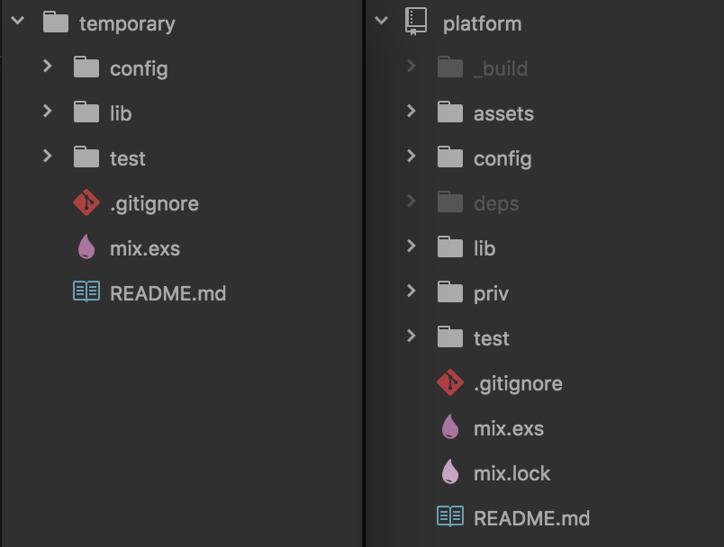

# Elixir Introduction

In the last chapter, we created a full Phoenix back-end platform. By default,
Phoenix applications contain a lot of Elixir code. But if we're just getting
started with the Elixir language, we should probably take a look at some simple
Elixir examples and get a better idea of how to work with the tools.

## Creating an Elixir Project

Let's create a small temporary project. We'll use the same `mix` tool that we
used in the last chapter when we created our Phoenix application, but this time
we're just creating a small Elixir project called `temporary`. Run the
following command in the Terminal:

```shell
$ mix new temporary
```

The `mix` tool is a simple build tool that ships with Elixir. Here's what the
output should look like when we create our project:

```shell
$ mix new temporary
* creating README.md
* creating .formatter.exs
* creating .gitignore
* creating mix.exs
* creating config
* creating config/config.exs
* creating lib
* creating lib/temporary.ex
* creating test
* creating test/test_helper.exs
* creating test/temporary_test.exs

Your Mix project was created successfully.
You can use "mix" to compile it, test it, and more:

    cd temporary
    mix test

Run "mix help" for more commands.
```

Let's change into the new project's directory and take a look at the files that
were generated for us:

```shell
$ cd temporary
```

The first thing you might notice is that our Elixir project and our Phoenix
project share a lot in common. The folder structure is similar:



The `platform` project we created in the last chapter contains more files and
folders, but it's important to note that it's still an Elixir project just like
the `temporary` one that we just created. The `config` folder contains
configuration settings, the `lib` folder is where we'll write most of our
Elixir code, and the `test` folder contains the tests that let us know our
application is working as intended.

## Elixir Testing

Depending on which programming languages you've worked with in the past, you
may have a lot of experience writing tests, or perhaps not.

If you haven't written tests before, the basic idea is that tests give us a way
to feel confidence that our code is actually working as expected. We write our
expectations (or "assertions"), and they give us a quick way to check that the
code we're writing works (and doesn't break other code). We'll delve deeper
into testing with our Phoenix app later, but for now let's just try it out.

Run the `mix test` command inside the `temporary` folder:

```shell
$ mix test
```

The output should look something like this:

```shell
$ mix test
Compiling 1 file (.ex)
Generated temporary app
..

Finished in 0.03 seconds
1 doctest, 1 test, 0 failures

Randomized with seed 670956
```

## Elixir Compilation

Here's where we'll start to see some key features of Elixir. First, we can see
that Elixir is a _compiled_ language. The first time we run our code after
making changes, Elixir needs to compile it to Erlang bytecode. This can be really
helpful because it means we'll catch errors early instead of having to debug our
app while we're using it.

In fact, if we run the `mix test` command again, we'll see that Elixir doesn't
need to recompile the code because we haven't made any changes (note the line
about compiling files is now missing):

```shell
$ mix test
..

Finished in 0.03 seconds
1 doctest, 1 test, 0 failures

Randomized with seed 114557
```

## Elixir Modules and Functions

The Elixir code that we'll write in this project is contained in the
`lib/temporary.ex` file. Files that end in `.ex` are Elixir files that will be
compiled and run (you'll also notice that we have files that end in `.exs`,
which are Elixir scripts).

Inside the `lib/temporary.ex` file, we see the basic structure for _all_ the
Elixir programs that we'll be writing.

```elixir
defmodule Temporary do
  @moduledoc """
  Documentation for Temporary.
  """

  @doc """
  Hello world.

  ## Examples

      iex> Temporary.hello
      :world

  """
  def hello do
    :world
  end
end
```

We start out with a **module** that encapsulates our related code:

```elixir
defmodule Temporary do
  # ...
end
```

If we ignore the documentation for now, we'll see that we have one
**function**:

```elixir
def hello do
  :world
end
```

Inside that function, we have our **return value**:

```elixir
:world
```

Let's start making some changes. Rename the `hello` function to `add`. We'll
pass two parameters (`x` and `y`), and we'll return the addition of these two
values using `x + y` inside the function:

```elixir
def add(x, y) do
  x + y
end
```

## Functions, Tests, and Documentation

The example above is admittedly simple, but it's good in the sense that we
know how to create a function now. But how do we use it?

We generally use the `Module.function(arguments)` syntax to invoke the
functions we've declared. If we look at the original documentation for our
`hello` function, we can see the example usage:

```elixir
defmodule Temporary do
  @moduledoc """
  Documentation for Temporary.
  """

  @doc """
  Hello world.

  ## Examples

      iex> Temporary.hello
      :world

  """
  def add(x, y) do
    x + y
  end
end
```

This tells us that we should be able to run `Temporary.hello` and it should
return `:world`. This is where things get interesting, so let's run `mix test`
again:

```shell
$ mix test
```

Since we no longer have our `hello` function, it's not surprising that our
tests failed. But we actually have _two_ test failures. One of them is from the
test file located in the `test` folder, but the first failure is actually
coming from the example in our documentation (which is called a **doctest**).

```shell
$ mix test
Compiling 1 file (.ex)

  1) test doc at Temporary.add/2 (1) (TemporaryTest)
     test/temporary_test.exs:3
     Doctest failed: got UndefinedFunctionError with message "function Temporary.hello/0 is undefined or private"
     code: Temporary.hello
     stacktrace:
       (temporary) Temporary.hello()
       (for doctest at) lib/temporary.ex:11: (test)

  2) test greets the world (TemporaryTest)
     test/temporary_test.exs:5
     ** (UndefinedFunctionError) function Temporary.hello/0 is undefined or private
     code: assert Temporary.hello() == :world
     stacktrace:
       (temporary) Temporary.hello()
       test/temporary_test.exs:6: (test)

Finished in 0.04 seconds
2 tests, 2 failures

Randomized with seed 520513
```

Let's update the documentation so that it shows an example of how to use our
new `add` function:

```elixir
defmodule Temporary do
  @moduledoc """
  Documentation for Temporary.
  """

  @doc """
  Add two numbers together.

  ## Examples

      iex> Temporary.add(1, 1)
      2

  """
  def add(x, y) do
    x + y
  end
end
```

We can run our tests again, and the doctest example in our `lib/temporary.ex`
file should now be passing:

```shell
$ mix test
➜  temporary mix test
Compiling 1 file (.ex)
.

  1) test greets the world (TemporaryTest)
     test/temporary_test.exs:5
     ** (UndefinedFunctionError) function Temporary.hello/0 is undefined or private
     code: assert Temporary.hello() == :world
     stacktrace:
       (temporary) Temporary.hello()
       test/temporary_test.exs:6: (test)

Finished in 0.03 seconds
2 tests, 1 failure

Randomized with seed 682227
```

Doctests are an _awesome_ feature of Elixir. They allow us to write our
functions _and_ document them _and_ test that they work all at once! It
encourages us to write and maintain our documentation, and gives us confidence
that our code is actually doing what we think it is.

## Writing Tests

Let's write a few tests to ensure that our `add` function is working as
intended. Open the `test/temporary_test.ex` file and add the following:

```elixir
defmodule TemporaryTest do
  use ExUnit.Case
  doctest Temporary

  test "the add function takes two integers and adds them together" do
    result = Temporary.add(1, 1)
    assert result == 2
  end

  test "the add function takes two floats and adds them together" do
    result = Temporary.add(1.5, 1.5)
    assert result == 3.0
  end

  test "the add function returns a number" do
    result = Temporary.add(1.5, 3.5)
    result_is_a_number = is_number(result)
    assert result_is_a_number
  end
end
```

Looking at the `test/temporary_test.exs` file, note that the test code still
takes the same general format we used in `lib/temporary.ex`, where we have a
module defined at the top that encapsulates the rest of our code. We also see
that we're using the default [`ExUnit`](https://hexdocs.pm/ex_unit/ExUnit.html)
library to write our tests. Then, there's the `doctest Temporary` line, which
is how the tests knew to run the examples we were writing in our documentation.

The three `test` cases show basic examples of how we can call our function with
some example numbers and verify that the result is correct. For example,
passing `1` and `1` as arguments to our `add` function should return a result
of `2`. There are other
[assertions](https://hexdocs.pm/ex_unit/ExUnit.Assertions.html) that `ExUnit`
provides, but we'll stick with `assert` for now to ensure that we're getting a
`true` value from our tests.

We should be able to run our tests again and see that all three of these test
cases are passing (and the doctest is still passing as well):

```shell
$ mix test
....

Finished in 0.03 seconds
4 tests, 0 failures

Randomized with seed 867380
```

## IEx

How would we run our code in an interactive environment? The tests are doing a
good job of testing values, but what if something wasn't working the way we had
expected? Let's run the following command from inside our `temporary` project
folder:

```shell
$ iex -S mix
```

This allows us to run Elixir code in an interactive environment and see the
results (you can also just use `iex` from the command line to get started, but
using `iex -S mix` is preferable because it means we don't have to manually
import the modules we want to work with).

Here's an example where we are basically recreating our first `test` case to
call the `add` function from the `Temporary` module and see the result:

```elixir
$ iex -S mix
Interactive Elixir - press Ctrl+C to exit (type h() ENTER for help)
iex(1)> Temporary.add(1, 1)
2
```

We can try our second example case too:

```elixir
iex(2)> Temporary.add(1.5, 1.5)
3.0
```

Everything works as expected in the tests, and now we have an interactive way
of checking our code too.

## The Pipe Operator

Our third `test` case uses a common pattern seen in programming. We break up our
code into small chunks, and we assign the values to variables. This has a great
benefit of being able to name things in obvious ways, but Elixir has an
alternative approach that helps us reconsider the way we write code.

The idea behind the "pipe operator" (`|>`) is that it encourages us to think
about our functions in terms of data transformation. Instead of using
variables, we take an initial value, pipe it through a handful of functions,
and return the result at the end. Let's take another look at our third `test`
case:

```elixir
test "the add function returns a number" do
  result = Temporary.add(1.5, 3.5)
  result_is_a_number = is_number(result)
  assert result_is_a_number
end
```

This example was intentionally written with extraneous variables that aren't
particularly necessary. Let's use the pipe operator syntax, keeping in mind
that the code is still going to accomplish the same thing:

```elixir
test "the add function returns a number" do
  Temporary.add(1.5, 3.5)
  |> is_number
  |> assert
end
```

Whoa. What's happening here? Instead of using variables, we're evaluating a
result and then using the `|>` to pass it along as the argument to the next
function.

It also enables us to take the data and "pipe it through" other functions. For
example, let's inspect what value is getting passed to `assert` at the end:

```elixir
test "the add function returns a number" do
  Temporary.add(1.5, 3.5)
  |> is_number
  |> IO.inspect
  |> assert
end
```

We can run `mix test` from the command line to see the results:

```shell
$ mix test
...true
.

Finished in 0.03 seconds
4 tests, 0 failures

Randomized with seed 312071
```

That explains why our test is passing, because `true` is getting passed to the
`assert` function.

## More Piping

These are simple examples, because these functions each expect a single
argument. But what if we want to pipe to a function that takes multiple
arguments? When we use the pipe operator in Elixir, it pipes the value as the
_first_ argument in the next function.

In other words, we could actually refactor our test case to pass the first
value like this:

```elixir
test "the add function returns a number" do
  1.5
  |> Temporary.add(3.5)
  |> is_number
  |> IO.inspect
  |> assert
end
```

This demonstrates that we can pipe the value `1.5` to the `Temporary.add`
function, and it will use the value as the _first_ argument. And `3.5` will be
sent as the _second_ argument to the `Temporary.add` function.

Before we move on, let's go back to the original pipe operator example since it
was cleaner code. But the examples above are an important demonstration of how
we can use the pipe operator.

```elixir
test "the add function returns a number" do
  Temporary.add(1.5, 3.5)
  |> is_number
  |> assert
end
```

## Function Arity

In this book, we've referred to functions like the `add` function as simply
`add`. But functions in Elixir are often referred to in terms of their "arity".

The arity of a function is the number of arguments it takes. In our examples
above, the `add` function takes two arguments, so it would be referred to as
`add/2`. The `is_number` function only takes a single argument, so we
would refer to it as `is_number/1`.

For the rest of the book, we'll try to be consistent about referring to
functions with their arity included, because the arity is of particular
importance in the Elixir language. In fact, we can define multiple functions
that share the same name, but behave differently depending on the number of
arguments we pass to them. This can be a tricky concept at first, but we'll see
some examples soon that should help to clarify.

## Shorthand Function Syntax

At this point, we're probably dying to get back to Phoenix and build our
application. But there are just a couple more Elixir topics that will help
us when we start looking at our Phoenix code. Without knowing the concepts
behind Elixir, it can be tough to really understand what's going on in Phoenix.

The functions we've seen so far take the following format:

```elixir
def function_name(arguments) do
  # ...
end
```

When we're dealing with small, simple functions like `add/2`, we can make our
code more concise and readable by using the shorthand function syntax:

```elixir
def function_name(arguments), do: ...
```

Note that there are extra `,` and `:` characters, but this enables us to remove
the `end` keyword and move our entire function definition to a single line.

Here's our `add/2` function as a single line. You can update our example in the
`lib/temporary.ex` file and then run `mix test` again to verify that it still
works.

```elixir
def add(x, y), do: x + y
```

There aren't strict rules about when you should use shorthand function syntax.
On the one hand, it's good practice to break up our programs into small
functions that are easy to reason about, which could mean many of our functions
fit well on a single line. However, we shouldn't feel compelled to force
multiline functions to fit on a single line arbitrarily. The reason we're
introducing this concept now is that the `add/2` function will be easier to
visualize and reason about in the next section when using the shorthand
function syntax.

## Pattern Matching

The reason for introducing shorthand function syntax here is that it gives us
a more obvious way to see one of Elixir's most powerful features in action:
pattern matching.

Pattern matching can be difficult to comprehend at first, so be gentle with
yourself if it takes some time to understand. It's one of those things that
needs to be seen and experienced a couple of times before it starts to sink in.

Elixir allows us to create multiple "clauses" of our functions. That means we
can create a new clause of our `add/2` function, and Elixir will use pattern
matching to determine which clause actually gets used when the function is
called. It sounds confusing, so let's see an example.

When we add `0` to a number, the result is actually just the number itself
(this is known as _the identity property of addition_). So `0 + 1` should
return a result of `1`. When we use the `add/2` function, it would look like
this:

```elixir
iex> Temporary.add(0, 1)
1
```

That means whenever we pass `0` as an argument to our function, we don't really
need to perform any addition. We can add a new clause for our `add/2` function
that handles cases where the first argument is `0`:

```elixir
def add(0, y), do: y
def add(x, y), do: x + y
```

And we can do the same thing when the second argument is `0`:

```elixir
def add(0, y), do: y
def add(x, 0), do: x
def add(x, y), do: x + y
```

We can even add another clause that "matches" for when both arguments are `0`s:

```elixir
def add(0, 0), do: 0
def add(0, y), do: y
def add(x, 0), do: x
def add(x, y), do: x + y
```

And here's our full example with a few more doctests to verify that everything
is working as expected:

```elixir
defmodule Temporary do
  @moduledoc """
  Documentation for Temporary.
  """

  @doc """
  Add two numbers together.

  ## Examples

      iex> Temporary.add(0, 0)
      0

      iex> Temporary.add(0, 1)
      1

      iex> Temporary.add(1, 0)
      1

      iex> Temporary.add(1, 1)
      2
  """
  def add(0, 0), do: 0
  def add(0, y), do: y
  def add(x, 0), do: x
  def add(x, y), do: x + y
end
```

## Guards

Lastly, Elixir allows us to add "guard clauses" to our functions to make sure
they're working with the right values.

Our `add/2` function is only designed to work with numbers. They can be integers
or floating point numbers, but we don't want to add strings together (string
concetenation would actually require the use of the `<>` operator).

We can use the `when` keyword along with the `is_number/1` function we saw
previously to make sure that our function is working with numerical values.

```elixir
def add(0, 0), do: 0
def add(0, y) when is_number(y), do: y
def add(x, 0) when is_number(x), do: x
def add(x, y) when is_number(x) and is_number(y), do: x + y
```

Functions like `is_number/1` can be really helpful to check the types of values
we're working with. One helpful tip is to find similar functions available to
us using `iex`. Inside `iex`, type `is_` and then hit the TAB key on your
keyboard, and it will display the different checks that are available:

```elixir
$ iex
iex(1)> is_
# Press TAB key after is_
is_atom/1         is_binary/1       is_bitstring/1    is_boolean/1
is_float/1        is_function/1     is_function/2     is_integer/1
is_list/1         is_map/1          is_nil/1          is_number/1
is_pid/1          is_port/1         is_reference/1    is_tuple/1
```

## Summary

This chapter was intended to give a brief introduction to Elixir concepts. These
will be invaluable as we start building our Phoenix applications, because we'll
see that Phoenix code is really just Elixir code. Without some background in
Elixir, it can occasionally be difficult to understand what's going on.

This was not meant as exhaustive introduction to Elixir. There are many more
concepts, and there are several books available that give a full introduction
to the language. In this book, we're going to keep moving because our goal is
to build a practical real-world application, and we'll learn what we need along
the way. But check out these free resources if you want to get a little
more Elixir experience before continuing:

- [Elixir Getting Started Guide](http://elixir-lang.org/getting-started/introduction.html)
- [Elixir School](https://elixirschool.com/en/lessons/basics/basics)
- [Try Elixir Course](https://www.codeschool.com/courses/try-elixir)

Feel free to delete the `temporary` project, and in the next chapter we'll
continue working towards building our platform application.
