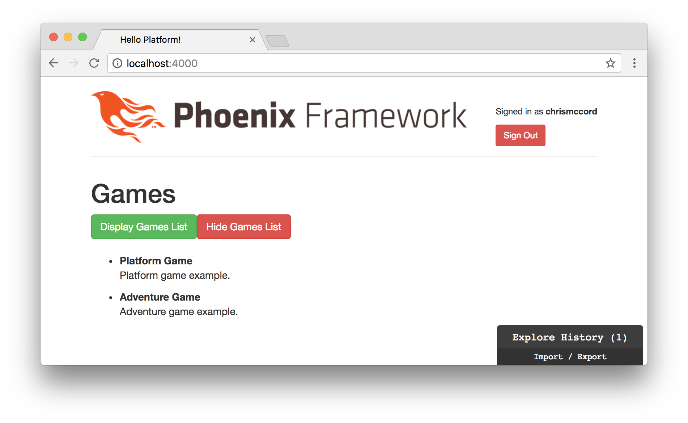
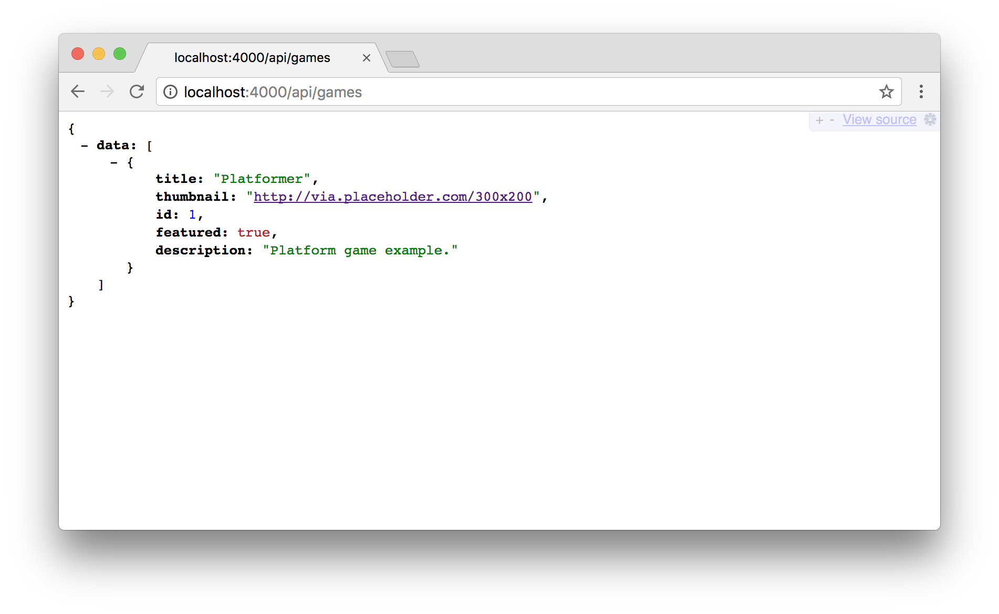
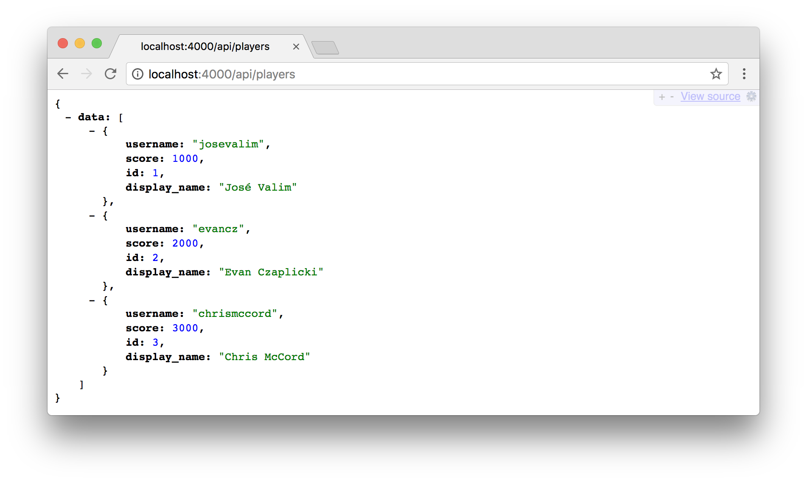
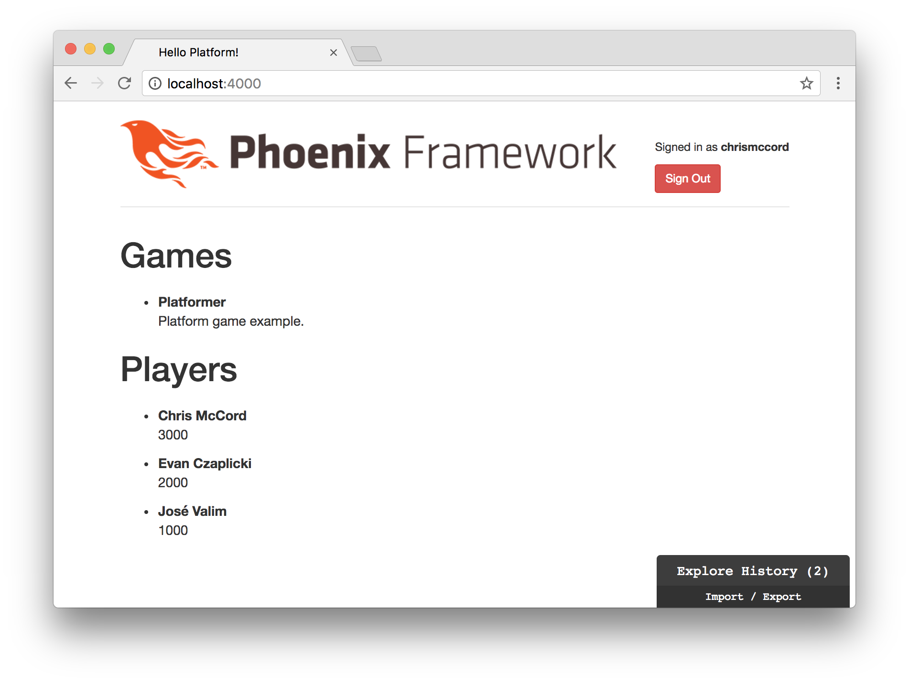

# Elm and API Data

Now that we have our Elm front-end application up and running, let's start
integrating it with our Phoenix application data. To start with, we can focus
on reading the game data from our API and rendering it on the page.

## Where Were We?

We currently have some hardcoded data in our Elm application that we're using
to display a list of games.

```elm
initialModel : Model
initialModel =
    { gamesList =
        [ { gameTitle = "Platform Game", gameDescription = "Platform game example." }
        , { gameTitle = "Adventure Game", gameDescription = "Adventure game example." }
        ]
    , displayGamesList = False
    }
```



Our next goal is to remove this hardcoded data and fetch the game JSON data
from our Phoenix API instead.



## Updating Our Initial Model

Let's start by clearing out the sample data we had been using to display our
list of games. We can also remove our buttons that display and hide the games
since we're going to show them by default. So we're removing the
`displayGamesList` field, and we're also going to add a new function called
`initialCommand` that we're going to use soon to fetch our data from the API.
Let's also go ahead and simplify our `Game` type by changing the field names
to `title` and `description`, which will help the fields match to the same
names that we have in our API.

Here is the full updated code for the model section:

```elm
type alias Model =
    { gamesList : List Game
    }


type alias Game =
    { title : String
    , description : String
    }


initialModel : Model
initialModel =
    { gamesList = []
    }


initialCommand : Cmd Msg
initialCommand =
    Cmd.none


init : ( Model, Cmd Msg )
init =
    ( initialModel, initialCommand )
```

## Changing the Update

We're also going to remove our `DisplayGamesList` and `HideGamesList` from the
update section and add a new action called `FetchGamesList`. For now, we'll
just set the `gamesList` to an empty list with `{ model | gamesList = [] }`,
but we'll assign the real data soon.

```elm
type Msg
    = FetchGamesList


update : Msg -> Model -> ( Model, Cmd Msg )
update msg model =
    case msg of
        FetchGamesList ->
            ( { model | gamesList = [] }, Cmd.none )
```

## Changing the View

Lastly, we'll need to update our view section. We can remove the buttons we
were using to display and hide the list of games. And we'll add a condition to
make sure our `gamesList` is not empty before we render the games section on
our page.

Here is the updated code for the view:

```elm
view : Model -> Html Msg
view model =
    if List.isEmpty model.gamesList then
        div [] []
    else
        div []
            [ h1 [ class "games-section" ] [ text "Games" ]
            , gamesIndex model
            ]
```

We'll also need to make a slight change to our `gamesListItem` function since
we changed the field names in our `Game` type.

```elm
gamesListItem : Game -> Html msg
gamesListItem game =
    li [ class "game-item" ]
        [ strong [] [ text game.title ]
        , p [] [ text game.description ]
        ]
```

## Importing Packages

Our goal for the rest of the chapter is going to be to make an HTTP request to
our Phoenix back-end for our JSON game data (`http://0.0.0.0:4000/api/games`),
and then to decode that JSON into our Elm application. To get started, let's
import the libraries we'll need to use:

- [Http](http://package.elm-lang.org/packages/elm-lang/http/latest)
- [Json.Decode](http://package.elm-lang.org/packages/elm-lang/core/latest/Json-Decode)

From the command line inside the `assets` folder where our `elm-package.json`
file lives, type the following command:

```shell
$ elm-package install elm-lang/http
```

This should install the `Http` package for us, and here's what the output
should look like:

```shell
$ elm-package install elm-lang/http
To install elm-lang/http I would like to add the following
dependency to elm-package.json:

    "elm-lang/http": "1.0.0 <= v < 2.0.0"

May I add that to elm-package.json for you? [Y/n] Y

Some new packages are needed. Here is the upgrade plan.

  Install:
    elm-lang/http 1.0.0

Do you approve of this plan? [Y/n] Y
Starting downloads...

  ● elm-lang/http 1.0.0

Packages configured successfully!
```

With that completed, we can now add the `import` declarations to the top of our
`Main.elm` file. Here's what the top of the file should look like:

```elm
module Main exposing (..)

import Html exposing (..)
import Html.Attributes exposing (..)
import Html.Events exposing (onClick)
import Http
import Json.Decode as Decode
```

Note that we're importing our new `Http` library to make the HTTP request to
our endpoint, and we're also importing the `Json.Decode` library from the core
and giving it an alias of `Decode` to make things a little easier on ourselves.

## Fetching Games

Now that we have our libraries imported, the first step we need to take is to
make an HTTP GET request to our endpoint. If we take a look at the
[documentation for `Http.get`](http://package.elm-lang.org/packages/elm-lang/http/latest/Http#get),
we see that this function takes a string value for the URL as the first
argument and a JSON decoder as the second argument.

Keep in mind that the order of your functions doesn't matter, but I like to add
a new section for API functions below the model section. Here we'll create a
`fetchGamesList` function that make our `Http.get` request to our
`"/api/games"` route (and we'll get to the decoding soon).

```elm
fetchGamesList =
    Http.get "/api/games" decodeGamesList
```

We also want to trigger this request using the
[`Http.send`](http://package.elm-lang.org/packages/elm-lang/http/latest/Http#send)
function. So we'll pipe the results along with a new action we're going to
create.

There's a lot going on here, so don't worry if it's getting a little bit
confusing. It will all make more sense as we finish up with this initial
feature and then we'll do something similar for fetching our player data, which
will give us another opportunity to improve our understanding.

## JSON Decoding

Let's take another look at the structure of the JSON data we're getting from
our endpoint.

```json
{
    data: [
        {
            title: "Platformer",
            thumbnail: "http://via.placeholder.com/300x200",
            id: 1,
            featured: true,
            description: "Platform game example."
        }
    ]
}
```

It looks like a JSON object that contains a `data` list, which contains the
game data that we're actually looking for.

It's useful to think of decoding JSON from the inside out. This allows us to
focus on decoding the values we want to pull into our application, and then
take care of the details afterward. The fields that we're looking to pull from
our API are the `title` and `description`.

Let's create a `decodeGame` function, and we'll use the
[`map2`](http://package.elm-lang.org/packages/elm-lang/core/latest/Json-Decode#map2)
function since we're only looking to decode two fields. Note that we're also
using the `Json.Decode` package's
[`field`](http://package.elm-lang.org/packages/elm-lang/core/latest/Json-Decode#field)
function that allows us to safely ensure that the fields will contain the
correct type of data we're looking for (strings in our case).

```elm
decodeGame : Decode.Decoder Game
decodeGame =
    Decode.map2 Game
        (Decode.field "title" Decode.string)
        (Decode.field "description" Decode.string)
```

Next, we can pipe the results of our decoded game to the
[`list`](http://package.elm-lang.org/packages/elm-lang/core/latest/Json-Decode#list)
function and the
[`at`](http://package.elm-lang.org/packages/elm-lang/core/latest/Json-Decode#at)
function to finish decoding the full list of games in our API's data list.

```elm
decodeGamesList : Decode.Decoder (List Game)
decodeGamesList =
    decodeGame
        |> Decode.list
        |> Decode.at [ "data" ]
```

Here's what all the functions should look like together to make the HTTP
request to our JSON endpoint and decode the response:

```elm
fetchGamesList : Cmd Msg
fetchGamesList =
    Http.get "/api/games" decodeGamesList
        |> Http.send FetchGamesList


decodeGamesList : Decode.Decoder (List Game)
decodeGamesList =
    decodeGame
        |> Decode.list
        |> Decode.at [ "data" ]


decodeGame : Decode.Decoder Game
decodeGame =
    Decode.map2 Game
        (Decode.field "title" Decode.string)
        (Decode.field "description" Decode.string)
```

## FetchGamesList

Now we can handle the results of our HTTP request in our update section. The
type annotation may look a bit strange at first, but essentially we're creating
our `FetchGamesList` action and the result will either be successful or an
error. When the API fetch is successful, we'll get back our list of games. When
it's not successful, we'll get back and `Http.Error` that we can ignore for
now.

```elm
type Msg
    = FetchGamesList (Result Http.Error (List Game))
```

Inside the `update` function, we'll add a `result` argument to our
`FetchGamesList` action. And we'll add a `case` expression to handle the
result. When we get an `Ok` response, we update the `gamesList` in our model to
contain the list of games from our API. Otherwise, we'll just leave the model
unchanged if we get back and error.

```elm
update : Msg -> Model -> ( Model, Cmd Msg )
update msg model =
    case msg of
        FetchGamesList result ->
            case result of
                Ok games ->
                    ( { model | gamesList = games }, Cmd.none )

                Err _ ->
                    ( model, Cmd.none )
```

## Performing the Fetch

We've managed to make a ton of progress. We have all the functions we need to
create our HTTP request, decode the response, and render the results. All
that's left is to add our `fetchGamesList` as the `initialCommand` we run when
our application is initialized.

```elm
initialCommand : Cmd Msg
initialCommand =
    fetchGamesList
```

When the Elm runtime initializes our application, it takes our `initialModel`
(which contains an empty `gamesList`) and performs the `initialCommand` (which
will set our `gamesList` to the list of games from the API). The result is that
we're now fetching our data successfully from the API and rendering it in our
Elm application!


## Decoding the Remaining Game Data

Now that we've successfully rendered our list of games, let's finish rendering
the rest of the game data from our API. We won't need to show all this data on
the page, but it's a good idea to have the data synced up between our Phoenix
API and our Elm application.

We can start by updating our `Game` type with the following:

```elm
type alias Game =
    { description : String
    , featured : Bool
    , id : Int
    , thumbnail : String
    , title : String
    }
```

Now we'll need to update our decoder so that we're properly decoding all the
fields with the correct types. The order of fields is important here and has to
match up with our type alias. I tend to keep fields in alphabetical order, but
keep in mind that the order will need to match up so that the fields are
decoded in accordance with the type alias.

```elm
decodeGame : Decode.Decoder Game
decodeGame =
    Decode.map5 Game
        (Decode.field "description" Decode.string)
        (Decode.field "featured" Decode.bool)
        (Decode.field "id" Decode.int)
        (Decode.field "thumbnail" Decode.string)
        (Decode.field "title" Decode.string)
```

That should be enough for now. Notice that we haven't changed our view
functions, so we're not actually rendering the additional data on the page.
But now we have all the data we need, so we can selectively choose the
fields we want to display as needed.

## Rendering Our List of Players

We managed to get our list of games from the API. Let's get some additional
experience as we do the same for our list of players.



We can start by adding to our `Model` type alias and `initialModel`:

```elm
type alias Model =
    { gamesList : List Game
    , playersList : List Player
    }

initialModel : Model
initialModel =
    { gamesList = []
    , playersList = []
    }
```

Then, we'll add a new `Player` type alias with all the fields we want from our
API:

```elm
type alias Player =
    { displayName : String
    , id : Int
    , score : Int
    , username : String
    }
```

You might have noticed a slight discrepancy here. Elixir and Phoenix
tend to use underscores in field names (`display_name`) by convention, and Elm
tends to use camel case in field names (`displayName`). I like to stick to these
conventions, and as long as we're consistent everything will still work as
intended.

Now we can add functions for making the HTTP request to the `"/api/players"`
endpoint and decoding the JSON response. Essentially, we have the same functions
that we created before with some slight alterations to work with players instead
of games. These functions work the same way, but we're going to decode the
player fields so we can render those in our Elm application.

```elm
fetchPlayersList : Cmd Msg
fetchPlayersList =
    Http.get "/api/players" decodePlayersList
        |> Http.send FetchPlayersList


decodePlayersList : Decode.Decoder (List Player)
decodePlayersList =
    decodePlayer
        |> Decode.list
        |> Decode.at [ "data" ]


decodePlayer : Decode.Decoder Player
decodePlayer =
    Decode.map4 Player
        (Decode.field "display_name" Decode.string)
        (Decode.field "id" Decode.int)
        (Decode.field "score" Decode.int)
        (Decode.field "username" Decode.string)
```

For our update section, we'll add a new `FetchPlayersList` action, and take the
same approach we did for our games. We add our type first, and then we fill out
the `case` expression inside the `update` function with the following:

```elm
type Msg
    = FetchGamesList (Result Http.Error (List Game))
    | FetchPlayersList (Result Http.Error (List Player))


update : Msg -> Model -> ( Model, Cmd Msg )
update msg model =
    case msg of
        FetchGamesList result ->
            case result of
                Ok games ->
                    ( { model | gamesList = games }, Cmd.none )

                Err _ ->
                    ( model, Cmd.none )

        FetchPlayersList result ->
            case result of
                Ok players ->
                    ( { model | playersList = players }, Cmd.none )

                Err _ ->
                    ( model, Cmd.none )
```

## Refactoring Our View

Our Elm application is currently in working order without any compiler errors.
But let's refactor our `view` function a little bit so that we can render both
our games and our list of players.

We can start by simplifying our `view` function to simply render our
`gamesIndex` and `playersIndex`, and we'll offload the conditional to check
whether or not those lists are empty to the index functions.

```elm
view : Model -> Html Msg
view model =
    div []
        [ gamesIndex model
        , playersIndex model
        ]
```

Next, we can update our `gamesIndex` function and add a new `playersIndex`
function.

```elm
playersIndex : Model -> Html msg
playersIndex model =
    if List.isEmpty model.playersList then
        div [] []
    else
        div [ class "players-index" ]
            [ h1 [ class "players-section" ] [ text "Players" ]
            , playersList model.playersList
            ]
```

Then, we can go ahead and take the same approach we did for our games by adding
two new functions for the `playersList` and `playersListItem`. For now, we're
going to use the player's `displayName` and `score` fields to render the data
on the page:

```elm
playersList : List Player -> Html msg
playersList players =
    ul [ class "players-list" ] (List.map playersListItem players)


playersListItem : Player -> Html msg
playersListItem player =
    li [ class "player-item" ]
        [ strong [] [ text player.displayName ]
        , p [] [ text (toString player.score) ]
        ]
```

## Performing Another Fetch

Lastly, don't forget that we need to perform the fetch for our player data
when we load the page. Let's go back to our `initialCommand` function, and
we'll use `Cmd.batch` that batches a list of commands to run. This way,
we'll run both `fetchGamesList` and `fetchPlayersList` when the page loads
and we'll have all the data we need.

```elm
initialCommand : Cmd Msg
initialCommand =
    Cmd.batch
        [ fetchGamesList
        , fetchPlayersList
        ]
```

We've successfully loaded the API data for both our players and our games!
Here's what our Elm application should look like in the browser:


## Sorting Results

Our application isn't the fanciest thing to look at yet, but we'll take a look
at some layout and styling improvements in the next chapter. Before we move on,
let's figure out how to sort our players by their score data.

Sorting a list is simple enough, so let's take this opportunity to talk about a
common refactoring approach you can use for your Elm programs.

This is what our `playersIndex` function currently looks like:

```elm
playersIndex : Model -> Html msg
playersIndex model =
    if List.isEmpty model.playersList then
        div [] []
    else
        div [ class "players-index" ]
            [ h1 [ class "players-section" ] [ text "Players" ]
            , playersList model.playersList
            ]
```

We're passing the list of players from our model to the `playersList` function
at the bottom. Our first approach to sorting our players will be to use the
[`List.sortBy`](http://package.elm-lang.org/packages/elm-lang/core/latest/List#sortBy)
function and pass the `.score` field. If we look at the documentation, we see
that the sorting is from lowest to highest. So we'll also have to pipe our data
to the `List.reverse` function as well. This works pretty well:

```elm
playersIndex : Model -> Html msg
playersIndex model =
    if List.isEmpty model.playersList then
        div [] []
    else
        div [ class "players-index" ]
            [ h1 [ class "players-section" ] [ text "Players" ]
            , model.playersList
                |> List.sortBy .score
                |> List.reverse
                |> playersList
            ]
```

Our `playersIndex` function is already getting a little difficult to read
through at a quick glance. One thing you can do to clarify what's happening in
your functions is to extract some functionality into a `let` expression and
give it a clear name. Here's how we can take our same code and refactor it into
a `let` expression:

```elm
playersIndex : Model -> Html msg
playersIndex model =
    let
        playersSortedByScore =
            model.playersList
                |> List.sortBy .score
                |> List.reverse
    in
        if List.isEmpty model.playersList then
            div [] []
        else
            div [ class "players-index" ]
                [ h1 [ class "players-section" ] [ text "Players" ]
                , playersList playersSortedByScore
                ]
```

This is a little more readable in the sense that the `playersSortedByScore`
name is obvious. Instead of using a `let` expression, we could extract this
into a separate function altogether. With this code, we're still passing data
to the `playersList` view function. But we're passing the player data from
our model through the `playersSortedByScore` function first and then piping
that backwards to `playersList`.

```elm
playersIndex : Model -> Html msg
playersIndex model =
    if List.isEmpty model.playersList then
        div [] []
    else
        div [ class "players-index" ]
            [ h1 [ class "players-section" ] [ text "Players" ]
            , playersList <|
                playersSortedByScore model.playersList
            ]


playersSortedByScore : List Player -> List Player
playersSortedByScore players =
    players
        |> List.sortBy .score
        |> List.reverse
```

You can decide for yourself which approach you think is preferable. But this is
a good example of how simple it is to refactor with Elm when we have type
safety. And it's a common approach to extract small pieces of functionality
into separate functions to keep things simple and easy to work with.

Either way, we managed to successfully sort our list of players and show the
top scorer at the top:



## Summary

We came a long way in this chapter! We now have a working Phoenix API back-end,
and we're successfully decoding the JSON API data into our Elm application.

In the next chapter, let's take a brief jaunt into improving the layout and
design so that our application is a little nicer to look at and use. We won't
need to create something fancy since this isn't a book about design, but we'll
try to make things nicer to work with and get a sense of how styles work within
the Phoenix framework.
