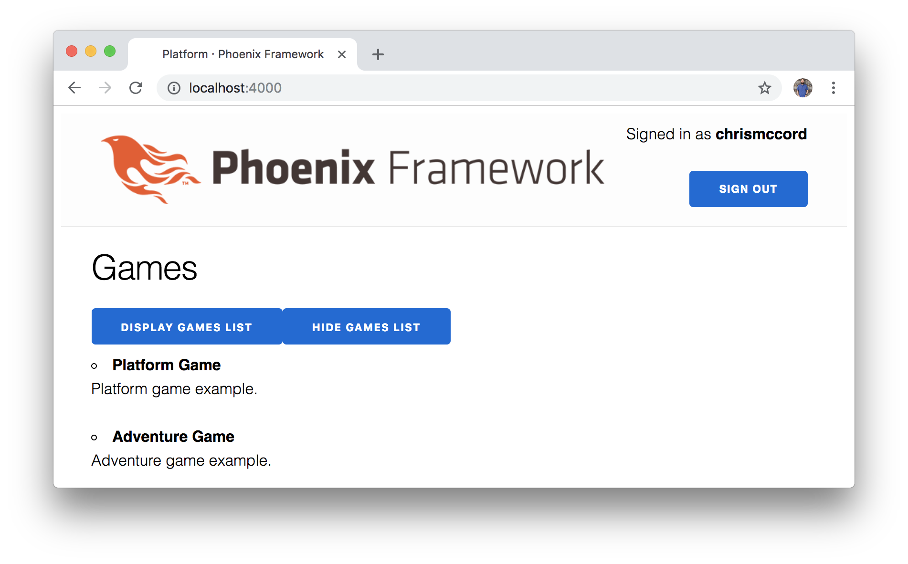
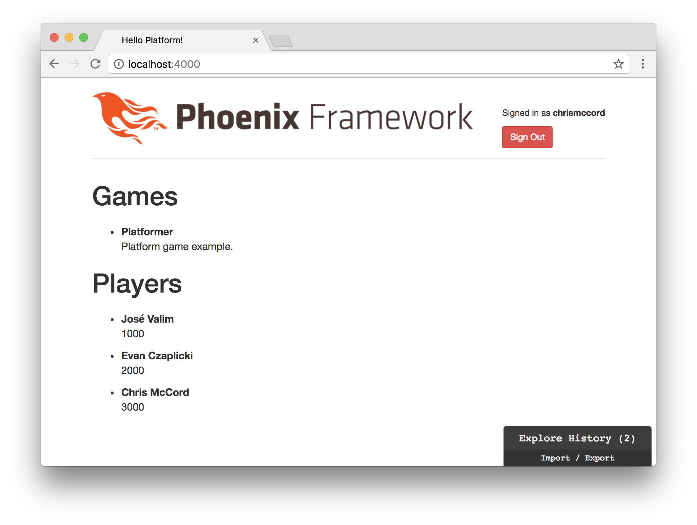

# Elm and API Data

Now that we have our Elm front-end application up and running, let's start
integrating it with our Phoenix application data. To start with, we can focus
on reading the game data from our API and rendering it on the page.

## Where Were We?

We currently have some hard-coded data in our Elm application that we're using
to display a list of games.

```elm
initialModel : Model
initialModel =
    { gamesList =
        [ { title = "Platform Game", description = "Platform game example." }
        , { title = "Adventure Game", description = "Adventure game example." }
        ]
    , displayGamesList = True
    }
```



Our next goal is to remove this hard-coded data and fetch the JSON game data
from our Phoenix API instead.


## Updating Our Initial Model

Let's start by clearing out the sample data we had been using to display our
list of games. We can also remove our buttons that display and hide the games
since we're going to show them by default. So we're removing the
`displayGamesList` field, and we're also going to add a new function called
`initialCommand` that we're going to use soon to fetch our data from the API.

Here is the full updated code for the model and init sections:

```elm
type alias Model =
    { gamesList : List Game
    }


type alias Game =
    { title : String
    , description : String
    }


initialModel : Model
initialModel =
    { gamesList = []
    }


initialCommand : Cmd Msg
initialCommand =
    Cmd.none


init : () -> ( Model, Cmd Msg )
init _ =
    ( initialModel, initialCommand )
```

## Changing the Update

We're also going to remove our `DisplayGamesList` and `HideGamesList` from the
update section and add a new action called `FetchGamesList`. For now, we'll
just set the `gamesList` to an empty list with `{ model | gamesList = [] }`,
but we'll assign the real data soon.

```elm
type Msg
    = FetchGamesList


update : Msg -> Model -> ( Model, Cmd Msg )
update msg model =
    case msg of
        FetchGamesList ->
            ( { model | gamesList = [] }, Cmd.none )
```

## Changing the View

Lastly, we'll need to update our view section. We can remove the buttons we
were using to display and hide the list of games. And we'll add a condition to
make sure our `gamesList` is not empty before we render the games section on
our page.

Here is the updated code for the view:

```elm
view : Model -> Html Msg
view model =
    if List.isEmpty model.gamesList then
        div [] []

    else
        div []
            [ h1 [ class "games-section" ] [ text "Games" ]
            , gamesIndex model
            ]
```

## Importing Packages

Our goal for the rest of the chapter will be to make an HTTP request to our
Phoenix back-end for the JSON game data (`http://localhost:4000/api/games`),
and then to decode that JSON into our Elm application. To get started, let's
import the libraries we'll need to use:

- [Http](http://package.elm-lang.org/packages/elm-lang/http/latest)
- [Json.Decode](http://package.elm-lang.org/packages/elm-lang/core/latest/Json-Decode)

From the command line, we'll type the following commands from inside the
`assets/elm` folder where our `elm.json` file lives:

```shell
$ elm install elm/http
$ elm install elm/json
```

We should see output to let us know that we're installing the `Http` package
and the `Json` package that contains the decoder functions we'll need.

With that completed, we can now add the `import` declarations to the top of our
`Main.elm` file. Here's what the top of the file should look like:

```elm
module Main exposing (main)

import Browser
import Html exposing (..)
import Html.Attributes exposing (..)
import Html.Events exposing (onClick)
import Http
import Json.Decode as Decode
```

Note that we're importing our new `Http` library to make the HTTP request to
our endpoint, and we're also importing the `Json.Decode` library from the core
and giving it an alias of `Decode` to make things a little easier to type.

## Fetching Games

Now that we have our libraries imported, the first step we need to take is to
make an HTTP GET request to our endpoint. If we take a look at the
documentation for the
[`Http.get`](https://package.elm-lang.org/packages/elm/http/latest/Http#get)
function, we see that we can use it with a `url` value and an `expect` value.

The `url` will be a string value like `http://localhost:4000/api/games` to hit
our Phoenix JSON endpoint, or you could fetch data from a public API like the
Star Wars API at `https://swapi.co/api/films/1`. The `expect` value allows us
to use things like `expectString` if we're fetching a text file or we can use
`expectJson` since we're fetching JSON data.

In other words, we're going to use `Http.get` to hit our JSON endpoint, we'll
handle the response using `FetchGamesList` in our `update` function, and we'll
create a new JSON decoder to decode the game data.

Keep in mind that the order of your function declarations doesn't matter in
Elm, but I like to add a new section for API functions below the model section.
Here we'll create a `fetchGamesList` function that make our `Http.get` request
to our `"/api/games"` route (and we'll get to the decoding soon).

```elm
-- API

fetchGamesList : Cmd Msg
fetchGamesList =
    Http.get
        { url = "/api/games"
        , expect = Http.expectJson FetchGamesList decodeGamesList
        }
```

Note the return value for this function is a `Cmd Msg`, which we'll later use
in our `initialCommand` function so that our application fetches the data as it
initializes.

There's a lot going on here, so don't worry if it's getting a little bit
confusing. It will all make more sense as we finish up with this initial
feature and then we'll do something similar for fetching our player data, which
will give us another opportunity to improve our understanding.

## JSON Decoding

Let's take another look at the structure of the JSON data we're getting from
our endpoint.

```javascript
{
  data: [
    {
      title: "Platformer",
      thumbnail: "http://via.placeholder.com/300x200",
      id: 1,
      featured: true,
      description: "Platform game example."
    }
  ];
}
```

It looks like a JSON object that contains a `data` list, which contains the
game data that we're actually looking for.

It's useful to think of decoding JSON from the inside out. This allows us to
focus on decoding the values we want to pull into our application, and then
take care of the details afterward. The fields that we're looking to pull from
our API are the `title` and `description`.

Let's create a `decodeGame` function, and we'll use the
[`map2`](http://package.elm-lang.org/packages/elm-lang/core/latest/Json-Decode#map2)
function since we're only looking to decode two fields. Note that we're also
using the `Json.Decode` package's
[`field`](http://package.elm-lang.org/packages/elm-lang/core/latest/Json-Decode#field)
function that allows us to safely ensure that the fields will contain the
correct type of data we're looking for (strings in our case).

```elm
decodeGame : Decode.Decoder Game
decodeGame =
    Decode.map2 Game
        (Decode.field "title" Decode.string)
        (Decode.field "description" Decode.string)
```

Next, we can pipe the results of our decoded game to the
[`list`](http://package.elm-lang.org/packages/elm-lang/core/latest/Json-Decode#list)
function and the
[`at`](http://package.elm-lang.org/packages/elm-lang/core/latest/Json-Decode#at)
function to finish decoding the full list of games in our API's data list.

```elm
decodeGamesList : Decode.Decoder (List Game)
decodeGamesList =
    decodeGame
        |> Decode.list
        |> Decode.at [ "data" ]
```

Here's what all the functions should look like together to make the HTTP
request to our JSON endpoint and decode the response:

```elm
fetchGamesList : Cmd Msg
fetchGamesList =
    Http.get
        { url = "/api/games"
        , expect = Http.expectJson FetchGamesList decodeGamesList
        }


decodeGamesList : Decode.Decoder (List Game)
decodeGamesList =
    decodeGame
        |> Decode.list
        |> Decode.at [ "data" ]


decodeGame : Decode.Decoder Game
decodeGame =
    Decode.map2 Game
        (Decode.field "title" Decode.string)
        (Decode.field "description" Decode.string)
```

## FetchGamesList

Now we can handle the results of our HTTP request in our update section. We'll
set up `FetchGamesList` to attempt to fetch data from our API. It will either
successfully return a list of games of type `List Game` or return an error with
`Http.Error`.

```elm
type Msg
    = FetchGamesList (Result Http.Error (List Game))
```

Inside the `update` function, we'll add a `result` argument to our
`FetchGamesList` action. And we'll add a `case` expression to handle the
result. When we get an `Ok` response, we update the `gamesList` in our model to
contain the list of games from our API. Otherwise, we'll just leave the model
unchanged if we get back and error. We could also handle errors here in more
detail, but for now we'll just add
[`Debug.log`](https://package.elm-lang.org/packages/elm-lang/core/latest/Debug)
to print a message to the browser console when the API fetch fails.

```elm
update : Msg -> Model -> ( Model, Cmd Msg )
update msg model =
    case msg of
        FetchGamesList result ->
            case result of
                Ok games ->
                    ( { model | gamesList = games }, Cmd.none )

                Err _ ->
                    Debug.log "Error fetching games from API."
                        ( model, Cmd.none )
```

## Performing the Fetch

We've managed to make a ton of progress. We have all the functions we need to
create our HTTP request, decode the response, and render the results. All
that's left is to add our `fetchGamesList` as the `initialCommand` we run when
our application is initialized.

```elm
initialCommand : Cmd Msg
initialCommand =
    fetchGamesList
```

When the Elm runtime initializes our application, it takes our `initialModel`
(which contains an empty `gamesList`) and performs the `initialCommand` (which
will set our `gamesList` to the list of games from the API). The result is that
we're now fetching our data successfully from the API and rendering it in our
Elm application!


## Decoding the Remaining Game Data

Now that we've successfully rendered our list of games, let's finish rendering
the rest of the game data from our API. We won't need to show all this data on
the page, but it's a good idea to have the data synced up between our Phoenix
API and our Elm application.

We can start by updating our `Game` type with the following:

```elm
type alias Game =
    { description : String
    , featured : Bool
    , id : Int
    , thumbnail : String
    , title : String
    }
```

Now we'll need to update our decoder so that we're properly decoding all the
fields with the correct types. The order of fields is important here and has to
match up with our type alias. I tend to keep fields in alphabetical order, but
keep in mind that the order will need to match up so that the fields are
decoded in accordance with the type alias.

```elm
decodeGame : Decode.Decoder Game
decodeGame =
    Decode.map5 Game
        (Decode.field "description" Decode.string)
        (Decode.field "featured" Decode.bool)
        (Decode.field "id" Decode.int)
        (Decode.field "thumbnail" Decode.string)
        (Decode.field "title" Decode.string)
```

That should be enough for now. Notice that we haven't changed our view
functions, so we're not actually rendering the additional data on the page.
But now we have all the data we need, so we can selectively choose the
fields we want to display as needed.

## Rendering Our List of Players

We managed to get our list of games from the API. Let's get some additional
experience as we do the same for our list of players.


We can start by adding to our `Model` type alias:

```elm
type alias Model =
    { gamesList : List Game
    , playersList : List Player
    }
```

And we'll also update our `initialModel` to use an empty list for the initial
`playersList` value:

```elm
initialModel : Model
initialModel =
    { gamesList = []
    , playersList = []
    }
```

Then, we'll add a new `Player` type alias with all the fields we want from our
API:

```elm
type alias Player =
    { displayName : Maybe String
    , id : Int
    , score : Int
    , username : String
    }
```

There are a couple of interesting notes to be aware of here. First, you might
have noticed that the JSON API data in the image above has a `display_name`
field, whereas our Elm field has a `displayName` field. Elixir and Phoenix tend
to use underscores in field names by convention, and Elm tends to use camel
case in field names. I like to stick to these conventions, and as long as we're
consistent everything will still work as intended.

Another thing to note is the `display_name` field coming from our API may or
may not have a value. If a player hasn't entered a value for that field, it
will be `null`. We can use `Int` as the type for our player `id` fields because
we know that all players will have an `id`, but we'll have to use a
`Maybe String` so we can handle cases where players may or may not have a
`display_name` value.

## Decoding Player Data

Now we can add functions for making the HTTP request to the `"/api/players"`
endpoint and decoding the JSON response. Essentially, we have the same functions
that we created before with some slight alterations to work with players instead
of games. These functions work the same way, but we're going to decode the
player fields so we can render those in our Elm application.

The only major difference between the way we decode games and players is the
`Decode.maybe` we're using for the optional `display_name` field. We're using
the same `Decode.field` approach we saw previously, but this time we're
wrapping it in a `Decode.maybe`. There are also more advanced ways to handle
JSON decoding in Elm, and there's a great book called
[The JSON Survival Kit](https://www.brianthicks.com/json-survival-kit)
you can check out!

```elm
fetchPlayersList : Cmd Msg
fetchPlayersList =
    Http.get
        { url = "/api/players"
        , expect = Http.expectJson FetchPlayersList decodePlayersList
        }


decodePlayersList : Decode.Decoder (List Player)
decodePlayersList =
    decodePlayer
        |> Decode.list
        |> Decode.at [ "data" ]


decodePlayer : Decode.Decoder Player
decodePlayer =
    Decode.map4 Player
        (Decode.maybe (Decode.field "display_name" Decode.string))
        (Decode.field "id" Decode.int)
        (Decode.field "score" Decode.int)
        (Decode.field "username" Decode.string)
```

For our `Msg` type, we'll add `FetchPlayersList` and take the same approach we
did for our games. We add to the `Msg` type, and then fill out the `case`
expression inside the `update` function with the following:

```elm
type Msg
    = FetchGamesList (Result Http.Error (List Game))
    | FetchPlayersList (Result Http.Error (List Player))


update : Msg -> Model -> ( Model, Cmd Msg )
update msg model =
    case msg of
        FetchGamesList result ->
            case result of
                Ok games ->
                    ( { model | gamesList = games }, Cmd.none )

                Err _ ->
                    Debug.log "Error fetching games from API."
                        ( model, Cmd.none )

        FetchPlayersList result ->
            case result of
                Ok players ->
                    ( { model | playersList = players }, Cmd.none )

                Err _ ->
                    Debug.log "Error fetching players from API."
                        ( model, Cmd.none )
```

## Refactoring Our View

Let's refactor our `view` function so we can render both our games and our list
of players.

We can start by simplifying our `view` function to simply render our
`gamesIndex` and `playersIndex`, and we'll offload the conditional to check
whether or not those lists are empty to the index functions.

```elm
view : Model -> Html Msg
view model =
    div []
        [ gamesIndex model
        , playersIndex model
        ]
```

Next, we can update our `gamesIndex` function with the following:

```elm
gamesIndex : Model -> Html msg
gamesIndex model =
    if List.isEmpty model.gamesList then
        div [] []

    else
        div [ class "games-index" ]
            [ h2 [] [ text "Games" ]
            , gamesList model.gamesList
            ]
```

And we'll use a similar approach for our new `playersIndex` function:

```elm
playersIndex : Model -> Html msg
playersIndex model =
    if List.isEmpty model.playersList then
        div [] []

    else
        div [ class "players-index" ]
            [ h2 [] [ text "Players" ]
            , playersList model.playersList
            ]
```

Then, we can go ahead and take the same approach we did for our games by adding
two new functions for the `playersList` and `playersListItem`.

We're adding a `case` expression for the player's `displayName` field. If the
player has entered a `displayName`, then we'll show that on the page.
Otherwise, we'll show their `username` instead. Also note that `player.score`
is an `Int` value and not a `String`, so we're using the `String.fromInt`
function to convert it before we display the player score on the page.

```elm
playersList : List Player -> Html msg
playersList players =
    ul [ class "players-list" ] (List.map playersListItem players)


playersListItem : Player -> Html msg
playersListItem player =
    li [ class "player-item" ]
        [ case player.displayName of
              Just displayName ->
                  strong [] [ text displayName ]

              Nothing ->
                  strong [] [ text player.username ]
        , p [] [ text (String.fromInt player.score) ]
        ]
```

## Performing Another Fetch

Lastly, don't forget that we need to perform the fetch for our player data
when we load the page. Let's go back to our `initialCommand` function, and
we'll use `Cmd.batch` that batches a list of commands to run. This way,
we'll run both `fetchGamesList` and `fetchPlayersList` when the page loads
and we'll have all the data we need.

```elm
initialCommand : Cmd Msg
initialCommand =
    Cmd.batch
        [ fetchGamesList
        , fetchPlayersList
        ]
```

We've successfully loaded the API data for both our players and our games!
Here's what our Elm application should look like in the browser:



## Sorting Results

Our application isn't the fanciest thing to look at yet, but we'll take a look
at some layout and styling improvements in the next chapter. Before we move on,
let's figure out how to sort our players by their score data.

Sorting a list is simple enough, so let's take this opportunity to talk about a
common refactoring approach you can use for your Elm programs.

This is what our `playersIndex` function currently looks like:

```elm
playersIndex : Model -> Html msg
playersIndex model =
    if List.isEmpty model.playersList then
        div [] []

    else
        div [ class "players-index" ]
            [ h2 [] [ text "Players" ]
            , playersList model.playersList
            ]
```

We're passing the list of players from our model to the `playersList` function
at the bottom. Our first approach to sorting our players will be to use the
[`List.sortBy`](http://package.elm-lang.org/packages/elm-lang/core/latest/List#sortBy)
function and pass the `.score` field. If we look at the documentation, we see
that the sorting is from lowest to highest. So we'll also have to pipe our data
to the `List.reverse` function as well. This works pretty well:

```elm
playersIndex : Model -> Html msg
playersIndex model =
    if List.isEmpty model.playersList then
        div [] []

    else
        div [ class "players-index" ]
            [ h2 [] [ text "Players" ]
            , model.playersList
                |> List.sortBy .score
                |> List.reverse
                |> playersList
            ]
```

Our `playersIndex` function is already getting a little difficult to read
through at a quick glance. One thing you can do to clarify what's happening in
your functions is to extract some functionality into a `let` expression and
give it a clear name. Here's how we can take our same code and refactor it into
a `let` expression:

```elm
playersIndex : Model -> Html msg
playersIndex model =
    let
        playersSortedByScore =
            model.playersList
                |> List.sortBy .score
                |> List.reverse
    in
    if List.isEmpty model.playersList then
        div [] []

    else
        div [ class "players-index" ]
            [ h2 [] [ text "Players" ]
            , playersList playersSortedByScore
            ]
```

This is a little more readable in the sense that the `playersSortedByScore`
name is obvious. Instead of using a `let` expression, we could extract this
into a separate function altogether. With this approach, we're passing the
player data from our model through the `playersSortedByScore` function first
and then piping that to the `playersList` view function.

```elm
playersIndex : Model -> Html msg
playersIndex model =
    if List.isEmpty model.playersList then
        div [] []

    else
        div [ class "players-index" ]
            [ h2 [] [ text "Players" ]
            , model.playersList
                |> playersSortedByScore
                |> playersList
            ]


playersSortedByScore : List Player -> List Player
playersSortedByScore players =
    players
        |> List.sortBy .score
        |> List.reverse
```

You can decide for yourself which approach you think is preferable. But this is
a good example of how simple it is to refactor with Elm when we have type
safety. And it's a common approach to extract small pieces of functionality
into separate functions to keep things simple and easy to work with.

Either way, we've managed to successfully sort our list of players so the top
scorer will be shown at the top.

## Summary

We came a long way in this chapter! We now have a working Phoenix API back-end,
and we're successfully decoding the JSON API data into our Elm application.

In the next chapter, let's take a brief jaunt into improving the layout and
design so that our application is a little nicer to look at and use. We won't
need to create something fancy since this isn't a book about design, but we'll
try to make things nicer to work with and get a sense of how styles work within
the Phoenix framework.
