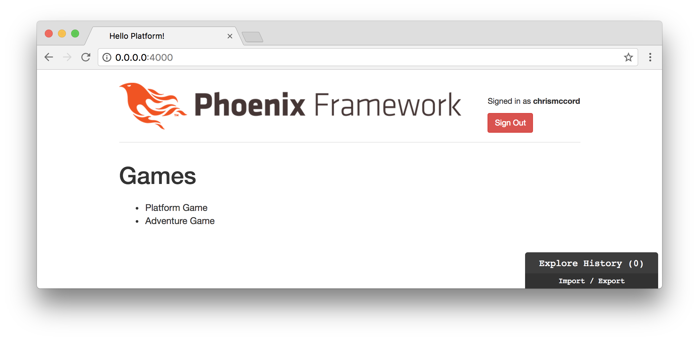

# Elm Application

We have Elm up and running in our Phoenix application. We've also gotten a
brief introduction to Elm syntax, but we could use some practice writing Elm
code as we start to get an understanding of the concepts.

Although some of these concepts might feel unfamiliar at first, let's keep
moving and we'll increase our comfort level as we write small snippets of Elm
code that we'll incorporate into our platform.

## Getting Acquainted

One of the best ways to get acquainted with something new is to start with
something we're already familiar with. If we already know how to write HTML
code, we can use that knowledge as a bridge to learning Elm. Granted, Elm will
afford us opportunities to accomplish so much more than what we could with
HTML. But starting with the view will allow us to render something on the page
and give us something tangible to work with.

## elm-format

We mentioned this briefly in the Elm Introduction chapter, but it bears
repeating that the [elm-format](https://github.com/avh4/elm-format) tool is
_invaluable_ in this situation. It will really help cut down on initial
mistakes and make Elm code easier to write.

## Main.elm

Let's take a look at our existing Elm application:

```elm
module Main exposing (main)

import Html exposing (Html, text)


main : Html msg
main =
    text "Hello from Elm inside Phoenix!"
```

Our goal for this chapter will be to show a list of games on the page, and
later we'll take care of pulling in real data from our JSON API.

What would our game list look like in standard HTML? We could create a `<div>`
element, and then add an unordered list that displays our games. Perhaps we'd
start with something like this:

```html
<div class="games-index">
  <ul class="games-list">
    <li>Platform Game</li>
    <li>Adventure Game</li>
  </ul>
</div>
```

## Elm View

Instead of displaying our `"Hello from Elm inside Phoenix!"` text, let's
create our games list in the `main` function.

We'll start by importing the
[`div`](http://package.elm-lang.org/packages/elm-lang/html/latest/Html#div)
function from Elm's
[`Html`](http://package.elm-lang.org/packages/elm-lang/html/latest/Html)
module. Then, we'll render a `div` element in our `main` function:

```elm
module Main exposing (main)

import Html exposing (Html, text, div)


main : Html msg
main =
    div [] []
```

Note that we replaced our original text with `div [] []`. Those empty square
brackets indicate that we're passing two empty lists to the `div` function. The
first one will be a list of attributes (like our class name), and the second
will be the contents of our `div` (our unordered list).

In order to use the `class` attribute, we'll need to import that too:

```elm
module Main exposing (main)

import Html exposing (Html, text, div)
import Html.Attributes exposing (class)


main : Html msg
main =
    div [ class "games-index" ] []
```

In other words, we can import HTML elements from the `Html` module, and we can
import HTML attributes from the `Html.Attributes` module. In fact, we can
import _all_ the functions available in these modules using `..` and we won't
have to worry about manually importing things one at a time. On the one hand,
we're importing a lot of functions with this approach, but it will save us time
while we're in development mode and we can go back later and refactor to import
only what we need. Let's adjust our import declarations with the following:

```elm
module Main exposing (main)

import Html exposing (..)
import Html.Attributes exposing (..)


main : Html msg
main =
    div [ class "games-index" ] []
```

Now we have access to any HTML element or attribute that we'll need. But we
still only have an empty `div` on the page, so let's start adding our list.

## Creating a List of Games

Remember that we are passing two lists as arguments to our `div` function:

```elm
div [ class "games-index" ] []
```

The first list contains our attributes, and we'll add the contents of our `div`
in the second list (we'll also move our second list to a new line for
readability):

```elm
div [ class "games-index" ]
    [ ul [] [] ]
```

The `ul` function works the same way as our `div`. We'll add our `class`
attribute first:

```elm
div [ class "games-index" ]
    [ ul [ class "games-list" ] [] ]
```

And now we can add the contents of our unordered list:

```elm
div [ class "games-index" ]
    [ ul [ class "games-list" ] [ li [] [] ] ]
```

This is starting to look a little confusing because we have a list item nested
inside an unordered list, which is nested inside our `div`. But let's finish
adding our current example by adding our list items:

```elm
module Main exposing (main)

import Html exposing (..)
import Html.Attributes exposing (..)


main : Html msg
main =
    div [ class "games-index" ]
        [ ul [ class "games-list" ]
            [ li [] [ text "Platform Game" ]
            , li [] [ text "Adventure Game" ]
            ]
        ]
```

This might seem like a lot of work to display a simple list on the page. But
soon we'll see how everything we're working with here is a pure function, which
makes it really simple to compose small, understandable pieces into a bigger
picture. And the good news is that now we have our list displaying on the page:


## Breaking Up the View

The nesting of elements inside elements is making things a little confusing in
our code so far. Let's break things up into small functions. Instead of
assigning everything directly to our `main` function, let's split things up
into a games index container, a list, and individual list items.

```elm
module Main exposing (main)

import Html exposing (..)
import Html.Attributes exposing (..)


main : Html msg
main =
    div [ class "games-index" ]
        [ ul [ class "games-list" ]
            [ li [] [ text "Platform Game" ]
            , li [] [ text "Adventure Game" ]
            ]
        ]


gamesIndex =
    div [] []


gamesList =
    ul [] []


gamesListItem =
    li [] []
```

Now we can start to break up our `main` function into smaller parts. Each of
these functions will return simple HTML, so we can add our type annotations:

```elm
gamesIndex : Html msg
gamesIndex =
    div [] []


gamesList : Html msg
gamesList =
    ul [] []


gamesListItem : Html msg
gamesListItem =
    li [] []
```

And now we can fill out our functions with the existing example we created in
our `main` function. Note that we're only going to add a single list item for
now, and then we're going to extract our data (the data currently consists of
the game titles like `"Platform Game"`) into a separate list:

```elm
gamesIndex : Html msg
gamesIndex =
    div [ class "games-index" ] [ gamesList ]


gamesList : Html msg
gamesList =
    ul [ class "games-list" ] [ gamesListItem ]


gamesListItem : Html msg
gamesListItem =
    li [] [ text "Platform Game" ]
```

With our `main` function, we can create a `div` that will display a header and
our `gamesIndex` to render our new structure to the page with a single game:

```elm
module Main exposing (main)

import Html exposing (..)
import Html.Attributes exposing (..)


main : Html msg
main =
    div []
        [ h1 [] [ text "Games" ]
        , gamesIndex
        ]


gamesIndex : Html msg
gamesIndex =
    div [ class "games-index" ] [ gamesList ]


gamesList : Html msg
gamesList =
    ul [ class "games-list" ] [ gamesListItem ]


gamesListItem : Html msg
gamesListItem =
    li [] [ text "Platform Game" ]
```


## Extracting Our Data

Currently, we've hard-coded our view data. But most Elm applications will
separate the data into a model. I find it helpful to add comments and
placeholder functions to my code so I can start to scaffold out where I want
things to go. In this example, we're going to start our `model` as an empty
list:

```elm
module Main exposing (main)

import Html exposing (..)
import Html.Attributes exposing (..)


-- MAIN


main : Html msg
main =
    div []
        [ h1 [] [ text "Games" ]
        , gamesIndex
        ]


-- MODEL


model =
    []


-- VIEW


gamesIndex : Html msg
gamesIndex =
    div [ class "games-index" ] [ gamesList ]


gamesList : Html msg
gamesList =
    ul [ class "games-list" ] [ gamesListItem ]


gamesListItem : Html msg
gamesListItem =
    li [] [ text "Platform Game" ]
```

In our initial example, we just want our data to be a list of game titles as
strings. That means we can add our data and type annotation:

```elm
model : List String
model =
    [ "Platform Game"
    , "Adventure Game"
    ]
```

Having the comma characters at the beginning of the line might seem foreign if
you're coming from other languages, but it's easy to get used to. And if you're
using elm-format then we're able to focus less on syntax and more on the
overall concepts we're learning here.

## Passing Data to the View

We're going to work towards displaying our full list of games, but we'll start
with trying to display a single game from our list because it introduces some
interesting concepts in Elm.

What if we want to find the first game in our list, and then pass that to the
`gamesListItem` function instead of using the hard-coded string we currently
have there?

Our first step would be to use the `model` list and find the first item. To do
that, we'd head to the Elm documentation for the `List` module, and try to find
a function that would give us the results we're looking for. Take a look at the
[`List`](http://package.elm-lang.org/packages/elm-lang/core/latest/List)
module documentation and find the `head` function.

The `List.head` function is exactly what we need to grab the first item from
our `model`:

```elm
model : List String
model =
    [ "Platform Game"
    , "Adventure Game"
    ]


firstGame =
    List.head model
```

You might think that `firstGame` would be set to `"Platform Game"`, but in
actuality we're working with something called a "Maybe" in Elm. The `List.head`
function doesn't return the result itself, it returns a `Maybe`. The reason for
this is that our list of data _could_ be empty.

To illustrate what's happening, we can take a quick look in the interactive
Elm REPL. From the command line, type `elm-repl` to get started:

```shell
$ elm-repl
```

This will display an interactive prompt where we can type in some Elm code and
view the output. Here's an example where we're accessing the `head` from a
list that contains a couple of strings and another example where we're trying
to access the `head` from an empty list.

```elm
$ elm-repl
---- elm-repl 0.18.0 -----------------------------------------------------------
 :help for help, :exit to exit, more at <https://github.com/elm-lang/elm-repl>
--------------------------------------------------------------------------------
> List.head [ "Platform Game", "Adventure Game" ]
Just "Platform Game"
> List.head []
Nothing
```

## Elm Maybe

This can be a really confusing concept, so don't worry if this looks strange at
first. The idea is that we need to handle both possible cases. The first case
is when our list contains the data we're looking for, and the second case is
when our list is empty. The first step that will help clarify this is to rename
the `firstGame` function to `firstGameMaybe` and add a type annotation:

```elm
model : List String
model =
    [ "Platform Game"
    , "Adventure Game"
    ]


firstGameMaybe : Maybe String
firstGameMaybe =
    List.head model
```

Now we can use Elm's `case` syntax to get the data we're looking for. When our
list has an actual game title string, we'll want to take that as a result.
Otherwise, we'll just return an empty string.

```elm
model : List String
model =
    [ "Platform Game"
    , "Adventure Game"
    ]


firstGameMaybe : Maybe String
firstGameMaybe =
    List.head model


firstGameTitle : String
firstGameTitle =
    case firstGameMaybe of
        Just gameTitle ->
            gameTitle

        Nothing ->
            ""
```

If this is overwhelming or confusing, don't worry too much. Sometimes it just
takes repeated exposure to these concepts before they become obvious. The
naming in our example should help with our understanding.

We're trying to get the first game title from our `model`. So we start by using
`List.head`, which returns a `Maybe` type, and we assign that to
`firstGameMaybe`. That could contain `Just` a game title or possibly contain
`Nothing` in the event that the list was empty.

We handle both of those cases in the `firstGameTitle` function. If the list
contains strings like we're expecting, we return the first string with
`gameTitle`. If the list was empty, we just return an empty string with `""`.

The result is that we can add this to our view and our application should
still work as intended by showing the `"Platform Game"` as the only list item
on the page:

```elm
gamesListItem : Html msg
gamesListItem =
    li [] [ text firstGameTitle ]
```

## Maybe.withDefault

Since this is a common pattern in Elm, there is a function called
[`withDefault`](http://package.elm-lang.org/packages/elm-lang/core/latest/Maybe#withDefault)
in the
[`Maybe`](http://package.elm-lang.org/packages/elm-lang/core/latest/Maybe)
module that can be really helpful to gather the results we're looking for.
Let's refactor our `firstGameTitle` function with the following approach:

```elm
firstGameTitle : String
firstGameTitle =
    Maybe.withDefault "" firstGameMaybe
```

This basically just grabs the first game title as a string, and if it doesn't
exist then we fall back to an empty string `""` as a default value. This allows
us to accomplish the same thing with a lot less code.

## Why Maybe?

You might be asking yourself why we have to go through all this trouble to get
a single value from our model. It seems like a lot of work at first, but this
ultimately proves to be one of the most powerful concepts in Elm, because it
insulates us from a massive class of errors.

We never have to run into errors like "undefined is not a function" in Elm,
because we always account for situations where something might not have a
value. There is no usage of `null` or `undefined` in Elm. This is why Elm can
make a claim of producing no runtime errors, because we're always able to
account for possible values. It means the users of our applications won't run
into errors, and enables us to make guarantees that many languages cannot.

If you're interested in these concepts, be sure to read more about the
[`null` reference on Wikipedia](https://en.wikipedia.org/wiki/Tony_Hoare).

This is one of the more difficult concepts to grasp at first when working with
Elm, but it becomes one of our most treasured assets.

## Iterating Through the List

We know how to display a single item from our `model` using `List.head`. But
how do we iterate through all the game titles and display them on the page?
We can use
[`List.map`](http://package.elm-lang.org/packages/elm-lang/core/latest/List#map)
to iterate through our values and pass them to our `gamesList` function.

We can start by refactoring our view functions to accept arguments. This is
going to be a little difficult at first since we have to make changes to
`gamesIndex`, `gamesList`, and `gamesListItem` all at the same time. At the
end, we'll have all the data from our model being displayed in the view.

First, let's update our `gamesIndex` function to take our `model` as an
argument, and we'll call the argument `gameTitles`. This will involve updating
our type annotation, adding the argument, and then passing it along to the next
function too:

```elm
gamesIndex : List String -> Html msg
gamesIndex gameTitles =
    div [ class "games-index" ] [ gamesList gameTitles ]
```

Now, we have to update our `gamesList` function to accept the argument that
we're passing along from our `gamesIndex` function. We'll update the type
annotation, add the `gameTitles` argument, and then we'll take a look at the
`map` function from the `List` module:

```elm
gamesList : List String -> Html msg
gamesList gameTitles =
    ul [ class "games-list" ] (List.map gamesListItem gameTitles)
```

There's a lot going on here. We're accepting a list of strings as the argument
to our `gamesList` function. Then, we're going to iterate through those game
titles one at a time using `List.map`. Take a look at the documentation for the
[`List.map`](http://package.elm-lang.org/packages/elm-lang/core/latest/List#map) function, and we see that it takes two arguments: a function and a list.

We're passing the list of all our game titles to the `List.map` function, and
it's splitting them apart and sending the titles one at a time to the
`gamesListItem` function. We need to wrap all this in parentheses because we're
using it as the second argument to our `ul` function, but don't get too caught
up in understanding everything at once. For now, we just want to get an overall
understanding of how to render the list on our page, and we'll go back later to
get a better explanation of how it all fits together.

Finishing up with the `gamesListItem` function will help clarify what's
happening above. Let's update the function to take a single string argument
called `gameTitle`:

```elm
gamesListItem : String -> Html msg
gamesListItem gameTitle =
    li [] [ text gameTitle ]
```

Our `gamesListItem` function is using the individual strings that are getting
passed from the `List.map` function in `gamesList`, and it's rendering them
inside a `li` element.

## Tying It All Together

Let's update our `main` function to accept the data from our `model`, and our
application should be back to a fully functioning state. We'll post the full
code example here and then follow the data to get a better understanding of
how it flows through our functions and how it all fits together (also note that
we removed our `firstGameMaybe` and `firstGameTitle` functions now that we're
mapping through all the titles):

```elm
module Main exposing (main)

import Html exposing (..)
import Html.Attributes exposing (..)


-- MAIN


main : Html msg
main =
    div []
        [ h1 [] [ text "Games" ]
        , gamesIndex model
        ]


-- MODEL


model : List String
model =
    [ "Platform Game"
    , "Adventure Game"
    ]


-- VIEW


gamesIndex : List String -> Html msg
gamesIndex gameTitles =
    div [ class "games-index" ] [ gamesList gameTitles ]


gamesList : List String -> Html msg
gamesList gameTitles =
    ul [ class "games-list" ] (List.map gamesListItem gameTitles)


gamesListItem : String -> Html msg
gamesListItem gameTitle =
    li [] [ text gameTitle ]
```



With functional programming, one of the best strategies for improving our
understanding is to think in terms of data transformation. We'll start with
the data from our model, and we'll follow it through our application as we
render it onto the page.

Our `model` function returns a list of strings. Each of these strings contains
a game title that we'll use when we display our list of games.

In our `main` function, we pass the data from our model to our view by passing
`model` to `gamesIndex`. The `gamesIndex` function gives us a `div` element as
a container for our list of games, but it's essentially just passing the data
through to our `gamesList` function without performing any alteration to the
data. This might seem unnecessary, but we'll see the value of this approach
later as we start building other views for our player index. And it currently
enables us to keep our functions small and easy to understand.

The `gamesList` function is where most of the work is getting done. We're using
`List.map` to iterate through our list of strings. We take in the full list of
`gameTitles`, and we pass them one at a time to the `gamesListItem` function.
This function allows us to render our unordered list, and then pipe the data
through to our individual list items.

Lastly, the individual strings with game titles are passed to our
`gamesListItem` function. This is where we see how our approach is so much
better than our original hard-coded attempt, because our list of games can grow
without us having to do any extra work. The number of `li` elements rendered
will just match the number of game title strings that are stored in our
`model`.

## Summary

In this chapter, we managed to start what will ultimately become the whole
front-end for our platform. We learned how to separate the data model and view
for our Elm application, and made things easier to understand as we broke our
code up into small functions.

We also got a quick introduction to the important concept of `Maybe` in Elm,
and learned how to iterate through data with the `List` module.

Since Elm applications tend to share a standard structure and follow similar
patterns, the Elm community has adopted the Elm Architecture. We've already
seen some of the concepts at play when we separated our code into separate
sections for the model and the view, and then pulled them together with the
`main` function.

In the next chapter, we'll take a deeper look at the Elm Architecture as we
work towards displaying real game data from our Phoenix JSON API.
