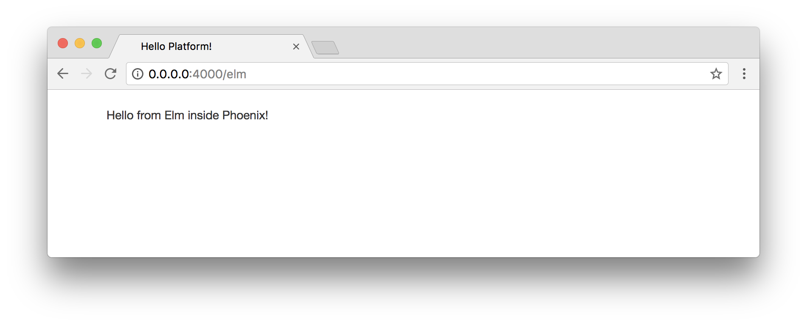
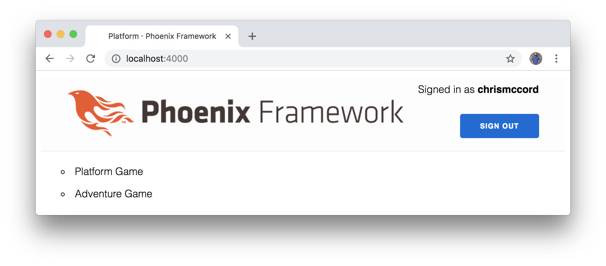
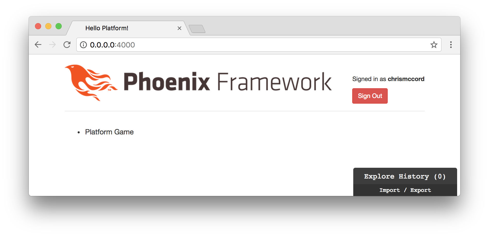

# Elm Application

We have Elm up and running in our Phoenix application. We've also gotten a
brief introduction to Elm syntax, but we could use some practice writing Elm
code as we start to get an understanding of the concepts.

Although some of these concepts might feel unfamiliar at first, let's keep
moving and we'll increase our comfort level as we write small snippets of Elm
code that we'll incorporate into our platform.

## Getting Acquainted

One of the best ways to get acquainted with something new is to start with
something we're already familiar with. If we already know how to write HTML
code, we can use that knowledge as a bridge to learning Elm. Granted, Elm will
afford us opportunities to accomplish so much more than what we could with
HTML. But starting with the view will allow us to render something on the page
and give us something tangible to work with.

## elm-format

We mentioned this briefly in the Elm Intro chapter, but it bears repeating that
the [elm-format](https://github.com/avh4/elm-format) tool is _invaluable_ in
this situation. It will really help cut down on initial mistakes and make Elm
code easier to write.

## Converting Existing Code

Let's start with our existing `http://0.0.0.0:4000/elm` page. In the
`index.html.eex` file from the `lib/platform/web/templates/page` folder, let's
remove everything other than our Elm container. Here's what the file currently
looks like:

```embedded_elixir
<p class="well">Signed in as <strong><%= @current_user.username %></strong></p>
<span><%= link "List All Players", to: player_path(@conn, :index), class: "btn btn-info" %></span>
<span><%= link "Sign Out", to: player_session_path(@conn, :delete, @current_user), method: "delete", class: "btn btn-danger" %></span>

<div class="elm-container"></div>
```

We're going to add our authentication features back in later, but for now we
want this page to only contain our Elm application. So let's replace the code
above with the following:

```embedded_elixir
<div class="elm-container"></div>
```

At this point, we're displaying only a single line of text that's coming from
our Elm application:



## Main.elm

Let's take a look at our existing Elm application:

```elm
module Main exposing (..)

import Html exposing (Html, text)


main : Html msg
main =
    text "Hello from Elm inside Phoenix!"
```

Our goal for this chapter will be to show a list of games on the page, and
later we'll take care of pulling in real data from our JSON API.

What would our game list look like in standard HTML? We could create a `<div>`
element, and then add an unordered list that displays our games. Perhaps we'd
start with something like this:

```html
<div class="games-index">
  <ul class="games-list">
    <li>Adventure Game</li>
    <li>Driving Game</li>
    <li>Platform Game</li>
  </ul>
</div>
```

## Elm View

Instead of displaying our `"Hello from Elm inside Phoenix!"` text, let's
create our games list in the `main` function. We'll start with an empty `div`
element:

```elm
module Main exposing (..)

import Html exposing (Html, text, div)


main : Html msg
main =
    div [] []
```

Note that the first step is to import the `div` function from Elm's `Html`
module. Then we replaced our text with `div [] []`. Those empty square brackets
indicate that we're passing two empty lists to the `div` function. The first
one will be a list of attributes (like our class name), and the second one will
be the contents of our `div` (our unordered list).

In order to use the `class` attribute, we'll need to import that too:

```elm
module Main exposing (..)

import Html exposing (Html, text, div)
import Html.Attributes exposing (class)


main : Html msg
main =
    div [ class "games-index" ] []
```

In other words, we can import HTML elements from the `Html` module, and we can
import HTML attributes from the `Html.Attributes` module. In fact, we can
import _everything_ from those modules using `..` and not have to worry about
manually importing things one at a time. On the one hand, we're importing a lot
of things we won't need, but it will save us time in development now and we can
go back and refactor to import only what we need later. Let's update our import
statements with the following:

```elm
module Main exposing (..)

import Html exposing (..)
import Html.Attributes exposing (..)


main : Html msg
main =
    div [ class "games-index" ] []
```

Now we have access to any HTML element or attribute that we'll need. But we
still only have an empty `div` on the page, so let's start adding our list.

## Creating a List of Games

Remember that we are passing two lists to our `div` function:

```elm
div [ class "games-index" ] []
```

The first list contains our attributes, and we'll add the contents of our `div`
in the second list (we'll also move our second list to a new line for
readability):

```elm
div [ class "games-index" ]
    [ ul [] [] ]
```

The `ul` function works the same way as our `div`. We'll add our `class`
attribute first:

```elm
div [ class "games-index" ]
    [ ul [ class "games-list" ] [] ]
```

And now we can add the contents of our unordered list:

```elm
div [ class "games-index" ]
    [ ul [ class "games-list" ] [ li [] [] ] ]
```

This is starting to look a little confusing because we have a list item nested
inside an unordered list, which is nested inside our `div`. But let's finish
adding our current example by adding our list items:

```elm
module Main exposing (..)

import Html exposing (..)
import Html.Attributes exposing (..)


main : Html msg
main =
    div [ class "games-index" ]
        [ ul [ class "games-list" ]
            [ li [] [ text "Adventure Game" ]
            , li [] [ text "Driving Game" ]
            , li [] [ text "Platform Game" ]
            ]
        ]
```

This might seem like a lot of work to display a simple list on the page. But
soon we'll see how everything we're working with here is a pure function, which
makes it really simple to compose small, understandable pieces into a bigger
picture. And the good news is that now we have our list displaying on the page:



## Breaking Up the View

The nesting of elements inside elements is making things a little confusing in
our code so far. Let's break things up into small functions. Instead of
assigning everything directly to our `main` function, let's split things up
into a games index container, a list, and individual list items.

```elm
module Main exposing (..)

import Html exposing (..)
import Html.Attributes exposing (..)


main : Html msg
main =
    div [ class "games-index" ]
        [ ul [ class "games-list" ]
            [ li [] [ text "Adventure Game" ]
            , li [] [ text "Driving Game" ]
            , li [] [ text "Platform Game" ]
            ]
        ]


gamesIndex =
    div [] []


gamesList =
    ul [] []


gamesListItem =
    li [] []
```

Now we can start to break up our `main` function into smaller parts. Each of
these functions will return simple HTML, so we can add our type annotations:

```elm
gamesIndex : Html msg
gamesIndex =
    div [] []


gamesList : Html msg
gamesList =
    ul [] []


gamesListItem : Html msg
gamesListItem =
    li [] []
```

And now we can fill out our functions with the existing example we created in
our `main` function. Note that we're only going to add a single list item for
now, and then we're going to extract our data into a separate list:

```elm
gamesIndex : Html msg
gamesIndex =
    div [ class "games-index" ] [ gamesList ]


gamesList : Html msg
gamesList =
    ul [ class "games-list" ] [ gamesListItem ]


gamesListItem : Html msg
gamesListItem =
    li [] [ text "Adventure Game" ]
```

Lastly, we can just assign our new `gamesIndex` function to `main` and it will
render our new structure to the page with a single game:

```elm
module Main exposing (..)

import Html exposing (..)
import Html.Attributes exposing (..)


main : Html msg
main =
    gamesIndex


gamesIndex : Html msg
gamesIndex =
    div [ class "games-index" ] [ gamesList ]


gamesList : Html msg
gamesList =
    ul [ class "games-list" ] [ gamesListItem ]


gamesListItem : Html msg
gamesListItem =
    li [] [ text "Adventure Game" ]
```



## Extracting Our Data

Currently we have some hardcoded `view` code. But most Elm applications will
separate the data into a Model. I find it helpful to add comments and
placeholder functions to my code so I can start to scaffold out where I want
things to go. In this example, we're going to start our `model` as an empty
list:

```elm
module Main exposing (..)

import Html exposing (..)
import Html.Attributes exposing (..)


-- MAIN


main : Html msg
main =
    gamesIndex


-- MODEL


model =
    []


-- VIEW


gamesIndex : Html msg
gamesIndex =
    div [ class "games-index" ] [ gamesList ]


gamesList : Html msg
gamesList =
    ul [ class "games-list" ] [ gamesListItem ]


gamesListItem : Html msg
gamesListItem =
    li [] [ text "Adventure Game" ]
```

In our initial example, we just want our data to be a list of game titles as
strings. That means we can add our data and type annotation:

```elm
model : List String
model =
    [ "Adventure Game"
    , "Driving Game"
    , "Platform Game"
    ]
```

Having the comma characters at the beginning of the line might seem foreign if
you're coming from other languages, but it's easy to get used to. And if you're
using elm-format then we're able to focus less on syntax and more on the
overall concepts we're learning here.

## Passing Data to the View

We're going to work towards displaying our full list of games, but we'll start
with trying to display a single game from our list because it introduces some
interesting concepts in Elm.

What if we want to find the first game in our list, and then pass that to the
`gamesListItem` function instead of using the hardcoded string we currently
have there?

Our first step would be to use the `model` list and find the first item. To do
that, we'd head to the Elm documentation for the `List` module, and try to find
a function that would give us the results we're looking for. Take a look at the
[`List` module documentation](http://package.elm-lang.org/packages/elm-lang/core/5.1.1/List),
and find the `head` function.

The `List.head` function is exactly what we need to grab the first item from
our `model`:

```elm
model : List String
model =
    [ "Adventure Game"
    , "Driving Game"
    , "Platform Game"
    ]


firstGame =
    List.head model
```

You might think that `firstGame` would be set to `"Adventure Game"`, but in
actuality we're working with something called a `Maybe` in Elm. The `List.head`
function doesn't return the result itself, it returns a "Maybe". The reason for
this is that our list of data _could_ be empty.

To illustrate what's happening, here's a quick example in the `elm-repl`:

```elm
$ elm-repl
> List.head [ "Adventure Game", "Driving Game", "Platform Game" ]
Just "Adventure Game"
> List.head []
Nothing
```

## Elm Maybe

This can be a really confusing concept, so don't worry if this looks strange at
first. The idea is that we need to handle both possible cases. The first case
is when our list contains the data we're looking for, and the second case is
when our list is empty. The first step that will help clarify this is to rename
the variable that we're working with and add a type annotation:

```elm
model : List String
model =
    [ "Adventure Game"
    , "Driving Game"
    , "Platform Game"
    ]


firstGameMaybe : Maybe String
firstGameMaybe =
    List.head model
```

Now we can use Elm's `case` syntax to get the data we're looking for. When our
list has an actual game title string, we'll want to take that as a result.
Otherwise, we'll just return an empty string.

```elm
model : List String
model =
    [ "Adventure Game"
    , "Driving Game"
    , "Platform Game"
    ]


firstGameMaybe : Maybe String
firstGameMaybe =
    List.head model


firstGameTitle : String
firstGameTitle =
    case firstGameMaybe of
        Just gameTitle ->
            gameTitle

        Nothing ->
            ""
```

If this is overwhelming or confusing don't worry too much. Sometimes it just
takes repeated exposure to these concepts before they become obvious. The
naming in our example should help with our understanding.

We're trying to get the first game title from our `model`. So we start by using
`List.head`, which returns a "Maybe", and we assign that to `firstGameMaybe`.
That could contain "Just" a game title or possibly contain "Nothing" in the
event that the list was empty.

We handle both of those cases in the `firstGameTitle` function. If the list
contains strings like we're expecting, we return the first string with
`gameTitle`. If the list was empty, we just return an empty string with `""`.

The result is that we can add this to our view and our application should
still work as intended by showing the `"Adventure Game"` as the only list item
on the page:

```elm
gamesListItem : Html msg
gamesListItem =
    li [] [ text firstGameTitle ]
```

## Maybe.withDefault

Since this is a common pattern in Elm, there is a function called `withDefault`
in the [`Maybe` module](http://package.elm-lang.org/packages/elm-lang/core/5.1.1/Maybe)
that can be really helpful to gather the results we're looking for. Let's
refactor our `firstGameTitle` function with the following approach:

```elm
firstGameTitle : String
firstGameTitle =
    Maybe.withDefault "" firstGameMaybe
```

This basically just grabs the first game title as a string, and if it doesn't
exist then we fall back to an empty string `""` as a default value. This allows
us to accomplish the same thing with a lot less code.

## Why Maybe?

You might be asking yourself why we have to go through all this trouble to get
a single value from our model. It seems like a lot of work at first, but this
ultimately proves to be one of the most powerful concepts in Elm, because it
insulates us from a massive class of errors.

We never have to run into errors like "undefined is not a function" in Elm,
because we always account for situations where something might not have a
value. There is no usage of `null` or `undefined` in Elm. This is why Elm can
make a claim of producing no runtime errors, because we're always able to
account for possible values. It means the users of our applications won't run
into errors, and enables us to make guarantees that many languages simply
can't.

If you're interested in these concepts, be sure to read more about the
[`null` reference on Wikipedia](https://en.wikipedia.org/wiki/Tony_Hoare).

This is one of the more difficult concepts to grasp at first when working with
Elm, but it becomes our most treasured asset.
