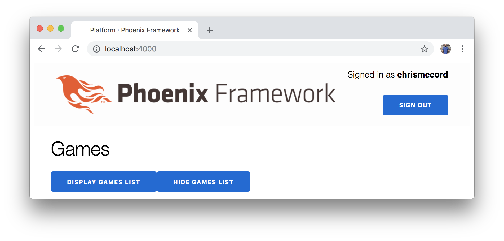
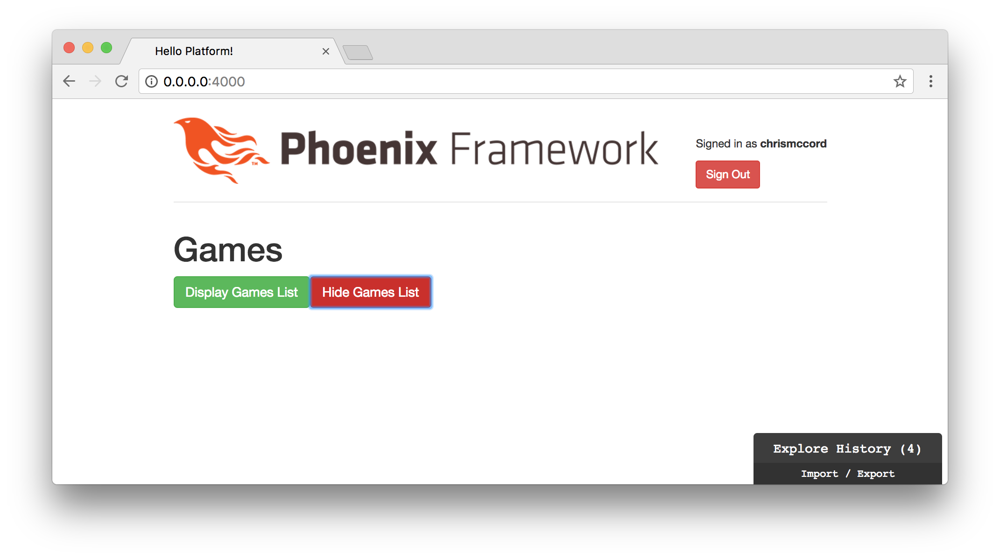

# Elm Architecture

In this chapter, we're going to adapt our existing Elm application so that it
follows the standard Elm Architecture. While Elm is a programming language like
JavaScript, we can think of the Elm Architecture as a framework for building
applications like React or Angular.

The Elm Architecture gives us a standard approach for how to structure our Elm
applications, and makes it really easy to add our initial features.

## Adapting Our Existing Elm Application

The good news is that our existing Elm application already has the elements we
need for the Elm Architecture. We're just going to adapt the existing code and
add a few things that will tie it all together.

One way to think of our Elm application is to break it into five sections:

- Main
- Model
- Update
- Subscriptions
- View

Each of these sections will be a function, and the Elm runtime will make
everything work by tying them together in the `main` function.

- Main: `main`
- Model: `init`
- Update: `update`
- Subscriptions: `subscriptions`
- View: `view`

## Removing the Original Main Function

We're going to be breaking our original Elm application with all the changes
we make in this chapter. But we don't want elm-format to keep warning us of
errors while we're working. Let's adjust our original `main` function to simply
return an empty `div` element for now:

```elm
-- MAIN


main : Html msg
main =
     div [] []
```

At the end of this chapter, we'll change our `main` function so it can pull
everything together for us.

## Starting with the Model

The model will be a good place to start as we structure our data. Instead of
just displaying our game titles, let's show both the game title and a brief
description. We're going to be mirroring some of the data we created in our
Phoenix JSON API for games.

We'll name this function `initialModel`, and we'll use Elm's "Record" syntax
to create our games:

```elm
initialModel =
    [ { gameTitle = "Platform Game", gameDescription = "Platform game example." }
    , { gameTitle = "Adventure Game", gameDescription = "Adventure game example." }
    ]
```

Note that we haven't added type annotations yet, and we're working with a new
data type. Records allow us to create keys and values for our fields. In this
example, we have two records (each one is a game), and each record has two
fields (`gameTitle` and `gameDescription`).

Now that we have some idea of how our data will be structured, let's add a
couple of type annotations for our individual games and our model as a whole:

```elm
type alias Model =
    List Game


type alias Game =
    { title : String
    , description : String
    }


initialModel : Model
initialModel =
    [ { title = "Platform Game", description = "Platform game example." }
    , { title = "Adventure Game", description = "Adventure game example." }
    ]
```

This is our first look at creating type aliases. We're creating one type alias
for our overall `Model`, which is a list of games. Then, we define the type of
our `Game` records. Each game is a record that will contain a `title` field and
a `description` field, both of which are `String` types. We also add a type
annotation for our `initialModel` function to ensure that it follows the
`Model` type alias structure that we created above.

Let's make a slight change to help further our understanding of what we're
accomplishing here. We'll make our `initialModel` more flexible for adding
other fields later by moving our records into a named list:

```elm
type alias Model =
    { gamesList : List Game
    }


type alias Game =
    { title : String
    , description : String
    }


initialModel : Model
initialModel =
    { gamesList =
        [ { title = "Platform Game", description = "Platform game example." }
        , { title = "Adventure Game", description = "Adventure game example." }
        ]
    }
```

This is essentially the same data we were already working with. We're just
turning our `Model` into a record so that we can easily add other fields later
(for example, we'll eventually want to add a `playersList`).

Now we have types that hold data for both our list of games and the individual
games themselves. This enables us to ensure that our data is always properly
structured and that we're not producing any errors.

Since we commented out our `main` function, we can also remove our original
`model` function. Here's what the top of our file should look like for
reference:

```elm
module Main exposing (main)

import Html exposing (..)
import Html.Attributes exposing (..)


-- MAIN


main : Html msg
main =
     div [] []


-- MODEL


type alias Model =
    { gamesList : List Game
    }


type alias Game =
    { title : String
    , description : String
    }


initialModel : Model
initialModel =
    { gamesList =
        [ { title = "Platform Game", description = "Platform game example." }
        , { title = "Adventure Game", description = "Adventure game example." }
        ]
    }
```

When we set up our `main` function later, we'll want to initialize our model
into an `init` function. For now, let's move on to the update section so we can
introduce the necessary concepts as they arise.

## Update

We've seen the model section where we deal with data, and we worked with the
view in the last chapter. But how do we update the state of our Elm
applications?

Let's create a new comment to delineate the update section, and add a new
`update` function:

```elm
-- UPDATE


update msg model =
    model
```

Our update function takes two arguments. First, it takes a `msg` that will
perform some action or operation in our code. Second, it takes the existing
`model` as an argument. This might sound complicated at first, but it basically
just means that the `update` function takes in our existing model, performs
some change to it, and then returns a new version of the model. In other words,
we can take some data like our list of games, update it, and then return the
updated version of that data.

Let's create the type annotation to clarify what's happening in the `update`
function:

```elm
update : Msg -> Model -> Model
update msg model =
    model
```

The type annotation helps a little because we can see that we take our existing
`model` as the second argument, and that the return type will also be of type
`Model`. But what is `Msg`? And how do we apply the changes we want to make
to our data?

## Update Messages

In our update section, we want to define the different type of actions our
users can perform. We do this by creating a new type for our messages above the
`update` function:

```elm
type Msg = DisplayGamesList | HideGamesList
```

In this example, we're going to allow our users to perform two different types
of transformations to our data. We're either going to display the list of games
on the page, or we're going to hide it from view. This feature will start to
be a little more obvious when we get to the view for our application. We'll
create a couple of buttons that will allow us to display and hide our list of
games. For now, all we need to know is that there are only two actions that a
user can perform in our application: `DisplayGamesList` and `HideGamesList`.

Before we update our model and perform our actions, let's create a `case`
expression that will allow us to handle our different messages (note that we're
actually just returning the same model that's being passed in for now, and
we'll perform the actual updates soon):

```elm
type Msg
    = DisplayGamesList
    | HideGamesList


update : Msg -> Model -> Model
update msg model =
    case msg of
        DisplayGamesList ->
            model

        HideGamesList ->
            model
```

We have two types of actions that our users can perform, and we'll use a `case`
expression to determine which changes get made to our data as a result.

## Changing the Model

Any time we change state in our Elm applications, it will involve an update to
the model section. In our case, we want to add a field that indicates whether
or not we're going to display our list of game data.

Let's add a `displayGamesList` field that will be set to either `True` or
`False`. We'll update the type alias for our `Model` and also set an initial
value of `False` in our `initialModel`:

```elm
type alias Model =
    { gamesList : List Game
    , displayGamesList : Bool
    }


type alias Game =
    { title : String
    , description : String
    }


initialModel : Model
initialModel =
    { gamesList =
        [ { title = "Platform Game", description = "Platform game example." }
        , { title = "Adventure Game", description = "Adventure game example." }
        ]
    , displayGamesList = False
    }
```

## Performing the Update

When a user performs an action and invokes the `DisplayGamesList` message,
we'll set the `displayGamesList` field to a value of `True`. Alternatively,
when a user performs an action and invokes the `HideGamesList` message, we'll
set the `displayGamesList` field to a value of `False`.

Here is the syntax we use in Elm to update a value stored in a record:

```elm
update : Msg -> Model -> Model
update msg model =
    case msg of
        DisplayGamesList ->
            { model | displayGamesList = True }

        HideGamesList ->
            { model | displayGamesList = False }
```

Since our model is a record that contains fields, we can use
`{ model | displayGamesList = True }` to change a value. This syntax is
basically telling our application to look inside the `model` record, find the
`displayGamesList` field, and set it to a new value of `True`. In the upcoming
sections, we'll add a button to our view that will allow users to invoke the
`DisplayGamesList` message, which will set `displayGamesList` to `True`, and
then we'll use that value to display the list of game data in our view.

## Subscriptions

Subscriptions in Elm allow us to subscribe to a stream of events (like the
user's mouse activity or keyboard input). We currently need to create a
`subscriptions` function so we can pull our full application together when we
get to the `main` function. But we're not going to subscribe to any events yet,
so we're just going to set it to an initial value of `Sub.none`.

Here's the initial `subscriptions` function we'll use, and we'll cover the
concept of subscriptions in greater detail later in the book:

```elm
-- SUBSCRIPTIONS


subscriptions : Model -> Sub Msg
subscriptions model =
    Sub.none
```

## Updating the View

Finally, we can update our existing view section to include our new features
and display our list of games. Let's start by adding a new `view` function that
takes our `model` as an argument and then renders HTML to the page:

```elm
-- VIEW


view : Model -> Html Msg
view model =
    div [] []
```

We start with an empty `div` element, and now we can add two buttons that will
conditionally display or hide our list of games.

```elm
view : Model -> Html Msg
view model =
    div []
        [ h1 [ class "games-section" ] [ text "Games" ]
        , button [ class "btn btn-success" ] [ text "Display Games List" ]
        , button [ class "btn btn-danger" ] [ text "Hide Games List" ]
        ]
```

These `button` elements won't be fully functioning yet, but the good news is
that we finally have enough code to start displaying our application in the
browser. Let's add our `main` function, and we'll come back to the `view` so
we can get all our features working.

## The Main Function

Let's go back to the top of our `Main.elm` file and add the following `main`
function back in just below the `import` declarations. This code is how the Elm
runtime pulls all the different functions we've created together:

```elm
main : Program Never Model Msg
main =
    Html.program
        { init = init
        , view = view
        , update = update
        , subscriptions = subscriptions
        }
```

Adding our `main` function means we'll need to initialize our model with an
`init` function. Add the following below the `initialModel` function:

```elm
init : ( Model, Cmd Msg )
init =
    ( initialModel, Cmd.none )
```

This code tells Elm that we want to start with the `initialModel` as our data.
We don't need to worry too much about `Cmd` yet, but it will basically allow us
to run a
["Command"](http://package.elm-lang.org/packages/elm-lang/core/latest/Platform-Cmd)
in Elm to fetch additional data. We're going to cover Elm commands in detail in
the next chapter, but for now we can just think of a command as an action that
may succeed or fail. For instance, we could perform an HTTP request when we
start our Elm application to gather initial data, and we'd have to handle the
situations where that HTTP fetch was successful and situations where that might
fail to fetch the data.

With these changes to our model, we'll have to change our `update` function
too:

```elm
update : Msg -> Model -> ( Model, Cmd Msg )
update msg model =
    case msg of
        DisplayGamesList ->
            ( { model | displayGamesList = True }, Cmd.none )

        HideGamesList ->
            ( { model | displayGamesList = False }, Cmd.none )
```

At this point, our `main` function is pulling everything together and we're
finally able to see our application rendered to the screen in the browser.
Our buttons aren't set up to work yet, but we're now able to see them rendering
on the screen.



## Displaying Our List of Games

Let's finish updating our view section. We'll update our existing functions to
display our list of games, and we'll use our buttons to add some interactivity.

First, we'll update our `gamesIndex` function to take our `model` as an
argument and then access the list of games with `model.gamesList`:

```elm
view : Model -> Html Msg
view model =
    div []
        [ h1 [ class "games-section" ] [ text "Games" ]
        , button [ class "btn btn-success" ] [ text "Display Games List" ]
        , button [ class "btn btn-danger" ] [ text "Hide Games List" ]
        , gamesIndex model
        ]

gamesIndex : Model -> Html msg
gamesIndex model =
    div [ class "games-index" ] [ gamesList model.gamesList ]
```

Now we can update our `gamesList` and `gamesListItem` functions:

```elm
gamesList : List Game -> Html msg
gamesList games =
    ul [ class "games-list" ] (List.map gamesListItem games)


gamesListItem : Game -> Html msg
gamesListItem game =
    li [ class "game-item" ]
        [ strong [] [ text game.title ]
        , p [] [ text game.description ]
        ]
```

We start by passing our full `model` to the `gamesIndex`, which passes the
`gamesList` from the model along to the `gamesList` function. Then we pass
those individual games to the `gamesListItem` function. For each `game`, we
display both the `title` (in a `strong` element) and the `description`
(in a `p` element).


We're now able to render our buttons and the list of games, but how do we
get the buttons to work?

## Handling Events

To get our buttons working, we'll need to add another import at the top of our
`Main.elm` file. We already have our HTML elements and attributes, and we'll
need to import `Html.Events` to handle events. More specifically, we just want
to import the `onClick` function for our buttons:

```elm
import Html exposing (..)
import Html.Attributes exposing (..)
import Html.Events exposing (onClick)
```

Now we can update our `view` function to handle the click events on our buttons
and send them to the right actions in the `update` function:

```elm
view : Model -> Html Msg
view model =
    div []
        [ h1 [ class "games-section" ] [ text "Games" ]
        , button [ class "btn btn-success", onClick DisplayGamesList ] [ text "Display Games List" ]
        , button [ class "btn btn-danger", onClick HideGamesList ] [ text "Hide Games List" ]
        , gamesIndex model
        ]
```

The last step to getting our buttons working is to check for the value of the
`displayGamesList` boolean before we render our list of games. When that field
is set to `True`, then we'll pass the `model` to the `gamesIndex`, otherwise
we'll just render an empty `div` element. Here's the full View section for our
application:

```elm
-- VIEW


view : Model -> Html Msg
view model =
    div []
        [ h1 [ class "games-section" ] [ text "Games" ]
        , button [ class "btn btn-success", onClick DisplayGamesList ] [ text "Display Games List" ]
        , button [ class "btn btn-danger", onClick HideGamesList ] [ text "Hide Games List" ]
        , if model.displayGamesList then
            gamesIndex model
          else
            div [] []
        ]


gamesIndex : Model -> Html msg
gamesIndex model =
    div [ class "games-index" ] [ gamesList model.gamesList ]


gamesList : List Game -> Html msg
gamesList games =
    ul [ class "games-list" ] (List.map gamesListItem games)


gamesListItem : Game -> Html msg
gamesListItem game =
    li [ class "game-item" ]
        [ strong [] [ text game.title ]
        , p [] [ text game.description ]
        ]
```

We should be able to click the buttons and see the list of games displayed or
hidden based on our interactions:



Now that we're changing state in our application, we can also start using the
Elm debugger by clicking the Explore History tab at the bottom right corner of
the browser to see changes to our model as they occur over time.

## Summary

We managed to get a fairly detailed look at the Elm Architecture in this
chapter as we adapted our original application. Most Elm applications tend to
follow this structure, so we can use this knowledge to quickly get a sense how
other Elm applications work too.

In the next chapter, we'll work on fetching JSON data from our Phoenix API so
we can render both our games and our players to the page.
