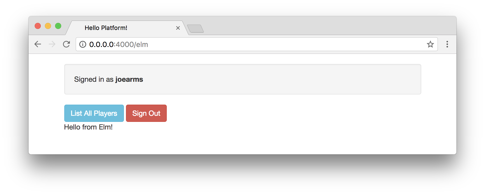
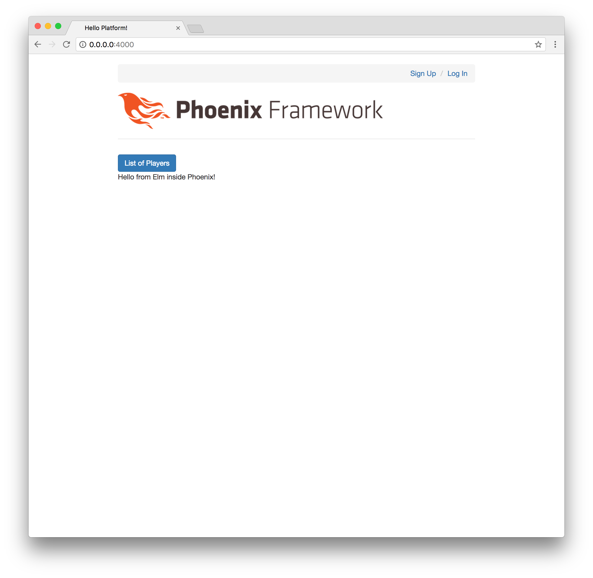

# Elm Setup

We're excited to have our back-end up and running, and we've gotten a brief
look at the Elm language. Now, let's figure out how we can write Elm code for
the front-end of our Phoenix application.

We already installed Elm globally in the last chapter, and now we can take a
look at configuring Elm with Phoenix using a tool called Brunch.

## Configuring Elm within Phoenix

Phoenix front-end files are located in the `assets` folder. Let's begin by
checking out the existing `package.json` file that Phoenix gives us by default:

```javascript
{
  "repository": {},
  "license": "MIT",
  "scripts": {
    "deploy": "brunch build --production",
    "watch": "brunch watch --stdin"
  },
  "dependencies": {
    "phoenix": "file:../deps/phoenix",
    "phoenix_html": "file:../deps/phoenix_html"
  },
  "devDependencies": {
    "babel-brunch": "6.1.1",
    "brunch": "2.10.9",
    "clean-css-brunch": "2.10.0",
    "uglify-js-brunch": "2.10.0"
  }
}
```

We can use any front-end build tool we prefer, but Phoenix comes with a
minimalist tool called [`brunch`](http://brunch.io), which we can see listed in
the `devDependencies`. You're welcome to try other options, but Brunch tends to
work well for our purposes. The initial configuration takes some work, but
afterward we'll be able to focus on development with Elixir and Elm.

Let's navigate to the `assets` folder from the command line and run the
following command to ensure our project works with the `elm` language and the
`elm-brunch` tool:

```shell
$ npm install --save-dev elm elm-brunch
```

This will add two new lines to the `devDependencies` section of our
`package.json` file.

```javascript
"devDependencies": {
  "babel-brunch": "6.1.1",
  "brunch": "2.10.9",
  "clean-css-brunch": "2.10.0",
  "elm": "^0.18.0",
  "elm-brunch": "^0.9.0",
  "uglify-js-brunch": "2.10.0"
}
```

## Updating .gitignore

Thankfully, the default `.gitignore` file is setup to ignore all the files that
get added to the `node_modules` folder. So our repository tracks changes to the
`package.json` file, but ignores all the files created in the `node_modules`
directory when we ran the `npm install` command.

Let's take this opportunity to update the `.gitignore` file in the root of our
`platform` project so our repository won't need to track extraneous files that
Elm will generate for us. Similar to the way that npm creates a `node_modules`
folder, Elm will generate a folder called `elm-stuff` that we can ignore.

Open the `.gitignore` file at the root of our project, and add the following
code to the bottom:

```gitignore
# Elm
/assets/elm-stuff
```

Now, run the following command from inside the `assets` folder of our Phoenix
project to install Elm packages:

```shell
$ elm-package install
```

It should show similar output to what we saw in the previous chapter:

```shell
$ elm-package install
Some new packages are needed. Here is the upgrade plan.

  Install:
    elm-lang/core 5.1.1
    elm-lang/html 2.0.0
    elm-lang/virtual-dom 2.0.4

Do you approve of this plan? [Y/n] Y
Starting downloads...

  ● elm-lang/html 2.0.0
  ● elm-lang/virtual-dom 2.0.4
  ● elm-lang/core 5.1.1

Packages configured successfully!
```

This command creates a new `elm-package.json` file that we need inside our
`assets` folder. And it also creates the `elm-stuff` folder that won't need to
be tracked by our repository.

This is a great location for our files, because it means we'll have collocated
our front-end files with `package.json` for any Node libraries and
`elm-package.json` for any Elm libraries we want to include.

## Elm Folder

We'll need a place to put our Elm code inside our Phoenix application structure.
Inside the `lib/platform/web` folder, create a new folder called `elm`. This is
where we'll install Elm packages and put all of our Elm source code. The Elm
source code we write will be committed to GitHub, but we want our Phoenix
application to compile it to JavaScript automatically and we won't actually have
to work with those JavaScript output files directly.

## brunch-config.js

Now that we've added Elm to our `package.json` file and created a folder for our
Elm code, we'll want to configure the Brunch build tool as well. Open the
`brunch-config.js` file, and replace it with the following (note that the
default file contains _a lot_ of comments, but we're removing them here for
brevity):

```javascript
exports.config = {
  files: {
    javascripts: { joinTo: "js/app.js" },
    stylesheets: { joinTo: "css/app.css" },
    templates: { joinTo: "js/app.js"}
  },
  conventions: { assets: /^(static)/ },
  paths: {
    watched: ["../lib/platform/web/elm", "static", "css", "js", "vendor"],
    public: "../priv/static"
  },
  plugins: {
    babel: { ignore: [/vendor/] },
    elmBrunch: { elmFolder: "../lib/platform/web/elm", mainModules: ["Main.elm"], outputFolder: "../../../../assets/vendor" }
  },
  modules: { autoRequire: { "js/app.js": ["js/app"] } },
  npm: { enabled: true }
};
```

This file has been condensed quite a bit to keep it short, but the main things
to note are the `watched` paths section, and the `elmBrunch` plugin. These
configuration options are basically telling the Phoenix application where to
look for our Elm source code, and where we'll output the results (in the
`assets/vendor` folder).

## Installing Elm Packages

Inside our `lib/platform/web/elm` folder we're going to pull in the Elm
packages we need. But we only want to commit our Elm source code to Git, so
first let's update our `.gitignore` file to make sure we don't add everything
to our repository.

Add the following lines to the bottom of the `.gitignore` file in our `platform`
project's root directory:

```gitignore
# Elm
/lib/platform/web/elm/elm-stuff
/assets/vendor/main.js
```

Now go to the `lib/platform/web/elm` folder from the command line and run the
following command:

```shell
elm-package install
```

Enter the `Y` character to approve of the package plan, and we should see the
following output:

```shell
$ elm-package install
Some new packages are needed. Here is the upgrade plan.

  Install:
    elm-lang/core 5.1.1
    elm-lang/html 2.0.0
    elm-lang/virtual-dom 2.0.4

Do you approve of this plan? [Y/n] Y
Starting downloads...

  ● elm-lang/html 2.0.0
  ● elm-lang/core 5.1.1
  ● elm-lang/virtual-dom 2.0.4

Packages configured successfully!
```

So we have our `package.json` file in the `assets` folder to handle our
JavaScript dependencies, and we also have our `elm-package.json` file in the
`lib/platform/web/elm` folder to manage Elm packages.

## Main.elm

Now we can start writing Elm code inside our Phoenix application. Create a file
called `Main.elm` inside the `lib/platform/web/elm` folder. And add the
following content:

```elm
module Main exposing (..)

import Html exposing (Html, text)


main : Html msg
main =
    text "Hello from Elm!"
```

Now let's start up our Phoenix server with `mix phx.server`, and we should see
a message in the Terminal about how the `Main.elm` file was compiled into an
`app.js` file that Phoenix can use:

```shell
$ mix phx.server
[info] Running Platform.Web.Endpoint with Cowboy using http://0.0.0.0:4000
07:33:05 - info: compiling
07:33:06 - info: compiled 66 files into 2 files, copied 3 in 6.9 sec
Elm compile: Main.elm, in ../lib/platform/web/elm, to ../../../../assets/vendor/main.js
07:33:08 - info: compiled main.js and 78 cached files into app.js in 306 ms
```

## Displaying Our Elm Application

The last step is to find a place to put our Elm application within Phoenix. In
a previous chapter, we already created a `/elm` route that we can use. That page
currently contains a few simple buttons, and we'll add our Elm content below.
We'll use the same `index.html.eex` file we worked with previously in the
`/lib/platform/web/templates/page` folder.

Below the existing code, let's add a `<div>` element where we can put our Elm
application:

```embedded_elixir
<p class="well">Signed in as <strong><%= @current_user.username %></strong></p>
<span><%= link "List All Players", to: player_path(@conn, :index), class: "btn btn-info" %></span>
<span><%= link "Sign Out", to: player_session_path(@conn, :delete, @current_user), method: "delete", class: "btn btn-danger" %></span>

<div class="elm-container"></div>
```

We have a container to attach our Elm application. So let's open the
`assets/js/app.js` file and add the following code at the very bottom:

```javascript
const elmContainer = document.querySelector(".elm-container");

if (elmContainer) {
  const elmApplication = Elm.Main.embed(elmContainer);
}
```

## Working Elm application

With our configuration finished, we now have the ability to write Elm code in
our `lib/platform/web/elm` folder. That will automatically be compiled into
JavaScript using our minimal Brunch configuration, and then the resulting Elm
application will be inserted into our Phoenix application on our `/elm` page
(`lib/platform/web/templates/page/index.html.eex`).

Be sure to restart your Phoenix server if it was still running, and it should
recompile all the code necessary to get our Elm application displayed on the
screen.

We should now be able to visit `http://0.0.0.0:4000/elm` and see the "Hello
from Elm!" text coming from our `Main.elm` application in the
`lib/platform/web/elm` folder.



## Live Reload

One of the great features is that we can keep working with Elm, and the live
reload feature will allow us to see changes without needing to restart the
server or refresh the page in the browser. Try making a small change to the
string in our `Main.elm` file:

```elm
module Main exposing (..)

import Html exposing (Html, text)


main : Html msg
main =
    text "Hello from Elm inside Phoenix!"
```

The content should be reloaded in the browser without needing a refresh.



## Summary

We've come a long way already in this book, and we now have the ability to
write code in both Elixir and Elm to create our platform. In this chapter,
we learned about configuring Elm to work inside Phoenix, and this will enable
us to start building the front-end for our application.

In the next chapter, we'll start putting together our Elm front-end
application so that we can start working with game data from our API.
