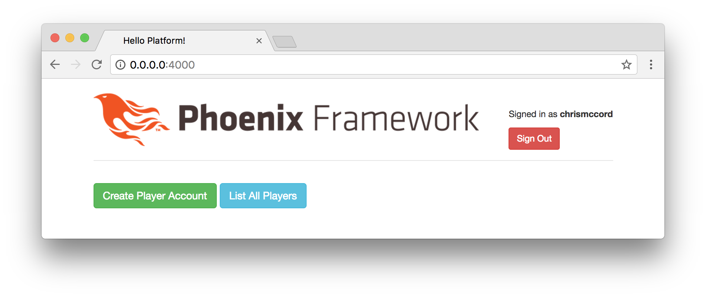

# Elm Setup

We're excited to have our back-end up and running, and we've gotten a brief
look at the Elm language. Now, let's figure out how we can write Elm code for
the front-end of our Phoenix application.

We already installed Elm globally in the last chapter, and now we can take a
look at configuring Elm with Phoenix using a tool called Brunch.

## Configuring Elm within Phoenix

Phoenix front-end files are located in the `assets` folder. Let's begin by
checking out the existing `package.json` file that Phoenix gives us by default:

```javascript
{
  "repository": {},
  "license": "MIT",
  "scripts": {
    "deploy": "brunch build --production",
    "watch": "brunch watch --stdin"
  },
  "dependencies": {
    "phoenix": "file:../deps/phoenix",
    "phoenix_html": "file:../deps/phoenix_html"
  },
  "devDependencies": {
    "babel-brunch": "6.1.1",
    "brunch": "2.10.9",
    "clean-css-brunch": "2.10.0",
    "uglify-js-brunch": "2.10.0"
  }
}
```

We can use any front-end build tool we prefer, but Phoenix comes with a
minimalist tool called [`brunch`](http://brunch.io), which we can see listed in
the `devDependencies`. You're welcome to try other options, but Brunch tends to
work well for our purposes. The initial configuration takes some work, but
afterward we'll be able to focus on development with Elixir and Elm.

Let's navigate to the `assets` folder from the command line and run the
following command to ensure our project works with the `elm` language and the
`elm-brunch` tool:

```shell
$ npm install --save-dev elm elm-brunch
```

This will add two new lines to the `devDependencies` section of our
`package.json` file.

```javascript
"devDependencies": {
  "babel-brunch": "6.1.1",
  "brunch": "2.10.9",
  "clean-css-brunch": "2.10.0",
  "elm": "^0.18.0",
  "elm-brunch": "^0.9.0",
  "uglify-js-brunch": "2.10.0"
}
```

## Updating .gitignore

The default `.gitignore` file is configured to ignore all the files that get
added to the `node_modules` folder. So our repository tracks changes to the
`package.json` file, but ignores all the files created in the `node_modules`
directory when we ran the `npm install` command.

Let's take this opportunity to update the `.gitignore` file in the root of our
`platform` project so our repository won't need to track extraneous files that
Elm will generate for us. Similar to the way that npm creates a `node_modules`
folder, Elm will generate a folder called `elm-stuff` that we can ignore.

Open the `.gitignore` file at the root of our project, and add the following
code to the bottom:

```gitignore
# Elm
/assets/elm-stuff
/assets/js/main.js
```

Now, run the following command from inside the `assets` folder of our Phoenix
project to install Elm packages:

```shell
$ elm-package install
```

It should show similar output to what we saw in the previous chapter:

```shell
$ elm-package install
Some new packages are needed. Here is the upgrade plan.

  Install:
    elm-lang/core 5.1.1
    elm-lang/html 2.0.0
    elm-lang/virtual-dom 2.0.4

Do you approve of this plan? [Y/n] Y
Starting downloads...

  ● elm-lang/html 2.0.0
  ● elm-lang/virtual-dom 2.0.4
  ● elm-lang/core 5.1.1

Packages configured successfully!
```

This command creates a new `elm-package.json` file that we need inside our
`assets` folder. And it also creates the `elm-stuff` folder that won't need to
be tracked by our repository.

This is a great location for our files, because it means we'll have collocated
our front-end files with `package.json` for any Node libraries and
`elm-package.json` for any Elm libraries we want to include.

## Elm Folder

We'll need a place to put our Elm code inside our Phoenix application. So let's
create a new folder called `elm` inside our `assets` folder. We'll use this
folder to store all of our Elm source code.

This allows us to collocate our Elm front-end code with the rest of our
front-end code. It also means that we won't need to put all of our Elm files
inside the `lib` directory, which is good because we don't want to make Phoenix
scan all these files when it recompiles our Elixir code.

The Elm source code we write will be committed to our repository, but we want
our Phoenix application to compile it to JavaScript automatically (we won't
have to work with those JavaScript output files directly).

## Main.elm

Inside our new `assets/elm` folder, let's create a new file called `Main.elm`
and add the following content:

```elm
module Main exposing (..)

import Html exposing (Html, text)


main : Html msg
main =
    text "Hello from Elm!"
```

This is a simple Elm program that will print "Hello from Elm!" in the browser
once we get everything wired together. The way it will work is that the Brunch
build tool will watch for changes to our Elm source code, and then compile the
results to a JavaScript file. So the changes we make to the
`assets/elm/Main.elm` file will be compiled to `assets/js/main.js`. To get this
up and running, we'll need to configure Brunch.

## Brunch Configuration

Inside the `assets` folder, open the `brunch-config.js` file and replace the
contents with the code below (note that the default file contains _a lot_ of
comments, but we're removing them here for brevity):

```javascript
exports.config = {
  files: {
    javascripts: { joinTo: "js/app.js" },
    stylesheets: { joinTo: "css/app.css" },
    templates: { joinTo: "js/app.js" }
  },
  conventions: { assets: /^(static)/ },
  paths: {
    watched: ["static", "css", "js", "vendor", "elm"],
    public: "../priv/static"
  },
  plugins: {
    babel: { ignore: [/vendor/] },
    elmBrunch: {
      mainModules: ["elm/Main.elm"],
      makeParameters: ["--debug"],
      outputFolder: "../assets/js"
    }
  },
  modules: {
    autoRequire: { "js/app.js": ["js/app"] }
  },
  npm: { enabled: true }
};
```

This file has been condensed quite a bit to keep it short, but the main things
to note are the `watched` paths section, and the `elmBrunch` plugin. These
configuration options are basically telling the Phoenix application where to
look for our Elm source code (`"elm/Main.elm"`), and where we'll output the
results (`"../assets/js"`). We also add a `--debug` parameter that will allow
us to use the Elm debugger while we develop our application.

## Compiling with Phoenix

We'll still need to take a few additional steps before we can render our Elm
application in the browser, but at this point we should be able to get Phoenix
to compile our Elm source code when we run the server.

Let's start up our Phoenix server with `mix phx.server`, and we should see
a message in the Terminal about how the `elm/Main.elm` file was compiled to the
`../assets/js/main.js` file.

```shell
$ mix phx.server
[info] Running PlatformWeb.Endpoint with Cowboy using http://0.0.0.0:4000
16:02:47 - info: compiled 7 files into 2 files, copied 3 in 801 ms
Elm compile: elm/Main.elm, to ../assets/js/main.js
```

## Displaying Our Elm Application

Now that Brunch is automatically compiling our Elm code in `Main.elm` to
JavaScript in `main.js`, we can find a place to display our front-end
application within Phoenix.

We'll use the same `index.html.eex` page we worked with previously. Here's
what our existing application looks like with a user signed in.



Let's replace everything below the header with our new Elm front-end. To do
this, we'll open the `lib/platform_web/templates/page/index.html.eex` and
and replace everything with a single line:

```embedded_elixir
<div id="elm-container"></div>
```

We can place our Elm application inside this container. Let's open the
`assets/js/app.js` file and add the following code at the bottom:

```javascript
// Elm
import Elm from "./main"

const elmContainer = document.querySelector("#elm-container");

if (elmContainer) {
  const elmApplication = Elm.Main.embed(elmContainer);
}
```

## Working Elm application

With our configuration finished, we now have the ability to write Elm code in
our Phoenix application! The code in our `Main.elm` file is being automatically
compiled to JavaScript using our minimal Brunch configuration, and then the
resulting Elm application is inserted into our Phoenix application.


Also note that we have our Elm debugger available to explore the history of
changes, and this will be useful as we start tracking state changes in our
application with the Elm Architecture.

## Live Reload

One of the great features is that we can keep working with Elm, and the live
reload feature will allow us to see changes without needing to restart the
server or refresh the page in the browser. Try making a small change to the
string in our `Main.elm` file:

```elm
module Main exposing (..)

import Html exposing (Html, text)


main : Html msg
main =
    text "Hello from Elm inside Phoenix!"
```

The content should be reloaded in the browser without needing a refresh (after
waiting a second or two for our code to compile).


## Summary

We've come a long way already in this book, and we now have the ability to
write code in both Elixir and Elm to create our platform. In this chapter,
we learned about configuring Elm to work inside Phoenix, and this will enable
us to start building the front-end for our application.

In the next chapter, we'll start putting together our Elm front-end
application so that we can start working with the JSON data from our API.
