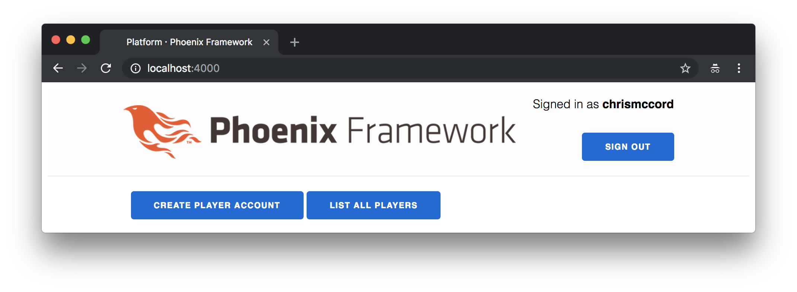

# Elm Setup

We're excited to have our back-end up and running, and we've gotten a brief
look at the Elm language. Now, let's figure out how we can write Elm code for
the front-end of our Phoenix application.

We already installed Elm globally in the last chapter, and now we can take a
look at configuring Elm with Phoenix using Webpack.

## Configuring Elm within Phoenix

Phoenix front-end files are located in the `assets` folder. Let's begin by
looking at the existing `package.json` file Phoenix gives us by default:

```javascript
{
  "repository": {},
  "license": "MIT",
  "scripts": {
    "deploy": "webpack --mode production",
    "watch": "webpack --mode development --watch"
  },
  "dependencies": {
    "phoenix": "file:../deps/phoenix",
    "phoenix_html": "file:../deps/phoenix_html"
  },
  "devDependencies": {
    "@babel/core": "^7.0.0",
    "@babel/preset-env": "^7.0.0",
    "babel-loader": "^8.0.0",
    "copy-webpack-plugin": "^4.5.0",
    "css-loader": "^0.28.10",
    "mini-css-extract-plugin": "^0.4.0",
    "optimize-css-assets-webpack-plugin": "^4.0.0",
    "uglifyjs-webpack-plugin": "^1.2.4",
    "webpack": "4.4.0",
    "webpack-cli": "^2.0.10"
  }
}
```

Phoenix comes preloaded with Webpack as the front-end build tool, which we can
see listed in the `devDependencies` above. Our initial configuration will take
some work, but afterward we'll be able to narrow our focus to developing
features with Elixir and Elm.

Let's navigate to the `assets` folder from the command line and run the
following command to ensure our project includes the `elm` compiler and the
`elm-webpack-loader` tool:

```shell
$ npm install --save elm elm-webpack-loader
```

This will add two new lines to the `dependencies` section of our
`package.json` file.

```javascript
"dependencies": {
  "elm": "^0.19.0",
  "elm-webpack-loader": "^5.0.0",
  "phoenix": "file:../deps/phoenix",
  "phoenix_html": "file:../deps/phoenix_html"
},
```

## Elm Folder

We'll need a place to put our Elm code inside our Phoenix application. So let's
create a new folder called `elm` inside our `assets` folder. We'll use this
folder to store all of our Elm source code. This also allows us to co-locate
our Elm front-end code with the rest of our front-end code.

```shell
$ cd assets
$ mkdir elm
```

The Elm source code we write will be committed to our repository, but our
Phoenix application will use Webpack and elm-webpack-loader to automatically
compile it to a JavaScript output file so we don't have to do it manually.

## Updating .gitignore

The default `.gitignore` file is configured to ignore all the files that get
added to the `node_modules` folder. So our repository tracks changes to the
`package.json` file, but ignores all the files created in the `node_modules`
directory when we ran the `npm install` command.

Let's take this opportunity to update the `.gitignore` file in the root of our
`platform` project so our repository won't need to track extraneous files that
Elm will generate for us. Similar to the way that npm creates a `node_modules`
folder, Elm will generate a folder called `elm-stuff` that we can ignore.

Open the `.gitignore` file at the root of our project, and add the following
code to the bottom:

```gitignore
# Elm
/assets/elm/elm-stuff
```

## elm init

Now, run the following command from inside the `assets/elm` folder to set up
our new Elm project within Phoenix:

```shell
$ elm init
```

It should show similar output to what we saw in the previous chapter and
generate both the `elm.json` file and a new `src` folder.

## Main.elm

Inside our new `assets/elm/src` folder, let's create a file called `Main.elm`
and add the following content:

```elm
module Main exposing (main)

import Html exposing (Html, text)


main : Html msg
main =
    text "Hello from Elm!"
```

This is a simple Elm program that will print "Hello from Elm!" in the browser
once we get everything wired together. The way it will work is that the Webpack
build tool will watch for changes to our Elm source code, and then compile the
results to a JavaScript file. First, we'll need to configure Webpack so the
changes we make to the `assets/elm/src/Main.elm` file will be compiled
automatically.

## Webpack Configuration

Inside the `assets` folder, open the `webpack.config.js` file and replace the
`rules` section with the following:

```javascript
// ...
module: {
  rules: [
    /* { test: /\.js$/ }, */
    /* { test: /\.css$/ }, */
    {
      test: /\.elm$/,
      exclude: [/elm-stuff/, /node_modules/],
      use: {
        loader: 'elm-webpack-loader',
        options: {
          cwd: path.resolve(__dirname, 'elm'),
          debug: true
          // optimize: true
        }
      }
    }
  ]
},
// ...
```

There are quite a few options we're setting here, but this gives us a good
configuration that will serve us well as we develop our Elm front-end. This
code is basically telling Webpack to look for files that end in a `.elm`
extension in the `elm` folder, and then handle them with `elm-webpack-loader`.

We're also setting an additional option at the bottom to enable the Elm
debugger by setting `debug` to `true`. I also included a commented out setting
to `optimize` assets for now. We'll want to keep the debugger available while
we work in the development environment, and then when we want to ship to
production we should remove the debugger and enable to the optimization
settings for the Elm compiler.

## Displaying Our Elm Application

We'll still need to take a few additional steps before we can render our Elm
application in the browser, but at this point we should be able to get Phoenix
to compile our Elm source code when we run the server with `mix phx.server`.

Now that Webpack is automatically compiling our Elm code in `Main.elm`, we can
find a place to display our front-end application within Phoenix.

We'll use the same `index.html.eex` page we worked with previously. Here's
what our existing application looks like with a user signed in.



Let's replace everything below the header with our new Elm front-end. To do
this, we'll open the `lib/platform_web/templates/page/index.html.eex` and
and replace everything with a single line:

```embedded_elixir
<div id="elm-container"></div>
```

Now, we can embed our Elm application inside this `div` element. Let's open the
`assets/js/app.js` file and add the following code at the bottom:

```javascript
// Elm
import { Elm } from "../elm/src/Main.elm"

Elm.Main.init({
  node: document.getElementById("elm-container");
});
```

## Working Elm application

With our configuration finished, we now have the ability to write Elm code in
our Phoenix application! The code in our `Main.elm` file is being automatically
compiled to JavaScript using our minimal Brunch configuration, and then the
resulting Elm application is inserted into our Phoenix application.


Also note that we have our Elm debugger available to explore the history of
changes, and this will be useful as we start tracking state changes in our
application with the Elm Architecture.

## Live Reload

One of the great features is that we can keep working with Elm, and the live
reload feature will allow us to see changes without needing to restart the
server or refresh the page in the browser. Try making a small change to the
string in our `Main.elm` file:

```elm
module Main exposing (..)

import Html exposing (Html, text)


main : Html msg
main =
    text "Hello from Elm inside Phoenix!"
```

The content should be reloaded in the browser without needing a refresh (after
waiting a second or two for our code to compile).


## Summary

We've come a long way already in this book, and we now have the ability to
write code in both Elixir and Elm to create our platform. In this chapter,
we learned about configuring Elm to work inside Phoenix, and this will enable
us to start building the front-end for our application.

In the next chapter, we'll start putting together our Elm front-end
application so that we can start working with the JSON data from our API.
