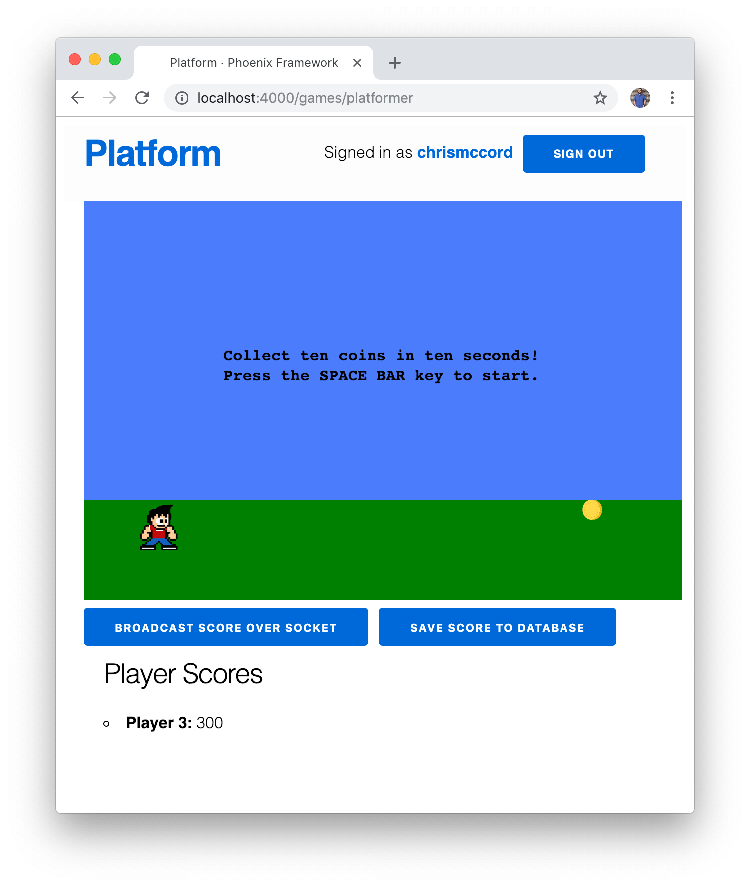

# Finishing Touches

In the past few chapters, we've managed to work with Elm ports and Phoenix
channels to give players the ability to broadcast their scores over the socket
connection and save their scores to the database.

Before we finish up with the book, let's take this chapter to improve the way
we display player scores for our game by fetching the players and gameplays
from the database.

We'll be moving quickly through some of the content in this chapter since we've
seen many of these concepts before. Be sure to refer to the **Elm API Data**
chapter for a refresher on the `Http` module and JSON decoding.

## Fetching Gameplays

We already have some experience fetching data for our Elm application from when
we were building our list of games and players in the `Main.elm` file. Let's
open the `assets/elm/src/Games/Platformer.elm` to fetch our gameplay data.
We've already created view functions at the bottom of this file so we can
display gameplays, but so far this is only working when players broadcast their
scores over the socket connection. We also want to fetch any scores that
players have saved to the database and render them in our Elm application.

We usually start with the types and our model when we make changes. In this
case, we've already created our `Gameplay` type alias, and we already have a
`gameplays` list in our model where we can store the data. So we just need to
make an HTTP request to fetch the gameplays from the database.

We'll be working with the `Http` package again, so let's go ahead and import
it at the top of our `Platformer.elm` file with the following line:

```elm
import Http
```

Then, below the `init` function, let's add an API section where we can add the
function for our request. Note that this function returns a command, which is
perfect for what we need because we want to trigger this in the `init` function
when we first start our application.

```elm
-- API

fetchGameplaysList : Cmd Msg
fetchGameplaysList =
    Http.get
        { url = "/api/gameplays"
        , expect = Http.expectJson FetchGameplaysList decodeGameplaysList
        }
```

This function allows us to make a GET request to the
`http://localhost:4000/api/gameplays` endpoint, and we'll set up the JSON
decoder functions next.

## Decoding the Gameplay JSON Data

Remember that the JSON data from our endpoint will look something like this:

```json
{
  data: [
    {
      game_id: 1,
      id: 1,
      player_id: 3,
      player_score: 300
    }
  ]
}
```

So we'll need to create a decoder that starts with the `data` list using the
`Decode.at` and `Decode.list` functions. And we wrote our `decodeGameplay`
function in the last chapter, but it's included here so we can show how the
functions work together.

```elm
decodeGameplaysList : Decode.Decoder (List Gameplay)
decodeGameplaysList =
    decodeGameplay
        |> Decode.list
        |> Decode.at [ "data" ]


decodeGameplay : Decode.Decoder Gameplay
decodeGameplay =
    Decode.map3 Gameplay
        (Decode.field "game_id" Decode.int)
        (Decode.field "player_id" Decode.int)
        (Decode.field "player_score" Decode.int)
```

To get our application up and running, we'll need to add `FetchGameplaysList`
to our `update` function. We'll start by adding it to our `Msg` type:

```elm
type Msg
    = BroadcastScore Encode.Value
    | CountdownTimer Time.Posix
    | FetchGameplaysList (Result Http.Error (List Gameplay))
    | GameLoop Float
    | KeyDown String
    | NoOp
    | ReceiveScoreFromPhoenix Encode.Value
    | SaveScore Encode.Value
    | SetNewItemPositionX Int
```

And now we can update the `case` expression inside our `update` function. When
we use the `fetchGameplaysList` function we created above, it's going to
trigger the HTTP GET request to our JSON endpoint. Then, if the fetch was
successful, we can update our `model` to include the `fetchedGameplays`. If
there's an error, we can just use `Debug.log` to print a message in the
DevTools console.

```elm
update : Msg -> Model -> ( Model, Cmd Msg )
update msg model =
    case msg of
        -- ...

        FetchGameplaysList result ->
            case result of
                Ok fetchedGameplays ->
                    ( { model | gameplays = fetchedGameplays }, Cmd.none )

                Err _ ->
                    Debug.log "Error fetching gameplays from API."
                        ( model, Cmd.none )
```

## Performing the Gameplays Fetch

Rather than adding a button with an `onClick` event like we've done in recent
chapters, we can trigger the HTTP request when our application loads.

To accomplish this, let's update our `init` function and add a new
`initialCommand` function that will trigger the `fetchGameplaysList` command
we created at the start of this chapter. We're also putting it in a `Cmd.batch`
list so we can fetch our players soon too.

```elm
initialCommand : Cmd Msg
initialCommand =
    Cmd.batch
        [ fetchGameplaysList
        ]


init : Flags -> ( Model, Cmd Msg )
init flags =
    ( initialModel flags, initialCommand )
```

If you've saved any scores to the database, we should have a successful fetch
when the game loads in the browser now.



## Fetching Players

Up to this point, we've been displaying player ID's when we show the scores at
the bottom of our game. So instead of displaying the player's name
(_Chris McCord_) or username (_chrismccord_), we've been showing _Player 3_ in
the Player Scores section.

To fix this, let's fetch all of our players from the back-end, and we'll use
those players to change the way we display our player scores with view
functions.

We'll start by creating a new type alias for `Player` records. We'll need the
`id` to associate players with their corresponding `Gameplay` records. And we'll
try to use each player's `displayName` if one exists, or we can fall back to
their `username` if they don't have one.

```elm
type alias Player =
    { displayName : Maybe String
    , id : Int
    , username : String
    }
```

Next, we can update our `Model` type and `initialModel` to include a list of
`players` that we'll fetch from the database when the game loads.

```elm
type alias Model =
    { -- ...
    , players : List Player
    }


initialModel : Flags -> Model
initialModel flags =
    { -- ...
    , players = []
    }
```

## Creating the HTTP Request and Decoders

Similar to what we did above for `gameplays`, we can add the HTTP request and
JSON decoders for `players` now too. We'll start with a new `fetchPlayersList`
function:

```elm
fetchPlayersList : Cmd Msg
fetchPlayersList =
    Http.get
        { url = "/api/players"
        , expect = Http.expectJson FetchPlayersList decodePlayersList
        }
```

Next, we can add the JSON decoders just like we did for `gameplays`. If this
all looks familiar, it's because we took a similar approach when we decoded our
list of players in the **Elm API Data** chapter. We're using `Decode.maybe` for
the `display_name` field on the back-end given that it may or may not have a
value we can use.

```elm
decodePlayersList : Decode.Decoder (List Player)
decodePlayersList =
    decodePlayer
        |> Decode.list
        |> Decode.at [ "data" ]


decodePlayer : Decode.Decoder Player
decodePlayer =
    Decode.map3 Player
        (Decode.maybe (Decode.field "display_name" Decode.string))
        (Decode.field "id" Decode.int)
        (Decode.field "username" Decode.string)
```

## Using FetchPlayersList in the Update

Next, we can adjust our `Msg` type and `update` function for
`FetchPlayersList` just like we did above for gameplays.

```elm
type Msg
    =
    -- ...
    | FetchGameplaysList (Result Http.Error (List Gameplay))
    | FetchPlayersList (Result Http.Error (List Player))
```

With that change, we can add to the `case` expression in our `update` function:

```elm
update : Msg -> Model -> ( Model, Cmd Msg )
update msg model =
    case msg of
        -- ...

        FetchPlayersList result ->
            case result of
                Ok fetchedPlayers ->
                    ( { model | players = fetchedPlayers }, Cmd.none )

                Err _ ->
                    Debug.log "Error fetching players from API."
                        ( model, Cmd.none )
```

Lastly, we can update the `initialCommand` function and it will successfully
pull all the players from the Phoenix back-end into our Elm front-end and make
them available in the `players` list as part of the Elm model.

```elm
initialCommand : Cmd Msg
initialCommand =
    Cmd.batch
        [ fetchGameplaysList
        , fetchPlayersList
        ]
```

## Showing Player Names in the View

Even though we're successfully fetching the players from the JSON endpoint,
we're still not displaying them on the page yet. Our goal is to associate our
`players` with their corresponding `gameplays` and then display the player's
name along with their score at the bottom of the page.

Let's take a look at what we came up previously for displaying gameplays with
the `viewGameplayItem` function:

```elm
viewGameplayItem : Gameplay -> Html Msg
viewGameplayItem gameplay =
    let
        displayPlayer =
            if gameplay.playerId == 0 then
                "Anonymous Player: "

            else
                "Player " ++ String.fromInt gameplay.playerId ++ ": "

        displayScore =
            String.fromInt gameplay.playerScore
    in
    li [ Html.Attributes.class "gameplay-item" ]
        [ strong [] [ text displayPlayer ]
        , span [] [ text displayScore ]
        ]
```

We can still use the code to display the player's score, but let's create a
couple of new helper functions to find players based on the gameplays we're
working with. Once we find the player we're looking for, we can use that
player to display either their `displayName` or their `userName` (or we can
fall back to displaying `"Anonymous Player"`).

Before we can get started, we need to keep in mind that we only have access
to a `gameplay` as an argument to the `viewGameplayItem` function. But we also
need to be able to access the list of players in `model.players`.

From the type signature, we can see that we have access to the model as the
first argument to the `viewGameplaysIndex` function. Let's make a slight change
at the bottom of this function so we can pass the full model along instead of
just the list of gameplays:

```elm
viewGameplaysIndex : Model -> Html Msg
viewGameplaysIndex model =
    if List.isEmpty model.gameplays then
        div [] []

    else
        div [ Html.Attributes.class "gameplays-index container" ]
            [ h2 [] [ text "Player Scores" ]
            , viewGameplaysList model
            ]
```

Next, we need to make a change to the `viewGameplaysList` function below. We're
going to be mapping through `model.gameplays`, and we'll also send the full
`model` along to the `viewGameplayItem` function as well.

```elm
viewGameplaysList : Model -> Html Msg
viewGameplaysList model =
    ul [ Html.Attributes.class "gameplays-list" ]
        (List.map (viewGameplayItem model) model.gameplays)
```

The reason this is important is that we're now going to be able to access both
the list of players (via `model.player`) and the relevant `gameplay` to display
with our `viewGameplayItem` function. Let's go ahead and update the type
signature and the arguments for our `viewGameplayItem` function now and we'll
refactor the body of the function soon.

```elm
viewGameplayItem : Model -> Gameplay -> Html Msg
viewGameplayItem model gameplay =
   -- ...
```

## Creating Helper Functions

Inside our `viewGameplayItem` function, we now have access to the full `model`
and the current `gameplay` that we want to display on the screen. And our goal
is to simply render the player names along with their scores. But how do we
associate the players with gameplays?

Let's create a helper function that we can use to filter through the list of
players to find the specific `Player` based on a given `Gameplay`. Note the
type signature here since we're going to pass the `Model` and a `Gameplay`, and
we're going to get back a `Maybe Player` since some gameplays could be
associated with anonymous players.

```elm
findPlayerWithGameplay : Model -> Gameplay -> Maybe Player
findPlayerWithGameplay model gameplay =
    model.players
        |> List.filter (\player -> player.id == gameplay.playerId)
        |> List.head
```

This will work great for our needs because we can take the result of this new
helper function and pipe it to another one to display the player's name as a
string. After adding the `findPlayerWithGameplay` helper function, let's add
another helper function called `viewPlayerName`.

This function will take a `Maybe Player` and try to return the player's
`displayName` if it exists. If it doesn't, we can use `Maybe.withDefault` to
display the player's `username` instead. If neither of those exists, it means
we're working with an anonymous player, and we'll just return an
`"Anonymous Player"` string at the bottom.

```elm
viewPlayerName : Maybe Player -> String
viewPlayerName maybePlayer =
    case maybePlayer of
        Just player ->
            Maybe.withDefault player.username player.displayName

        Nothing ->
            "Anonymous Player"
```

## Refactoring the viewGameplayItem Function

We can now use our helper functions to finish the `viewGameplayItem` function
and show both player names and their scores. All we need to do is update the
`displayPlayer` part of the `let` expression to start with the
`findPlayerWithGameplay` function and then pipe the results to
`viewPlayerName`. This gives us the player string we've been looking for (and
the only other minor change is appending `": "` to the name to add some space
between the player's name and their score value).

```elm
viewGameplayItem : Model -> Gameplay -> Html Msg
viewGameplayItem model gameplay =
    let
        displayPlayer =
            findPlayerWithGameplay model gameplay
            |> viewPlayerName

        displayScore =
            String.fromInt gameplay.playerScore
    in
    li [ Html.Attributes.class "gameplay-item" ]
        [ strong [] [ text (displayPlayer ++ ": ") ]
        , span [] [ text displayScore ]
        ]
```

And with that change we're finally able to display a list of player scores at
the bottom of our games that includes both the player's name and their score
too. For the screenshot below, we update the `chrismccord` player account we've
been using throughout the book to include a `display_name` on the back-end with
a value of `Chris McCord`. And we can see that the Elm front-end will now use
the `displayName` value to show the player score at the bottom of the page.


## Updating the Leaderboard

We've come to the end of a long journey in this book, and we've learned a ton
of valuable skills we can use for working with both Elixir and Elm. You also
have all the tools you need to extend the features of our game platform
application.

In fact, you can use all the new information from this chapter along with the
content from the rest of this book to update the leaderboard section on our
platform's home page. At the bottom of our `Main.elm` file in the
`assets/elm/src` folder, we're displaying a list of players. Your mission, if
you want to continue extending the features of our demo application, is to
aggregate the gameplays for those players and display a total score for each
player. Note that there are multiple ways to accomplish this, and it's up to
you if you want to stretch your skills on the back-end with Elixir or the
front-end with Elm.

And don't forget the full sample application for this book is
[available on GitHub](https://github.com/elixir-elm-tutorial/platform). If you
make mistakes or get lost, the code in the repository can help to guide you
back to a working condition. Feel free to be creative and consider checking out
the great documentation from both Elixir and Elm to add some additional fun
features.

## Summary

We managed to finish up with our sample application in this chapter by adding
some finishing touches to our Platformer game. We fetched both gameplays and
players from the database to improve the way we display our player scores at
the bottom of the page.

In the next chapter, we'll go over some of the features that didn't quite make
it into the content for this book along with some ideas for everyone to check
out as we continue our learning journey with Elixir and Elm.
