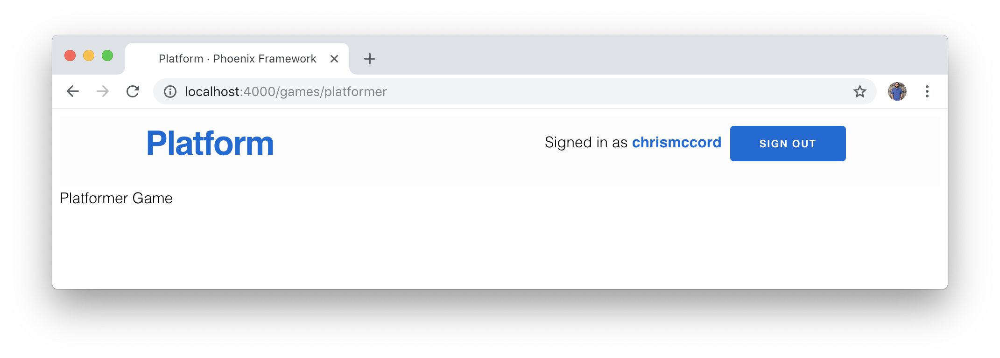
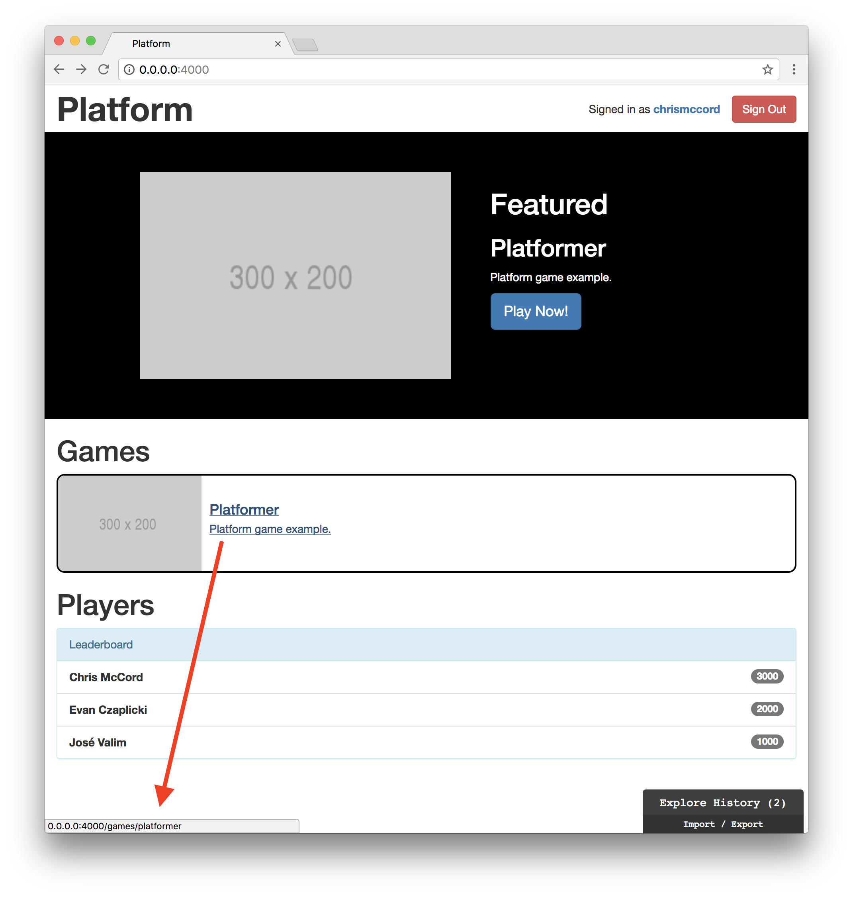

# Game Setup

We have our platform application layout in place, and we currently have a
sample "Platformer" game title to work with. But if we click the link to this
game, nothing happens yet because we haven't wired up the game routes and
configuration.

In this chapter, we'll configure our application so we can create new games
inside our `assets/elm` folder, and then load them in the browser through our
platform.

## Creating a Game File

Let's start by creating a new file for our "Platformer" game in the
`assets/elm` folder. We can use the game's title as our Elm module name, so
let's call the file `Platformer.elm` and initialize it with the following code
so we have something to display on the page:

```elm
module Platformer exposing (..)

import Html exposing (..)


main : Html msg
main =
    text "Platformer Game"
```

## Configuring Elm Brunch

Now that we have mutiple Elm source code files, we'll need to update the
`elmBrunch` section of our `brunch-config.js` file. First, we'll add
`"elm/Platformer.elm"` to the list of `mainModules`. Then, we'll add an
`outputFile` property to compile all of our Elm source code into a single
`elm.js` file.

```javascript
elmBrunch: {
  mainModules: ["elm/Main.elm", "elm/Platformer.elm"],
  makeParameters: ["--debug"],
  outputFile: "elm.js",
  outputFolder: "../assets/js"
}
```

When we run our Phoenix server, our application will compile all the Elm
source code and output it to the new `elm.js` file.

We can also include our new output file in the `.gitignore` file at the root of
our project.

```gitignore
# Elm
/assets/elm-stuff
/assets/js/elm.js
```

Feel free to delete the existing `main.js` file that's no longer needed.

## Updating app.js

With our new approach, we can now refactor our `assets/js/app.js` file. We'll
use a single `require()` statement to pull in our compiled `elm.js` output.

```javascript
// Elm
const Elm = require("./elm.js");

const elmContainer = document.querySelector("#elm-container");

if (elmContainer) Elm.Main.embed(elmContainer);
```

With the way we configured our application, we can now use `Elm` as a top-level
namespace, and then embed our code using our module names. In the code above,
we're using `Elm.Main`, and we can also use `Elm.Platformer` to work with our
new game.

```javascript
// Elm
const Elm = require("./elm.js");

const elmContainer = document.querySelector("#elm-container");
const platformer = document.querySelector("#platformer");

if (elmContainer) Elm.Main.embed(elmContainer);
if (platformer) Elm.Platformer.embed(platformer);
```

Keep in mind we haven't created the `div` element with a `#platformer` id yet.
Once we create that element, we'll be able to embed our game using
`Elm.Platformer.embed(platformer)`.

## Extending Our GameController

We've taken care of most of the tedious configuration steps. Now, let's take a
look at our `PlatformWeb.GameController` module in the
`lib/platform_web/controllers` folder. This file currently contains functions
that we use for our JSON API. What we want to do now is to basically add a new
version of the "show" function that allows us to display a page in the browser
for our games.

Below the `show/2` function, let's add a new function called `play/2`. We'll
take the same approach as we do for showing the JSON associated with a game,
but this time we'll use `"show.html"` instead.

```elixir
def show(conn, %{"id" => id}) do
  game = Products.get_game!(id)
  render(conn, "show.json", game: game)
end

def play(conn, %{"id" => id}) do
  game = Products.get_game!(id)
  render(conn, "show.html", game: game)
end
```

## Adding a Route

Now that we have our controller action, we can add a line to our router in the
`lib/platform_web/router.ex` file. We'll route to the `play/2` function in our
`GameController` based on the `:id` for each game:

```elixir
scope "/", PlatformWeb do
  pipe_through :browser

  get "/", PageController, :index
  get "/games/:id", GameController, :play
  resources "/players", PlayerController
  resources "/sessions", PlayerSessionController, only: [:new, :create, :delete]
end
```

## Creating a Template

We also need to add a new template file for our games. Inside the
`lib/platform_web/templates` folder, create a new folder called `game`. Then,
create a file called `show.html.eex` with the following line:

```embedded_elixir
<div id="<%= @game.title |> String.downcase %>"></div>
```

What we're doing here is using the game's `title` field to dynamically create
a new `div` element with an ID that matches that game's title. That allows us
to use the `document.querySelector("#platformer")` line that we used in our
`app.js` code above.

At this point, we should now have everything working well enough to see the
game being rendered in the browser!


When we visit `http://0.0.0.0:4000`, we see the Elm application we created in
`Main.elm`. And when we visit `http://0.0.0.0:4000/games/1`, we see the new
game we're going to create in `Platformer.elm`.

## Working with Slugs

Let's clean things up a little bit. Rather than working with our game's `title`
field, we can add a new field called `slug`. This will allow us to display the
game's `slug` in the URL with a few changes.

First, we'll need to create a migration to add a new field to our games. Let's
go to the command line and run the following command:

```shell
$ mix ecto.gen.migration add_slug_to_games
```

We should see the following output (bearing in mind that the timestamp on the
migration file will look slightly different on your machine):

```shell
$ mix ecto.gen.migration add_slug_to_games
* creating priv/repo/migrations
* creating priv/repo/migrations/20170913215145_add_slug_to_games.exs
```

Now, open the migration file that was generated in the `priv/repo/migrations`
folder and alter our `games` table with the new `slug` field. We'll also
create a unique index since we want slugs to be a unique identifier for our
games.

```elixir
defmodule Platform.Repo.Migrations.AddSlugToGames do
  use Ecto.Migration

  def change do
    alter table(:games) do
      add :slug, :string
    end

    create unique_index(:games, [:slug])
  end
end
```

## Updating the Schema

We can also this field to our games schema. Open the `lib/products/game.ex`
file and update the schema with the following:

```elixir
schema "games" do
  many_to_many :players, Player, join_through: Gameplay

  field :description, :string
  field :featured, :boolean, default: false
  field :slug, :string, unique: true
  field :thumbnail, :string
  field :title, :string

  timestamps()
end
```

At the bottom of that same `lib/products/game.ex` file, we'll want to add our
new field to the `cast/2` and `validated_required/1` functions (note that I
tend to alphabetize fields, but it's not entirely necessary). We'll also add a
`unique_constraint/1` function to verify that our `slug` fields are unique.

```elixir
def changeset(%Game{} = game, attrs) do
  game
  |> cast(attrs, [:description, :featured, :slug, :thumbnail, :title])
  |> validate_required([:description, :featured, :slug, :thumbnail, :title])
  |> unique_constraint(:slug)
end
```

## Updating the Seeds and Running the Migration

We should now be able to update our seed file so that our sample game also has
a `slug` field. In the `priv/repo/seeds.exs` file, update the bottom of the
file with the following:

```elixir
# Games

Products.create_game(%{title: "Platformer", slug: "platformer", description: "Platform game example.", thumbnail: "http://via.placeholder.com/300x200", featured: true})
```

We should now be able to reseed the database with our new field. From the
command line, run the following to drop the existing data, recreate the
database, run our new migration, and reseed the database with our updated seed
file:

```shell
$ mix ecto.reset
```

At the bottom of the output, we should be able to see our new `slug` field:

```shell
$ mix ecto.reset
# ...
INSERT INTO "games" ("description","featured","slug","thumbnail","title","inserted_at","updated_at") VALUES ($1,$2,$3,$4,$5,$6,$7) RETURNI
NG "id" ["Platform game example.", true, "platformer", "http://via.placeholder.com/300x200", "Platformer", {{2017, 9, 13}, {22, 6, 34, 975
867}}, {{2017, 9, 13}, {22, 6, 34, 975874}}]
```

## Fixing the Tests

Since we added a new field, we'll need to update our tests as well. At the top
of the `test/platform/products/products_test.exs` file, we can add our new
`slug` field to the attributes with the following:

```elixir
@valid_attrs %{description: "some description", featured: true, thumbnail: "some thumbnail", title: "some title", slug: "some-slug"}
@update_attrs %{description: "some updated description", featured: false, thumbnail: "some updated thumbnail", title: "some updated title", slug: "some-slug"}
@invalid_attrs %{description: nil, featured: nil, thumbnail: nil, title: nil, slug: nil}
```

Similarly, we can update
`test/platform_web/controllers/game_controller_test.exs` with the following:

```elixir
@create_attrs %{description: "some description", featured: true, thumbnail: "some thumbnail", title: "some title", slug: "some-slug"}
@update_attrs %{description: "some updated description", featured: false, thumbnail: "some updated thumbnail", title: "some updated title", slug: "some-slug"}
@invalid_attrs %{description: nil, featured: nil, thumbnail: nil, title: nil, slug: nil}
```

We should now be able to run our tests again and see them all passing!

```shell
$ mix test
..................................

Finished in 0.3 seconds
34 tests, 0 failures

Randomized with seed 455292
```

## Using Our New Slug Field

Now that we have our new `slug` field to work with, we can refactor our game
routing features.

Let's go back to the `lib/platform_web/templates/show.html.eex` file and update
the contents with the following code:

```embedded_elixir
<div id="<%= @game.slug %>"></div>
```

This means that we're creating a new `div` element on the page with the game's
`slug` as the id attribute.

## Pretty URLs

To finish getting this working, we'll need to refactor a couple more things.
We'll start with our `lib/platform/products/products.ex` file, where we can add
a new function to fetch games by their `slug` field. Below the `get_game!/1`
function, let's add a new function called `get_game_by_slug!/1`.

```elixir
def get_game!(id), do: Repo.get!(Game, id)
def get_game_by_slug!(slug), do: Repo.get_by!(Game, slug: slug)
```

Now in the `lib/platform_web/controllers/game_controller.ex` file, we can
update our existing `play/2` function to handle slugs instead of ids.

```elixir
def play(conn, %{"slug" => slug}) do
  game = Products.get_game_by_slug!(slug)
  render(conn, "show.html", game: game)
end
```

Lastly, we'll update our `lib/platform_web/router.ex` file with the following:

```elixir
scope "/", PlatformWeb do
  pipe_through :browser

  get "/", PageController, :index
  get "/games/:slug", GameController, :play
  resources "/players", PlayerController
  resources "/sessions", PlayerSessionController, only: [:new, :create, :delete]
end
```

This may seem like a lot of work (and it's admittedly tedious), but it's good
to get practice with adding fields and making changes. It's also great news,
because we now have the ability to access our games via the `slug` field in the
URL!



This will make things much easier on us as we decide to add new games to our
platform application.

## Working Links

You may have noticed that we still haven't accomplished our original goal from
the beginning of the chapter. Most of the hard work is taken care of, and now
we can make a few more changes on the front-end to get things running smoothly.

We can start by adding our new `slug` field to the JSON response for games. In
the `lib/platform_web/game_view.ex` file, update the function at the bottom
with the following:

```elixir
def render("game.json", %{game: game}) do
  %{id: game.id,
    title: game.title,
    slug: game.slug,
    description: game.description,
    thumbnail: game.thumbnail,
    featured: game.featured}
end
```

This update to the JSON response will require some quick updates to our tests
again. Open the `test/platform_web/controllers/game_controller_test.exs` file
and update the `describe` blocks for `"create game"` and `"update game"`. We
only need to add keys and values for our new `slug` field to the JSON
responses, but here are the full blocks of code for context:

```elixir
describe "create game" do
  test "renders game when data is valid", %{conn: conn} do
    conn = post conn, game_path(conn, :create), game: @create_attrs
    assert %{"id" => id} = json_response(conn, 201)["data"]

    conn = get conn, game_path(conn, :show, id)
    assert json_response(conn, 200)["data"] == %{
    "id" => id,
    "description" => "some description",
    "featured" => true,
    "thumbnail" => "some thumbnail",
    "title" => "some title",
    "slug" => "some-slug"}
  end

  test "renders errors when data is invalid", %{conn: conn} do
    conn = post conn, game_path(conn, :create), game: @invalid_attrs
    assert json_response(conn, 422)["errors"] != %{}
  end
end

describe "update game" do
  setup [:create_game]

  test "renders game when data is valid", %{conn: conn, game: %Game{id: id} = game} do
    conn = put conn, game_path(conn, :update, game), game: @update_attrs
    assert %{"id" => ^id} = json_response(conn, 200)["data"]

    conn = get conn, game_path(conn, :show, id)
    assert json_response(conn, 200)["data"] == %{
    "id" => id,
    "description" => "some updated description",
    "featured" => false,
    "thumbnail" => "some updated thumbnail",
    "title" => "some updated title",
    "slug" => "some-slug"}
  end

  test "renders errors when data is invalid", %{conn: conn, game: game} do
    conn = put conn, game_path(conn, :update, game), game: @invalid_attrs
    assert json_response(conn, 422)["errors"] != %{}
  end
end
```

## Decoding Slug Data in Elm

Now, we can go back to our main Elm front-end application in
`assets/elm/Main.elm` and decode this JSON. First, we'll add to our `Game` type
at the top:

```elm
type alias Game =
    { description : String
    , featured : Bool
    , id : Int
    , slug: String
    , thumbnail : String
    , title : String
    }
```

And now we can update our game decoder function to use `map6` and decode the
`slug` field as a string:

```elm
decodeGame : Decode.Decoder Game
decodeGame =
    Decode.map6 Game
        (Decode.field "description" Decode.string)
        (Decode.field "featured" Decode.bool)
        (Decode.field "id" Decode.int)
        (Decode.field "slug" Decode.string)
        (Decode.field "thumbnail" Decode.string)
        (Decode.field "title" Decode.string)
```

Lastly, we can finally update our `gamesListItem` function that contains the
link to our game. All we need to update in this function is our `href`
attribute.

```elm
gamesListItem : Game -> Html msg
gamesListItem game =
    a [ href <| "games/" ++ game.slug ]
        [ li [ class "game-item media" ]
            [ div [ class "media-left" ]
                [ img [ class "media-object", src game.thumbnail ] []
                ]
            , div [ class "media-body media-middle" ]
                [ h4 [ class "media-heading" ] [ text game.title ]
                , p [] [ text game.description ]
                ]
            ]
        ]
```

It works! We now have working links in our list of games, and you can hover
over the game link in the browser to see that the link points to the URL with
the slug.



## Featured Game Link

While we're here, let's go ahead and update the `featured` function in our Elm
application so that the link to our featured game works as well. This is just a
one line change to conver the `button` element to a link with an `href`
attribute, but here's the full `featured` function for context:

```elm
featured : Model -> Html msg
featured model =
    case featuredGame model.gamesList of
        Just game ->
            div [ class "row featured" ]
                [ div [ class "container" ]
                    [ div [ class "featured-img" ]
                        [ img [ class "featured-thumbnail", src game.thumbnail ] [] ]
                    , div [ class "featured-data" ]
                        [ h1 [] [ text "Featured" ]
                        , h2 [] [ text game.title ]
                        , p [] [ text game.description ]
                        , a [ class "btn btn-lg btn-primary", href <| "games/" ++ game.slug ] [ text "Play Now!" ]
                        ]
                    ]
                ]

        Nothing ->
            div [] []
```

Now our "Play Now!" button in the featured section should work as well to
access our featured game.

## Summary

This was a relatively long chapter to set up the games on our platform, but we
managed to make a ton of progress. And the good news is that now we can create
games and add them to our platform with a relatively flexible approach.

When creating new games, we'll add a new Elm file that contains the source
code. Then, we update the brunch configuration to compile it. Then, we embed
the game in the `app.js` file, and the rest should be taken care of for us.

Now that we have our platform running and a working configuration for games,
we can finally dive into creating our first game in the next chapter!
