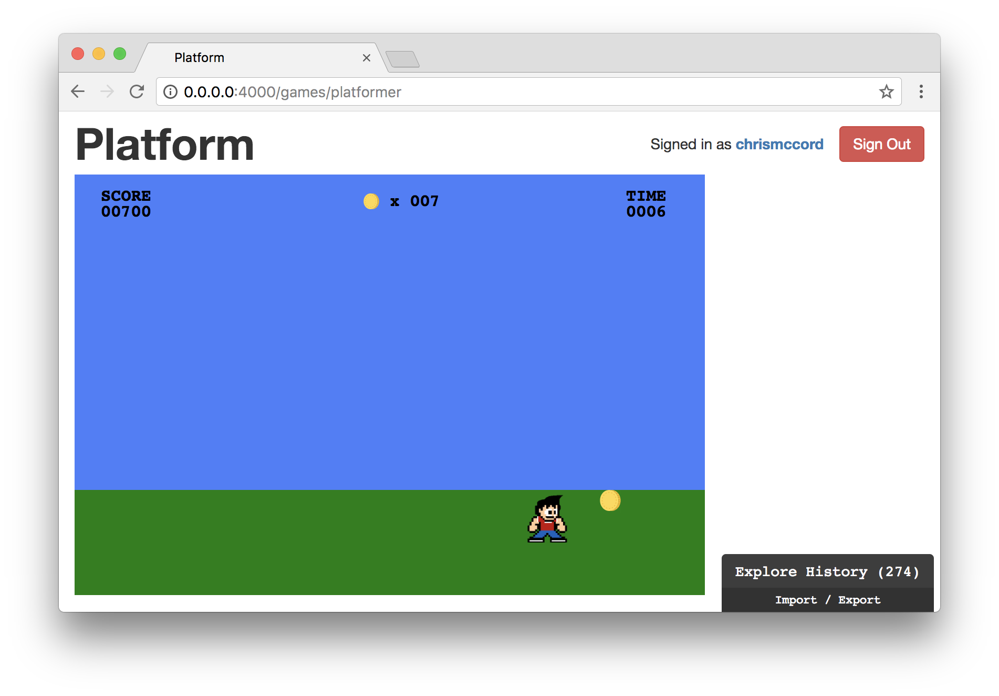

# Gameplay

We have the basic elements of our game up and running. There's a character, an
item, and simple interaction. We also have our game states set up so we can
move between a start screen, a playing state, a success screen, and a game over
screen.

How can we inject more fun into our game? It's been exciting to add interaction
and see our game taking shape, but there are some simple principles of game
design that we haven't taken into consideration yet.

In this chapter, we'll be moving away from randomness and working towards
recognizable patterns that will create a learning progression for our players.
Then, we'll begin adding level features and skills that our players can
acquire with experience.

## Learning and Skill Acquisition

As it turns out, one of the things that makes games so fun to play is the
excitement that comes from learning. As humans, we're wired to pick up on
patterns, and fun comes from learning these patterns and improving our skills
as we gain experience.

In other words, one of the reasons our game isn't much fun is that there are
no recognizable patterns built into it yet. Our items are spawning in random
locations, and it's not much fun to continue after one or two plays.

## Our First Pattern

Let's start by removing the randomness from our game. Instead, we'll be
manually creating a list of locations where our items will spawn.

Remove the `Random.generate` command from the `TimeUpdate` section, and we'll
replace it with `Cmd.none`:

```elm
TimeUpdate time ->
    if characterFoundItem model then
        ( { model
            | itemsCollected = model.itemsCollected + 1
            , playerScore = model.playerScore + 100
            , itemPositionX = spawnNewItem model.itemsCollected
            }
        , Cmd.none
        )
    -- ...
```

We can also remove `SetNewItemPositionX` from our `Msg` type (go ahead and
remove `SetNewItemPositionX` from the `update` function too):

```elm
type Msg
    = NoOp
    | KeyDown KeyCode
    | TimeUpdate Time
    | CountdownTimer Time
```

## A Quick Win

For our first level, we want players to get a quick win by collecting coins
with relative ease. Let's update the position of our first item by setting the
`itemPositionX` value right in front of the character at a value of `150`
instead of `500`.

```elm
initialModel : Model
initialModel =
    { gameState = StartScreen
    , characterPositionX = 50
    , characterPositionY = 300
    , itemPositionX = 150
    , itemPositionY = 300
    , itemsCollected = 0
    , playerScore = 0
    , timeRemaining = 10
    }
```

We want our player to learn to move around the screen in this first level. So,
we're going to create a list of integers that will serve as the `itemPositionX`
values.

```elm
levelOneItemPositions : List Int
levelOneItemPositions =
    [ 200, 250, 300, 350, 400, 450, 500, 400, 300 ]
```

Note that there are nine positions, because the first item will appear at the
default location provided in the `initialModel` (with a value of `150`). Also
keep in mind that in this section we're only going to be dealing with the "x"
position values so that items can move left and right, but the "y" position
will remain the same so the items won't move up or down.

## Arrays

We have a list of integers, but we actually want to access these values one at
a time based on their index. We tend to use the `List` data type in Elm for
collections of values, but you may be happy to find out that there is also an
[`Array`](http://package.elm-lang.org/packages/elm-lang/core/latest/Array) data
type if you're familiar with using this structure in other languages.

We can import our `Array` package that's built into the Elm core package at the
top of our file (and you can also delete the `import Random` line now that
we're no longer using it):

```elm
module Platformer exposing (..)

import AnimationFrame exposing (diffs)
import Array exposing (Array, fromList, get)
import Html exposing (Html, div)
import Keyboard exposing (KeyCode, downs)
import Svg exposing (..)
import Svg.Attributes exposing (..)
import Time exposing (Time, every, second)
```

We're going to start with our list of integers in `levelOneItemPositions`, and
then use the
[`fromList`](http://package.elm-lang.org/packages/elm-lang/core/latest/Array#fromList)
function to convert it to an array. Then, we'll be able to use the
[`get`](http://package.elm-lang.org/packages/elm-lang/core/latest/Array#get)
function to select items.

Let's refactor the `levelOneItemPositions` function with a new type signature
and implementation:

```elm
levelOneItemPositions : Array Int
levelOneItemPositions =
    Array.fromList [ 200, 250, 300, 350, 400, 450, 500, 300, 100 ]
```

Now we have an indexed array of values to select from. Let's create a new
function called `spawnNewItem` that takes in the `itemsCollected` account that
we can use as an index, and returns a new integer value we can use for the
`itemPositionX`.

```elm
spawnNewItem : Int -> Int
spawnNewItem currentItemCount =
    Array.get currentItemCount levelOneItemPositions
```

We've got the right idea, but this won't work yet because it returns a
`Maybe Int` and not just an `Int` like we're looking for. Let's refactor with
the following:

```elm
spawnNewItem : Int -> Int
spawnNewItem currentItemCount =
    case Array.get currentItemCount levelOneItemPositions of
        Just itemPosition ->
            itemPosition

        Nothing ->
            0
```

The way this will work is that we're going to use `Array.get` and pass in the
`currentItemCount` to adjust the item position. Every time the character
collects a coin item, the `itemsCollected` value gets incremented. So we can
use that value as an index and keep working our way through the list of
positions in `levelOneItemPositions`.

When we get a new position value, we just return it as `itemPosition`. If
there's nothing left in the list, we're handling our `Nothing` case by
returning `0`. When a player completes a level, we actually want to hide the
item altogether, so let's refactor this function again. We'll use a `let`
expression to push the item out of the screen with a negative value so the
player doesn't have to see a coin they can't get.

```elm
spawnNewItem : Int -> Int
spawnNewItem currentItemCount =
    let
        hiddenPosition =
            -100
    in
        case Array.get currentItemCount levelOneItemPositions of
            Just itemPosition ->
                itemPosition

            Nothing ->
                hiddenPosition
```

## Working Item Positions

Now that we have our new functions in place, we can adjust the `TimeUpdate`
function to change the `itemPositionX` value. We'll pass `model.itemsCollected`
to the `spawnNewItem` function and it will give us a new position.

```elm
TimeUpdate time ->
    if characterFoundItem model then
        ( { model
            | itemsCollected = model.itemsCollected + 1
            , playerScore = model.playerScore + 100
            , itemPositionX = spawnNewItem model.itemsCollected
            }
        , Cmd.none
        )
    -- ...
```

Try this out in the browser and see how it works. It's a super simple level
where players are essentially just learning to move to the right. Once they
arrive at the right edge of the game window, they can move back to the left
to complete the level by collecting all ten coins.



## Levels

Let's add a new level that's slightly harder to complete. For the second level,
players will still just be moving around the screen from left to right, but
the items will be placed in such a way that makes it slightly difficult to pick
them all up on the first try. In other words, if players know the pattern it
should be really easy to complete the level, but if they don't know the pattern
the timer may present a challenge.

Below the `levelOneItemPositions` function, let's create a similar function
called `levelTwoItemPositions` with a different list of values:

```elm
levelTwoItemPositions : Array Int
levelTwoItemPositions =
    Array.fromList [ 500, 300, 100, 500, 300, 100, 500, 300, 100 ]
```

The item pattern for the second level is fairly straightforward, and it's
pretty simple to move the character around in time to pick up ten coins and
complete the level. If you want to try this out in the browser, update the
`spawnNewItem` function to use `levelTwoItemPositions`:

```elm
spawnNewItem : Int -> Int
spawnNewItem currentItemCount =
    let
        hiddenPosition =
            -100
    in
        case Array.get currentItemCount levelTwoItemPositions of
            Just itemPosition ->
                itemPosition

            Nothing ->
                hiddenPosition
```

## Changing Levels

We have item positions for two levels, but we haven't written the code to
switch between levels yet.

...

## Next Levels

Now that we've got a couple of introductory levels built, we'll transition to
adding new character features that our players can learn. In order for players
to pass the next levels, they'll have to pick up on running and jumping skills.
This will require a bit of refactoring, and we'll get started in our next
chapter.
