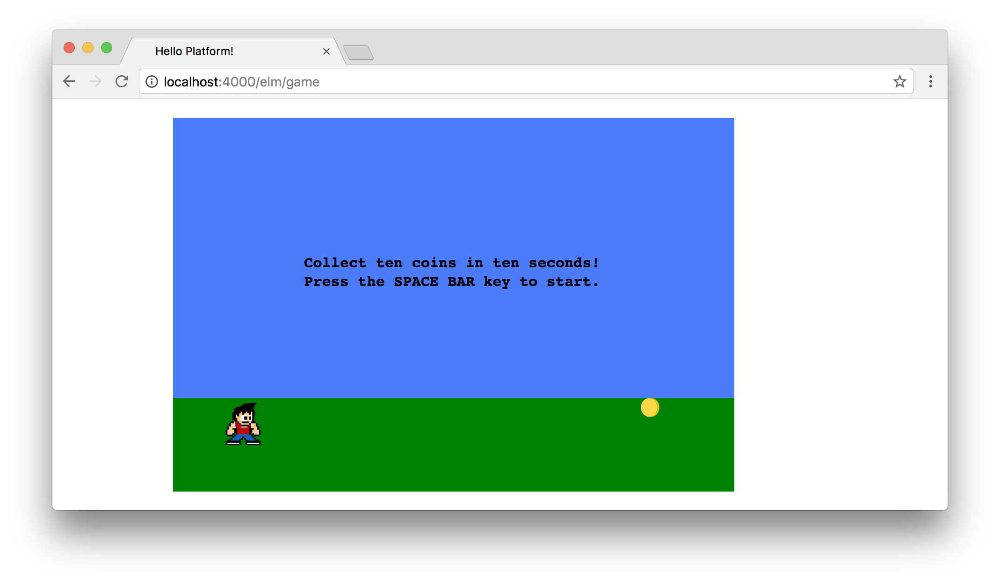
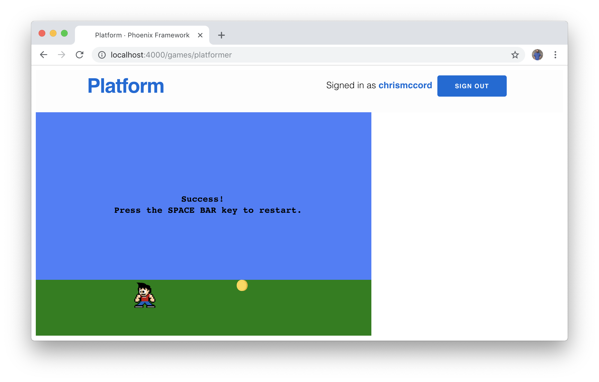
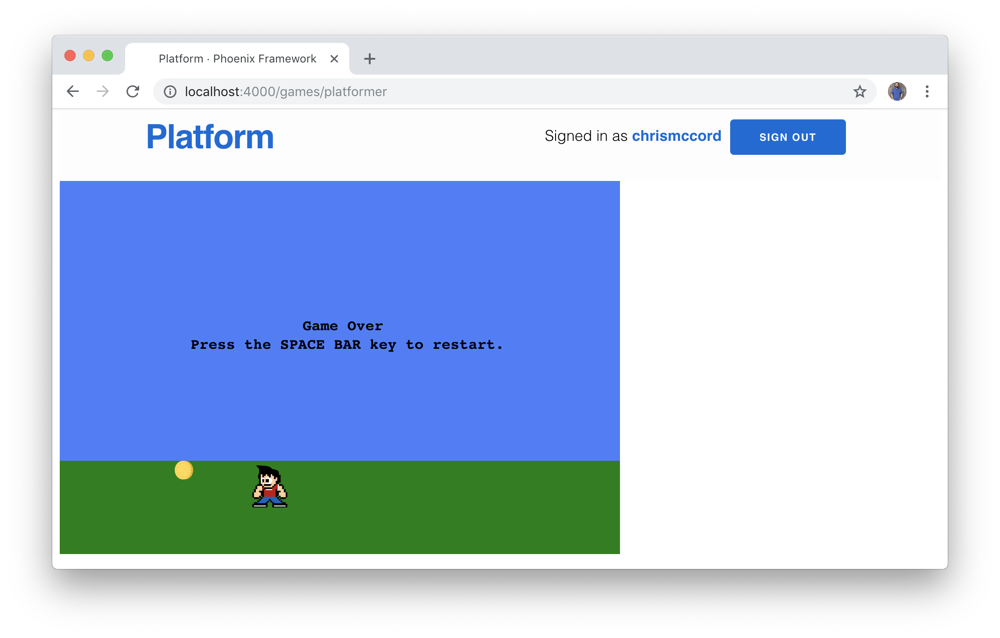

# Handling Game States

This isn't necessarily a book about game programming, so we won't have time to
delve too deeply into the topic of game design. But we still want our minigames
to be fun, and one way to do this is to be thoughtful about gameplay.

## Game State

Let's begin by thinking about how we want our game to start and how we want it
to end. It looks like our game is going to be a simple race against the clock
to collect items. We don't have some amazing plot to add yet, because we
really want to focus on the core gameplay being fun.

The starting state should be pretty straightforward. We just want a simple text
screen that appears with basic instructions, and an indicator of which key to
press to start the game.

We'll also want to add states for when the game is currently being played,
a success state for when the player wins, and a game over screen.

## Custom Types

This is a great opportunity to talk about custom types in Elm. Types can be
a helpful way to think about something that has a limited set of possible
states. In our case, we want to create a `GameState` type that handles all the
scenarios we mentioned above. You can add this type right above the `Model`
type alias:

```elm
type GameState = StartScreen | Playing | Success | GameOver
```

I like to think of custom types in this way on a single line. We're creating a
`GameState` type that has four possibilities, and it's easy to reason about.
Once the code gets formatted, it should look like this instead:

```elm
type GameState
    = StartScreen
    | Playing
    | Success
    | GameOver
```

We can use this new type in our model to indicate the game's current state.
We'll initialize the state to the game's `StartScreen`, which we'll create
soon.

```elm
type alias Model =
    { characterDirection : Direction
    , characterPositionX : Int
    , characterPositionY : Int
    , gameState : GameState
    , itemPositionX : Int
    , itemPositionY : Int
    , itemsCollected : Int
    , playerScore : Int
    , timeRemaining : Int
    }


initialModel : Model
initialModel =
    { characterDirection = Right
    , characterPositionX = 50
    , characterPositionY = 300
    , gameState = StartScreen
    , itemPositionX = 500
    , itemPositionY = 300
    , itemsCollected = 0
    , playerScore = 0
    , timeRemaining = 10
    }
```

## Adjusting the View

Now we want to update our `viewGame` function to account for the different game
states that we've created. But before we make changes to that function, let's
create a new function called `viewGameState` below it that will handle our
cases. The idea is that we'll take in the `model` as an argument, and then
we'll display a list of SVG content based on the current state of the game.

```elm
viewGameState : Model -> List (Svg Msg)
viewGameState model =
    case model.gameState of
        StartScreen ->
            []

        Playing ->
            []

        Success ->
            []

        GameOver ->
            []
```

We started with empty lists for each of these cases, but let's go ahead and
fill in the `Playing` state since we already had the content for that one.
While users are actively playing the game, we'll want them to be able to see
all the relevant view functions we created previously:

```elm
viewGameState : Model -> List (Svg Msg)
viewGameState model =
    case model.gameState of
        -- ...

        Playing ->
            [ viewGameWindow
            , viewGameSky
            , viewGameGround
            , viewCharacter model
            , viewItem model
            , viewGameScore model
            , viewItemsCollected model
            , viewGameTime model
            ]

        -- ...
```

Now we can update our `viewGame` function to reference this new function that
we just created. This might seem a bit confusing at first, but the idea is that
we're keeping the main `svg` element for our game, and then we're using the
`viewGameState` function to populate it with elements that are relevant to the
current state. Here's the new `viewGame` function:

```elm
viewGame : Model -> Svg Msg
viewGame model =
    svg [ version "1.1", width "600", height "400" ]
        (viewGameState model)
```

## Starting Screen

For the start screen, we'll still show our basic game window with the sky, the
ground, the character, and the item. And we also want to display some text to
the player to give an idea of what to do. Let's add a `viewStartScreenText`
function that will display some introductory text:

```elm
viewStartScreenText : Svg Msg
viewStartScreenText =
    Svg.svg []
        [ viewGameText 140 160 "Collect ten coins in ten seconds!"
        , viewGameText 140 180 "Press the SPACE BAR key to start."
        ]
```

Inside the `viewGameState` function, we'll add the contents of our
`StartScreen` state:

```elm
viewGameState : Model -> List (Svg Msg)
viewGameState model =
    case model.gameState of
        StartScreen ->
            [ viewGameWindow
            , viewGameSky
            , viewGameGround
            , viewCharacter model
            , viewItem model
            , viewStartScreenText
            ]

        Playing ->
            -- ...

        Success ->
            -- ...

        GameOver ->
            -- ...
```

The structure should be getting a little clearer now. We're going to keep using
the `viewGameState` function as a way to selectively show different components
of the game. In this case, we want players to start with some brief
instructions, and they'll be able to see the character and the item they'll be
pursuing.



## Space Bar to Start

The instructions mention using the space bar key to start the game, so let's
add that feature now. It will also be useful as a way to reset to default
values when we need to.

We already have a `KeyDown` message that we've been using to track keyboard
input for things like `"ArrowRight"`. We can use this same approach to handl
the space bar with `" "` (a string with a space character). Update the contents
of the `KeyDown` action with the following:

```elm
KeyDown key ->
    case key of
        "ArrowLeft" ->
            -- ...

        "ArrowRight" ->
            -- ...

        " " ->
            ( { model | gameState = Playing }, Cmd.none )

        _ ->
            -- ...
```

## Clean Starting State

If you tried things out in the browser, you might have noticed some issues with
our approach so far. The space bar works to begin our game, but the timer
starts on the `StartScreen` state instead of the `Playing` state. And players
are currently able to move the character around and collect items before the
`Playing` state is set, which could result in a confusing game experience.

Let's restrict character motion until the `gameState` is set to `Playing`. We
can handle this in the `KeyDown` section of our `update` function. We'll add a
conditional to check that we're in the `Playing` state before the left and
right arrow keys become usable.

```elm
KeyDown key ->
    case key of
        "ArrowLeft" ->
            if model.gameState == Playing then
                ( { model
                    | characterDirection = Left
                    , characterPositionX = model.characterPositionX - 15
                    }
                , Cmd.none
                )

            else
                ( model, Cmd.none )

        "ArrowRight" ->
            if model.gameState == Playing then
                ( { model
                    | characterDirection = Right
                    , characterPositionX = model.characterPositionX + 15
                    }
                , Cmd.none
                )

            else
                ( model, Cmd.none )

        " " ->
            ( { model | gameState = Playing }, Cmd.none )

        -- ...
```

We also don't want our timer to start counting down until our players are in
the active `Playing` state. Let's update the conditional check in our
`CountdownTimer` section:

```elm
CountdownTimer time ->
    if model.gameState == Playing && model.timeRemaining > 0 then
        ( { model | timeRemaining = model.timeRemaining - 1 }, Cmd.none )
    else
        ( model, Cmd.none )
```

## Success State

If a player has managed to collect ten coins before the time has expired, we
can consider the level completed and display a success message.

Let's create a new function called `viewSuccessScreenText` with the following
content:

```elm
viewSuccessScreenText : Svg Msg
viewSuccessScreenText =
    Svg.svg []
        [ viewGameText 260 180 "Success!"
        ]
```

It would be fun to add some SVG fireworks or animations here for the game's
success state. If you have time, feel free to get creative with the SVG in our
game, but for now we'll just add some text like we did for the starting screen.

Let's update the `viewGameState` function with the following:

```elm
viewGameState : Model -> List (Svg Msg)
viewGameState model =
    case model.gameState of
        StartScreen ->
            -- ...

        Playing ->
            -- ...

        Success ->
            [ viewGameWindow
            , viewGameSky
            , viewGameGround
            , viewCharacter model
            , viewItem model
            , viewSuccessScreenText
            ]

        GameOver ->
            -- ...
```

In order to trigger the success screen, we'll need to create another condition
in our `GameLoop` for when the user's score arrives at a value of `10`.
Inside the `update` function, adapt the code with the following:

```elm
GameLoop time ->
    if characterFoundItem model then
        ( { model
            | itemsCollected = model.itemsCollected + 1
            , playerScore = model.playerScore + 100
            }
        , Random.generate SetNewItemPositionX (Random.int 50 500)
        )

    else if model.itemsCollected >= 10 then
        ( { model | gameState = Success }, Cmd.none )

    else
        ( model, Cmd.none )
```

## Restarting

We also want our players to be able to restart the game without having to
refresh the page in the browser. Let's update the `viewSuccessScreenText`
function we just created to include some more text about restarting the game:

```elm
viewSuccessScreenText : Svg Msg
viewSuccessScreenText =
    Svg.svg []
        [ viewGameText 260 160 "Success!"
        , viewGameText 140 180 "Press the SPACE BAR key to restart."
        ]
```

And now we can update the space bar case in our `update` function so that
users can restart the game from the `Success` state. In fact, we can use this
opportunity to reset the values in the model to their initial values when we
restart the game. If the user isn't currently in the `Playing` state, they
can use the space bar to start the game from a clean state:

```elm
KeyDown key ->
    case key of
        -- ...

        " " ->
            if model.gameState /= Playing then
                ( { model
                    | characterDirection = Right
                    , characterPositionX = 50
                    , itemsCollected = 0
                    , gameState = Playing
                    , playerScore = 0
                    , timeRemaining = 10
                    }
                , Cmd.none
                )

            else
                ( model, Cmd.none )

        -- ...
```

At this point, we should have working states for the start screen, the active
playing state, and the success screen.



## Game Over State

We still haven't figured out what to do when the timer reaches zero and the
player hasn't collected enough coins. In this case, we'll take a similar
approach to the one we used for the success state in that we want to show some
"Game Over" text along with an option for the player to restart the game.

We'll start with a simple `viewGameOverScreenText` function for the text we
want to display:

```elm
viewGameOverScreenText : Svg Msg
viewGameOverScreenText =
    Svg.svg []
        [ viewGameText 260 160 "Game Over"
        , viewGameText 140 180 "Press the SPACE BAR key to restart."
        ]
```

Now we can finish up our `viewGameState` function by updating the
`GameOver` case:

```elm
viewGameState : Model -> List (Svg Msg)
viewGameState model =
    case model.gameState of
        StartScreen ->
            -- ...

        Playing ->
            -- ...

        Success ->
            -- ...

        GameOver ->
            [ viewGameWindow
            , viewGameSky
            , viewGameGround
            , viewCharacter model
            , viewItem model
            , viewGameOverScreenText
            ]
```

We'll also need to add another condition for when the timer reaches `0` and the
player has collected less than `10` coins. Let's update the `GameLoop`
message to set the `gameState` to `GameOver` when those conditions arise during
gameplay:

```elm
GameLoop time ->
    if characterFoundItem model then
        ( { model
            | itemsCollected = model.itemsCollected + 1
            , playerScore = model.playerScore + 100
          }
        , Random.generate SetNewItemPositionX (Random.int 50 500)
        )

    else if model.itemsCollected >= 10 then
        ( { model | gameState = Success }, Cmd.none )

    else if model.itemsCollected < 10 && model.timeRemaining == 0 then
        ( { model | gameState = GameOver }, Cmd.none )

    else
        ( model, Cmd.none )
```

Users are now able to reach the `GameOver` screen when time runs out, and they
can restart the game by pressing the space bar key.



## Summary

Our game is starting to take shape! We now have working game states, so players
can see a start screen, play the game, view a success state, and also restart
from the game over screen.

Ideally we'd like to add a lot more features for our game. But now that we have
a game with a working scoring mechanism, let's switch gears and work on
integrating our game with the Phoenix back-end.
