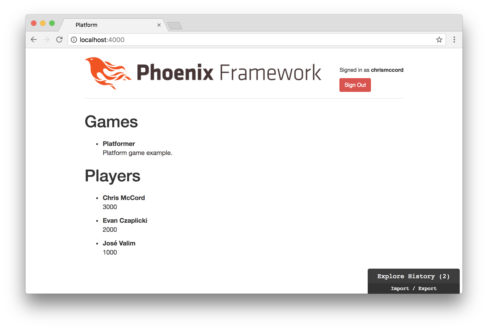
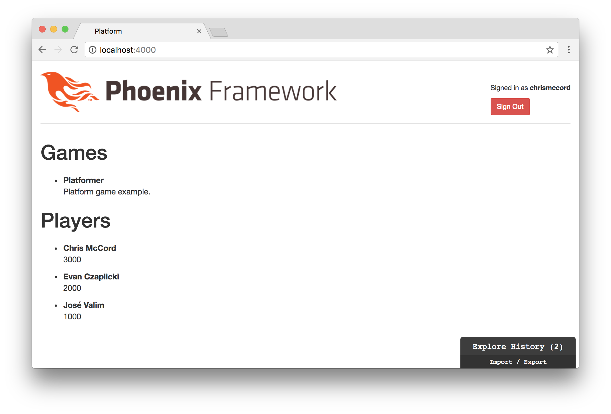
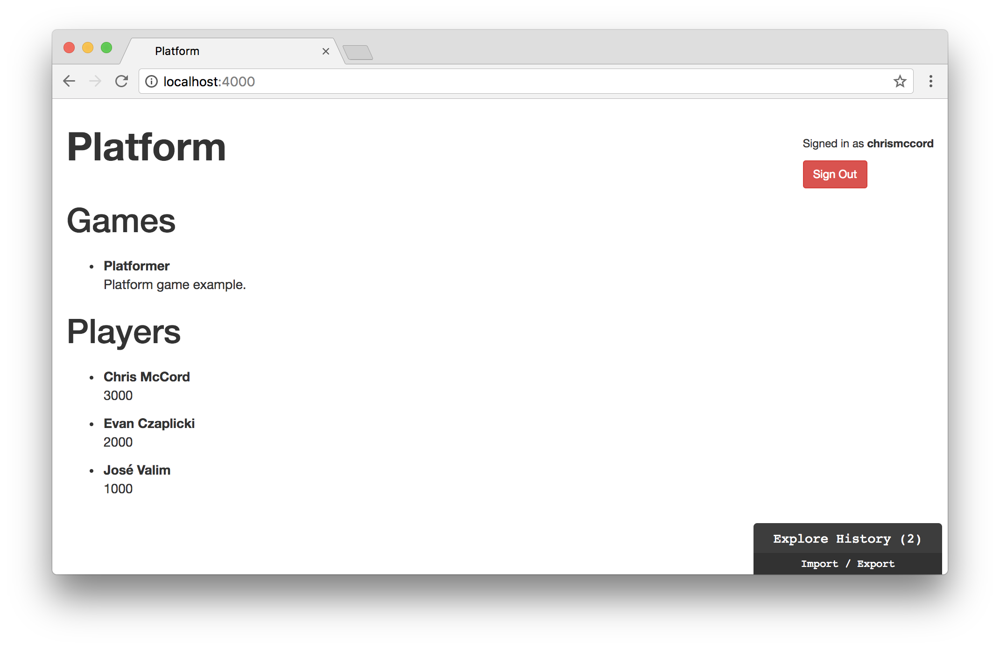
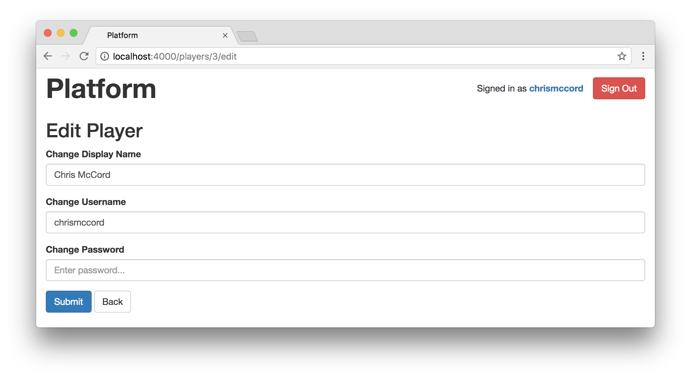
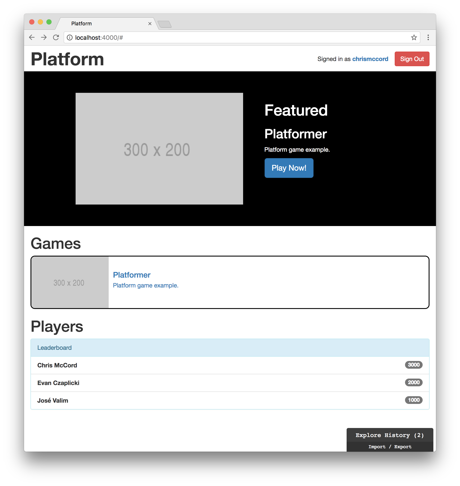

# Layout and Design

Although this isn't a book about design, our application could certainly
benefit from an effort to make it more usable and nicer to look at. The author
is admittedly not a strong designer, but we'll do the best we can to improve
the styling and usability for our platform application.

## Pages

Let's start by taking a look at all the different pages we've created for our
application.

- Home Page (`/`)
- Players
  - Players Index Page (`/players`)
  - Players Index JSON Page (`/api/players`)
  - New Player Page (`/players/new`)
  - Show Player Page (`/players/:id`)
  - Show Player JSON Page (`/api/players/:id`)
  - Edit Player Page (`/players/:id/edit`)
- Games
  - Games Index JSON Page (`/api/games`)
  - Games Index Page (`/api/games`)
- Sessions
  - Player Sign In Page (`/sessions/new`)

Phoenix allows you to see a similar list of routes by running a mix command.
Inside the root folder of our platform project, try running the following from
the command line:

```shell
$ mix phx.routes
```

This can be useful to see the paths available, the HTTP requests associated
with them, and the controller actions as well. Here's what the output should
look like:

```shell
$ mix phx.routes
          page_path  GET     /                  PlatformWeb.PageController :index
        player_path  GET     /players           PlatformWeb.PlayerController :index
        player_path  GET     /players/:id/edit  PlatformWeb.PlayerController :edit
        player_path  GET     /players/new       PlatformWeb.PlayerController :new
        player_path  GET     /players/:id       PlatformWeb.PlayerController :show
        player_path  POST    /players           PlatformWeb.PlayerController :create
        player_path  PATCH   /players/:id       PlatformWeb.PlayerController :update
                     PUT     /players/:id       PlatformWeb.PlayerController :update
        player_path  DELETE  /players/:id       PlatformWeb.PlayerController :delete
player_session_path  GET     /sessions/new      PlatformWeb.PlayerSessionController :new
player_session_path  POST    /sessions          PlatformWeb.PlayerSessionController :create
player_session_path  DELETE  /sessions/:id      PlatformWeb.PlayerSessionController :delete
    player_api_path  GET     /api/players       PlatformWeb.PlayerApiController :index
    player_api_path  GET     /api/players/:id   PlatformWeb.PlayerApiController :show
    player_api_path  POST    /api/players       PlatformWeb.PlayerApiController :create
    player_api_path  PATCH   /api/players/:id   PlatformWeb.PlayerApiController :update
                     PUT     /api/players/:id   PlatformWeb.PlayerApiController :update
    player_api_path  DELETE  /api/players/:id   PlatformWeb.PlayerApiController :delete
          game_path  GET     /api/games         PlatformWeb.GameController :index
          game_path  GET     /api/games/:id     PlatformWeb.GameController :show
          game_path  POST    /api/games         PlatformWeb.GameController :create
          game_path  PATCH   /api/games/:id     PlatformWeb.GameController :update
                     PUT     /api/games/:id     PlatformWeb.GameController :update
          game_path  DELETE  /api/games/:id     PlatformWeb.GameController :delete
```

We can simplify the pages we need for our application now that we're using Elm
display our lists of players and games, but first we'll start with our default
Phoenix layout and home page.

## Phoenix Layout

The template that contains our default Phoenix layout is located in the
`lib/platform_web/templates/layout` folder, and it's called `app.html.eex`. We
worked with this file briefly when we added our initial authentication
features in the header section. Let's open that file and take a look at the
contents (note that the content has been trimmed for readability):

```embedded_elixir
<!DOCTYPE html>
<html lang="en">
  <head>
    <!-- ... -->
    <title>Platform</title>
    <link rel="stylesheet" href="<%= static_path(@conn, "/css/app.css") %>">
  </head>

  <body>
    <div class="container">
      <header class="header"><!-- ... --></header>
      <!-- ... -->
      <main role="main"><!-- ... --></main>
    </div> <!-- /container -->
    <script src="<%= static_path(@conn, "/js/app.js") %>"></script>
  </body>
</html>
```

We can see that our `<title>` and stylesheets (`"/css/app.css"`) are loaded in
the `<head>` section. For the purposes of this book, I'm going to continue
using the generic name "Platform" for our application, but feel free to get
creative and change the `<title>` tag as you see fit.

```html
<title>Platform</title>
```

You can see the change in the browser tab if you adjust the title and load the
page:



## Bootstrap

Inside our `<body>` tag, we create a `<div>` element with the `container`
class. Phoenix comes preloaded with [Bootstrap](http://getbootstrap.com) by
default, and this class is the reason our application is centered on the page.

Let's change this class to `container-fluid` so we can use the full width of
the page.

```html
<body>
  <div class="container-fluid">
    <!-- ... -->
  </div>
</body>
```

Notice how the layout of our application changes as we switch to a fluid
container:



## Logo

Instead of displaying the Phoenix logo in our header, let's display a simple
link that we can use to navigate back to our home page.

Here's the line that's currently being used to apply a `logo` class and render
the default Phoenix logo:

```html
<span class="logo"></span>
```

We can replace this with a Phoenix
[`link`](https://hexdocs.pm/phoenix_html/Phoenix.HTML.Link.html#link/2) that
routes back to our home page with `page_path(@conn, :index)`. We'll keep it
simple with the `"Platform"` text, and we're still going to apply the `logo`
class so we can adjust the styles.

```embdedded_elixir
<%= link "Platform", to: page_path(@conn, :index), class: "logo" %>
```

Next, open up the `phoenix.css` file inside the `assets/css` folder and we'll
scroll down to find the `/* Custom page header */` section.

Let's remove the `.header` CSS declaration that's adding a thin line beneath
our header section. Then, we'll adjust the `.logo` CSS declaration so we can
remove our Phoenix background image and style the `"Platform"` text in our
link:

```css
/* Custom page header */
.logo {
  text-decoration: none;
  font-weight: bold;
  font-size: 3em;
  color: #333;
}

.logo:hover {
  text-decoration: none;
}
```

This gives us a working link we can use to reload the home page:



## app.css

You've gotten a chance to look at some of the styles that Phoenix gives us in
the `phoenix.css` file. For the rest of this chapter, let's work with the
`app.css` file that's also located inside the `assets/css` folder. In fact,
let's remove all the custom CSS declarations at the bottom of the `phoenix.css`
file and migrate the few we'll need to `app.css`.

In other words, we'll leave all the minified Bootstrap CSS code in our
`phoenix.css` file. But we'll delete all the custom CSS declarations from the
bottom, and our `app.css` file should just look like this:

```css
/* This file is for your main application css. */

/* Phoenix flash messages */
.alert:empty { display: none; }

/* Custom page header */
.logo {
  text-decoration: none;
  font-weight: bold;
  font-size: 3em;
  color: #333;
}

.logo:hover {
  text-decoration: none;
}
```

This will allow us to add all of our styles to the `app.css` file and we won't
have to bounce between files.

## Featured Section

Now that we've updated our header section, let's move below that and back into
our Elm application where we handle our game data. Beneath the header, we're
going to add a "featured" section where we can feature a game that stands out
from the rest of the content.

Let's open up our `Main.elm` file in the `assets/elm` folder, and we'll update
the `view` function while adding a new `featured` function just below it:

```elm
view : Model -> Html Msg
view model =
    div []
        [ featured model
        , gamesIndex model
        , playersIndex model
        ]


featured : Model -> Html msg
featured model =
    div [ class "row featured" ]
        [ h1 [] [ text "Featured" ] ]
```

Note that we added a `featured` class so we can use CSS to style this section.
The `row` class comes from Bootstrap, and allows this section to stretch to the
full width of the window. Open up the `app.css` file where we can add custom
CSS for our application, and add the following:

```css
/* Featured section */
.featured {
  height: 360px;
  background-color: black;
  color: white;
}
```

## Featured Game Data

Let's split our "featured" section into two parts and pull in our game data. On
the left side, we'll display a screenshot of our game using the featured game's
`thumbnail` field. On the right side, we'll display the game `title`, the game
`description`, and a call to action button that says "Play Now!" for users to
start playing the game.

For the first step, let's find a featured game to work with. Create a function
called `featuredGame` that takes in a list of games (`List Game`) and returns
the first featured game if there is one (`Maybe Game`). We can use this to pass
in our full list of games and then use `List.filter` to narrow down to the ones
that have `.featured` set to a `True` value. Then, we use `List.head` to return
the first game if there is one.

```elm
featuredGame : List Game -> Maybe Game
featuredGame games =
    games
        |> List.filter .featured
        |> List.head
```

Now we can use this new function in our `featured` function to display the data
from our featured game. We can use a `case` expression to show our featured
section when our `featuredGame` function returns a game for us to work with.
Otherwise, we'll just render an empty `div` element if there are no featured
games.

This is a great example of where `Maybe` is so powerful, because our
application won't compile unless we handle both of these possibilities where we
may or may not have a featured game to work with. In other languages and
frameworks, we might forget to handle situations where we have no featured game
data, and we wouldn't actually find out until our application threw an error.

```elm
featured : Model -> Html msg
featured model =
    case featuredGame model.gamesList of
        Just game ->
            div [ class "row featured" ]
                [ h1 [] [ text "Featured" ] ]

        Nothing ->
            div [] []
```

Let's break up our featured section into a `featured-img` section for the left
side and a `featured-data` section for the right side.

```elm
featured : Model -> Html msg
featured model =
    case featuredGame model.gamesList of
        Just game ->
            div [ class "row featured" ]
                [ div [ class "container" ]
                    [ div [ class "featured-img" ]
                        [ img [ class "featured-thumbnail", src game.thumbnail ] [] ]
                    , div [ class "featured-data" ]
                        [ h1 [] [ text "Featured" ]
                        , h2 [] [ text game.title ]
                        , p [] [ text game.description ]
                        , button [ class "btn btn-lg btn-primary" ] [ text "Play Now!" ]
                        ]
                    ]
                ]

        Nothing ->
            div [] []
```

Note that we're adding quite a few class names so we can use CSS to style each
element. And we're rendering our game data using `game.thumbnail`,
`game.title`, and `game.description`.

Let's add a couple of CSS declarations to clean things up. Open the `app.css`
file and we'll add the following to our featured CSS declarations:

```css
/* Featured section */
.featured {
  height: 360px;
  background-color: black;
  color: white;
}

.featured-img {
  margin-top: 50px;
  margin-right: 50px;
  float: left;
}

.featured-thumbnail {
  height: 260px;
}

.featured-data {
  margin-top: 50px;
  overflow: hidden;
}
```

This applies spacing and sizing to our featured thumbnail image, and floats it
to the left so that our text data will appear on the right. We also apply an
`overflow` property to our game data so that it won't spill out of the featured
section on smaller screens.

These aren't the fanciest of styles, but our featured game section works well
for now:


## Authentication Section

You may have noticed that our authentication information at the top right of
the window doesn't look great. Let's open our `app.html.eex` file and we'll
make a few more changes. We'll change the classes we're using for our buttons,
and we'll display our "Signed in" text with a new class too:

```embedded_elixir
<header class="header">
  <nav role="navigation">
    <ul class="nav nav-pills pull-right">
    <%= if @current_user do %>
        <p class="navbar-text">Signed in as <strong><%= @current_user.username %></strong></p>
        <%= link "Sign Out", to: player_session_path(@conn, :delete, @current_user), method: "delete", class: "btn navbar-btn btn-danger" %>
    <% else %>
        <%= link "Sign Up", to: player_path(@conn, :new), class: "btn navbar-btn btn-success" %>
        <%= link "Sign In", to: player_session_path(@conn, :new), class: "btn navbar-btn btn-primary" %>
    <% end %>
    </ul>
  </nav>
  <%= link "Platform", to: page_path(@conn, :index), class: "logo" %>
</header>
```

We can add a quick and dirty CSS rule so that our nav elements at the top right
of the window look okay and don't break our layout on small screens:

```css
.nav {
  margin-top: 6px;
  max-height: 50px;
  overflow: hidden;
}
```

Next, let's allow the currently signed in player to edit their account. Update
the `nav` element with the following:

```embedded_elixir
<nav role="navigation">
  <ul class="nav nav-pills pull-right">
    <%= if @current_user do %>
      <p class="navbar-text">
        Signed in as
        <strong><%= link @current_user.username, to: player_path(@conn, :edit, @current_user) %></strong>
      </p>
      <span><%= link "Sign Out", to: player_session_path(@conn, :delete, @current_user), method: "delete", class: "btn navbar-btn btn-danger" %></span>
    <% else %>
      <%= link "Sign Up", to: player_path(@conn, :new), class: "btn navbar-btn btn-success" %>
      <%= link "Sign In", to: player_session_path(@conn, :new), class: "btn navbar-btn btn-primary" %>
    <% end %>
  </ul>
</nav>
```

This adds a link for the current user to access their **Edit Player** page and
change their account. Keep in mind that we still haven't restricted access to
pages, so users can technically edit each other's accounts. We'll fix this in
an upcoming chapter, but for now let's keep moving.



## List of Games

For our list of games, it looks like Bootstrap has a
[media object component](https://getbootstrap.com/docs/3.3/components/#media)
that will work well for our needs.

We'll add a `media-list` class to our list of games, and then we'll use
`media-left` for the thumbnail and `media-body` for the text information. Feel
free to take a look at the examples in the Bootstrap documentation if you're
interested in tinkering around with the styles for our application.

We also want to wrap the each game in a link tag so that the clickable area is
large for users to click on and access the game. We don't have a game to send
users to yet, so we're just adding `href "#"` for now.

```elm
gamesList : List Game -> Html msg
gamesList games =
    ul [ class "games-list media-list" ] (List.map gamesListItem games)


gamesListItem : Game -> Html msg
gamesListItem game =
    a [ href "#" ]
        [ li [ class "game-item media" ]
            [ div [ class "media-left" ]
                [ img [ class "media-object", src game.thumbnail ] []
                ]
            , div [ class "media-body media-middle" ]
                [ h4 [ class "media-heading" ] [ text game.title ]
                , p [] [ text game.description ]
                ]
            ]
        ]
```

Bootstrap takes care of most of the heavy lifting for us, but let's add a
couple of custom styles to the `app.css` file. Add the following CSS code to
style our list of games:

```css
/* Games section */
.game-item {
  margin-bottom: 15px;
  border: 2px solid black;
  border-radius: 10px;
}

.media-object {
  height: 120px;
}
```

## List of Players

Lastly, let's style our list of players into a leaderboard. Bootstrap has a
[panel component](https://getbootstrap.com/docs/3.3/components/#panels) that we
can use to wrap around our player list. Then, we can use the
[list group component](https://getbootstrap.com/docs/3.3/components/#list-group)
to display each player along with their current score.

Update the `playersList` function and `playersListItem` function with the
following and Bootstrap will take care of the rest of the styling for us:


```elm
playersList : List Player -> Html msg
playersList players =
    div [ class "players-list panel panel-info" ]
        [ div [ class "panel-heading" ] [ text "Leaderboard" ]
        , ul [ class "list-group" ] (List.map playersListItem players)
        ]


playersListItem : Player -> Html msg
playersListItem player =
    li [ class "player-item list-group-item" ]
        [ strong [] [ text player.displayName ]
        , span [ class "badge" ] [ text (toString player.score) ]
        ]
```

Looks like this works well for us. We've got our sorted list of players
displaying inside a leaderboard with their display names and scores.



## Summary

This book is primarily focused on working with Elixir and Elm, but this chapter
was a fun aside into seeing how we can still use a familiar approach to styling
with CSS and Bootstrap within the context of a Phoenix application.

We have our Phoenix API up and running, and our Elm application is pulling in
all the sample data. Let's move on to creating a game with Elm and pulling
everything together!
