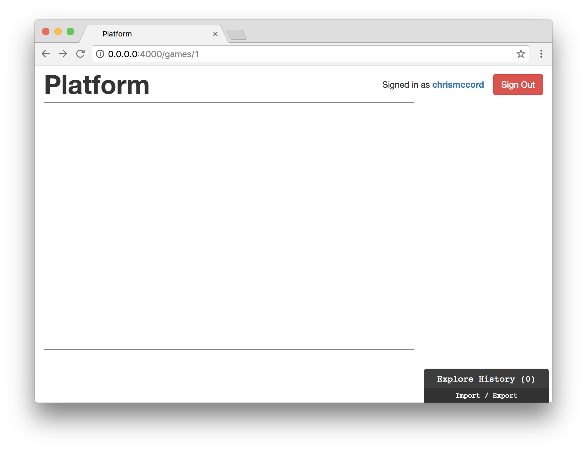
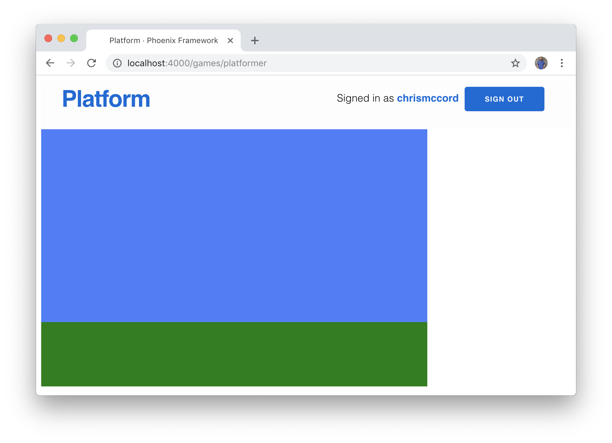
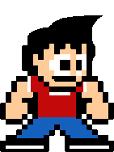
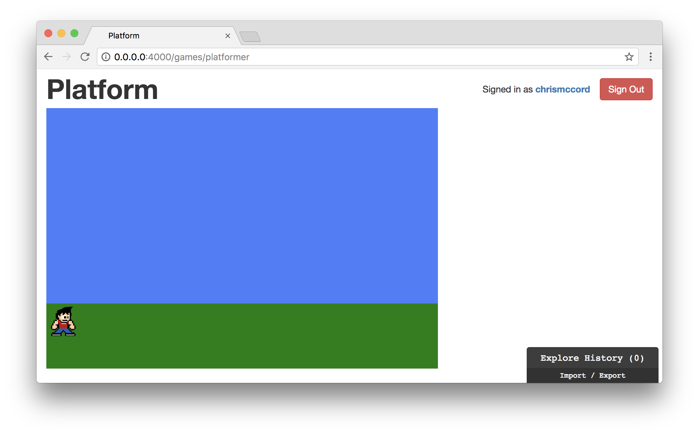
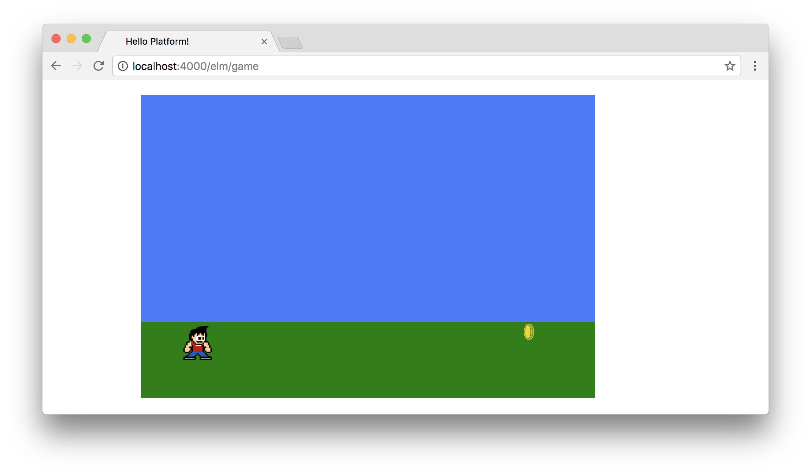

# Our First Game

Let's start creating our first minigame with Elm. We want to begin with
something small and simple that still has the characteristics we want for all
of our games.

Our initial game should be small, self-contained, interactive, and fun. And
we'll also want to add a simple scoring mechanism so we can work towards
tracking player scores and sending that data to our back-end platform.

We have our platform running with a sample game file to work with, and now we
can focus on writing the actual game. In the next sections, we're going to set
up our Elm application, add SVG for our game's background, create a little
character, and wire up the keyboard for interaction.

## Base Application for Our Game

We've already got some experience in the preceding chapters with the Elm
Architecture, so we're not going to cover it in great detail here. Instead,
we're going to start by pasting in the following code, which will give us some
starter code to work with. Add the following to the `Platformer.elm` file:

```elm
module Games.Platformer exposing (main)

import Browser
import Html exposing (Html, div, text)

-- MAIN

main =
    Browser.element
        { init = init
        , update = update
        , subscriptions = subscriptions
        , view = view
        }

-- MODEL

type alias Model =
    {}

initialModel : Model
initialModel =
    {}

init : () -> ( Model, Cmd Msg )
init _ =
    ( initialModel, Cmd.none )

-- UPDATE

type Msg
    = NoOp

update : Msg -> Model -> ( Model, Cmd Msg )
update msg model =
    case msg of
        NoOp ->
            ( model, Cmd.none )

-- SUBSCRIPTIONS

subscriptions : Model -> Sub Msg
subscriptions model =
    Sub.none

-- VIEW

view : Model -> Html Msg
view model =
    div []
        [ text "Elm Game Base" ]
```

There are different conventions for setting up Elm applications, but this is a
minimal base application that I like to start with.

We have all the things we need to get started:

- minimal imports.
- a `main` function to wire everything together.
- an empty `Model` type and `init` function.
- a default `update` function with a "NoOp" placeholder case that allows us
  to perform no operation. This may seem confusing at first, but it's helpful
  to have a default message to work with before we start updating our model.
- an intitial `subscriptions` function that starts with `Sub.none`.
- a simple `view` with a container `div` and some text that we can see to
  ensure that our application is working.

## Creating a Game Canvas

Before we can add our game character, we need to create a window where our hero
(or heroine) can live. Let's start using SVG to create our game world.

In order to work with Elm's SVG library, we'll need to install the package and
import it into our project.

From the command line, let's switch to the `assets/elm` folder and
run the following command:

```shell
$ elm install elm/svg
```

After agreeing to install the package by entering the `Y` key, here's the
output we should see:

```shell
$ elm install elm/svg
Here is my plan:

  Add:
    elm/svg    1.0.1

Would you like me to update your elm.json accordingly? [Y/n]: Y
Starting downloads...

  ● elm/svg 1.0.1

Dependencies ready!
```

Now that we have the package installed, let's import it at the top of our
`Platformer.elm` file. We'll import all the `Svg` functions (with
`exposing (..)`) along with all the `Svg.Attributes` functions since we'll be
using so many of them to create our game. We'd normally be more selective about
which functions we want to import into our application, but it turns out we're
going to need a lot of SVG elements and attributes for a game, so we're
simplifying things in this book to avoid having to import new functions one at
a time. Also, keep in mind that many of the functions from the `Html` and `Svg`
modules share a name. We're limiting our `Html` imports significantly (to just
`Html` and `div`) so we don't run into naming issues.

Update the top of your `Platformer.elm` file with the following import code:

```elm
module Games.Platformer exposing (main)

import Browser
import Html exposing (Html, div)
import Svg exposing (..)
import Svg.Attributes exposing (..)
```

## Setting Up a Game Window

Now we can create a small window to use for our game. We're going to create
a rectangle that has a `600px` width and a `400px` height. The rectangle will
reside inside our SVG element, and that will reside inside our HTML code.

You don't need to type this code in, but here's an HTML visualization that
might help conceptualize how we'll lay out the elements on our page:

```html
<html>
  <body>
    <div>
      <svg>
        <!-- We'll create our game inside this rectangle. -->
        <rect>
      </svg>
    </div>
  </body>
</html>
```

Even though we're using SVG for our game, we still want to nest it inside an
HTML document with a container `div` element. The reason for this is that we
might want to add HTML elements outside the game, or we could even add multiple
minigames to a single page if we wanted to.

Also, don't worry too much if you're unfamiliar with SVG. If you have
experience working with HTML elements and attributes and values, then it's easy
to pick up. There are some quirks to working with SVG, but we'll learn what we
need to learn to start creating our Elm games so we can keep moving. Feel free
to take a look online, though, because there are some great SVG learning
materials and courses available. The
[SVG documentation from MDN](https://developer.mozilla.org/en-US/docs/Web/SVG)
is always helpful as a searchable reference, and the
[package documentation](https://package.elm-lang.org/packages/elm/svg/latest)
for `elm/svg` is also helpful.

Let's add our SVG code to the Elm view, and we'll walk through how it all fits
together. At the bottom of the `Platformer.elm` file, add the following:

```elm
view : Model -> Html Msg
view model =
    div []
        [ viewGame ]


viewGame : Svg Msg
viewGame =
    svg [ version "1.1", width "600", height "400" ]
        [ viewGameWindow ]


viewGameWindow : Svg Msg
viewGameWindow =
    rect
        [ width "600"
        , height "400"
        , fill "none"
        , stroke "black"
        ]
        []
```

We start with a `div` element at the top, which will contain our `svg` element.
The `svg` element will contain the `rect` element that serves as our small game
window. Note that we need to add the same `width` and `height` for both of
these elements, or else we'd run the risk that the size of our rectangle might
exceed the size of our surrounding `svg` element.

Lastly, we add a `stroke` attribute to see a `"black"` line around our game
window, and a `fill` attribute with an initial value of `"none"`.



## Adding the Sky and the Ground

Now that we have an empty canvas to work with, let's add a sky and a ground
for our game world. Just like we did for our game window rectangle, we'll use
two more `rect` elements to represent a beautiful blue sky and some green
grass for the ground.

Add the following code to see our game world start taking shape:

```elm
viewGame : Svg Msg
viewGame =
    svg [ version "1.1", width "600", height "400" ]
        [ viewGameWindow
        , viewGameSky
        , viewGameGround
        ]


viewGameWindow : Svg Msg
viewGameWindow =
    rect
        [ width "600"
        , height "400"
        , fill "none"
        , stroke "black"
        ]
        []


viewGameSky : Svg Msg
viewGameSky =
    rect
        [ x "0"
        , y "0"
        , width "600"
        , height "300"
        , fill "#4b7cfb"
        ]
        []


viewGameGround : Svg Msg
viewGameGround =
    rect
        [ x "0"
        , y "300"
        , width "600"
        , height "100"
        , fill "green"
        ]
        []
```



Note that the width for all of our rectangles is the same. But we adjust the
height so that the ground takes up the bottom 25% of the window and the sky
takes up the top 75% of the window. Then we use the `x` and `y` attributes to
move our SVG shapes to the correct placement.

We haven't added our character or interaction yet, but our tiny game world is
starting to come to life!

## Creating Our Character

We have a few options for adding a small character to our game:

- Create a small SVG rectangle shape that represents the character. This option
  isn't as fun, but it's a quick way to get something on the page and keep
  moving.
- Use an existing character image from the web. Check out free sites like
  opengameart.org for assets, or if you're not planning on releasing your
  game publicly then you can search Google for character sprites from your
  favorite games and use those. If you choose this option, be sure to look for
  characters that have a transparent background. And you may need to resize the
  images you find to fit properly within the game we'll be creating.
- Draw your own character with piskelapp.com. It's a lot of fun, but it's also
  difficult and it may be more worthwhile to use something else for now while
  we build our initial minigame.

Keep in mind that we're using a static, motionless character image for now, and
we don't need to add running or jumping animations yet. In other words, we'll
still want to add keyboard interaction soon so that we can move our character
around the screen, but the character itself won't be animating while we move it
around.

While writing this chapter, I ended up experimenting with creating a pixel art
character using piskelapp.com. You're welcome to use this asset, which is
[available in the GitHub repository](https://github.com/elixir-elm-tutorial/elixir-elm-tutorial-book/tree/master/manuscript/images/our_first_game/character.gif)
for this book. Feel free to create your own asset, or choose another one from
the web. Just make sure you download the image file you want to use, and we'll
import it into our application next.



## Importing Our Character

Now that we have our character asset, let's import it into our game. When using
Phoenix, we can add images to the `assets/static/images` folder and they'll be
available from anywhere in our application (this is how the `phoenix.png` image
was displayed on the default start page when we first started our Phoenix
server). Let's move our `character.gif` file inside that folder. This will make
our character image available at `/images/character.gif`.

At the bottom of our `Platformer.elm` file, we can now add to the view to render our
new game character:

```elm
viewCharacter : Svg Msg
viewCharacter =
    image
        [ xlinkHref "/images/character.gif"
        , x "1"
        , y "300"
        , width "50"
        , height "50"
        ]
        []
```

And we'll need to update our `viewGame` function so that it invokes our new
view function:

```elm
viewGame : Svg Msg
viewGame =
    svg [ version "1.1", width "600", height "400" ]
        [ viewGameWindow
        , viewGameSky
        , viewGameGround
        , viewCharacter
        ]
```

With the `viewCharacter` function, we're creating an SVG `image` element with
a `width` and `height` of `"50"` pixels. We're also hard-coding the `x` and
`y` attributes to set the initial character position inside the grass area of
our game window. We can use the `x` attribute to move our character left and
right, and we can use the `y` attribute to move our character up and down.



## Changing the Character Position

Let's refactor our `viewCharacter` function to make it easier to work with the
character position. The SVG attributes need to work with strings as values, but
for our purposes it's more helpful to think of the character's position in
number values. We can use Elm's `let` expressions to refactor.

Instead of manually setting the `x` attribute to a value of `"1"`, let's hoist
that value up to a `let` expression assignment:

```elm
viewCharacter : Svg Msg
viewCharacter =
    let
        characterPositionX =
            1
    in
        image
            [ xlinkHref "/images/character.gif"
            , x (toString characterPositionX)
            , y "300"
            , width "50"
            , height "50"
            ]
            []
```

Our code works the same as it did before, but now we can start thinking about
our `characterPositionX` value in numbers instead of strings. Let's go ahead
and do the same for the `y` attribute:

```elm
viewCharacter : Svg Msg
viewCharacter =
    let
        characterPositionX =
            1

        characterPositionY =
            300
    in
        image
            [ xlinkHref "/images/character.gif"
            , x (toString characterPositionX)
            , y (toString characterPositionY)
            , width "50"
            , height "50"
            ]
            []
```

Our code is still working the same way, we're just moving things around to
make things easier to work with and reason about.

## Updating the Model

Since our character position is something that will change, let's move it to
our model instead of hard-coding it in our view functions.

Let's update the type alias for our `Model` as well as the values in the
`initialModel`:

```elm
type alias Model =
    { characterPositionX : Int
    , characterPositionY : Int
    }


initialModel : Model
initialModel =
    { characterPositionX = 1
    , characterPositionY = 300
    }
```

Now, we'll have to pass our model through the view functions so we can access
those values in the right places. Our `view` function already takes `model`
as an argument, so we can pass that along to the `viewGame` function like this:

```elm
view : Model -> Html Msg
view model =
    div [] [ viewGame model ]
```

Then, we'll update both the type annotation and function declaration for
`viewGame` so it takes `model` as an argument and passes it along to the
`viewCharacter` function at the bottom.

```elm
viewGame : Model -> Svg Msg
viewGame model =
    svg [ version "1.1", width "600", height "400" ]
        [ viewGameWindow
        , viewGameSky
        , viewGameGround
        , viewCharacter model
        ]
```

This works well for our needs, because it means we can pass the model data as
it changes to the `viewCharacter` function, which allows us to keep changing
the character's position.

Let's go ahead and update the `viewCharacter` function. We'll accept `model` as
an argument, and that means we'll be able to access any value directly from our
model. That also simplifies our code, because we won't need the `let`
expression anymore. Update the `viewCharacter` function with the following:

```elm
viewCharacter : Model -> Svg Msg
viewCharacter model =
    image
        [ xlinkHref "/images/character.gif"
        , x (toString model.characterPositionX)
        , y (toString model.characterPositionY)
        , width "50"
        , height "50"
        ]
        []
```

At this point, we have working data from the model that's being rendered to the
view. Let's move our character slightly to the right on the screen by
increasing the `characterPositionX` value to `50` in the `initialModel`:

```elm
initialModel : Model
initialModel =
    { characterPositionX = 50
    , characterPositionY = 300
    }
```


## Adding an Item

Our character is looking pretty lonely in our minigame world. Let's add an item
to our world, and then we'll work towards having our character be able to pick
up the item in the next chapter.

We're going to follow many of the same steps we did for our character image, so
we'll move quickly in this section. First, let's add a `coin.svg` image to our
project to use as our item.

The `coin.svg` asset we'll be using is
[available in the GitHub repository](https://github.com/elixir-elm-tutorial/elixir-elm-tutorial-book/tree/master/manuscript/images/our_first_game/coin.svg)
for this book.

Let's move our `coin.svg` file inside the `assets/static/images` folder just
like we did for our character image, which will make it available at
`/images/coin.svg`.

Now we can update our model to set a position for the new item:

```elm
type alias Model =
    { characterPositionX : Int
    , characterPositionY : Int
    , itemPositionX : Int
    , itemPositionY : Int
    }


initialModel : Model
initialModel =
    { characterPositionX = 50
    , characterPositionY = 300
    , itemPositionX = 500
    , itemPositionY = 300
    }
```

Then, we can update our `viewGame` function and create a new `viewItem`
function that takes in a `model` argument and returns some SVG code to render:

```elm
viewGame : Model -> Svg Msg
viewGame model =
    svg [ version "1.1", width "600", height "400" ]
        [ viewGameWindow
        , viewGameSky
        , viewGameGround
        , viewCharacter model
        , viewItem model
        ]
```

Keep in mind that the order of our view functions doesn't matter, but it's
still a good idea to group similar functions. Add the following below the
`viewCharacter` function:

```elm
viewItem : Model -> Svg Msg
viewItem model =
    image
        [ xlinkHref "/images/coin.svg"
        , x (toString model.itemPositionX)
        , y (toString model.itemPositionY)
        , width "20"
        , height "20"
        ]
        []
```

We essentially took the same approach for our character and our new coin item.
The only difference is that we moved the coin item to the right of the screen
and altered the `width` and `height` attributes so that the item is smaller
than our character.

This is what our results should look like so far:



## Summary

We managed to accomplish a lot in this chapter. We created a space for our
first game, set up an initial SVG game world, added a character, and added an
item. But keep in mind that we've been hard-coding a lot of values in our quest
to get something up and running. In the next chapter, we'll be taking a look at
Elm subscriptions as a way to handle keyboard input and add interaction to our
game.
