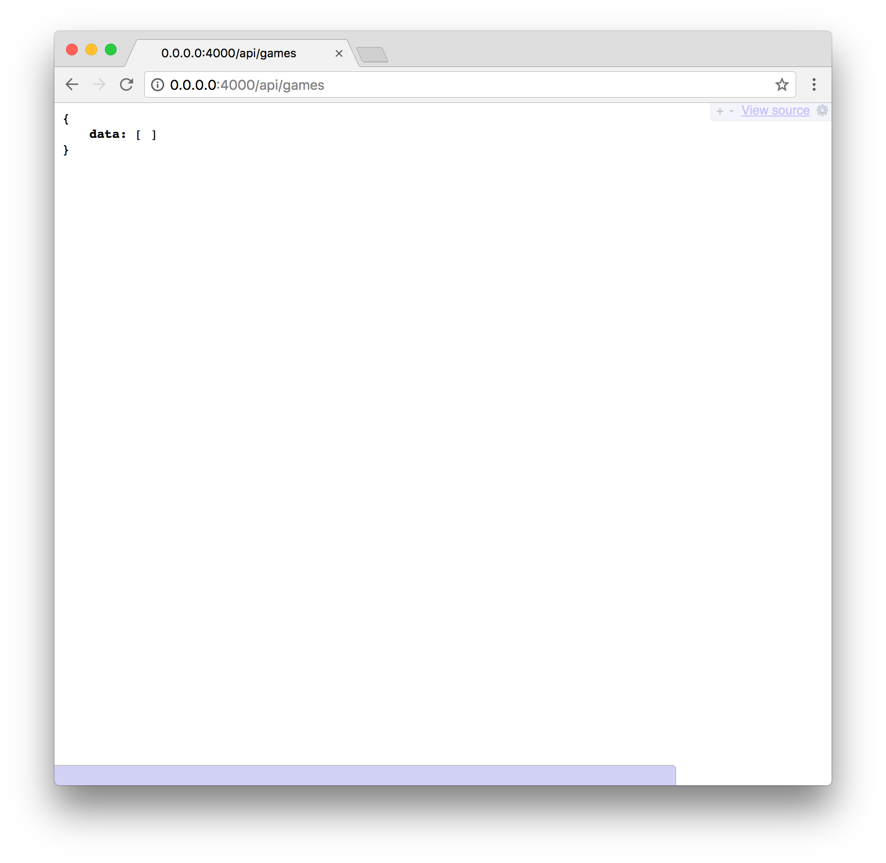
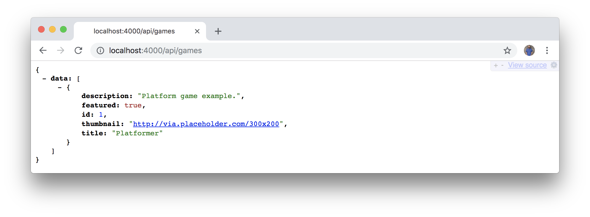
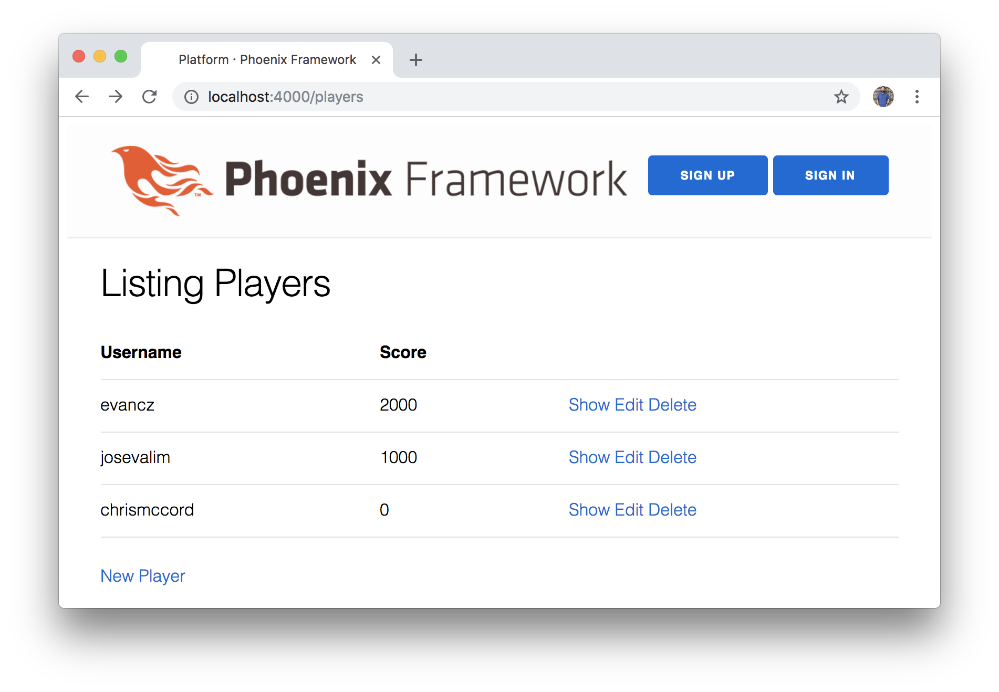
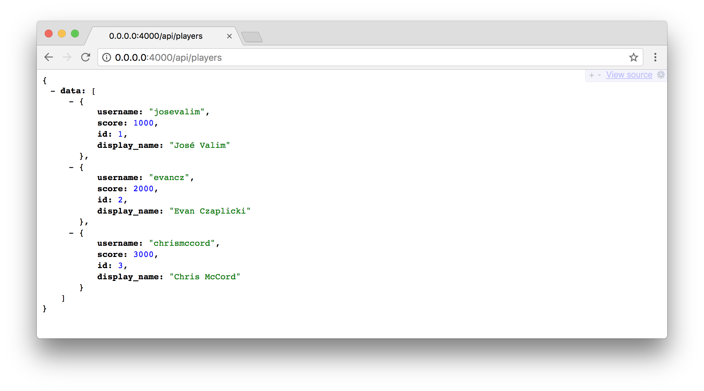

# Phoenix API and Ecto Relationships

We now have players for our gaming platform, but we don't have any games yet.
We're going to create an Elm application for our front-end that will display
our lists of players and games, but first let's create the back-end JSON API.
And we'll find a way to establish relationships between our players and games
so that we can model our data properly.

## Generating the JSON API

Let's begin by creating an endpoint for our games. We want each game to have
fields for `title`, `description`, `thumbnail`, and `featured`. These fields
will allow us to display a list of games for players to choose from, and the
`featured` field will be a simple boolean value we can use to feature
particular games in a special section. We can also add other fields later, but
this will be a good start.

We'll run the Phoenix generator from the command line to get started:

```shell
$ mix phx.gen.json Products Game games title:string description:string thumbnail:string featured:boolean
```

This is similar to the way we created our players resource, but this time we're
using
[`phx.gen.json`](https://hexdocs.pm/phoenix/Mix.Tasks.Phx.Gen.Json.html)
instead of
[`phx.gen.html`](https://hexdocs.pm/phoenix/Mix.Tasks.Phx.Gen.Html.html).

Also note that we're keeping our contexts intentionally abstract in this book.
Although we're building features that are specific to our gaming domain
(`players` and `games`), we want to be able to adapt this same material for
other uses too. We're using the `Accounts` context for our `players` and the
`Products` context for our `games`, and we could easily use these same concepts
to the domain of a bookstore where our `Accounts` might be `readers` and our
`Products` could be `books`.

Here's what the output should look like when we run the generator for our new
games resource:

```shell
$ mix phx.gen.json Products Game games title:string description:string thumbnail:string featured:boolean
* creating lib/platform_web/controllers/game_controller.ex
* creating lib/platform_web/views/game_view.ex
* creating test/platform_web/controllers/game_controller_test.exs
* creating lib/platform_web/views/changeset_view.ex
* creating lib/platform_web/controllers/fallback_controller.ex
* creating lib/platform/products/game.ex
* creating priv/repo/migrations/20170826154100_create_games.exs
* creating lib/platform/products/products.ex
* injecting lib/platform/products/products.ex
* creating test/platform/products/products_test.exs
* injecting test/platform/products/products_test.exs

Add the resource to your :api scope in lib/platform_web/router.ex:

    resources "/games", GameController, except: [:new, :edit]

Remember to update your repository by running migrations:

    $ mix ecto.migrate
```

Let's hold off on running the Ecto migration, because we'll want to make a few
changes in the next sections first.

## API Routing

We'll need to follow the instructions that Phoenix provides for us. Open up the
`lib/platform_web/router.ex` file. Instead of adding to the browser scope like
we did previously, we're going to add this resource to the `/api` scope. This
means our two scopes will look like this:

```elixir
scope "/", PlatformWeb do
  pipe_through :browser

  get "/", PageController, :index
  resources "/players", PlayerController
  resources "/sessions", PlayerSessionController, only: [:new, :create, :delete]
end

scope "/api", PlatformWeb do
  pipe_through :api

  resources "/games", GameController, except: [:new, :edit]
end
```

## Establishing Relationships

We also want to establish a relationship from our `games` table to our
`players` table. To accomplish this, we'll start with the migration that was
created for us in the `priv/repo/migrations/20170826144626_create_games.exs`
file (bearing in mind that your file will have a different name since the
filenames have a datetime associated with them):

```elixir
defmodule Platform.Repo.Migrations.CreateGames do
  use Ecto.Migration

  def change do
    create table(:games) do
      add :title, :string
      add :description, :string
      add :thumbnail, :string
      add :featured, :boolean, default: false, null: false

      timestamps()
    end

  end
end
```

We can see that we're creating a new table called `games` in our database
with the `create table(:games)` syntax.

We also want to form an association from our `players` table to our new `games`
table. So we're going to create a new table called `gameplays` that will store
a `game_id` as a reference to the `games` table, a `player_id` as a reference
to the `players` table, and a `player_score` that will track a player's score
for the current play through the game.

Let's update the `change/0` function in our migration to include the following:

```elixir
defmodule Platform.Repo.Migrations.CreateGames do
  use Ecto.Migration

  def change do
    create table(:games) do
      add :title, :string
      add :description, :string
      add :thumbnail, :string
      add :featured, :boolean, default: false, null: false

      timestamps()
    end

    create table(:gameplays) do
      add :game_id, references(:games, on_delete: :nothing), null: false
      add :player_id, references(:players, on_delete: :nothing), null: false
      add :player_score, :integer

      timestamps()
    end
  end
end
```

Before we run our migration, let's take a look at the schema files for players
and games. And we'll manually create a new schema for our gameplays.

## Updating the Schemas

First, open the `lib/platform/accounts/player.ex` file, and let's update our
schema with the following:

```elixir
schema "players" do
  many_to_many :games, Game, join_through: Gameplay

  field :display_name, :string
  field :password, :string, virtual: true
  field :password_digest, :string
  field :score, :integer
  field :username, :string

  timestamps()
end
```

We'll also need to add two `alias` lines above:

```elixir
alias Platform.Products.Game
alias Platform.Products.Gameplay
```

This means that we're establishing a
[`many_to_many`](https://hexdocs.pm/ecto/Ecto.Schema.html#many_to_many/3)
relationship between our `players` and `games`, and that we're joining these
through the `Gameplay` module that we'll be creating shortly.

Next, we'll do something similar for the `lib/platform/products/game.ex` file.
We'll add our two `alias` lines at the top:

```elixir
alias Platform.Products.Gameplay
alias Platform.Accounts.Player
```

Then, we'll add our `many_to_many` relationship between our `games` and our
`players` through the `Gameplay` module.

```elixir
schema "games" do
  many_to_many :players, Player, join_through: Gameplay

  field :description, :string
  field :featured, :boolean, default: false
  field :thumbnail, :string
  field :title, :string

  timestamps()
end
```

## Creating a New Schema

Finally, we'll create a schema file for our new table. Create a new file called
`gameplay.ex` inside the `lib/platform/products` folder.

```elixir
defmodule Platform.Products.Gameplay do
  use Ecto.Schema
  import Ecto.Changeset
  alias Platform.Products.Gameplay
  alias Platform.Products.Game
  alias Platform.Accounts.Player

  schema "gameplays" do
    belongs_to :game, Game
    belongs_to :player, Player

    field :player_score, :integer, default: 0
  end

  @doc false
  def changeset(%Gameplay{} = gameplay, attrs) do
    gameplay
    |> cast(attrs, [:game, :player, :player_score])
    |> validate_required([:game, :player, :player_score])
  end
end
```

Our new schema follows the same general structure as the other ones we were
just working with, but has a couple of new items. We created our `alias` lines
at the top just as we did previously. For our new `gameplays` schema, we're
creating [`belongs_to`](https://hexdocs.pm/ecto/Ecto.Schema.html#belongs_to/3)
relationships so that each gameplay will have just one `player` and one `game`.
We also include a `default` value for our `player_score` field. In our
`changeset/2` function, we also make sure to require all of these fields.

## Running Our Migration

We can now run our migration to update the database with `mix ecto.migrate`.
This creates tables for both `games` and `gameplays`.

```shell
$ mix ecto.migrate
17:17:22.048 [info]  == Running Platform.Repo.Migrations.CreateGames.change/0 forward
17:17:22.048 [info]  create table games
17:17:22.053 [info]  create table gameplays
17:17:22.059 [info]  == Migrated in 0.0s
```

Lastly, we'll run our tests to make sure everything is still working:

```shell
$ mix test
..................................

Finished in 0.4 seconds
34 tests, 0 failures

Randomized with seed 724771
```

It's great that we have 34 passing tests. Granted, these were created by the
Phoenix generators, but it gives us some level of confidence that our
application is working when the tests are passing.

## Trying Out our JSON API

Let's start up our Phoenix server with `mix phx.server`.

For our players resource, we were using URLs like `http://0.0.0.0:4000/players`
to access the templates. But now that we added a JSON resource, we'll need to
use `/api` in our URLs. Try to access `http://0.0.0.0:4000/api/games` in the
browser. We shouldn't see an error, but we also don't have any game data to
display yet (note that your browser might display JSON data differently):



## Adding Data Seeds

We can't interact with our game resources the same way we did with players,
because we're only working with JSON and don't have any HTML pages to view.

Let's update our database for both our players and our games so we have some
sample data to work with. Add the following to the bottom of the
`priv/repo/seeds.ex` file:

```elixir
# Aliases

alias Platform.Accounts
alias Platform.Products

# Players

Accounts.create_player(%{display_name: "José Valim", username: "josevalim", password: "josevalim", score: 1000})
Accounts.create_player(%{display_name: "Evan Czaplicki", username: "evancz", password: "evancz", score: 2000})
Accounts.create_player(%{display_name: "Chris McCord", username: "chrismccord", password: "chrismccord", score: 3000})

# Games

Products.create_game(%{title: "Platformer", description: "Platform game example.", thumbnail: "http://via.placeholder.com/300x200", featured: true})
```

Assuming we don't have any local data that we want to keep, we can use this
file to reseed the database with `mix ecto.reset`. This task will drop the
existing database, create a new one, run migrations, and then seed the
database with our sample data. Our full output will look something like this:

```shell
$ mix ecto.reset
The database for Platform.Repo has been dropped
The database for Platform.Repo has been created

18:15:28.202 [info]  == Running Platform.Repo.Migrations.CreatePlayers.change/0 forward
18:15:28.202 [info]  create table players
18:15:28.211 [info]  == Migrated in 0.0s
18:15:28.251 [info]  == Running Platform.Repo.Migrations.AddFieldsToPlayerAccounts.change/0 forward
18:15:28.251 [info]  alter table players
18:15:28.254 [info]  create index players_username_index
18:15:28.256 [info]  == Migrated in 0.0s
18:15:28.278 [info]  == Running Platform.Repo.Migrations.CreateGames.change/0 forward
18:15:28.278 [info]  create table games
18:15:28.283 [info]  create table gameplays
18:15:28.290 [info]  == Migrated in 0.0s
# ...
```

Now that we have some data, we should be able to restart the server and reload
the `http://0.0.0.0:4000/api/games` URL in our browser to see the results:



## Player API

We had previously been using the browser to work with our player accounts. But
since we're transitioning to an API for our games, we'll also want to make our
players resource accessible as JSON too.

Let's create a new controller in the `lib/platform_web/controllers` folder.
We'll call the file `player_api_controller.ex` and then add the following
contents:

```elixir
defmodule PlatformWeb.PlayerApiController do
  use PlatformWeb, :controller

  alias Platform.Accounts
  alias Platform.Accounts.Player

  action_fallback PlatformWeb.FallbackController

  def index(conn, _params) do
    players = Accounts.list_players()
    render(conn, "index.json", players: players)
  end

  def create(conn, %{"player" => player_params}) do
    with {:ok, %Player{} = player} <- Accounts.create_player(player_params) do
      conn
      |> put_status(:created)
      |> put_resp_header("location", player_path(conn, :show, player))
      |> render("show.json", player: player)
    end
  end

  def show(conn, %{"id" => id}) do
    player = Accounts.get_player!(id)
    render(conn, "show.json", player: player)
  end

  def update(conn, %{"id" => id, "player" => player_params}) do
    player = Accounts.get_player!(id)

    with {:ok, %Player{} = player} <- Accounts.update_player(player, player_params) do
      render(conn, "show.json", player: player)
    end
  end

  def delete(conn, %{"id" => id}) do
    player = Accounts.get_player!(id)
    with {:ok, %Player{}} <- Accounts.delete_player(player) do
      send_resp(conn, :no_content, "")
    end
  end
end
```

This may look like a lot of code, but we're essentially copying the same thing
that the Phoenix generators gave us for our games API and making small
adjustments so that we can work with accounts and players instead of products
and games.

We'll also want to update our `lib/platform_web/router.ex` file with the new
resource:

```elixir
scope "/api", PlatformWeb do
  pipe_through :api

  resources "/players", PlayerApiController, except: [:new, :edit]
  resources "/games", GameController, except: [:new, :edit]
end
```

To finish making our players accessible via a JSON API, we need to add a view.
Create a file named `player_api_view.ex` inside the `lib/platform_web/views`
folder and add the following content:

```elixir
defmodule PlatformWeb.PlayerApiView do
  use PlatformWeb, :view
  alias PlatformWeb.PlayerApiView

  def render("index.json", %{players: players}) do
    %{data: render_many(players, PlayerApiView, "player.json")}
  end

  def render("show.json", %{player: player}) do
    %{data: render_one(player, PlayerApiView, "player.json")}
  end

  def render("player.json", %{player_api: player_api}) do
    %{id: player_api.id,
      username: player_api.username,
      display_name: player_api.display_name,
      score: player_api.score}
  end
end
```

This code is similar to what we have in the `game_view.ex` file. When we load
the `http://0.0.0.0:4000/api/players` URL, we're using `render_many/3` to list
all the players. When we only want to show a single player, we can use a URL
like `http://0.0.0.0:4000/api/players/1` that will use `render_one/3` to only
display a single user's JSON data. At the bottom, we're creating a function
that returns a map with all our player data. We can add or remove fields here
whenever we want to adjust the fields that are accessible via the JSON API.

This is all great news because it means we can still use the
`http://0.0.0.0:4000/players` URL to access our list of players in the browser,
and we can use `http://0.0.0.0:4000/api/players` to see our player data as
JSON.





Now would be a good time to commit changes to your Git repository if you
haven't already done so since we've come a long way in this chapter.

## Summary

We managed to accomplish our goal for this chapter of creating a JSON API for
the games on our platform. And we also learned a lot about Ecto relationships
as we connected our players, games, and gameplays together.

In the next chapter, we'll get an introduction to the Elm language. And we'll
start working towards using the Phoenix JSON API that we built here to supply
data for our Elm application.
