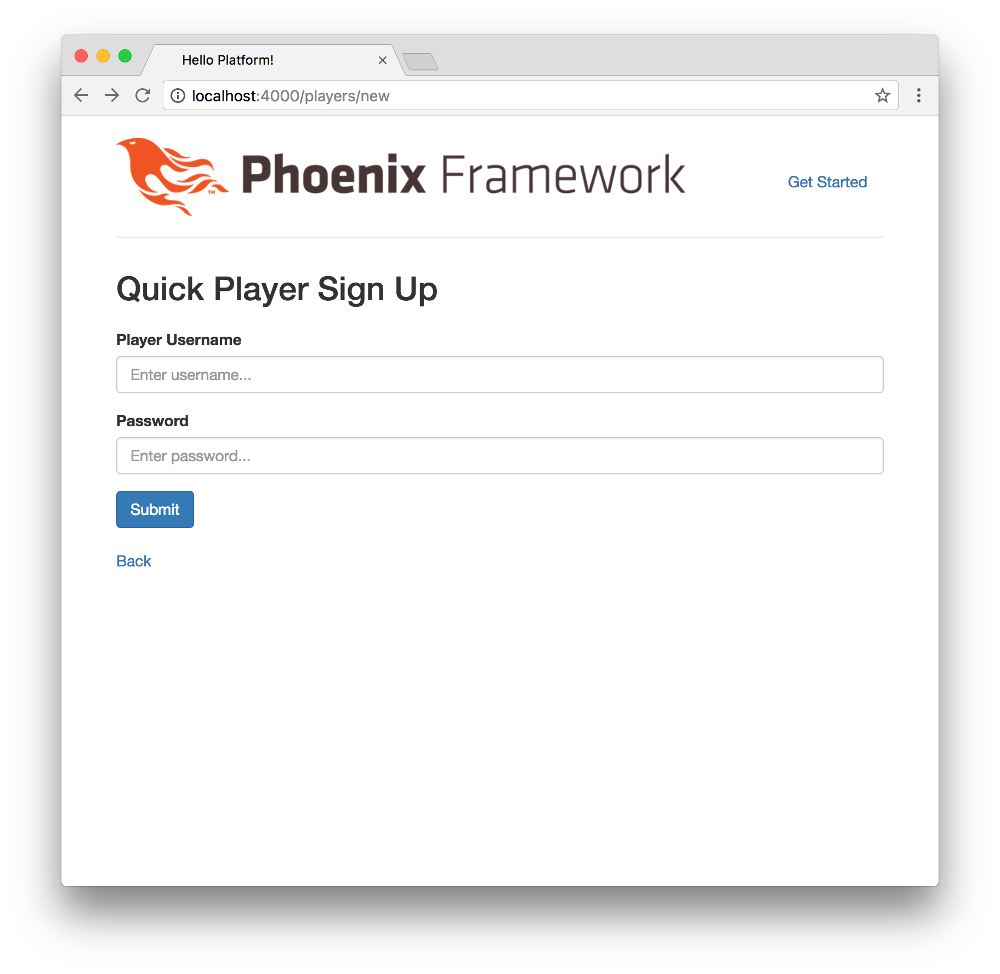
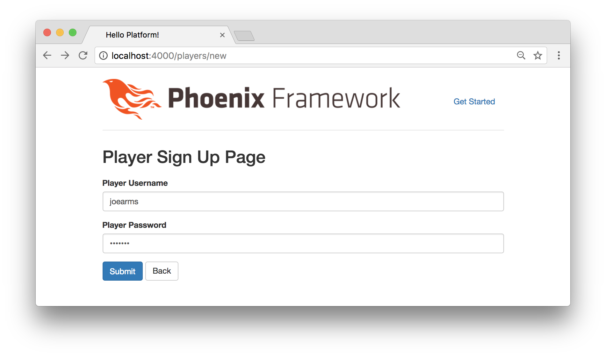
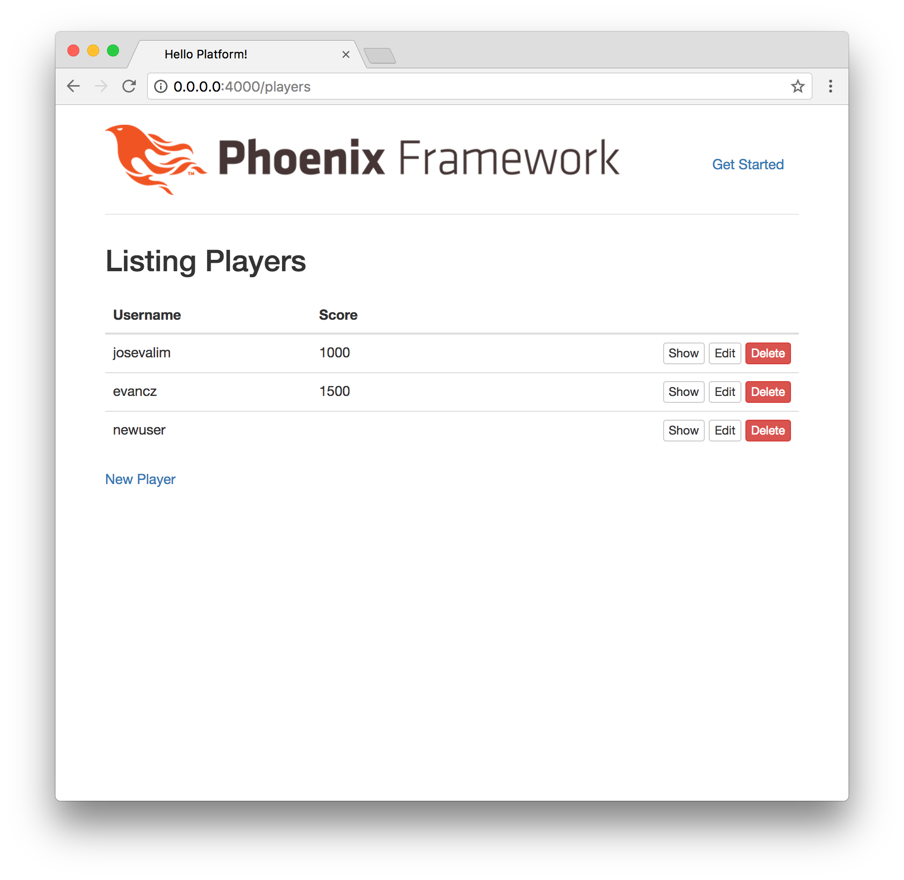

# Phoenix Authentication

In the last chapter, we managed to update our players with all the fields we'll
need. Now we can go ahead and implement our authentication features. We're
going to try to implement the bare minimum so that users can sign up and log in
to our platform, but we're not going to worry too much about more advanced
authentication features (forgotten password mailers, email verification, etc.).
Our goal is to allow users to sign up and log in quickly, easily, and securely.

## Fetching Dependencies

In order to get started with Phoenix authentication, we'll need to pull in a
dependency. In the root of our platform project, take a look at the `mix.exs`
file and find the `deps/0` function. This function is where we specify which
dependencies our application requires, and we can see that there are already a
handful that Phoenix uses by default.

```elixir
# Specifies your project dependencies.
#
# Type `mix help deps` for examples and options.
defp deps do
  [{:phoenix, "~> 1.3.0-rc"},
   {:phoenix_pubsub, "~> 1.0"},
   {:phoenix_ecto, "~> 3.2"},
   {:postgrex, ">= 0.0.0"},
   {:phoenix_html, "~> 2.6"},
   {:phoenix_live_reload, "~> 1.0", only: :dev},
   {:gettext, "~> 0.11"},
   {:cowboy, "~> 1.0"}]
end
```

The one we want to use to secure our passwords is called
[comeonin](https://hex.pm/packages/comeonin). The syntax for adding a new
dependency is a tuple like this:

```elixir
{:comeonin, "~> 3.0"}
```

In Elixir, this syntax is called a tuple. It's used commonly as a way to store
keys and values like we need here. The first element of the tuple is an atom
(`:comeonin`), and the second element indicates the version number. So let's
update our `deps/0` function to look like this:

```elixir
# Specifies your project dependencies.
#
# Type `mix help deps` for examples and options.
defp deps do
  [{:phoenix, "~> 1.3.0-rc"},
   {:phoenix_pubsub, "~> 1.0"},
   {:phoenix_ecto, "~> 3.2"},
   {:postgrex, ">= 0.0.0"},
   {:phoenix_html, "~> 2.6"},
   {:phoenix_live_reload, "~> 1.0", only: :dev},
   {:gettext, "~> 0.11"},
   {:cowboy, "~> 1.0"},
   {:comeonin, "~> 3.0"}]
end
```

Save that file, and then from the command-line we'll run the `mix` command that
fetches dependencies:

```bash
$ mix deps.get
```

We'll see the following results:

```bash
$ mix deps.get
Running dependency resolution...
Dependency resolution completed:
  comeonin 3.0.1
  elixir_make 0.4.0
* Getting comeonin (Hex package)
  Checking package (https://repo.hex.pm/tarballs/comeonin-3.0.1.tar)
  Fetched package
* Getting elixir_make (Hex package)
  Checking package (https://repo.hex.pm/tarballs/elixir_make-0.4.0.tar)
  Fetched package
```

## Player Changesets

Let's update our existing `player_changeset/2` function inside the
`lib/platform/players/players.ex` file. We're going to add some validations and
a new function that will allow us to encrypt passwords so they're not stored in
plain text.

Below the `change_player/1` function, write the following code:

```elixir
defp player_changeset(%Player{} = player, attrs) do
  player
  |> cast(attrs, [:username, :password, :display_name, :score])
  |> validate_required([:username])
  |> validate_length(:username, min: 2, max: 30)
  |> validate_length(:password, min: 6, max: 100)
  |> put_pass_hash()
end

defp put_pass_hash(changeset) do
  case changeset do
    %Ecto.Changeset{valid?: true, changes: %{password: pass}} ->
      put_change(changeset, :password_hash, Comeonin.Bcrypt.hashpwsalt(pass))

    _ ->
      changeset
  end
end
```

This means we're able to make changes to all our player field data, but we're
adding some validations to ensure that our `username` and `password` fields are
required and structured properly. More importantly, we're piping into our new
`put_pass_hash/1` function, which will encrypt passwords using the `comeonin`
dependency that we added earlier.

## Authentication Plug

Players are currently able to create new accounts at
`http://0.0.0.0:4000/players/new`. But we'll want to add features so that users
can log in and log out, and something to show that they're currently signed in
after they first create an account.



Let's create a new controller called `PlayerAuthController`. Create a
`lib/platform/web/controllers/player_auth_controller.ex` file, and add the
following content:

```elixir
defmodule Platform.Web.PlayerAuthController do
  import Plug.Conn

  def init(opts) do
    Keyword.fetch!(opts, :repo)
  end

  def call(conn, repo) do
    player_id = get_session(conn, :player_id)
    player = player_id && repo.get(Platform.Players.Player, player_id)
    assign(conn, :current_user, player)
  end
end
```

This will allow us to collect information about the player's session, and assign
it to `:current_user` so we can refer to that when handling our authentication
features.

## Router

Remembering back to when we set up our `PlayerController` in the Phoenix router,
we used the default browser pipeline. If we open the `lib/platform/web/router.ex`
file, we'll see that there are quite a few `plug`s at the top:

```elixir
defmodule Platform.Web.Router do
  use Platform.Web, :router

  pipeline :browser do
    plug :accepts, ["html"]
    plug :fetch_session
    plug :fetch_flash
    plug :protect_from_forgery
    plug :put_secure_browser_headers
  end

  pipeline :api do
    plug :accepts, ["json"]
  end

  scope "/", Platform.Web do
    pipe_through :browser # Use the default browser stack

    get "/", PageController, :index
    resources "/players", PlayerController
  end

  # ...
end
```

At the bottom of the `pipeline :browser` block, let's add our new authentication
plug:

```elixir
pipeline :browser do
  plug :accepts, ["html"]
  plug :fetch_session
  plug :fetch_flash
  plug :protect_from_forgery
  plug :put_secure_browser_headers
  plug Platform.Web.PlayerAuthController, Platform.Repo
end
```

## Authenticate Function

At the bottom of our `PlayerController`, let's add an `authenticate/1` function.
Open up the `lib/platform/web/controllers/player_controller.ex` file and add the
following at the bottom (beneath the `delete/2` function):

```elixir
defp authenticate(conn, _opts) do
  if conn.assigns.current_user() do
    conn
  else
    conn
    |> put_flash(:error, "You must be logged in to access that page.")
    |> redirect(to: page_path(conn, :index))
    |> halt()
  end
end
```

Since we assigned the current player's session to be the `current_user` inside
our `PlayerAuthController`, we can use that to determine whether a visitor to
our site is signed in. If they are, we'll just return the connection and allow
them to continue, otherwise if they're attempting to access a restricted
resource, we'll display a message and redirect them beck to the index.

In the same file, we'll use the `authenticate/1` function that we just used to
determine whether or not players should be able to render the player index page.

Above the `index/2` function, add the following line of code:

```elixir
plug :authenticate when action in [:index]
```

## Testing

If you're wondering if the updates above broke our tests, you're right. We
usually run our test suite with `mix test`, but this time let's fire up our
Phoenix server and manually test things out in the browser.

Start up the Phoenix server with `mix phx.server` and try going to the players
index page at `http://0.0.0.0:4000/players`:


This is great, it redirects us back to the home page because we managed to
restrict access to the players index page. And we see the flash message
displayed:

> You must be logged in to access that page.

## Logging In

So how can we allow users to log in to their newly created accounts? Let's
define a `login/2` function in our `PlayerAuthController`:

```elixir
def login(conn, player) do
  conn
  |> assign(:current_user, player)
  |> put_session(:player_id, player.id)
  |> configure_session(renew: true)
end
```

Right after a new user player creates an account, we automatically want to log
them into the system. So let's update the `create/2` function in our
`PlayerController`. We'll use the pipe operator to log the player in before we
display the flash message and redirect them:

```elixir
def create(conn, %{"player" => player_params}) do
  case Players.create_player(player_params) do
    {:ok, player} ->
      conn
      |> Platform.Web.PlayerAuthController.login(player)
      |> put_flash(:info, "Player created successfully.")
      |> redirect(to: player_path(conn, :show, player))
    {:error, %Ecto.Changeset{} = changeset} ->
      render(conn, "new.html", changeset: changeset)
  end
end
```

Let's try it out. Go to the `http://0.0.0.0:4000/players/new` page and create a
new user:



So far so good. The new user we just created should be logged in. Let's try to
access the players index page to verify. Go to the `http://0.0.0.0:4000/players`
page in your browser:



Success! We're able to access this page because we create a new account and
authenticated the new player at the same time.