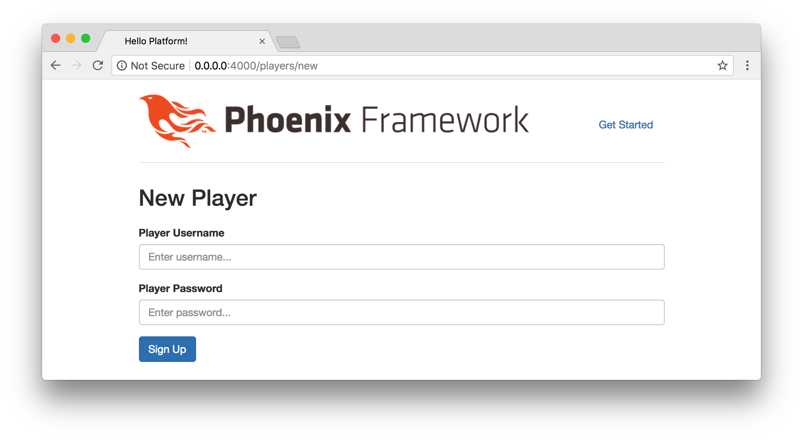
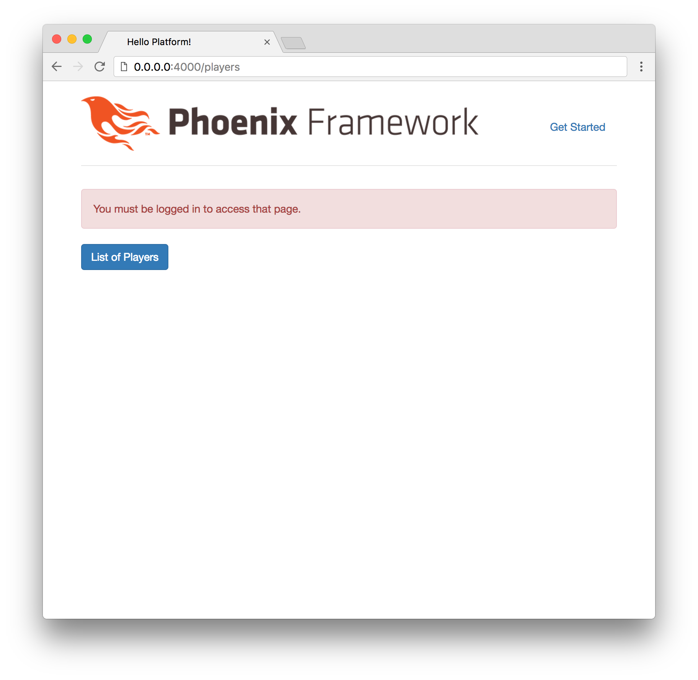
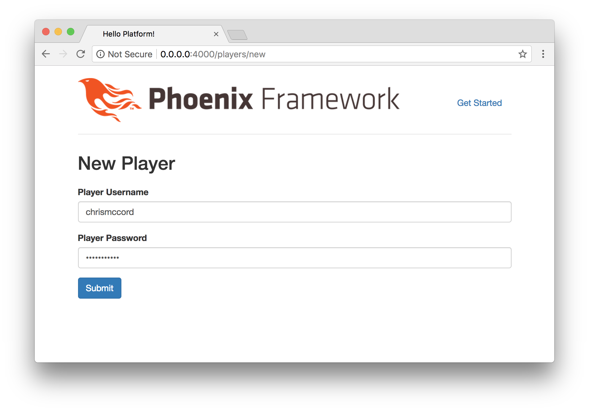
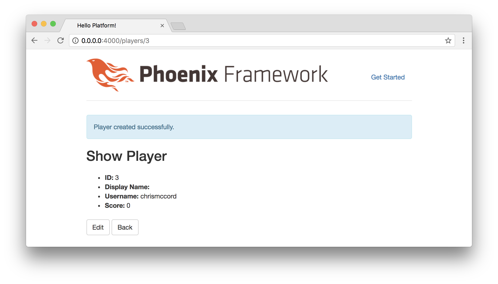
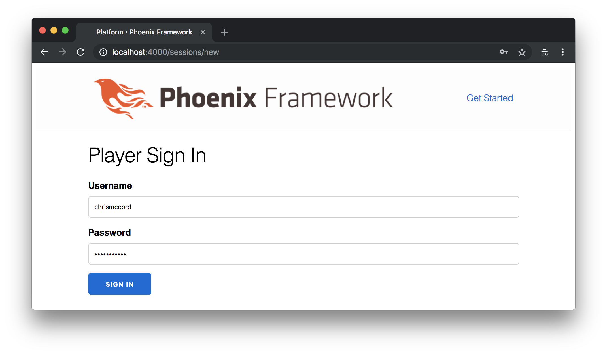
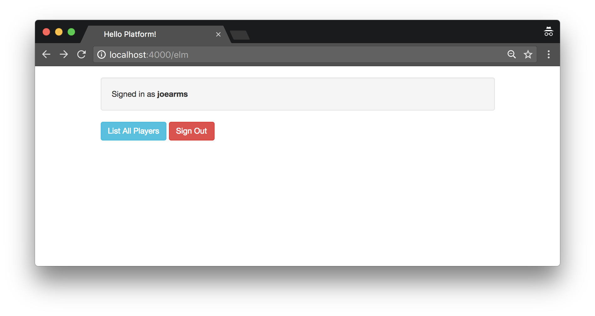

# Phoenix Authentication

In the last chapter, we managed to update our players with the fields we'll
need to continue. Now, we can start implementing our authentication features.
We're going to begin with the bare minimum so users can sign up and sign in to
our platform, but we're not going to worry about more advanced authentication
features like email verification or forgotten password mailers. Our goal is to
allow users to sign up and sign in quickly, easily, and securely.

## Fetching Dependencies

To get started with Phoenix authentication, we'll need to add a couple of new
dependencies. At the root of our project, take a look at the `mix.exs` file and
find the `deps/0` function. This function is where we specify which
dependencies our application requires, and we can see there are already a
handful that Phoenix includes by default.

```elixir
defp deps do
  [
    {:phoenix, "~> 1.3.0"},
    {:phoenix_pubsub, "~> 1.0"},
    {:phoenix_ecto, "~> 3.2"},
    {:postgrex, ">= 0.0.0"},
    {:phoenix_html, "~> 2.10"},
    {:phoenix_live_reload, "~> 1.0", only: :dev},
    {:gettext, "~> 0.11"},
    {:cowboy, "~> 1.0"}
  ]
end
```

The dependency we'll use for securing our passwords is called (somewhat
ironically) [comeonin](https://hex.pm/packages/comeonin). This is what the
syntax looks like for adding a new dependency:

```elixir
{:comeonin, "~> 4.0"}
```

In Elixir, this syntax is called a **tuple**. It's commonly used as a way to
reference keys and values. In this example, the first element of the tuple is
an atom (`:comeonin`), and the second element is a string that indicates the
version number (`"~> 4.0"`).

Comeonin allows us to choose from different password hashing algorithms, so
we'll also need to import another dependency called
[bcrypt_elixir](https://hex.pm/packages/bcrypt_elixir) to get everything
working. Let's update our `deps/0` function with the following:

```elixir
defp deps do
  [
    {:phoenix, "~> 1.3.0"},
    {:phoenix_pubsub, "~> 1.0"},
    {:phoenix_ecto, "~> 3.2"},
    {:postgrex, ">= 0.0.0"},
    {:phoenix_html, "~> 2.10"},
    {:phoenix_live_reload, "~> 1.0", only: :dev},
    {:gettext, "~> 0.11"},
    {:cowboy, "~> 1.0"},
    {:comeonin, "~> 4.0"},
    {:bcrypt_elixir, "~> 0.12"}
  ]
end
```

Save that file, and then from the command line we'll run the `mix` command that
fetches dependencies:

```shell
$ mix deps.get
```

We'll see the following results:

```shell
$ mix deps.get
Running dependency resolution...
Dependency resolution completed:
  comeonin 4.0.0
  bcrypt_elixir 0.12.1
  elixir_make 0.4.0
  ...
* Getting comeonin (Hex package)
  Checking package (https://repo.hex.pm/tarballs/comeonin-4.0.0.tar)
  Fetched package
* Getting bcrypt_elixir (Hex package)
  Checking package (https://repo.hex.pm/tarballs/bcrypt_elixir-0.12.1.tar)
  Fetched package
* Getting elixir_make (Hex package)
  Checking package (https://repo.hex.pm/tarballs/elixir_make-0.4.0.tar)
  Fetched package
```

## Player Changesets

Now that we've included our new dependencies, let's take a look at the existing
`changeset/2` function inside the `lib/platform/accounts/player.ex` file.

```elixir
def changeset(%Player{} = player, attrs) do
  player
  |> cast(attrs, [:display_name, :password, :score, :username])
  |> validate_required([:username])
end
```

This is where we can add additional validations for our data and ensure that it
conforms to our expectations. This function will remain our default player
changeset, but we'll also add a separate one called `registration_changeset/2`
for when players create a new account.

Let's add some validations and a new function that will allow us to encrypt
passwords so they're not stored in plain text. Update the `changeset/2` function
and add the following code:

```elixir
@doc false
def changeset(%Player{} = player, attrs) do
  player
  |> cast(attrs, [:display_name, :password, :score, :username])
  |> validate_required([:username])
  |> validate_length(:username, min: 2, max: 100)
  |> validate_length(:password, min: 6, max: 100)
  |> put_pass_digest()
end

@doc false
def registration_changeset(%Player{} = player, attrs) do
  player
  |> cast(attrs, [:password, :username])
  |> validate_required([:password, :username])
  |> validate_length(:username, min: 2, max: 100)
  |> validate_length(:password, min: 6, max: 100)
  |> put_pass_digest()
end

defp put_pass_digest(changeset) do
  case changeset do
    %Ecto.Changeset{valid?: true, changes: %{password: pass}} ->
      put_change(changeset, :password_digest, Comeonin.Bcrypt.hashpwsalt(pass))

    _ ->
      changeset
  end
end
```

With this code, we're able to add a couple of quick validations to ensure data
is structured properly. We're making sure that users enter both a `username`
and `password` when they create a new account, and that those fields are of a
certain length. More importantly, we're piping into our new `put_pass_digest/1`
function, which will encrypt passwords using the `comeonin` dependency.

Our new `put_pass_digest/1` function takes in the player `changeset`, and then
we add a `case` statement to determine whether or not it is valid. If the
`changeset` is valid, we're using our new dependency to hash the `password`
field with `Comeonin.Bcrypt.hashpwsalt(pass)`, and then store the hash in the
`password_digest` field using the
[`put_change/3`](https://hexdocs.pm/ecto/Ecto.Changeset.html#put_change/3)
function. This is the reason we set the `password` field to `virtual: true` in
the player schema, because we're only going to store the hash in the
`player_digest` field.

In the event that the `changeset` was not valid, we just return it at the
bottom of our `put_pass_digest/1` function without any changes. This is a
common pattern we can use for `case` statements where `_` is a useful default
case if none of the branches above applied.

Lastly, to get this working we'll need to adjust the `create_player/1` function
in the `lib/platform/accounts/accounts.ex` file. In the other functions, we'll
continue using the `changeset/2` function, but in this one we want to use the
`registration_changeset/2` function so that both the `username` and `password`
fields are required to create an account.

Update the `create_player/1` function with the following:

```elixir
def create_player(attrs \\ %{}) do
  %Player{}
  |> Player.registration_changeset(attrs)
  |> Repo.insert()
end
```

## Accounts Tests and Module Attributes

When we run our tests, we use different sets of attributes to simulate valid
and invalid data. When we ran the generator command to create our players
resource, Phoenix created some initial values for us. We've since updated the
fields that we're working with, so we'll need to make some changes to our
tests as well.

Let's open the `test/platform/accounts/accounts_test.exs` file and take a look
at the attributes:

```elixir
describe "players" do
  alias Platform.Accounts.Player

  @valid_attrs %{score: 42, username: "some username"}
  @update_attrs %{score: 43, username: "some updated username"}
  @invalid_attrs %{score: nil, username: nil}

  # ...
end
```

In Elixir, these are called
[module attributes](https://elixir-lang.org/getting-started/module-attributes.html).
They're useful for creating constants that we can use throughout our tests. For
example, we assign a map of valid player fields to the `@valid_attrs` module
attribute, and then we can use those fields in the tests below.

Let's make some changes to our attribute data to account for the changes we've
made to our player schema:

```elixir
@valid_attrs %{password: "some password", username: "some username"}
@update_attrs %{display_name: "some updated display name", password: "some updated password", score: 43, username: "some updated username"}
@invalid_attrs %{password: nil, username: nil}
```

We want to ensure that our players can sign up with just a `username` and
`password`, so we include those in our `@valid_attrs`. Then we can ensure that
our other fields work by including them in `@update_attrs`. Lastly, we ensure
that `nil` values won't work to create new accounts by including them in
`@invalid_attrs`.

Let's also go ahead and update our `create_player/1` test case with the
following to since we want users to create accounts with valid `username` and
`password` fields.

```elixir
test "create_player/1 with valid data creates a player" do
  assert {:ok, %Player{} = player} = Accounts.create_player(@valid_attrs)
  assert player.password == "some password"
  assert player.username == "some username"
end
```

## Fixtures, Maps, and Structs

In the same `test/platform/accounts/accounts_test.exs` file, we have a
`player_fixture/1` function that returns a player "struct" we use as a sample
player throughout the test cases. We still want to use this function to create
a sample player, but we also want to ignore the `password` field in our test
environment. We can use this as an opportunity to learn a little bit about
Elixir structs and maps.

We saw some examples of
[Elixir Maps](https://elixir-lang.org/getting-started/keywords-and-maps.html#maps)
in the previous section about attributes. They are useful as key-value stores,
and they're considered an essential data structure. Here's a simple example with
two keys and two values:

```elixir
%{password: "some password", username: "some username"}
```

[Elixir Structs](https://elixir-lang.org/getting-started/structs.html) are
similar to maps, but have additional structure for defining keys and values.
Here's an example of what a simple player struct might look like:

```elixir
%Platform.Accounts.Player{password: "some password", username: "some username"}
```

Our actual player struct is more complicated, because it needs to account for
all the other fields including things like `id`, `updated_at`, and other
metadata.

Let's take a look at our existing `player_fixture/1` function:

```elixir
def player_fixture(attrs \\ %{}) do
  {:ok, player} =
    attrs
    |> Enum.into(@valid_attrs)
    |> Accounts.create_player()

  player
end
```

This function takes our map of valid player attributes (`@valid_attrs`) and
uses the `Accounts.create_player()` function to create a new player account.
Then, we pattern match the result to get the `player` struct and return the
`player` at the bottom.

We're going to make a slight change to remove the `password` field. We'll need
to convert the struct into a map to delete the field, and then we'll merge the
fields back together to return the player struct.

```elixir
def player_fixture(attrs \\ %{}) do
  {:ok, player} =
    attrs
    |> Enum.into(@valid_attrs)
    |> Accounts.create_player()

  player_attrs_map =
    player
    |> Map.from_struct()
    |> Map.delete(:password)

  %Platform.Accounts.Player{}
  |> Map.merge(player_attrs_map)
end
```

Rather than just returning the `player` struct at the bottom of the function,
we're converting the struct to a map using `Map.from_struct()` and then
deleting the `password` field with `Map.delete(:password)`. This gives us a map
of all the player attributes except the `password` field.

At the bottom of the function, we create a player struct with
`%Platform.Accounts.Player{}` and then merge all of the fields in our map
together using `Map.merge(player_attrs_map)`.

Keep in mind that this is a lot to take in as we're dealing with new data
structures and a lot of new functions, so don't worry if this seems slightly
overwhelming at first. Working with maps and structs is so common in Elixir and
Phoenix applications that we'll pick it up easily as we gain experience. In the
meantime, this provided a good starting point while we work towards our goal of
fixing our test suite.

## Player Controller Tests

We've updated our player `changeset/1` function and fixed the tests for our
player accounts, but we still have a few failing tests. Let's switch to the
`test/platform_web/controllers/player_controller_test.exs` file and make some
changes.

Similar to the way we updated our module attributes in the previous sections,
let's change `@create_attrs`, `@update_attrs`, and `@invalid_attrs` with the
following:

```elixir
@create_attrs %{password: "some password", username: "some username"}
@update_attrs %{display_name: "some updated display name", password: "some updated password", score: 43, username: "some updated username"}
@invalid_attrs %{password: nil, username: nil}
```

Now that we've made changes to our player schema and adjusted our attributes,
we should be able to run our tests again and see them all passing:

```shell
$ mix test
....................

Finished in 4.4 seconds
20 tests, 0 failures

Randomized with seed 77808
```

## Speeding Up Tests

This part is optional, but it provides a good example of how we can configure
our test environment and speed things up. You may have noticed that our tests
are running more slowly than they were before. The password hashing algorithm
takes a while, and we don't necessarily need this in our test environment.

Let's add a configuration setting at the bottom of our `config/test.exs` file:

```elixir
# Reduce bcrypt rounds to speed up tests
config :bcrypt_elixir, :log_rounds, 4
```

Save the file, and then let's try running our tests again to see if there's a
difference:

```shell
$ mix test
Compiling 20 files (.ex)
Generated platform app
....................

Finished in 0.2 seconds
20 tests, 0 failures

Randomized with seed 749042
```

We reduced the number of encryption rounds our hashing algorithm is running
(only in our test environment), and this resulted in a noticeable difference in
the amount of time our tests took to run (from 4.4 seconds to 0.2 seconds).

## Authentication Plug

Players are currently able to create new accounts at
`http://0.0.0.0:4000/players/new`. But we'll want to add features so that users
can sign in and sign out.



Let's make a new controller called `PlayerAuthController`. Create a
`lib/platform_web/controllers/player_auth_controller.ex` file, and add the
following content:

```elixir
defmodule PlatformWeb.PlayerAuthController do
  import Plug.Conn

  alias Platform.Accounts.Player

  def init(opts) do
    Keyword.fetch!(opts, :repo)
  end

  def call(conn, repo) do
    player_id = get_session(conn, :player_id)
    player = player_id && repo.get(Player, player_id)
    assign(conn, :current_user, player)
  end
end
```

This will allow us to collect information about the current player's session
and assign it to `:current_user` so we can refer to that when handling our
authentication features.

## Router

Remembering back to when we set up our `PlayerController` in the Phoenix
router, we used the default browser pipeline. If we open the
`lib/platform_web/router.ex` file, we'll see that there are quite a few
`plug`s at the top:

```elixir
defmodule PlatformWeb.Router do
  use PlatformWeb, :router

  pipeline :browser do
    plug :accepts, ["html"]
    plug :fetch_session
    plug :fetch_flash
    plug :protect_from_forgery
    plug :put_secure_browser_headers
  end

  pipeline :api do
    plug :accepts, ["json"]
  end

  # ...
end
```

At the bottom of the `pipeline :browser` block, let's add our new
authentication plug:

```elixir
pipeline :browser do
  plug :accepts, ["html"]
  plug :fetch_session
  plug :fetch_flash
  plug :protect_from_forgery
  plug :put_secure_browser_headers
  plug PlatformWeb.PlayerAuthController, repo: Platform.Repo
end
```

This plug is going to allow us to restrict access to certain pages. Let's
update our application so users will be redirected to the **New Player** page
at `http://0.0.0.0:4000/players/new` if they haven't already signed in.

Currently, when we access `http://0.0.0.0:4000` in the browser, we see the
index page from our `PageController`. In the upcoming chapters, we'll be
turning this into our Elm front-end application.


We're going to use our new `PlayerAuthController` to redirect users to the
**New Player** page before they can view our home page.

## Authenticate Function

Currently, users are able to navigate to all the pages within our application.
We want to ensure that players are signed in before they access our Elm
application and start playing games.

At the bottom of our `PageController`, let's add an `authenticate/2`
function. Open up the `lib/platform_web/controllers/page_controller.ex` file
and add the following beneath the `index/2` function:

```elixir
defp authenticate(conn, _opts) do
  if conn.assigns.current_user() do
    conn
  else
    conn
    |> put_flash(:error, "You must be signed in to access that page.")
    |> redirect(to: player_path(conn, :new))
    |> halt()
  end
end
```

Since we assigned the current player's session to be the `current_user` inside
our `PlayerAuthController`, we can use that to determine whether a visitor to
our site is signed in. If they are, we'll just return the connection and allow
them to continue, otherwise if they're attempting to access a restricted
resource, we'll display a message and redirect them back to the **New Player**
page.

In the same file, we'll use the `authenticate/2` function that we just created
to determine whether or not players should be able to render the
`PageController` index page.

Above the `index/2` function, add the following line of code:

```elixir
plug :authenticate when action in [:index]
```

## Manual Testing

If you're wondering if the updates above broke our tests, you're right. We
usually run our test suite with `mix test`, but this time let's manually test
things out in the browser. Open up your browser and try visiting the
`PageController` index page at `http://0.0.0.0:4000`:



It looks like our changes worked, because the application redirected us back to
the **New Player** page. We managed to restrict access to index page, and we
see the flash alert ("You must be signed in to access that page.") that we
wrote in the `authenticate/2` function at the bottom of the `PageController`.

## Fixing Our Tests

Let's push a quick fix for our tests. Open the `test/platform_web/controllers/page_controller_test.exs` file and replace it
with the following code that tests our default route and the redirect that
we created:

```elixir
defmodule PlatformWeb.PageControllerTest do
  use PlatformWeb.ConnCase

  test "redirects unauthenticated users away from index page", %{conn: conn} do
    conn = get conn, "/"
    assert html_response(conn, 302) =~ "redirect"
  end
end
```

Go ahead and run the `mix test` command again, and we should be all set with
passing tests that give us confidence to keep adding features.

## Signing In

How do we allow users to sign in to their newly created accounts? Let's define
a `signin/2` function in our `PlayerAuthController`:

```elixir
def sign_in(conn, player) do
  conn
  |> assign(:current_user, player)
  |> put_session(:player_id, player.id)
  |> configure_session(renew: true)
end
```

Right after a new player creates an account, we automatically want to use the
`sign_in/2` function to authenticate them on our platform. To accomplish this,
we'll need to update the `create/2` function in our `PlayerController`. We'll
use the pipe operator to sign the player in before we display the flash message
and redirect them:

```elixir
def create(conn, %{"player" => player_params}) do
  case Accounts.create_player(player_params) do
    {:ok, player} ->
      conn
      |> PlatformWeb.PlayerAuthController.sign_in(player)
      |> put_flash(:info, "Player created successfully.")
      |> redirect(to: player_path(conn, :show, player))
    {:error, %Ecto.Changeset{} = changeset} ->
      render(conn, "new.html", changeset: changeset)
  end
end
```

Let's try it out. Go to the **New Player** page at
`http://0.0.0.0:4000/players/new` and create a new user with both the
`username` and `password` fields set to `chrismccord`:



The new user we just created should now be signed in, and we'll be directed to
the **Show Player** page for the new user.



Now, let's try to access the `PageController` index page to verify that the
user is authenticated. Go to the `http://0.0.0.0:4000` page in your browser:


Success! We're able to access this page because we created a new account and
authenticated the new player at the same time.

## Sessions

To complete our authentication features, we'll need to handle user sessions. We
were able to handle logins in the previous section because we took care of it
while creating an account, but now we'll also want to allow users to log out and
log back in whenever they'd like.

Let's start by creating a `PlayerSessionController`. Create a new file called
`platform/lib/web/controllers/player_session_controller.ex`, and add the
following code:

```elixir
defmodule Platform.Web.PlayerSessionController do
  use Platform.Web, :controller

  def new(conn, _) do
    render conn, "new.html"
  end

  def create(conn, %{"session" => %{"username" => user, "password" => pass}}) do
    case Platform.Web.PlayerAuthController.login_by_username_and_pass(conn, user, pass, repo: Platform.Repo) do
      {:ok, conn} ->
        conn
        |> put_flash(:info, "Welcome back!")
        |> redirect(to: page_path(conn, :index))
      {:error, _reason, conn} ->
        conn
        |> put_flash(:error, "Invalid username/password combination.")
        |> render("new.html")
    end
  end

  def delete(conn, _) do
    conn
    |> Platform.Web.PlayerAuthController.logout()
    |> redirect(to: player_session_path(conn, :new))
  end
end
```

This may seem like a lot at first, but we'll go through it quickly along with
the updates we make to the `PlayerAuthController`.

The `new/2` function will allow us to display a login page (as opposed to the
sign up page that new players will use). When we create new sessions, we'll use
a new function (which we'll create soon) called `login_by_username_and_pass/4`.
Lastly, the `delete/2` function will allow us to log users out by deleting
their session.

## View and Template

Let's create the view and the template for our login page. Add a new file called
`player_session_view.ex` inside the `lib/platform/web/views` folder. And add the
following to the file:

```elixir
defmodule Platform.Web.PlayerSessionView do
  use Platform.Web, :view
end
```

And then we'll need to create the corresponding template. Create a
`lib/platform/web/templates/player_session` folder, and then add a
`new.html.eex` file inside with the following content:

```elixir
<h1>Player Sign In Page</h1>

<%= form_for @conn, player_session_path(@conn, :create), [as: :session], fn f -> %>
  <div class="form-group">
    <%= text_input f, :username, placeholder: "Enter username...", class: "form-control" %>
  </div>
  <div class="form-group">
    <%= password_input f, :password, placeholder: "Enter password...", class: "form-control" %>
  </div>
  <%= submit "Sign In", class: "btn btn-primary" %>
  <span><%= link "Create New Account", to: player_path(@conn, :new), class: "btn btn-success" %></span>
<% end %>
```

## Login Routing

If you were still running a Phoenix server this whole time, you've probably
noticed we've been creating errors in our application. But we're getting close
to a working authentication system. We'll need to update our router to reflect
our new session features. Open the `lib/platform/web/router.ex` file and add
our session resource:

```elixir
scope "/", Platform.Web do
  pipe_through :browser

  get "/", PlayerController, :new
  get "/elm", PageController, :index
  resources "/players", PlayerController
  resources "/sessions", PlayerSessionController, only: [:new, :create, :delete]
end
```

This will add only the necessary routes so our players can create and delete
their sessions to log in and out of the platform.

## Logging In and Out

Lastly, we'll create the function in our `PlayerAuthController` that ties
everything together. Add the `login_by_username_and_pass/4` function at the
bottom of the `lib/platform/controllers/player_auth_controller.ex` file, and
don't forget to add the `import` for our encryption at the top. Here's what
the full code should look like for the file:

```elixir
defmodule Platform.Web.PlayerAuthController do
  import Plug.Conn
  import Comeonin.Bcrypt, only: [checkpw: 2, dummy_checkpw: 0]

  def init(opts) do
    Keyword.fetch!(opts, :repo)
  end

  def call(conn, repo) do
    player_id = get_session(conn, :player_id)
    player = player_id && repo.get(Platform.Accounts.Player, player_id)
    assign(conn, :current_user, player)
  end

  def login(conn, player) do
    conn
    |> assign(:current_user, player)
    |> put_session(:player_id, player.id)
    |> configure_session(renew: true)
  end

  def login_by_username_and_pass(conn, username, given_pass, opts) do
    repo = Keyword.fetch!(opts, :repo)
    player = repo.get_by(Platform.Accounts.Player, username: username)

    cond do
      player && checkpw(given_pass, player.password_hash) ->
        {:ok, login(conn, player)}
      player ->
        {:error, :unauthorized, conn}
      true ->
        dummy_checkpw()
        {:error, :not_found, conn}
    end
  end

  def logout(conn) do
    configure_session(conn, drop: true)
  end
end
```

What the `login_by_username_and_pass/4` function does is to grab the player
from the database by their `username` field. If the player exists and has the
correct password, they will be logged in. Otherwise, we'll return an error.

## Trying Things Out

It's a good idea to try out these features using "incognito" browser windows.
That will give us a way to open a new browser window in a clean state. If
you're using Google Chrome on OS X, you can create a new incognito window with
`Command + Shift + N`. It's also a good idea to restart your Phoenix server
with `mix phx.server` at this point to get things up and running.

We can test out the **Player Sign In Page** with the same account that we
created in the previous sections. Go to the new session page at
`http://0.0.0.0:4000/sessions/new` and try entering `joearms` for both the
`username` and `password` fields.



Success! We get a welcome back message letting us know that we were able to
log in successfully:


## Displaying the Player Status

We've given users the ability to create new accounts at `/players/new`, and
players can sign in to existing accounts from the `/sessions/new` page. As a
last step for this chapter, let's find a place to let players know when they're
logged in, and give them a way to log out.

First, let's open the `lib/platform/web/templates/layout` folder, and remove
the existing header that Phoenix came with by default (we're going to handle
our own custom header with routing in our Elm front-end application later).

Update the `<body>` of the `app.html.eex` file with the following:

```embedded_elixir
<body>
  <div class="container">
    <p class="alert alert-info" role="alert"><%= get_flash(@conn, :info) %></p>
    <p class="alert alert-danger" role="alert"><%= get_flash(@conn, :error) %></p>

    <main role="main">
      <%= render @view_module, @view_template, assigns %>
    </main>

  </div> <!-- /container -->
  <script src="<%= static_path(@conn, "/js/app.js") %>"></script>
</body>
```

Now, let's update the template at `lib/platform/web/page/index.html.eex` with
the following:

```embedded_elixir
<p class="well">Signed in as <strong><%= @current_user.username %></strong></p>
<span><%= link "List All Players", to: player_path(@conn, :index), class: "btn btn-info" %></span>
<span><%= link "Sign Out", to: player_session_path(@conn, :delete, @current_user), method: "delete", class: "btn btn-danger" %></span>
```

This is exactly what we were hoping for. Now we have content to display for
signed in users on the `http://0.0.0.0:4000/elm` page. We know that a player
must be authenticated to access this page, so we can use `@current_user` to
display their `username` along with a **Sign Out** button.



Users can successfully delete their session by clicking the red **Sign Out**
button, and it will redirect them back to the **Player Sign In Page**.

## Summary

We've come a long way! We now have working features for players to create
accounts, sign in, and sign out of our platform. And we also have the ability
to restrict access to certain pages to ensure that users are authorized to
view the right data. Next, we'll be building out the games section for our
platform, and getting our first taste of what it's like to work with Elm.
