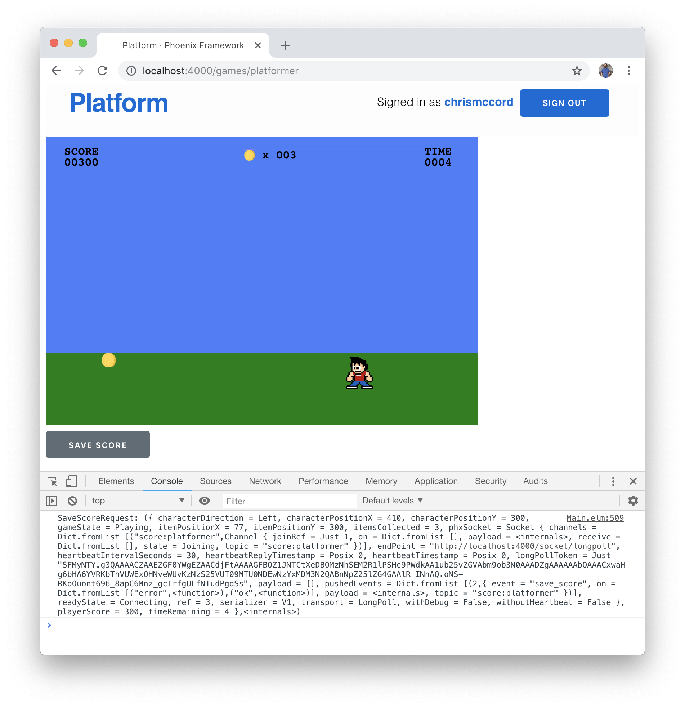

# Phoenix Channel Setup

We have our game platform up and running, where users can sign in and play a
simple Elm game that tracks a score. Now, let's work towards syncing the Elm
front-end of our application with the Phoenix back-end. We'll learn about
Phoenix channels with the goal of being able to communicate the score from
games back to a player's account in real-time.

## Channels

Essentially, Phoenix channels give us a way to send and receive messages. A
chatroom application is a common example of how channels work. When users enter
the chatroom, they "join" the channel. Then, we can "broadcast" the chat
messages to all users that have joined the channel.

We're going to use Phoenix channels for a similar purpose. We're going to take
the `playerScore` field that we're tracking in our Elm application, and we're
going to broadcast that value to other users so all players can see scores for
a particular game being tracked in real-time. We'll also take a look at how to
store the scores as records in our database using the `gameplays` table we
configured earlier in the book.

## Score Channel

To get started, we can create a file for our new channel in the
`lib/platform_web/channels` folder. Let's use `score_channel.ex` as the
filename, and add the following content:

```elixir
defmodule PlatformWeb.ScoreChannel do
  use PlatformWeb, :channel
end
```

To get our new channel up and running, let's open the `user_socket.ex` file
in the same `lib/platform_web/channels` folder. At the top, we'll see comments
that show how to add a new channel.

```elixir
defmodule PlatformWeb.UserSocket do
  use Phoenix.Socket

  ## Channels
  # channel "room:*", PlatformWeb.RoomChannel

  # ...
end
```

We'll replace the commented example with the channel we're going to be working
with. We're setting things up to work with the `PlatformWeb.ScoreChannel` that
we just created. The `"score:*"` part refers to "topic" and "subtopic". That
means we can use `"score:platformer"` to track scores for our Platformer game,
or something like `"score:racer"` to track scores for a different game. The
`"*"` character means that we're joining the `"score"` topic and matching _any_
subtopics.

```elixir
defmodule PlatformWeb.UserSocket do
  use Phoenix.Socket

  ## Channels
  channel "score:*", PlatformWeb.ScoreChannel

  # ...
end
```

## Joining the Channel

Let's add a `join/3` function to the `score_channel.ex` file. This function
will take three arguments:

- The Topic: We're joining `"score:platformer"` to track scores for our
  Platformer game.
- The Payload: We're using `_payload` to ignore this for now, but this will
  contain the data that we pass over the socket.
- The Socket: This is the WebSocket connection that we return in the body of
  the function.

```elixir
defmodule PlatformWeb.ScoreChannel do
  use PlatformWeb, :channel

  def join("score:platformer", _payload, socket) do
    {:ok, socket}
  end
end
```

Now, let's add another function that will allow us to handle incoming messages
from the client. We'll use the `handle_in/3` function, and we'll listen for a
`"save_score"` message to trigger it.

```elixir
defmodule PlatformWeb.ScoreChannel do
  use PlatformWeb, :channel

  def join("score:platformer", _payload, socket) do
    {:ok, socket}
  end

  def handle_in("save_score", payload, socket) do
    broadcast(socket, "save_score", payload)
    {:noreply, socket}
  end
end
```

This will allow us to listen for a `"save_score"` message that we'll send from
our Elm client. Inside the `handle_in/3` function, we use the
[`broadcast/3`](https://hexdocs.pm/phoenix/Phoenix.Channel.html#broadcast/3)
function, which will relay the results to all players on the channel.

We haven't configured our front-end to work with the channel yet, but we've
managed to take care of the initial channel setup on the back-end.

## elm-phoenix-socket

While channel features come bundled with the Phoenix framework, but we'll need
to import a new library on the Elm side. To enable communication between the
front-end and back-end, let's use
[elm-phoenix-socket](https://github.com/fbonetti/elm-phoenix-socket).

To get started, let's move to the `assets` folder in our project, and run the
following command to install the package:

```shell
$ elm-package install fbonetti/elm-phoenix-socket
```

This will also import the `elm-lang/websocket` package, and we should see the
following output:

```shell
$ elm-package install fbonetti/elm-phoenix-socket
To install fbonetti/elm-phoenix-socket I would like to add the following
dependency to elm-package.json:

    "fbonetti/elm-phoenix-socket": "2.2.0 <= v < 3.0.0"

May I add that to elm-package.json for you? [Y/n] Y

  Install:
    elm-lang/websocket 1.0.2
    fbonetti/elm-phoenix-socket 2.2.0

Do you approve of this plan? [Y/n] Y
Starting downloads...

  ● elm-lang/websocket 1.0.2
  ● fbonetti/elm-phoenix-socket 2.2.0

Packages configured successfully!
```

## Configuring elm-phoenix-socket

Now, we can work through the elm-phoenix-socket
[README](https://github.com/fbonetti/elm-phoenix-socket/blob/master/README.md)
to configure everything on the Elm side of our application. We'll start by
importing the necessary modules. Let's update the imports at the top of our
`Platformer.elm` file to include three new `Phoenix` modules:

```elm
module Platformer exposing (..)

import AnimationFrame exposing (diffs)
import Html exposing (Html, div)
import Keyboard exposing (KeyCode, downs)
import Phoenix.Channel
import Phoenix.Push
import Phoenix.Socket
import Random
import Svg exposing (..)
import Svg.Attributes exposing (..)
import Time exposing (Time, every, second)
```

Next, we can add a `phxSocket` field to our model. We'll update our `Model`
type first, and then provide an initial value in our `initialModel` that points
to a new function we'll call `initialSocket`.

```elm
type alias Model =
    { characterDirection : Direction
    , characterPositionX : Int
    , characterPositionY : Int
    , gameState : GameState
    , itemPositionX : Int
    , itemPositionY : Int
    , itemsCollected : Int
    , phxSocket : Phoenix.Socket.Socket Msg
    , playerScore : Int
    , timeRemaining : Int
    }


initialModel : Model
initialModel =
    { characterDirection = Right
    , characterPositionX = 50
    , characterPositionY = 300
    , gameState = StartScreen
    , itemPositionX = 500
    , itemPositionY = 300
    , itemsCollected = 0
    , phxSocket = initialSocket
    , playerScore = 0
    , timeRemaining = 10
    }
```

Here's the new `initialSocket` function we can use to initialize the socket
connection with `Phoenix.Socket.init`. When our Phoenix server is running,
we'll be able to use the `devSocketServer` value for the WebSocket connection
that's being served as the default from Phoenix.

```elm
initialSocket : Phoenix.Socket.Socket Msg
initialSocket =
    let
        devSocketServer =
            "ws://localhost:4000/socket/websocket"
    in
        Phoenix.Socket.init devSocketServer
            |> Phoenix.Socket.withDebug
```

We also pipe the results to `Phoenix.Socket.withDebug` so we can take a look at
the DevTools Console and inspect the data once we get things up and running.

## The Update Function

Before we have a working socket connection, we'll need to add a new message
to our update section. Still following along with the elm-phoenix-socket README
file, we see that we can create a new message type at the bottom to handle
Phoenix socket messages with `PhoenixMsg`.

```elm
type Msg
    = NoOp
    | CountdownTimer Time
    | KeyDown KeyCode
    | PhoenixMsg (Phoenix.Socket.Msg Msg)
    | SetNewItemPositionX Int
    | TimeUpdate Time
```

And we can add the following inside the `case` expression of our `update`
function:

```elm
PhoenixMsg msg ->
  let
    ( phxSocket, phxCmd ) = Phoenix.Socket.update msg model.phxSocket
  in
    ( { model | phxSocket = phxSocket }
    , Cmd.map PhoenixMsg phxCmd
    )
```

This enables us to track changes in state using the `phxSocket` field in our
model.

## Socket Subscription

Lastly, we can add to our `subscriptions` function to subscribe to changes over
time.

```elm
subscriptions : Model -> Sub Msg
subscriptions model =
    Sub.batch
        [ downs KeyDown
        , diffs TimeUpdate
        , every second CountdownTimer
        , Phoenix.Socket.listen model.phxSocket PhoenixMsg
        ]
```

At this point, we should have a working socket connection when we visit the
`http://0.0.0.0:4000/games/platformer` route in our application. You may need to
restart your local Phoenix server to get things up and running, but if you
load the page and wait a few moments, you should be able to see a "heartbeat"
of WebSocket messages in the DevTools Console.


## Using the DevTools

If you're not familiar with the Chrome DevTools, you should be able to press
`Command + Option + J` on your keyboard to pull up the JavaScript Console that
displays the messages we're looking for.

For now, our `payload` is empty since we haven't explicitly sent any data yet,
but we can tell that it's working with the `status = "ok"` indicator and see
that it changes over time because it increments the `Just <number>` indicator.
This is what the messages should look like in the DevTools Console:

```shell
Phoenix message: { event = "phx_reply", topic = "phoenix", payload = { status = "ok", response = {} }, ref = Just 0 }
Phoenix message: { event = "phx_reply", topic = "phoenix", payload = { status = "ok", response = {} }, ref = Just 1 }
Phoenix message: { event = "phx_reply", topic = "phoenix", payload = { status = "ok", response = {} }, ref = Just 2 }
```

## Sending Data Over the Socket

Now that we have an initial setup, we can start sending data. We want to send
the score that we already have available in the Elm model over the socket to
the Phoenix back-end. We can start by adding a new message to our update
section. Add `SaveScoreRequest` to our `Msg` type:

```elm
type Msg
    = NoOp
    | CountdownTimer Time
    | KeyDown KeyCode
    | PhoenixMsg (Phoenix.Socket.Msg Msg)
    | SaveScoreRequest
    | SetNewItemPositionX Int
    | TimeUpdate Time
```

Then, let's add the following to our `update` function:

```elm
SaveScoreRequest ->
    let
        payload =
            Encode.object [ ( "player_score", Encode.int model.playerScore ) ]
    in
        ( model, Cmd.none )
```

We'll need to import Elm's JSON encoding package, so add this to the imports
at the top of the file:

```elm
import Json.Encode as Encode
```

With `SaveScoreRequest`, we're starting to construct a `payload` that we'll use
to send our Elm data. We take the `playerScore` that's part of our Elm model,
and we encode it as a JSON integer with `Encode.int`. Then, we wrap that up in
a JSON object that we can use to send it to the Phoenix back-end. Keep in mind
that we're still using `(model, Cmd.none)` so far, so we're not actually
pushing data over the socket yet.

## Phoenix.Push

To continue, we'll use the `Phoenix.Push` module that we imported at the top of
our file. We want to initialize using the `"score:platformer"` channel that we
created on the Phoenix side, and we'll use the `payload` we constructed to send
along the relevant data. We'll also use the pipe operator to pass data along
and handle the success and failure cases.

```elm
SaveScoreRequest ->
    let
        payload =
            Encode.object [ ( "player_score", Encode.int model.playerScore ) ]

        phxPush =
            Phoenix.Push.init "save_score" "score:platformer"
                |> Phoenix.Push.withPayload payload
                |> Phoenix.Push.onOk SaveScore
                |> Phoenix.Push.onError SaveScoreError
    in
        ( model, Cmd.none )
```

We'll need to scaffold out new messages for `SaveScore` and
`SaveScoreError` for the success and failure cases, respectively. We can add
these to our `Msg` type first, and they'll both take an `Encode.Value` as an
argument:

```elm
type Msg
    = NoOp
    | CountdownTimer Time
    | KeyDown KeyCode
    | PhoenixMsg (Phoenix.Socket.Msg Msg)
    | SaveScore Encode.Value
    | SaveScoreError Encode.Value
    | SaveScoreRequest
    | SetNewItemPositionX Int
    | TimeUpdate Time
```

And we can add cases at the bottom of our `update` function to get our code
back to a state with no errors, and we're one step closer to connecting our
front-end with our back-end.

```elm
SaveScore value ->
    ( model, Cmd.none )

SaveScoreError message ->
    Debug.log "Error sending score over socket."
        ( model, Cmd.none )
```

## Executing the Push

In our `SaveScore` case, we're going to connect everything together by sending
data over the `phxSocket`.

```elm
SaveScoreRequest ->
    let
        payload =
            Encode.object [ ( "player_score", Encode.int model.playerScore ) ]

        phxPush =
            Phoenix.Push.init "save_score" "score:platformer"
                |> Phoenix.Push.withPayload payload
                |> Phoenix.Push.onOk SaveScore
                |> Phoenix.Push.onError SaveScoreError

        ( phxSocket, phxCmd ) =
            Phoenix.Socket.push phxPush model.phxSocket
    in
        ( { model | phxSocket = phxSocket }
        , Cmd.map PhoenixMsg phxCmd
        )
```

## Joining the Score Channel

Now we can join the `"score:platformer"` channel and broadcast the player's
score. Below our `initialSocket` function, let's create a new function called
`initialChannel`.

```elm
initialChannel : Phoenix.Channel.Channel msg
initialChannel =
    Phoenix.Channel.init "score:platformer"
```

We're going to adjust the `initialSocket` function so that it returns a tuple.
The first item in that tuple is what we'll use for the `phxSocket` field in our
`initialModel`, and then second item in the tuple will be used as the initial
command in our `init` function.

Here is the full code for our `initialModel`, `initPhxSocket`, and `init`
functions:

```elm
initialSocket : ( Phoenix.Socket.Socket Msg, Cmd (Phoenix.Socket.Msg Msg) )
initialSocket =
    let
        devSocketServer =
            "ws://localhost:4000/socket/websocket"
    in
        Phoenix.Socket.init devSocketServer
            |> Phoenix.Socket.withDebug
            |> Phoenix.Socket.on "save_score" "score:platformer" SaveScore
            |> Phoenix.Socket.join initialChannel
```

We can create two new functions to identify which parts of the tuple we need:

```elm
initialSocketJoin : Phoenix.Socket.Socket Msg
initialSocketJoin =
    initialSocket
        |> Tuple.first


initialSocketCommand : Cmd (Phoenix.Socket.Msg Msg)
initialSocketCommand =
    initialSocket
        |> Tuple.second
```

Now, we can set the `phxSocket` field in our `initialModel` to
`initialSocketJoin`:

```elm
initialModel : Model
initialModel =
    { characterDirection = Right
    , characterPositionX = 50
    , characterPositionY = 300
    , gameState = StartScreen
    , itemPositionX = 500
    , itemPositionY = 300
    , itemsCollected = 0
    , phxSocket = initialSocketJoin
    , playerScore = 0
    , timeRemaining = 10
    }
```

And we can update our `init` function with the `initialSocketCommand` to get
things up and running:

```elm
init : ( Model, Cmd Msg )
init =
    ( initialModel, Cmd.map PhoenixMsg initialSocketCommand )
```

This is a lot to process, but let's keep moving for now so we can get things
working, and we'll work towards a deeper understanding as we gain more
familiarity with the code we're working with.

## Triggering SaveScore

Finally, we just need to trigger the `SaveScoreRequest` message whenever we
want to send our score over the socket. We'll set it up so that we can click a
button, and then check the DevTools console to view the `payload` that's being
sent over the socket.

At the top of our file, let's import the `onClick` functionality from
`Html.Events`. While we're here, we also want to make a quick change to the
`Html` import so we can use the `button` element. Here are the `Html` imports:

```elm
import Html exposing (Html, button, div)
import Html.Events exposing (onClick)
```

## Adding a Button to the View

Now, we can create a new `viewSaveScoreButton` function and add it to our main
`view` to trigger the `SaveScoreRequest` message.

```elm
view : Model -> Html Msg
view model =
    div []
        [ viewGame model
        , viewSaveScoreButton
        ]


viewSaveScoreButton : Html Msg
viewSaveScoreButton =
    div []
        [ button
            [ onClick SaveScoreRequest
            , class "btn btn-primary"
            ]
            [ text "Save Score" ]
        ]
```

## Testing Out the Socket

We've got everything configured, and we should be able to test out our working
socket payload. Start the Phoenix server with `mix phx.server` and load the
game in the browser. Collect a few coins to increment the player's score, and
then click the new "Save Score" button.

The DevTools console will show an initial message when the page loads, and this
let's us know that our `"score:platformer"` topic was initialized with an `"ok"`
status.

```shell
Phoenix message: { event = "phx_reply", topic = "score:platformer", payload = { status = "ok", response = {} }, ref = Just 0 }
```

We also see a message triggered in the DevTools console when we click the score
text. It shows that we triggered a `"save_score"` event, which means we can
broadcast the data over the socket. This is the behavior we want, because we'll
want all the player scores to be visible and update in real-time on the Phoenix
page where we list out all the players. In this example, you can see that we
collected three coins for a score of `300`, and that is reflected in the
payload with `{ score = 300 }`.

```shell
Phoenix message: { event = "save_score", topic = "score:platformer", payload = { player_score = 300 }, ref = Nothing }
```



## Summary

We made it a _long_ way in this chapter, but we still haven't accomplished our
goal of syncing data between the Elm front-end and Phoenix back-end.

We created a new Phoenix channel, we installed elm-phoenix-socket, and we
configured our game to send a payload. But we still need to handle the data
that's being sent from the front-end. Let's take a look at these topics in the
next chapter.
