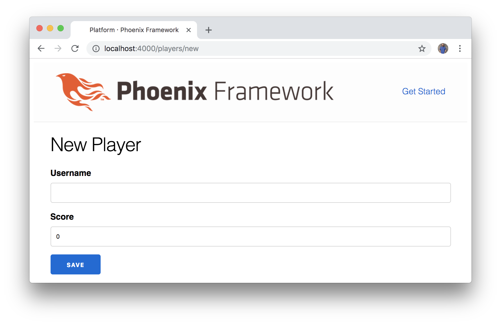
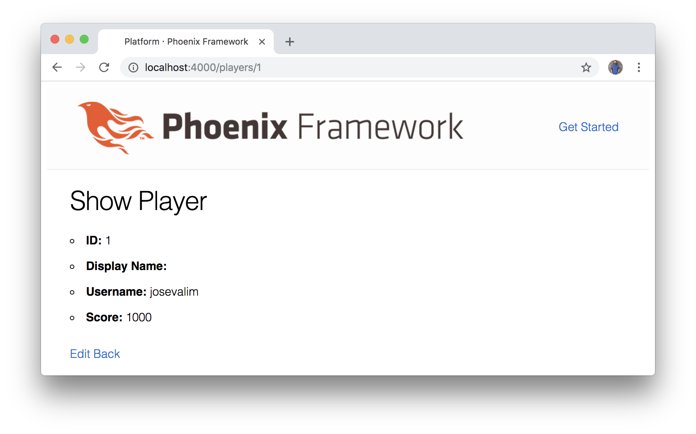
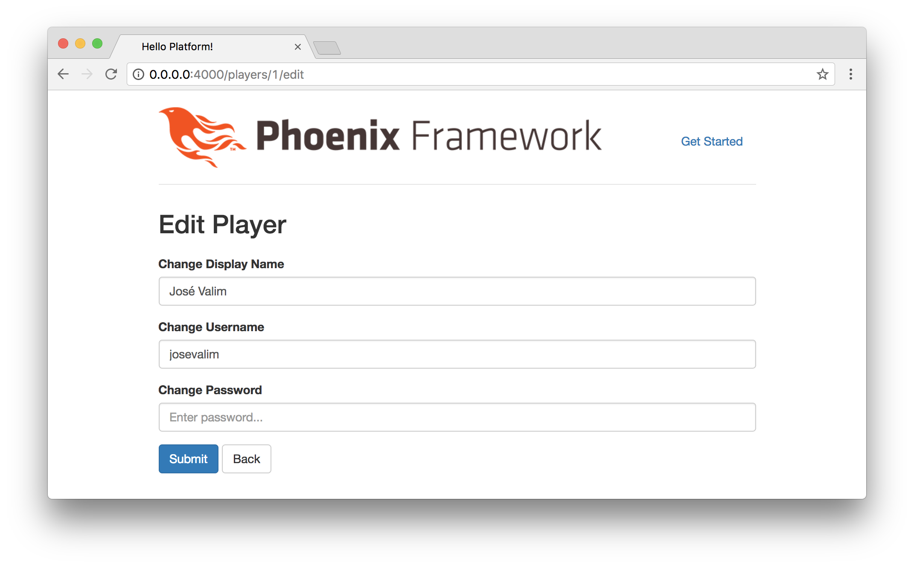
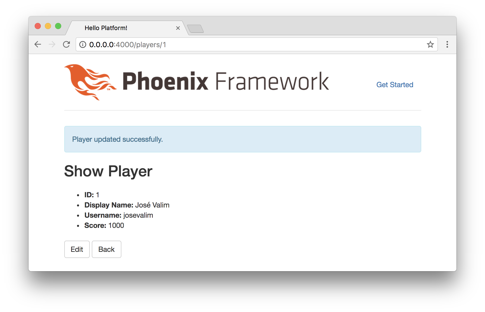

# Phoenix Sign Up

There are multiple options available for handling player sign up and sign in
features. In our case, we want to keep things straightforward so that players
can sign up easily and play games on our platform, which means we'll forego
asking them for their email or building out a full featured authentication
system.

We're also eager to start using Elm to build the front-end, so we're going to
take a simple approach. We'll use Phoenix to handle authentication initially,
and once users are signed in, they'll be redirected to the Elm front-end
application we'll be building. We'll need to refactor some of these features
later, but this approach will provide a quick way for players to sign up as we
extend the player resource features we generated previously.

## Extending Player Account Features

First, let's take a look at the existing features provided in the
`Platform.Accounts` module we created earlier. Check out the functions
available in the `lib/platform/accounts/accounts.ex` file:

```elixir
defmodule Platform.Accounts do
  @moduledoc """
  The Accounts context.
  """

  import Ecto.Query, warn: false
  alias Platform.Repo

  alias Platform.Accounts.Player

  @doc """
  Returns the list of players.

  ## Examples

      iex> list_players()
      [%Player{}, ...]

  """
  def list_players do
    Repo.all(Player)
  end

  # ...

end
```

Inside this module, there's a `list_players/0` function that will fetch all the
`Player` records from the database. We can think of `Repo` as an abstraction
for our database, so `Repo.all(Player)` means we'll query for all the players
we have stored.

We can test out this function using `iex` to interactively query for our
existing player records. First, we'll start the interactive Elixir prompt:

```shell
$ iex -S mix phx.server
```

Now we can query for our players with the following:

```elixir
iex> Platform.Accounts.list_players
[debug] QUERY OK source="players" db=3.0ms decode=3.7ms
SELECT a0."id", a0."score", a0."username", a0."inserted_at", a0."updated_at" FROM "players" AS a0 []
[%Platform.Accounts.Player{__meta__: #Ecto.Schema.Metadata<:loaded, "players">,
  id: 1, inserted_at: ~N[2017-04-08 14:55:28.674971], score: 1000,
  updated_at: ~N[2017-04-08 14:55:28.681607], username: "josevalim"},
 %Platform.Accounts.Player{__meta__: #Ecto.Schema.Metadata<:loaded, "players">,
  id: 2, inserted_at: ~N[2017-04-08 14:55:34.139085], score: 2000,
  updated_at: ~N[2017-04-08 14:55:34.139091], username: "evancz"}]
```

This function provides a good demonstration of how Phoenix uses well-named
functions to abstract away implementation details and make things easy to use.
It means we can use the `list_players/0` function to fetch all the players from
the database for our **List Players** page.


Similarly, the `Platform.Accounts` module contains a `get_player!/1` function
that's useful for our **Show Player** page, a `create_player/1` function that's
useful for our **New Player** page, an `update_player/2` function that's useful
for our **Edit Player** page, and a `delete_player/1` function that we can use
to remove player accounts.

## Player Fields

When we created our players resource, we ran the generator to create two fields:

- `username`
- `score`

It looks like Phoenix also included a couple of other fields by default:

- `id`
- `inserted_at`
- `updated_at`

## Adding Fields

We have some existing fields for our players, but what if we want to add new
fields? We'll not only have to update our application, but also update our
database.

Let's add a couple of new fields for our player accounts:

- `display_name`
- `password`
- `password_digest`

We'll use a `display_name` field so players can display something other than
their `username` inside a game. We'll also create a "virtual" field called
`password` that users will enter on the sign up form. But we'll only use the
`password_digest` field to store a secure hash for user passwords, so we're
never storing the `password` field in plain text.

## Updating the Player Schema

Let's update the `lib/platform/accounts/player.ex` file with the following:

```elixir
defmodule Platform.Accounts.Player do
  use Ecto.Schema
  import Ecto.Changeset
  alias Platform.Accounts.Player


  schema "players" do
    field :display_name, :string
    field :password, :string, virtual: true
    field :password_digest, :string
    field :score, :integer
    field :username, :string

    timestamps()
  end

  @doc false
  def changeset(%Player{} = player, attrs) do
    player
    |> cast(attrs, [:display_name, :password, :score, :username])
    |> validate_required([:username])
  end
end
```

We're adding our new fields to the `"players"` schema. Each of our new fields
is a `:string` type, and also note that the `password` field is marked with
`virtual: true`.

## Player Changeset

In the code example above, note that we didn't just change the player schema.
We also updated the `changeset/2` function. The
[`Ecto.Changeset`](https://hexdocs.pm/ecto/Ecto.Changeset.html) module allows
us to filter, cast, and validate our data. In our case, we only want to use the
`validate_required/1` function to verify that a new player enters a `username`
so they can sign up for an account easily. We'll also require the `password`
field later, but we'll need to implement additional functionality before we can
get that working properly.

Although the `display_name` field isn't required when users sign up for an
account, we want them to be able to change this field on the **Edit Player**
page, so we add it to the `cast/2` function along with the other fields.

## Generating a Migration

Now we'll need to update the database so it knows about the new fields we we're
adding to our players. Let's run the following command to generate a migration
file:

```shell
$ mix ecto.gen.migration add_fields_to_player_accounts
```

And we should see output showing that it successfully generated the migration
file, which we'll update next:

```shell
$ mix ecto.gen.migration add_fields_to_player_accounts
* creating priv/repo/migrations
* creating priv/repo/migrations/20170812150719_add_fields_to_player_accounts.exs
```

Let's update the migration file that we created in the `priv/repo/migrations`
folder before we actually run the migration. We'll `alter` the existing
`players` database table and add the new fields. We'll also add a
`unique_index` at the bottom to ensure that each player has a unique `username`
field:

```elixir
defmodule Platform.Repo.Migrations.AddFieldsToPlayerAccounts do
  use Ecto.Migration

  def change do
    alter table(:players) do
      add :display_name, :string
      add :password_digest, :string
    end

    create unique_index(:players, [:username])
  end
end
```

## Running the Migration

Now we can run the migration to update our database. This is the command we
use to run our database migrations:

```shell
$ mix ecto.migrate
```

When the migrations are successful, we should see output like this:

```shell
$ mix ecto.migrate
11:11:29.028 [info]  == Running Platform.Repo.Migrations.AddFieldsToPlayerAccounts.change/0 forward
11:11:29.028 [info]  alter table players
11:11:29.046 [info]  create index players_username_index
11:11:29.051 [info]  == Migrated in 0.0s
```

## Updating Our Application

Let's update our application to work with our new player account fields.

We'll start with what we want our users to do when they first sign up. Open up
the `lib/platform_web/templates/player/new.html.eex` file:

```embedded_elixir
<h2>New Player</h2>

<%= render "form.html", Map.put(assigns, :action, player_path(@conn, :create)) %>

<span><%= link "Back", to: player_path(@conn, :index) %></span>
```

From the looks of the code here, the page is rendering a `"form.html"` file,
which is shared between our **New Player** page and **Edit Player** page. But
we want slightly different behavior for our application. We want users to be
able to sign up with minimal effort by entering only a `username` and
`password`. Once they're signed up, they can enter additional fields like their
`display_name`.

## Working with Forms

Here's what our original **New Player** page looks like:



We don't actually want our players to be able to manually enter their scores,
because the games should track player scores and update their accounts in
real-time. For now, we just want players to create a `username` and `password`
to sign up.

We're going to move part of the `form.html.eex` file over to the `new.html.eex`
file. We'll also create a form in the `edit.html.eex` file, and ultimately we'll
be able to delete the shared `form.html.eex` file as a result.

Let's start by updating our `new.html.eex` file:

```embedded_elixir
<h2>New Player</h2>

<%= form_for @changeset, player_path(@conn, :create), fn f -> %>
  <%= if @changeset.action do %>
    <div class="alert alert-danger">
      <p>Oops, something went wrong! Please check the errors below.</p>
    </div>
  <% end %>

  <div class="form-group">
    <%= label f, :username, "Player Username", class: "control-label" %>
    <%= text_input f, :username, placeholder: "Enter username...", class: "form-control" %>
    <%= error_tag f, :username %>
  </div>

  <div class="form-group">
    <%= label f, :password, "Player Password", class: "control-label" %>
    <%= password_input f, :password, placeholder: "Enter password...", class: "form-control" %>
    <%= error_tag f, :password %>
  </div>

  <div class="form-group">
    <%= submit "Submit", class: "btn btn-primary" %>
    <span><%= link "Back", to: page_path(@conn, :index), class: "btn btn-default" %></span>
  </div>
<% end %>
```

We're basically moving some of the content from the `form.html.eex` file into
our `new.html.eex` file along with some minor changes. On a successful
submission, we're using the `create` action from our player controller. We also
have a **Back** button at the bottom that allows users to navigate back to the
default home page. This is what it should look like in the browser:


## Show Player Page

After a new user is created, the application currently redirects them to the
**Show Player** page. When we have the full platform application built out later,
we'll probably want to redirect them to a list of games to play. But for now
we'll update this page to display all the relevant fields for the player's
account:

- `id`
- `display_name`
- `username`
- `score`

We can work towards making this page look nicer with styles later, but for now
let's update the `lib/platform_web/templates/player/show.html.eex` file with
the following:

```embedded_elixir
<h2>Show Player</h2>

<ul>
  <li><strong>ID: </strong><%= @player.id %></li>
  <li><strong>Display Name: </strong><%= @player.display_name %></li>
  <li><strong>Username: </strong><%= @player.username %></li>
  <li><strong>Score: </strong><%= @player.score %></li>
</ul>

<span><%= link "Edit", to: player_path(@conn, :edit, @player), class: "btn btn-default" %></span>
<span><%= link "Back", to: page_path(@conn, :index), class: "btn btn-default" %></span>
```

We display all the relevant data on the page, and added a few classes to the
buttons at the bottom to make things look nicer. Users can choose to **Edit**
their accounts from here, and if they click the **Back** button they can
navigate back to the home page.



## Edit Player Page

For the **Edit Player** page, we're going to do much of the same that we did
for the **New Player** page. We want users to be able to adjust their
`username` and `display_name` fields for example, but they shouldn't be able to
manually alter their `score` field since that data should be coming from the
games they play on the platform. Since we won't have a full authentication
system with a reset password feature, we'll also allow users to change their
`password` as needed on this page.

Update the `lib/platform_web/templates/player/edit.html.eex` file to contain
the following:

```embedded_elixir
<h2>Edit Player</h2>

<%= form_for @changeset, player_path(@conn, :update, @player), fn f -> %>
  <%= if @changeset.action do %>
    <div class="alert alert-danger">
      <p>Oops, something went wrong! Please check the errors below.</p>
    </div>
  <% end %>

  <div class="form-group">
    <%= label f, :display_name, "Change Display Name", class: "control-label" %>
    <%= text_input f, :display_name, placeholder: "Enter display name...", class: "form-control" %>
    <%= error_tag f, :display_name %>
  </div>

  <div class="form-group">
    <%= label f, :username, "Change Username", class: "control-label" %>
    <%= text_input f, :username, placeholder: "Enter username...", class: "form-control" %>
    <%= error_tag f, :username %>
  </div>

  <div class="form-group">
    <%= label f, :password, "Change Password", class: "control-label" %>
    <%= text_input f, :password, placeholder: "Enter password...", class: "form-control" %>
    <%= error_tag f, :password %>
  </div>

  <div class="form-group">
    <%= submit "Submit", class: "btn btn-primary" %>
    <span><%= link "Back", to: page_path(@conn, :index), class: "btn btn-default" %></span>
  </div>
<% end %>
```

After saving that file, we can go back to the **Edit Player** page and change
the `display_name` field for one of our players:



On submission, we'll be redirected to the **Show Player** page and see that the
field was successfully changed:



## Shared Form

Now that we've adjusted our **New Player** page and our **Edit Player**
page, we're able to delete the `form.html.eex` file that was shared between
them since it's no longer used anywhere.

## Database Seeds

Now that we have all the fields we want to work with, it can be helpful to add
some default data seeds for our application. Instead of manually creating new
database records while we're working in the development environment, this gives
us a quick way to seed the database.

The other benefit of this approach is that other developers can clone our
repository and run the `mix ecto.setup` command to create the database, run
migrations, and seed the application with some sample data.

Open the `priv/repo/seeds.exs` file:

```elixir
# Script for populating the database. You can run it as:
#
#     mix run priv/repo/seeds.exs
#
# Inside the script, you can read and write to any of your
# repositories directly:
#
#     Platform.Repo.insert!(%Platform.SomeSchema{})
#
# We recommend using the bang functions (`insert!`, `update!`
# and so on) as they will fail if something goes wrong.
```

We can see that this file only contains comments initially. But these comments
are a helpful indication of what we can do to add seeds for our data. Let's add
a couple of sample records with the following:

```elixir
# Script for populating the database. You can run it as:
#
#     mix run priv/repo/seeds.exs
#
# Inside the script, you can read and write to any of your
# repositories directly:
#
#     Platform.Repo.insert!(%Platform.SomeSchema{})
#
# We recommend using the bang functions (`insert!`, `update!`
# and so on) as they will fail if something goes wrong.
Platform.Repo.insert!(%Platform.Accounts.Player{display_name: "José Valim", username: "josevalim", score: 1000})
Platform.Repo.insert!(%Platform.Accounts.Player{display_name: "Evan Czaplicki", username: "evancz", score: 2000})
```

At the top of the file, the comments show that we can run the
`mix run priv/repo/seeds.exs` command to populate the database with any seed
data we add to this file. But keep in mind that we may have already created
these records manually, and we did add a constraint to our database to make
sure that the `username` fields are unique. The good news is we can always
adjust this file with sample data to work with. By doing that, we don't have to
worry about manually creating records in our development environment to test
things out.

In fact, there's a command we can use often if we end up creating extraneous
data in our development environment and want to start fresh. If you have records
that you created locally and you don't want to lose them, then DON'T run this
command! But if you ever run into database issues, running `mix ecto.reset` can
be a lifesaver. It drops the existing database (don't say I didn't warn you),
creates a new one, runs all the migrations, and then seeds the database.

Here's what it looks like in action:

```shell
$ mix ecto.reset
The database for Platform.Repo has been dropped
The database for Platform.Repo has been created

12:27:16.348 [info]  == Running Platform.Repo.Migrations.CreatePlayers.change/0 forward
12:27:16.348 [info]  create table players
12:27:16.354 [info]  == Migrated in 0.0s
12:27:16.394 [info]  == Running Platform.Repo.Migrations.AddFieldsToPlayerAccounts.change/0 forward
12:27:16.394 [info]  alter table players
12:27:16.396 [info]  create index players_username_index
12:27:16.398 [info]  == Migrated in 0.0s

[debug] QUERY OK db=4.0ms queue=2.8ms
INSERT INTO "players" ("display_name","score","username","inserted_at","updated_at") VALUES ($1,$2,$3,$4,$5) RETURNING "id" ["José Valim", 1000, "josevalim", {{2017, 4, 8}, {16, 27, 16, 501546}}, {{2017, 4, 8}, {16, 27, 16, 501552}}]
[debug] QUERY OK db=2.1ms
INSERT INTO "players" ("display_name","score","username","inserted_at","updated_at") VALUES ($1,$2,$3,$4,$5) RETURNING "id" ["Evan Czaplicki", 2000, "evancz", {{2017, 4, 8}, {16, 27, 16, 519697}}, {{2017, 4, 8}, {16, 27, 16, 519703}}]
```

## Saving Our Progress

Since we've made quite a few changes, now would be a good time to run our tests
locally with `mix test`:

```shell
$ mix test
Compiling 2 files (.ex)
....................

Finished in 0.2 seconds
20 tests, 0 failures
```

If everything is passing, let's go ahead and commit our changes:

```shell
$ git add .
$ git commit -m "Update player fields and adjust templates"
```

We can hold off on pushing this to production because we want to tackle
authentication first, and that will be the topic of our next chapter.

## Summary

We managed to accomplish a lot in this chapter. First, we learned how to add
fields to our players and update the database accordingly. We also got some
experience working with templates and designing how we want our users to
interact with our application. We're going to be working with Elm for the
front-end of our application in this book, but this chapter gave a good
introduction into what it feels like to add features to a Phoenix application.

The first step towards adding authentication features is taken care of, and
we'll work towards working sign up and sign in features in the next chapter.
