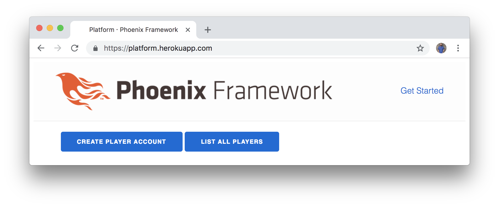
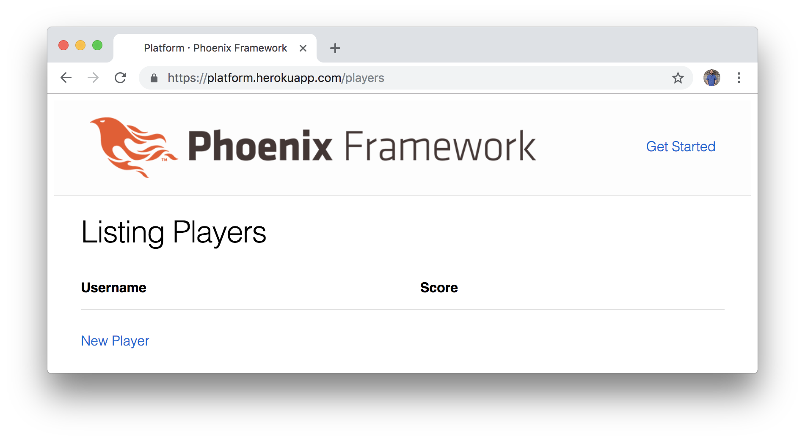

# Phoenix Testing and Deployment

Now that we have some familiarity with Elixir, let's get back to our Phoenix
application. In this chapter, we're going to be working with Phoenix tests,
GitHub version control, and Heroku deployment.

If you're already familiar with these concepts and only want to work locally
for this project, feel free to skim through the content. Even if you decide to
skip the Heroku deployment, the concepts here are important. Keeping our tests
passing and consistently checking in our code contributes to a sane development
workflow.

## Running Phoenix Tests

In the last chapter, we learned that we could use the `mix test` command to run
the tests for our simple Elixir project. We can do the same thing for our
Phoenix project. Let's go to our `platform` folder and run `mix test` (the
results below have been cleaned up for readability):

```shell
$ mix test
...................

  1) test GET / (PlatformWeb.PageControllerTest)
     test/platform_web/controllers/page_controller_test.exs:4
     Assertion with =~ failed
     code:  assert html_response(conn, 200) =~ "Welcome to Phoenix!"
     left:  "<!DOCTYPE html><html lang=\"en\"><body><div class=\"container\"><main role=\"main\">\n<a class=\"btn btn-success\" href=\"/players/new\">Create Player Account</a>\n<a class=\"btn btn-info\" href=\"/players\">List All Players</a></main></div></body></html>"
     right: "Welcome to Phoenix!"
     stacktrace:
       test/platform_web/controllers/page_controller_test.exs:6: (test)

Finished in 0.2 seconds
19 tests, 1 failure

Randomized with seed 905
```

The good news is it looks like we already have 19 tests. Some of them came with
Phoenix by default when we ran `mix phx.new platform`. Other tests were created
when we ran the `mix phx.gen.html` generator for our players resource.

The bad news is one of our tests is no longer passing due to the changes we
made to our home page. Let's take a look at the
`test/platform_web/controllers/page_controller_test.exs` file:

```elixir
defmodule PlatformWeb.PageControllerTest do
  use PlatformWeb.ConnCase

  test "GET /", %{conn: conn} do
    conn = get conn, "/"
    assert html_response(conn, 200) =~ "Welcome to Phoenix!"
  end
end
```

It looks like this test is making an HTTP `get` request to the default route
(`"/"`). If we look at the `http://localhost:4000/` URL, you can think of that
trailing slash as the default `/` route.

Our test is expecting the text `"Welcome to Phoenix!"` to appear somewhere on
the page, but remember that we replaced the default Phoenix page.

Keep in mind that we don't need a full understanding of everything going on in
the tests yet. For now, we just want to get back to where all the tests are
passing. In this case, a quick fix is to assert that the home page contains the
word `"Players"` instead of `"Welcome to Phoenix!"`. This is admittedly a
brittle test that's subject to break when we make changes to our home page, but
since we're making a game platform, it's likely that our home page is going to
say `"Players"` somewhere, and this test still allows us to ensure that our
home page is loading properly. Let's go ahead and update our test with the
following:

```elixir
defmodule PlatformWeb.PageControllerTest do
  use PlatformWeb.ConnCase

  test "GET /", %{conn: conn} do
    conn = get conn, "/"
    assert html_response(conn, 200) =~ "Players"
  end
end
```

We can run our tests again, and we should see all green:

```shell
$ mix test
....................

Finished in 0.3 seconds
19 tests, 0 failures

Randomized with seed 187055
```

## Git and GitHub

Now that all our tests are passing and our application is in working condition,
let's go ahead and commit what we have so far and push it to GitHub.

We won't cover version control in detail in this book, and you're welcome to
skip the parts with `git` commands if you'd like. But it's a good idea to keep
a history of your project so you can always recover from mistakes. This will
also help when it comes time to deploy our application to Heroku.

If you have [Git](https://git-scm.com/) installed, run the following commands
inside the `platform` folder to commit what we have so far:

```shell
$ git init
$ git add .
$ git commit -m "Initial Phoenix platform application"
```

If you have a GitHub account, you can create a new public repository at
https://github.com/new. Give it the name `platform`, and then the following
commands will allow us to push our local application to GitHub (you'll need to
add your username on the first line):

```shell
$ git remote add origin https://github.com/YOUR-GITHUB-USERNAME/platform.git
$ git push -u origin master
```

Keep in mind that the audience for this book is expected to have some experience
with these topics already. Feel free to take your time, skim quickly, or skip
ahead as needed.

## Heroku

For those that haven't used [Heroku](https://www.heroku.com) before, it
essentially gives us an easy and free way to deploy our application and see it
running live.

It's not always an ideal deployment environment for Elixir applications, but
it's perfect for our purposes, because we're just looking for the simplest way
to get our application up and running.

Sign up for a Heroku account if you haven't already, and then our deployments
will be as simple as running `git push heroku master` when we're ready.

## Heroku Setup

After you've signed up for a Heroku account, create a free app using their web
interface (the name `platform` will already be taken, so you'll have to come up
with a name you like or allow Heroku to choose a random name for you). Then,
download the [Heroku toolbelt](https://toolbelt.heroku.com) command line tool.

Once you have that installed, you can run the `heroku login` command to sign in
to your account. Since we have an existing Git repository, we can use the
following command to add our application to Heroku:

```shell
$ heroku git:remote -a YOUR-HEROKU-APP-NAME
```

Now inside our `platform` folder, we can run the `git remote` command and see
that we now have two remotes for our project:

```shell
$ git remote
heroku
origin
```

When we push to `origin`, we'll be pushing our project to GitHub. When we push
to `heroku`, we'll be pushing our project to Heroku.

Before we can do that, we'll have to set things up for Heroku to know what
kind of application we're building. We'll add a couple of "buildpacks" to set
things up:

```shell
$ heroku buildpacks:add https://github.com/HashNuke/heroku-buildpack-elixir.git
$ heroku buildpacks:add https://github.com/gjaldon/heroku-buildpack-phoenix-static.git
```

Keep in mind that these commands won't make changes to our local files. If we
run the `git status` command, we'll see that nothing has changed. But we should
see the following output to let us know that our Heroku app is configured to
work with the Elixir code that we're going to send:

```shell
$ heroku buildpacks:add https://github.com/HashNuke/heroku-buildpack-elixir.git
Buildpack added. Next release on platform will use https://github.com/HashNuke/heroku-buildpack-elixir.git.
Run git push heroku master to create a new release using this buildpack.
$ heroku buildpacks:add https://github.com/gjaldon/heroku-buildpack-phoenix-static.git
Buildpack added. Next release on platform will use:
  1. https://github.com/HashNuke/heroku-buildpack-elixir.git
  2. https://github.com/gjaldon/heroku-buildpack-phoenix-static.git
Run git push heroku master to create a new release using these buildpacks.
```

To set up the correct versions and settings we need for our application, create
a file called `elixir_buildpack.config` in the `platform` folder. Inside the
file, add the following contents:

```config
erlang_version=20.0
elixir_version=1.7.0
always_rebuild=true
```

Since we're using the latest versions of Erlang, Elixir, and Phoenix, these
settings are necessary for the deployment to work.

## Heroku Configuration

There are still a couple more steps we need to take to make sure our application
is ready to be pushed live to Heroku. Let's create a `Procfile` to tell
Heroku which command we want to run to start the Phoenix server. Create a file
called `Procfile` inside the `platform` folder, and add the following code:

```Procfile
web: MIX_ENV=prod mix phx.server
```

Now we'll need to set some environment variables on Heroku. These are
configuration settings we'll need to get our app running. If we run the
`heroku config` command right now, we'll see that we don't currently have any
variables set up:

```shell
$ heroku config
=== platform Config Vars
```

Since we're using PostgreSQL for our Phoenix application, we'll also want to
create a free Heroku add-on for our project with the following command:

```shell
$ heroku addons:create heroku-postgresql:hobby-dev
```

This is what the output should look like:

```shell
$ heroku addons:create heroku-postgresql:hobby-dev
Creating heroku-postgresql:hobby-dev on ⬢ platform... free
Database has been created and is available
 ! This database is empty. If upgrading, you can transfer
 ! data from another database with pg:copy
Created ... as DATABASE_URL
Use heroku addons:docs heroku-postgresql to view documentation
```

If we run `heroku config` again, we'll see that we now have a `DATABASE_URL`
variable configured (the actual URL has been removed in this example):

```shell
$ heroku config
=== platform Config Vars
DATABASE_URL: postgres://...
```

We'll also need to set a `SECRET_KEY_BASE` environment variable for production.
Phoenix can generate a secret key for us with the following command (note that
your key will be different from the example shown below):

```shell
$ mix phx.gen.secret
ChVyb+s5O6qVKZabMCWwDPYHJbYqMpWppTZFZmsnULd+PDyXqQU36H8Rs6HXU0nl
```

Then we can take that key and set it as the Heroku environment variable with
the following command (don't forget to replace the example key shown here with
the one you generated above):

```shell
$ heroku config:set SECRET_KEY_BASE="ChVyb+s5O6qVKZabMCWwDPYHJbYqMpWppTZFZmsnULd+PDyXqQU36H8Rs6HXU0nl"
```

Now when we run the `heroku config` command we should be able to see the
settings for both the `DATABASE_URL` and the `SECRET_KEY_BASE`.

```shell
$ heroku config
=== platform Config Vars
DATABASE_URL: ...
SECRET_KEY_BASE: ...
```

## Production Deploy

Lastly, we need to make a few changes to the `prod.exs` file in the `config`
folder. Open that file and you'll see the following code along with a lot of
explanatory comments:

```elixir
config :platform, PlatformWeb.Endpoint,
  http: [:inet6, port: System.get_env("PORT") || 4000],
  url: [host: "example.com", port: 80],
  cache_static_manifest: "priv/static/cache_manifest.json"
```

Let's make a couple of changes so it looks like this (replace
`YOUR-HEROKU-APP-NAME` with the app name you created on Heroku):

```elixir
config :platform, PlatformWeb.Endpoint,
  http: [:inet6, port: System.get_env("PORT") || 4000],
  url: [scheme: "https", host: "YOUR-HEROKU-APP-NAME.herokuapp.com", port: 443],
  force_ssl: [rewrite_on: [:x_forwarded_proto]],
  cache_static_manifest: "priv/static/cache_manifest.json",
  secret_key_base: Map.fetch!(System.get_env(), "SECRET_KEY_BASE")
```

This allows us to set the `port`, the `host` name, and `secret_key_base`. We're
also configuring our app to use `https`. Right below that configuration code,
we also want to add a new block of code to configure our database:

```elixir
# Database configuration
config :platform, Platform.Repo,
  adapter: Ecto.Adapters.Postgres,
  url: System.get_env("DATABASE_URL"),
  pool_size: String.to_integer(System.get_env("POOL_SIZE") || "10"),
  ssl: true
```

If you scroll down to the very bottom of the `prod.exs` file, you'll see a line
to import a secret configuration file. Since we're using environment variables
for Heroku, we won't need this. Let's comment that line out by placing a `#`
character at the beginning of the line:

```elixir
# Finally import the config/prod.secret.exs
# which should be versioned separately.
# import_config "prod.secret.exs"
```

You can also delete the `prod.secret.exs` file if you'd like since we won't
need it anymore.

## Static Asset Compilation

Phoenix uses [Webpack](https://webpack.js.org) to compile the static assets for
the front-end. We already added the Heroku buildpack for Phoenix static assets,
and now we just need to add configuration files to compile the assets as we
deploy our application to the production environment.

The buildpack we're using is highly configurable, and we can take a look at the
[configuration options](https://github.com/gjaldon/heroku-buildpack-phoenix-static#configuration)
available in the README. We're going to stick with the default options, but
we'll need to add a shell script file called `compile` (note that there's no
file extension and the file is simply named `compile`).

Let's go ahead and create our `compile` file now at the root of our project and
add the following contents:

```shell
npm run deploy
cd $phoenix_dir
mix "${phoenix_ex}.digest"
```

This allows our application to compile the front-end assets whenever we deploy
to Heroku. It runs the `"deploy"` script from the `package.json` file that's
located in the `assets` folder of our Phoenix project. That script runs the
`webpack --mode production` command for our front-end assets. Then, the
`compile` script changes back to the root Phoenix directory and runs the
`mix phx.digest` command to compress all our static files for the production
environment.

## Deployment

Let's run our tests one more time to make sure we didn't break anything:

```shell
$ mix test
```

If everything is still passing, we'll commit our latest changes. If you ran
into any issues, check out the Phoenix docs for a similar set of steps for
[deploying an application to Heroku](https://hexdocs.pm/phoenix/heroku.html).

```shell
$ git add .
$ git commit -m "Update production configuration"
```

We'll push the updates to GitHub first:

```shell
$ git push origin master
```

And now (the moment we've all been waiting for), we can push to Heroku:

```shell
$ git push heroku master
```

We'll see _a lot_ of output when we deploy. If something goes wrong with the
deployment, it will let us know. Don't worry too much if you run into an issue
or two, because this process is admittedly tedious. The likelihood of
forgetting a comma or confusing the application names is high, but it's usually
just a matter of calmly working through any errors you come across. There are
Stack Overflow sections for both
[Heroku](https://stackoverflow.com/questions/tagged/heroku)
and [Phoenix](https://stackoverflow.com/questions/tagged/phoenix-framework)
that can be really useful if you run into issues.

It's worth the trouble once we get to see our app up and running live in
production!

## Up and Running

Once the deploy finishes, our app is finally up and running on Heroku! Inside
the `platform` folder, let's run the following from the command line to
see our application running on Heroku:

```shell
$ heroku open
```



Our application is working in production!

## Running Migrations

Now that we managed to successfully get our application up and running on
Heroku, we can take one more step to automate our database migrations each time
we deploy to production.

Open up the `Procfile` we created before, and add a new `release` line at the
top of the file:

```shell
release: MIX_ENV=prod mix ecto.migrate
web: MIX_ENV=prod mix phoenix.server
```

This allows us to automate the database migrations before the Phoenix web
server starts in the production environment. And our app should now be fully
functional on Heroku with a working production database.



## Summary

In this chapter, we were able to get all our Phoenix tests passing, push our
code to GitHub, and deploy our application successfully to Heroku!

We're off to a solid start for our platform. Our back-end is up and running,
and we've picked up some introductory knowledge about Phoenix and Elixir. In
the next chapter, we'll learn more about Phoenix as we extend our player
features and allow new users to sign up.
