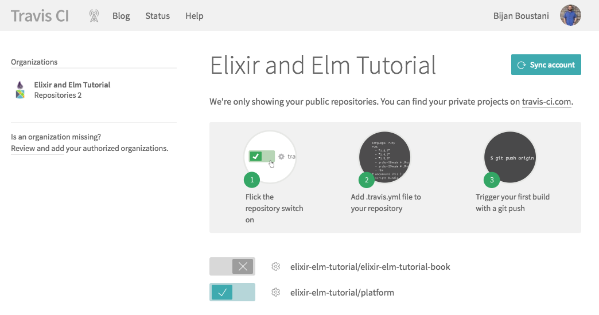

# Phoenix Testing and Deployment

Now that we have some familiarity with Elixir, let's get back to our Phoenix
application. In this chapter, we're going to be working with Phoenix tests,
GitHub version control, and Heroku deployment.

If you're already familiar with these concepts and only want to work locally
for this project, feel free to skim through the content. Even if you decide to
skip the Heroku deployments, the concepts here are important. Keeping our tests
passing and consistently checking in our code contributes to a sane development
workflow.

## Running Phoenix Tests

In the last chapter, we learned that we could use the `mix test` command to run
the tests for our simple Elixir project. We can do the same thing for our
Phoenix project. Let's go to our `platform` folder and run `mix test` (the
results below have been cleaned up for readability):

```shell
$ mix test
...................

  1) test GET / (PlatformWeb.PageControllerTest)
     test/platform_web/controllers/page_controller_test.exs:4
     Assertion with =~ failed
     code:  assert html_response(conn, 200) =~ "Welcome to Phoenix!"
     left:  "<!DOCTYPE html><html lang=\"en\"><head>...</head><body><div class=\"container\"><header class=\"header\">...</header><main role=\"main\">\n<a class=\"btn btn-success\" href=\"/players/new\">Create Player Account</a>\n<a class=\"btn btn-info\" href=\"/players\">List All Players</a></main></div></body></html>"
     right: "Welcome to Phoenix!"
     stacktrace:
       test/platform_web/controllers/page_controller_test.exs:6: (test)

Finished in 0.2 seconds
20 tests, 1 failure

Randomized with seed 905
```

The good news is that it looks like we already have 20 tests. Some of them
came with Phoenix by default when we ran `mix phx.new platform`. Other tests
were created when we ran the `mix phx.gen.html` generator for our players
resource.

The bad news is that one of our tests is no longer passing. Let's take a look at
the `test/platform_web/controllers/page_controller_test.exs` file:

```elixir
defmodule PlatformWeb.PageControllerTest do
  use PlatformWeb.ConnCase

  test "GET /", %{conn: conn} do
    conn = get conn, "/"
    assert html_response(conn, 200) =~ "Welcome to Phoenix!"
  end
end
```

It looks like it's making an HTTP `get` request to the default route (`"/"`).
If we look at the `http://0.0.0.0:4000/` URL, you can think of that trailing
slash as the default `/` route.

Our test is expecting the text `"Welcome to Phoenix!"` to appear somewhere on
the page, but remember that we replaced the default Phoenix page.

Keep in mind that we don't need a full understanding of everything going on in
the tests yet, and for now we just want to get back to where everything is
passing. In this case, it seems like it's a quick fix, and we can just assert
that the home page contains the word `"Players"` somewhere instead of "Welcome to
Phoenix!". This is admittedly a brittle test that is subject to break when we
make changes to our home page, but since we're making a game platform, it's
likely that our home page is going to say `"Players"` somewhere, and this
test still does a good job of making sure that our home page loads properly.
Let's go ahead and update our test with the following:

```elixir
defmodule PlatformWeb.PageControllerTest do
  use PlatformWeb.ConnCase

  test "GET /", %{conn: conn} do
    conn = get conn, "/"
    assert html_response(conn, 200) =~ "Players"
  end
end
```

We can run our tests again, and we should see all green:

```shell
$ mix test
....................

Finished in 0.4 seconds
20 tests, 0 failures

Randomized with seed 187055
```

## Git and GitHub

Now that all of our tests are passing and our application is in a good working
condition, let's go ahead and commit what we have so far and push it to GitHub.

We won't cover version control in detail in this book, and you're welcome to
skip the parts with `git` commands if you'd like. But it's a good idea to keep
a history of your project so you can always recover from mistakes. This will
also help when it comes time to deploy our application to Heroku.

From inside the `platform` folder, we can run the following commands to commit
what we have so far to git:

```shell
$ git init
$ git add .
$ git commit -m "Initial Phoenix platform application"
```

If you have a GitHub account, you can create a new public repository at
https://github.com/new. Give it the name of `platform`, and then the following
commands will allow us to push our local application to GitHub (keeping in mind
that you'll need to add your username on the first line):

```shell
$ git remote add origin https://github.com/YOURUSERNAME/platform.git
$ git push -u origin master
```

Keep in mind that the audience for this book is expected to have some experience
with these topics already. Feel free to take your time or skim quickly or skip
ahead as needed.

## Heroku

For those that haven't used [Heroku](https://www.heroku.com) before, it
essentially gives us an easy and free way to deploy our application and see it
running live in the real world.

It's not always an ideal deployment environment for Elixir applications, but
it's perfect for our purposes because we're just looking for the simplest way
to get our application up and running.

Sign up for a Heroku account if you haven't already, and then our deployments
will be as simple as running `git push heroku master` when we're ready.

## Heroku Setup

After you've signed up for a Heroku account, create a free app using their web
interface (the name `platform` will already be taken, so you'll have to come up
with a name you'd like or allow Heroku to choose a random name for you). Then
download the [Heroku toolbelt](https://toolbelt.heroku.com) command line tool.

Once you have that installed, you can run the `heroku login` command to sign in
to your account. Since we have an existing Git repository, we can use the
following command to add our application to Heroku:

```shell
$ heroku git:remote -a platform
```

Now inside our `platform` folder, we can run the `git remote` command and see
that we now have two remotes for our project:

```shell
$ git remote
origin
heroku
```

When we push to `origin`, we'll be pushing our project to GitHub. When we push
to `heroku`, we'll be pushing our project to Heroku.

Before we can do that, we'll have to set things up for Heroku to know what
kind of application we're building. We'll add a couple of "buildpacks" to set
things up:

```shell
$ heroku buildpacks:add https://github.com/HashNuke/heroku-buildpack-elixir.git
$ heroku buildpacks:add https://github.com/gjaldon/heroku-buildpack-phoenix-static.git
```

Keep in mind that these commands won't make changes to our local files. If we
run the `git status` command, we'll see that nothing has changed. But we should
see the following output to let us know that our Heroku app is configured to
work with the Elixir code that we're going to send:

```shell
$ heroku buildpacks:add https://github.com/HashNuke/heroku-buildpack-elixir.git
Buildpack added. Next release on platform will use https://github.com/HashNuke/heroku-buildpack-elixir.git.
Run git push heroku master to create a new release using this buildpack.
$ heroku buildpacks:add https://github.com/gjaldon/heroku-buildpack-phoenix-static.git
Buildpack added. Next release on platform will use:
  1. https://github.com/HashNuke/heroku-buildpack-elixir.git
  2. https://github.com/gjaldon/heroku-buildpack-phoenix-static.git
Run git push heroku master to create a new release using these buildpacks.
```

To set up the correct versions we need for our application, create a file
called `elixir_buildpack.config` in the `platform` folder.

```config
erlang_version=19.0
elixir_version=1.4.2
```

Since we're using the latest versions of Erlang, Elixir, and Phoenix, these
settings are necessary for the deployment to work.

## Heroku Configuration

There are still a couple more steps we need to take to make sure our application
is secured to be pushed live to Heroku. Let's create a `Procfile` to tell
Heroku which command we want to run to start the Phoenix server. We'll also add
a line to make sure that database migrations are successful before we start the
server in the production environment. Create a file called `Procfile` inside
the `platform` folder, and add the following code:

```Procfile
release: MIX_ENV=prod mix ecto.migrate
web: MIX_ENV=prod mix phx.server
```

Now we'll need to set some environment variables on Heroku. These are
configuration settings we'll need to get our app running. If we run the
`heroku config` command right now, we'll see that we don't currently have any
variables set up:

```shell
$ heroku config
=== platform Config Vars
```

Since we're using PostgreSQL for our Phoenix application, we'll also want to
create a free Heroku add-on for our project with the following command:

```shell
$ heroku addons:create heroku-postgresql:hobby-dev
```

This is what the output should look like:

```shell
$ heroku addons:create heroku-postgresql:hobby-dev
Creating heroku-postgresql:hobby-dev on ⬢ platform... free
Database has been created and is available
 ! This database is empty. If upgrading, you can transfer
 ! data from another database with pg:copy
Created ... as DATABASE_URL
Use heroku addons:docs heroku-postgresql to view documentation
```

And if we run `heroku config` again, we'll see that we now have a `DATABASE_URL`
variable configured (the actual URL has been removed in this example):

```shell
$ heroku config
=== platform Config Vars
DATABASE_URL: postgres://...
```

We'll also need to set a `SECRET_KEY_BASE` environment variable for production.
Phoenix can generate a secret key for us with the following command (note that
your key will be different from the example shown below):

```shell
$ mix phx.gen.secret
ChVyb+s5O6qVKZabMCWwDPYHJbYqMpWppTZFZmsnULd+PDyXqQU36H8Rs6HXU0nl
```

Then we can take that key and set it as the Heroku environment variable with
the following command (don't forget to replace the example key shown here with
the one you generated above):

```shell
$ heroku config:set SECRET_KEY_BASE="ChVyb+s5O6qVKZabMCWwDPYHJbYqMpWppTZFZmsnULd+PDyXqQU36H8Rs6HXU0nl"
```

Now when we run the `heroku config` command we should be able to see the
settings for both the `DATABASE_URL` and the `SECRET_KEY_BASE`.

```shell
$ heroku config
=== platform Config Vars
DATABASE_URL: ...
SECRET_KEY_BASE: ...
```

## Production Deploy

Lastly, we need to make a few changes to the `prod.exs` file in the `config`
folder. Open that file and you'll see the following code:

```elixir
config :platform, Platform.Web.Endpoint,
  on_init: {Demo.Web.Endpoint, :load_from_system_env, []},
  url: [host: "example.com", port: 80],
  cache_static_manifest: "priv/static/cache_manifest.json"
```

Let's make a couple of quick changes so it looks like this (replace the
YOURAPPNAME with the app name you created on Heroku):

```elixir
config :platform, Platform.Web.Endpoint,
  on_init: {Platform.Web.Endpoint, :load_from_system_env, []},
  url: [host: "YOURAPPNAME.herokuapp.com", port: 80],
  cache_static_manifest: "priv/static/cache_manifest.json",
  secret_key_base: System.get_env("SECRET_KEY_BASE")
```

This is how Heroku knows to use the `SECRET_KEY_BASE` environment variable in
the production environment. Below that, we also want to add a new block of code
to configure our database:

```elixir
config :platform, Platform.Repo,
  adapter: Ecto.Adapters.Postgres,
  url: System.get_env("DATABASE_URL"),
  pool_size: String.to_integer(System.get_env("POOL_SIZE") || "10"),
  ssl: true
```

And if you scroll down to the very bottom of the `prod.exs` file, you'll see a
line to import a production configuration file. But we just want to comment that
line out altogether since we're using environment variables:

```elixir
# Finally import the config/prod.secret.exs
# which should be versioned separately.
# import_config "prod.secret.exs"
```

## Deployment

Let's run our tests one more time to make sure we didn't break anything:

```shell
$ mix test
```

If everything is still passing, then let's go ahead and commit our latest
changes:

```shell
$ git add .
$ git commit -m "Update production configuration"
```

We'll push the updates to GitHub first:

```shell
$ git push origin master
```

And now (the moment we've all been waiting for), we can push to Heroku:

```shell
$ git push heroku master
```

We'll see _a lot_ of output when we deploy. If something goes wrong with the
deployment, it will let us know. And don't worry too much if there is an issue
or two, because this process is admittedly tedious. Use StackOverflow as needed
if you run into any errors.

It's worth the trouble once we get to see our app up and running live in
production!

## Production Database

Our app is finally up and running on Heroku! The `Procfile` we created should
automatically handle production database migrations for future deploys, but
let's try running them manually with the following command:

```shell
$ heroku run "mix ecto.migrate"
```

This will ensure that the database table for our players resource was created:

```shell
$ heroku run "mix ecto.migrate"
Running mix ecto.migrate on ⬢ platform... up, run.4619 (Free)
04:49:15.381 [info]  == Running Platform.Repo.Migrations.CreatePlatform.Accounts.Player.change/0 forward
04:49:15.381 [info]  create table accounts_players
04:49:15.390 [info]  == Migrated in 0.0s
```

And our application should finally be working in production!

## Continuous Integration

The whole point to this long chapter was to build up to the topic of continuous
integration. We have all our Phoenix tests passing, and we have our application
deployed to Heroku. The next big step that really makes this a real-world
project is automation. We want to be able to build and deploy our application
with confidence that it's actually working properly.

## TravisCI

In this example, we're going to use [TravisCI](https://travis-ci.org), which is
also free like Heroku. You can use your existing GitHub account to sign up, and
that will make things easy to configure with the repository we have hosted on
GitHub.

Follow the setup process on TravisCI for creating your account, and visit the
[getting started page](https://travis-ci.org/getting_started) to create our new
build. Flip the switch for the `platform` repository from your GitHub account.
If you don't see it available, you may need to enable access for TravisCI, and
help should be available on the TravisCI website with the links above.



To get the TravisCI build working, we'll need to create a `.travis.yml` file
at the root of our project. Go ahead and create the file in the `platform`
folder and add the following:

```yml
language: elixir
elixir:
  - 1.4.2
otp_release:
  - 19.0
```

This is just a simple configuration file that tells TravisCI we want to run our
build for an Elixir project. It already knows how to
[work with Elixir projects](https://docs.travis-ci.com/user/languages/elixir),
so this is all the setup we need. When we commit this file and push to GitHub,
TravisCI should automatically pick up the changes and run a build for us.

We can add additional settings later if we need to, but for now this should work
to ensure that every time we push our changes to GitHub, it's going to run a
build for our `platform` project and give us some assurance that our code is
working when all our tests are passing and the build is green.

## TravisCI Badge

We can also add a badge to our `README.md` file that shows the status of our
latest build, which should always be passing and green.

Click the badge in the TravisCI interface, and it'll pop up a modal where we
can select our branch (`master`) and the type of badge we want (`Markdown`),
and it should generate an example like this:

```Markdown
[](https://travis-ci.org/elixir-elm-tutorial/platform)
```


## Continuous Delivery

This is where all of our hard work pays off. We can automatically deploy to
Heroku when our TravisCI build passes. That means we can just focus on
developing new features, and we'll automatically test everything using TravisCI
and automatically deploy to Heroku once the build passes.

In order to set this up, we'll need to add to our `.travis.yml` file. But we
don't want to commit our secret Heroku credentials to GitHub, so we'll use a
TravisCI command line tool to generate an encrypted key for us.

First, install the `travis` command line tool by typing this in the Terminal:

```shell
$ gem install travis
```

And now that we have both command line tools for `heroku` and `travis`, we can
run the following command from the `platform` folder, and it will automatically
add the right information to our `.travis.yml` file:

```shell
$ travis setup heroku
```

The `travis` tool makes things easy on us, but if we run into any issues here,
we can always consult the
[Heroku Deployment Documentation](https://docs.travis-ci.com/user/deployment/heroku)
for TravisCI and it will help us get everything set up the right way.

## Summary

This has a been a long chapter, and you might think to yourself, "Why go
through all this when I just want to build my application with Elixir and Elm?"
You're right to be wary, and we're going to try keeping things as simple as
possible in this book. The reason we wanted to cover these topics is that they
ultimately speed up development over time. And since the goal of this book is
to teach how to build a real-world project, the topics of continous integration
and continuous delivery are necessary evils.

We're off to a solid start for our platform application. We have our back-end
up and running, we picked up some knowledge about Phoenix and Elixir, we have
our tests passing, and our application is getting deployed successfully when
we push to GitHub. In the next chapter, we'll learn more about Phoenix as we
extend our player features and allow players to sign up.
