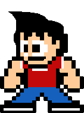
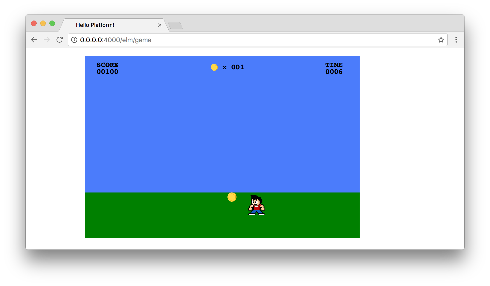

# Player Skills

In this chapter, let's add new character abilities for running and jumping.
When it comes to moving our character around on the screen, we've been kind of
cheating. We've just been manually altering the position when the left and
right arrow keys are pressed, and shifting the character's position. What we'd
really like is to tinker with our character's velocity, which is the speed in a
certain direction. This is going to require quite a few changes, but it will be
worth it in terms of moving towards a game that's more fun to play.

## Velocity

Let's start by updating our model and adding a new field for the character's
velocity as a `Float`. We'll also need to make some adjustments to the other
fields relating to the character's position.

```elm
type alias Model =
    { gameState : GameState
    , characterPositionX : Float
    , characterPositionY : Float
    , characterVelocityX : Float
    , characterVelocityY : Float
    , itemPositionX : Int
    , itemPositionY : Int
    , itemsCollected : Int
    , playerScore : Int
    , timeRemaining : Int
    }


initialModel : Model
initialModel =
    { gameState = StartScreen
    , characterPositionX = 50.0
    , characterPositionY = 300.0
    , characterVelocityX = 0.0
    , characterVelocityY = 0.0
    , characterDirection = Right
    , itemPositionX = 150
    , itemPositionY = 300
    , itemsCollected = 0
    , playerScore = 0
    , timeRemaining = 10
    }
```

This will create some issues in our program, because we were previously using
`Int` types. Thankfully, Elm guides us gently to making the necessary changes.
Let's update our `characterFoundItem` function to make the necessary
conversions between `Float` and `Int` types so that our character can still
discover and collect items.

```elm
characterFoundItem : Model -> Bool
characterFoundItem model =
    let
        approximateItemLowerBound =
            toFloat model.itemPositionX - 35

        approximateItemUpperBound =
            toFloat model.itemPositionX

        currentCharacterPosition =
            model.characterPositionX
    in
        currentCharacterPosition
            >= approximateItemLowerBound
            && currentCharacterPosition
            <= approximateItemUpperBound
```

We're changing our approach here slightly. Instead of creating a list of
integers to determine whether our character has stumbled on an item, we're
determining whether our character's position is greater than the lower bound
of the item and less than the approximate upper bound. Still not a perfect
solution, but it works to get our game functioning properly again.

## Adjusting Arrow Keys

Now we want to adjust our `characterVelocityX` with our left and right arrow
keys instead of changing the position. Let's update the cases for the left and
right arrow keys (`37` and `39`) in our `KeyDown` message:

```elm
37 ->
    ( { model | characterVelocityX = -0.3 }, Cmd.none )

39 ->
    ( { model | characterVelocityX = 0.3 }, Cmd.none )
```

Keep in mind that this will break our character's previous ability to move
around the screen, so we'll take a look at fixing that now.

Let's go ahead and add a new `MoveCharacter` message to the bottom of our
update section. We'll already have access to the fields from the model in this
context, but we'll need these changes to happen over time, so we want to pass
an argument of type `Time` too.

```elm
type Msg
    = NoOp
    | KeyDown KeyCode
    | TimeUpdate Time
    | CountdownTimer Time
    | SetNewItemPositionX Int
    | MoveCharacter Time
```

Now we can add a new case at the bottom of our `update` function to account
for character movement. We're going to apply the changes in the character's
velocity to the character's position over time. This will also allow us to
alter the character's speed if we want to implement a different speed for the
character walking and running.

```elm
MoveCharacter time ->
    ( { model | characterPositionX = model.characterPositionX + model.characterVelocity * time }, Cmd.none )
```

Lastly, we can add `MoveCharacter` to our `subscriptions` function so that
we're animating our character's movement:

```elm
subscriptions : Model -> Sub Msg
subscriptions model =
    Sub.batch
        [ downs KeyDown
        , diffs TimeUpdate
        , diffs MoveCharacter
        , every second CountdownTimer
        ]
```

Go ahead and tinker around with the character's movement in the browser. It
looks like we managed to successfully add velocity to our game, but there were
also some unintended consequences. On the one hand, we can now move the
character back and forth, and we can even vary the speed wildly by pressing the
same arrow twice. But we also have to press the key in the opposite direction
in order to stop movement.

## Stopping Movement

After we set our character in motion by pressing an arrow key on the keyboard,
we want the character to stop moving when we release the key. To accomplish
this, we'll need to update the `Keyboard` import declaration at the top of our
file to use the `ups` function:

```elm
import Keyboard exposing (KeyCode, downs, ups)
```

And now we can add `ups` to our `subscriptions` function along with a new
`KeyUp` message that we'll create next.

```elm
subscriptions : Model -> Sub Msg
subscriptions model =
    Sub.batch
        [ downs KeyDown
        , ups KeyUp
        , diffs TimeUpdate
        , diffs MoveCharacter
        , every second CountdownTimer
        ]
```

In our update section, we can add adjust our `Msg` type with a new `KeyUp`
message.

```elm
type Msg
    = NoOp
    | KeyDown KeyCode
    | KeyUp KeyCode
    | TimeUpdate Time
    | CountdownTimer Time
    | SetNewItemPositionX Int
    | MoveCharacter Time
```

When we release the left and right arrow keys, we'll set the character's
velocity to a value of `0`, which will stop movement altogether.

```elm
KeyUp keyCode ->
    case keyCode of
        37 ->
            ( { model | characterVelocity = 0 }, Cmd.none )

        39 ->
            ( { model | characterVelocity = 0 }, Cmd.none )

        _ ->
            ( model, Cmd.none )
```

## Direction

At this point, we've managed to replicate our previous functionality in the
game, but now we have much more flexibility. Let's add a new field to indicate
which direction the character is facing.

We'll add a new union type since there are only two possible directions the
character could be facing:

```elm
type Direction
    = Left
    | Right
```

With that, we can add a `characterDirection` field of type `Direction`, and
we'll set the initial value to `Right`.

```elm
type alias Model =
    { gameState : GameState
    , characterPositionX : Float
    , characterPositionY : Float
    , characterVelocity : Float
    , characterDirection : Direction
    , itemPositionX : Int
    , itemPositionY : Int
    , itemsCollected : Int
    , playerScore : Int
    , timeRemaining : Int
    }


initialModel : Model
initialModel =
    { gameState = StartScreen
    , characterPositionX = 50.0
    , characterPositionY = 300.0
    , characterVelocity = 0.0
    , characterDirection = Right
    , itemPositionX = 500
    , itemPositionY = 300
    , itemsCollected = 0
    , playerScore = 0
    , timeRemaining = 10
    }
```

Now that we're going to have our character change direction, we'll also want
to update the assets so that the character looks like he or she is facing in
the correct direction too. Let's create two new copies of the `character.gif`
file in the `/assets/static/images` folder. We'll create one called
`character-right.gif` which will be exactly the same as `character.gif`. And
we'll also create `character-left.gif`, which is the same image flipped along
the horizontal axis. If you're using OS X, you can open the file in Preview and
click the Tools > Flip Horizontal option.




## Rendering the Direction

Let's update our `viewCharacter` function with a `let` expression that will
indicate which asset to render based on the direction the character is facing.

```elm
viewCharacter : Model -> Svg Msg
viewCharacter model =
    let
        characterImage =
            case model.characterDirection of
                Right ->
                    "/images/character-right.gif"

                Left ->
                    "/images/character-left.gif"
    in
        image
            [ xlinkHref characterImage
            , x (toString model.characterPositionX)
            , y (toString model.characterPositionY)
            , width "50"
            , height "50"
            ]
            []
```

Now we just need to be able to update the value of the `characterDirection`
field. We can start by adding a new `ChangeDirection` message at the bottom of
our `Msg` type:

```elm
type Msg
    = NoOp
    | KeyDown KeyCode
    | KeyUp KeyCode
    | TimeUpdate Time
    | CountdownTimer Time
    | SetNewItemPositionX Int
    | MoveCharacter Time
    | ChangeDirection Time
```

When the character's velocity is greater than `0`, then we know the character
should be moving to the right. If the character's velocity is negative, then
we know the character should be facing to the left. Otherwise, we just want the
character to continue facing the same way.

```elm
ChangeDirection time ->
    if model.characterVelocity > 0 then
        ( { model | characterDirection = Right }, Cmd.none )
    else if model.characterVelocity < 0 then
        ( { model | characterDirection = Left }, Cmd.none )
    else
        ( model, Cmd.none )
```

Lastly, we want to update our `subscriptions` function so that we render the
directional changes over time.

```elm
subscriptions : Model -> Sub Msg
subscriptions model =
    Sub.batch
        [ downs KeyDown
        , ups KeyUp
        , diffs TimeUpdate
        , diffs MoveCharacter
        , diffs ChangeDirection
        , every second CountdownTimer
        ]
```

At this point we now have working `characterVelocity` and `characterDirection`
fields for our game!



## TODO

- Character running and jumping ability

## Summary

...