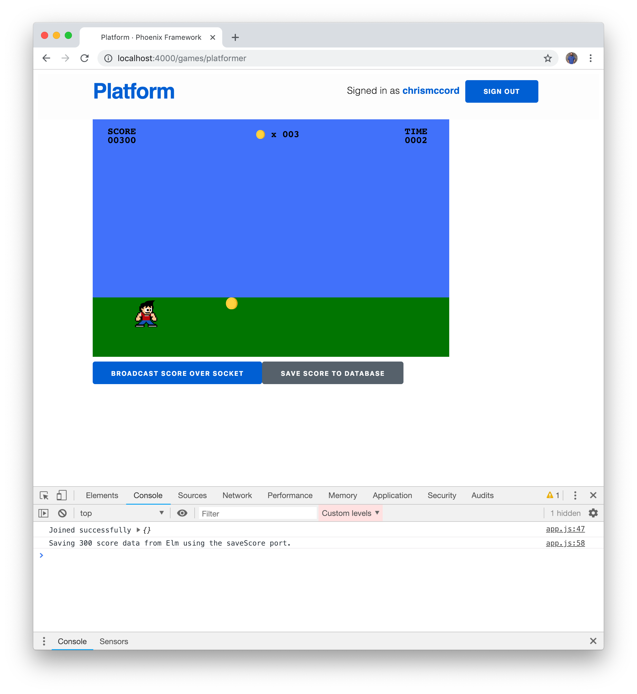
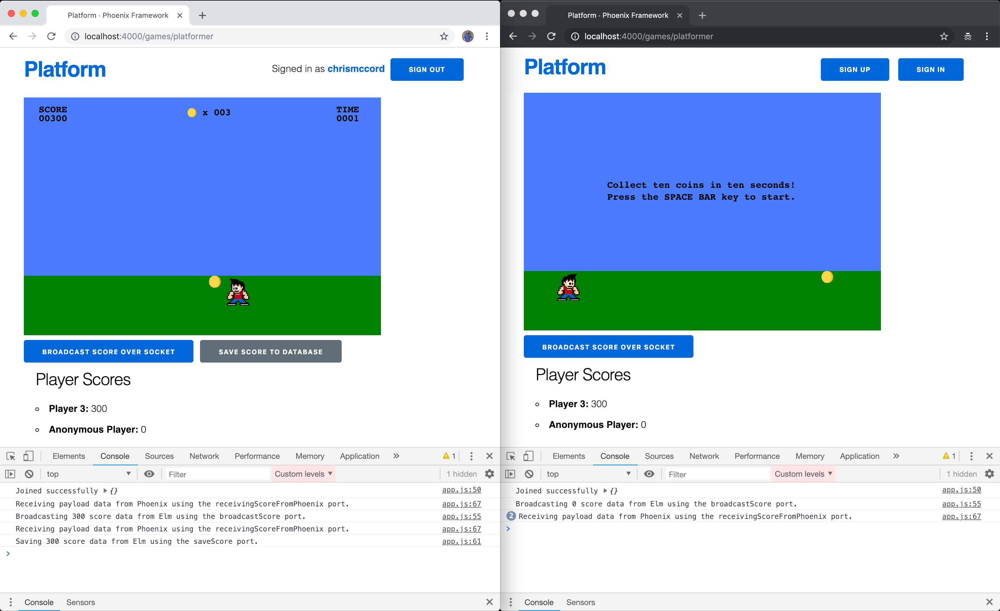

# Saving Score Data

In this chapter, we'll work towards giving players the ability to save their
scores to the database. We've already covered many of the concepts we need to
get this done, so this chapter will be a good refresher and an opportunity to
practice setting up a new message within our Phoenix channel.

We'll also tie together a lot of the concepts from both the Phoenix back-end
and the Elm front-end so we can both save new data to the database and fetch
existing data to work with.

## Saving Scores with Our ScoreChannel

We currently have a `ScoreChannel` module that listens for incoming messages,
and so far we've set up a message called `"broadcast_score"` that allows
players to broadcast their scores to any other players connected to the socket
in real-time. But what if we want to give users an option to save their scores
instead of seeing them disappear when the page reloads?

Let's open up the `lib/platform_web/channels/score_channel.ex` file and start
listening for a new message called `"save_score"`.

```elixir
defmodule PlatformWeb.ScoreChannel do
  # ...

  def handle_in("save_score", payload, socket) do
    IO.inspect(payload, label: "Saving the score payload to the database")
    # Save player scores to the database
    {:noreply, socket}
  end
end
```

Back in the **Phoenix API** chapter earlier in the book, we set up `gameplays`
to create the relationship between players and scores. When we create a new
`gameplay`, it needs to contain the following fields:

- `game_id` (which references the `games` table)
- `player_id` (which references the `players` table)
- `player_score` (which stores the player's score as an integer)

In the last chapter, we also worked with this same data to create a `Gameplay`
type in our Elm application too. As a reminder, here's the code we used for the
`"broadcast_score"` message:

```elixir
# Broadcast for authenticated players
def handle_in(
      "broadcast_score",
      %{"player_score" => player_score} = payload,
      %{assigns: %{game_id: game_id, player_id: player_id}} = socket
    ) do
  payload = %{
    game_id: game_id,
    player_id: player_id,
    player_score: player_score
  }

  IO.inspect(payload, label: "Broadcasting the score payload over the channel")
  broadcast(socket, "broadcast_score", payload)
  {:noreply, socket}
end
```

Let's take the same approach for our `"save_score"` message. We're basically
going to have all the same code for the arguments and constructing the
`payload`. The only major difference is that instead of calling the
`broadcast/3` function we're going to make a call to the
`Platform.Products.create_gameplay/1` function we created back in the
**Phoenix API** chapter. Let's go ahead and replace the `handle_in/3` function
we created above with the following:

```elixir
# Save scores for authenticated players
def handle_in(
      "save_score",
      %{"player_score" => player_score} = payload,
      %{assigns: %{game_id: game_id, player_id: player_id}} = socket
    ) do
  payload = %{
    game_id: game_id,
    player_id: player_id,
    player_score: player_score
  }

  IO.inspect(payload, label: "Saving the score payload to the database")
  Platform.Products.create_gameplay(payload)
  {:noreply, socket}
end
```

This might seem like a lot of code, but it's the exact same approach we took in
the last chapter. We're pattern matching all the relevant values we need in the
arguments to the `handle_in/3` function and then using those values to create a
new `payload`.

The key line of code here is that we're sending that `payload` to the
`Platform.Products.create_gameplay/1` function, which will store the gameplays
in the database for us.

## Saving Prerequisites

You might have noticed that we're only listening for the `"save_score"` message
for authenticated users, and that if an anonymous user were to trigger this
message it would crash because the pattern match would fail without all the
relevant data to match in the arguments.

We're only going to allow authenticated players to save scores (which
conceivably would be a good prompt for users to create accounts). When we
create a button to trigger the `"save_score"` message, it's only going to be
visible to players that have an account.

In other words, anonymous players will be able to broadcast their scores over
the socket, but only authenticated players will be able to persist their scores
to the database.

## Saving Gameplays

Before we move back to our Elm application and trigger our new `"save_score"`
message, we just need to make a couple of quick changes to our back-end to
handle all the data we need for our gameplays.

If you start a Phoenix server with `mix phx.server` and visit the endpoint for
our gameplays at `http://localhost:4000/api/gameplays`, you'll see that we're
only sending the gamplay `id` value along with the `player_score`. This is a
good start, but let's go ahead and update the `GameplayView` module so that we
can make the `game_id` and `player_id` available here too so we can easily send
all that data to our Elm application.

Open the `lib/platform_web/views/gameplay_view.ex` file and update the
`render/2` function to include the following (note that some code has been
trimmed below for readability):

```elixir
defmodule PlatformWeb.GameplayView do
  # ...

  def render("gameplay.json", %{gameplay: gameplay}) do
    %{
      game_id: gameplay.game_id,
      id: gameplay.id,
      player_id: gameplay.player_id,
      player_score: gameplay.player_score
    }
  end
end
```

With this change, we'll be able to hit the
`http://localhost:4000/api/gameplays` endpoint and access the `game_id` and
`player_id` and `player_score` that we need.

The last change we need to make on our back-end is to make sure we're able to
send all the right data to the database when we call our `create_gameplay/1`
function.

Let's open the `lib/platform/products/gameplay.ex` file and take a look at the
`changeset/2` function:

```elixir
defmodule Platform.Products.Gameplay do
  # ...

  def changeset(gameplay, attrs) do
    gameplay
    |> cast(attrs, [:player_score])
    |> validate_required([:player_score])
  end
end
```

We'll update the fields in the `cast/2` function to include the `game_id` field
and `player_id` field that we're going to send from our channel:

```elixir
def changeset(gameplay, attrs) do
  gameplay
  |> cast(attrs, [:game_id, :player_id, :player_score])
  |> validate_required([:player_score])
end
```

## Triggering SaveScore on the Front-end

We have everything we need configured on the Elixir side of our platform, and
now we can move back to our `assets/elm/src/Games/Platformer.elm` file to add
the code that will trigger `"save_score"`.

Let's start with the view, and we'll add a new "Save Score" button to the UI
that will allow users to trigger our new message.

Below `viewBroadcastScoreButton`, let's add a similar function to display a new
button:

```elm
viewSaveScoreButton : Model -> Html Msg
viewSaveScoreButton model =
    let
        saveEvent =
            model.playerScore
                |> Encode.int
                |> SaveScore
                |> Html.Events.onClick
    in
    button
        [ saveEvent
        , Html.Attributes.class "button"
        ]
        [ text "Save Score to Database" ]
```

We also need to update our main `view` function to include the new button as
well:

```elm
view : Model -> Html Msg
view model =
    div [ class "container" ]
        [ viewGame model
        , viewBroadcastScoreButton model
        , viewSaveScoreButton model
        , viewGameplaysIndex model
        ]
```

This is good practice, because we're going to follow the same approach we took
for our `BroadcastScore` button. Next, we'll update the `Msg` type with
`SaveScore`:

```elm
type Msg
    = BroadcastScore Encode.Value
    | CountdownTimer Time.Posix
    | GameLoop Float
    | KeyDown String
    | NoOp
    | ReceiveScoreFromPhoenix Encode.Value
    | SaveScore Encode.Value
    | SetNewItemPositionX Int
```

We can also add to the `case` expression inside our `update` function to handle
`SaveScore` and trigger a new `saveScore` command that we'll create next:

```elm
update : Msg -> Model -> ( Model, Cmd Msg )
update msg model =
    case msg of
        -- ...

        SaveScore value ->
            ( model, saveScore value )
```

## Setting Up the saveScore Port

Now that we have our `view` and `update` taken care of, let's create our
`saveScore` port to send the data out to our channel.

Below the existing ports for `broadcastScore` and `receiveScoreFromPhoenix`,
let's add the new `saveScore` port:

```elm
-- PORTS
port broadcastScore : Encode.Value -> Cmd msg

port receiveScoreFromPhoenix : (Encode.Value -> msg) -> Sub msg

port saveScore : Encode.Value -> Cmd msg
```

Keep in mind that we're only sending a single `playerScore` value out from our
model, and it's actually the Phoenix channel that's taking care of putting the
whole `payload` together when it comes time to store it in the database.

The last step we need to take to get this all working is to update our
`assets/js/app.js` file with code for our `saveScore` port. Below the code for
our `broadcastScore` port, we're going to add the following similar code. Some
of the code has been trimmed for readability, but you can see that we're taking
the same approach we did for `broadcastScore`, where we're using
`channel.push()` to send the player score data over the socket.

```javascript
if (platformer) {
  // ...

  app.ports.broadcastScore.subscribe(function (scoreData) { /* ... */ });

  app.ports.saveScore.subscribe(function (scoreData) {
    console.log(`Saving ${scoreData} score data from Elm using the saveScore port.`);
    channel.push("save_score", { player_score: scoreData });
  });

  // ...
}
```

## Saving Scores

We should have everything we need to save our player scores to the database
now. Let's start our Phoenix server, load the game with for an authenticated
player, and then click the button to save a score.



After clicking the button, we should be able to look at the server log to see
the data being saved in the database. The raw output can be a little bit
difficult to read, but this snippet below shows the `IO.inspect/2` message we
added to our `"save_score"` message in the `ScoreChannel` module. And it's good
to see that the data being sent matches the player and the score we see in the
screenshot above. Lastly, we see the successful SQL output that a record has
successfully been added to the `gameplays` table will all the relevant data.

```shell
Saving the score payload to the database: %{game_id: 1, player_id: 3, player_score: 300}
[debug] INCOMING "save_score" on "score:platformer" to PlatformWeb.ScoreChannel
  Parameters: %{"player_score" => 300}
[debug] QUERY OK db=12.7ms queue=1.8ms
INSERT INTO "gameplays" ("game_id","player_id","player_score","inserted_at","updated_at") VALUES ($1,$2,$3,$4,$5) RETURNING "id" [1, 3, 300, ~N[2019-01-03 14:09:35], ~N[2019-01-03 14:09:35]]
```

In fact, if we load the server with `iex -S mix phx.server`, we can play with
some of the functions from the `Platform.Products` module to see our new
gameplay records. For instance, you can use
`Platform.Products.list_gameplays()` to see all the current gameplay records
that are stored in the database:

```shell
iex> Platform.Products.list_gameplays()
[debug] QUERY OK source="gameplays" db=1.7ms
SELECT g0."id", g0."game_id", g0."player_id", g0."player_score", g0."inserted_at", g0."updated_at" FROM "gameplays" AS g0 []
[
  %Platform.Products.Gameplay{
    __meta__: #Ecto.Schema.Metadata<:loaded, "gameplays">,
    game_id: 1,
    id: 36,
    inserted_at: ~N[2019-01-03 14:09:35],
    player_id: 3,
    player_score: 300,
    updated_at: ~N[2019-01-03 14:09:35]
  }
]
```

## Adjusting the SaveScore Button

We've managed to successfully achieve our goal of saving scores to the
database, but let's add a couple of finishing touches before we end this
chapter.

First, we'll just make a quick change to the CSS to space out our buttons in
UI so they aren't so close together. Open the `assets/css/app.css` file and
add the following to the bottom:

```css
/* Buttons */
.button {
  margin-right: 1em;
}
```

## Working with Flags

As a last step, let's make sure we're not displaying the button to save player
scores for anonymous users. And we'll take this as an opportunity to learn a
little bit about how "flags" work in Elm.

When we initialize our Elm application on the JavaScript side, this is what it
looks like:

```javascript
const platformer = document.querySelector("#platformer");

if (platformer) {
  let app = Elm.Games.Platformer.init({ node: platformer });

  // ..
}
```

We're finding the `div` element with a `#platformer` id first. And then we use
that `node` when we call the `init()` function for our `Platformer` game. But
what if we want to send some data to our Elm application from JavaScript when
it first loads? There's a chapter in the official Elm guide on working with
[Elm flags](https://guide.elm-lang.org/interop/flags.html), and we're going to
use this feature to send the `userToken` to our Elm application and determine
whether or not players are logged in.

To get started, we just need to change the `init()` function we're calling in
the code above:

```javascript
const platformer = document.querySelector("#platformer");

if (platformer) {
  let app = Elm.Games.Platformer.init({
    node: platformer,
    flags: { /* send data to elm */ }
  });

  // ..
}
```

You can send different types of data as `flags` to Elm. Using an object helps
in terms of being able to add keys and values and create a `Flags` type in our
Elm application where we can validate the type of data we're working with.
We took a similar approach when we were connection to the socket, so let's do
the same here:

```javascript
let app = Elm.Games.Platformer.init({
  node: platformer,
  flags: { token: window.userToken }
});
```

This means we're sending a `token` value to our Elm application, which will be
an empty string `""` for anonymous users.

In our `Platformer.elm` file, let's go ahead and create a type alias for our
incoming data:

```elm
type alias Flags =
    { token : String
    }
```

When it comes to handling incoming flags data, we can start with our `init`
function:

```elm
init : () -> ( Model, Cmd Msg )
init _ =
    ( initialModel, Cmd.none )
```

This function has already been set up to work with flags as the first argument,
but we've just been ignoring that with an empty tuple `()`. Let's adjust this
function to handle the incoming `Flags` type and make it available as a `flags`
argument.

```elm
init : Flags -> ( Model, Cmd Msg )
init flags =
    ( initialModel, Cmd.none )
```

This works great because it means we can always send data from JavaScript to
Elm when our application initializes. We can add additional fields to the
`flags` object in our `app.js` file and then account for them in our `Flags`
type on the Elm side.

Let's go ahead and pass the `flags` argument through to our `initialModel`
function next:

```elm
init : Flags -> ( Model, Cmd Msg )
init flags =
    ( initialModel flags, Cmd.none )
```

This will allow us to use `flags` as an argument to our `initialModel` function
and also add a new field called `playerToken` too. Note taht we're assigning
`flags.token` to our `playerToken` field.

```elm
initialModel : Flags -> Model
initialModel flags =
    { -- ...
    , playerToken = flags.token
    }
```

Lastly, we can update our `Model` type to indicate that the `playerToken`
should be a `String` value:

```elm
type alias Model =
    { -- ...
    , playerToken : String
    }
```

This works perfect for our needs, because we'll now be able to use the
`model.playerToken` value to determine whether a player is authenticated or
if they're anonymous.

## Hiding the Button for Anonymous Players

Let's finish up the chapter by hiding our new button for anonymous players.
If players have an empty string in `model.playerToken`, it means they're not
logged in and we can't persist their scores to the database.

In the `viewSaveScoreButton` function, we can use the following code to display
the save score button to players that are logged in:

```elm
viewSaveScoreButton : Model -> Html Msg
viewSaveScoreButton model =
    let
        saveEvent =
            model.playerScore
                |> Encode.int
                |> SaveScore
                |> Html.Events.onClick
    in
    if model.playerToken == "" then
        div [] []

    else
        button
            [ saveEvent
            , Html.Attributes.class "button"
            ]
            [ text "Save Score to Database" ]
```



## Summary

In this chapter, we were able to take a lot of the same concepts we used for
broadcasting our player scores over the socket and use them to save scores to
the database. We also got to work with Elm flags to send data from JavaScript
to Elm and use that to differentiate between authenticated and anonymous users
for our game.

We're nearing the end of our journey in this book. In the next chapter, we're
going to put some finishing touches on our game by fetching the data we've
saved to the database.
