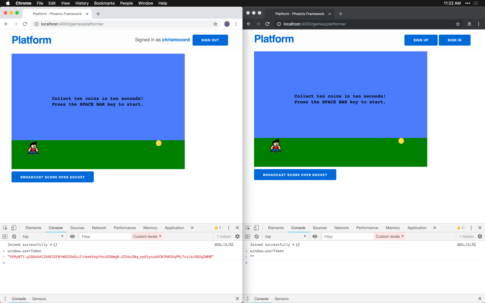
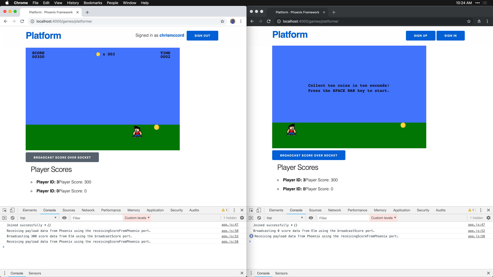
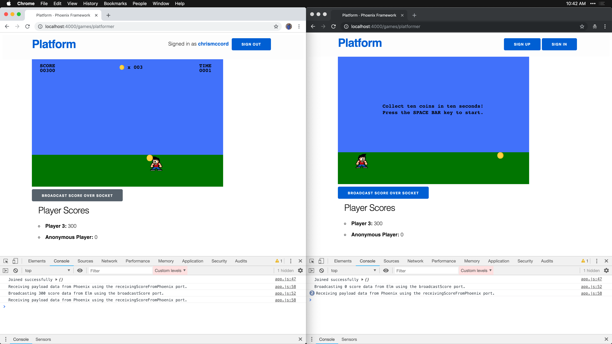

# Socket Authentication

In the previous chapters, we've gotten our Phoenix channel configured and it's
now up and running. We're able to send data over the socket, but we currently
don't have a way to differentiate between players.

In this chapter, we're going to make some key changes to the way our Elixir and
Elm applications are configured. This will allow us to handle multiple players
playing our game at the same time and we can work towards associating player
scores with players.

## Phoenix.Token

In the Phoenix authentication chapter earlier in the book, we looked at how to
handle user authentication for the players on our platform. For our channel
features, we'll be taking a similar approach, but we'll use
[`Phoenix.Token`](https://hexdocs.pm/phoenix/Phoenix.Token.html) for
authentication.

The two main steps for using `Phoenix.Token` are to "sign" a token for a user
and then use that token to "verify" and identify the user. We start with
[`Phoenix.Token.sign/4`](https://hexdocs.pm/phoenix/Phoenix.Token.html#sign/4)
to sign a token to send to the client, and then we can use
[`Phoenix.Token.verify/4`](https://hexdocs.pm/phoenix/Phoenix.Token.html#verify/4)
to decode that token and identify the current user. If that all sounds
confusing, don't worry. At the end, we'll be able to access the current user
over the socket.

## User Tokens

To get started, let's open up the `lib/platform_web/router.ex` file. At the
bottom of the file, create a new private function called `put_user_token/2`,
which will check if there's a user currently signed in. If the user is not
authenticated, we simply return the connection with `conn`. Otherwise, we
create a new token with `Phoenix.Token.sign/4` and assign it to the
connection so we can access it elsewhere.

```elixir
defp put_user_token(conn, _) do
  if current_user = conn.assigns[:current_user] do
    token = Phoenix.Token.sign(conn, "user salt", current_user.id)
    assign(conn, :user_token, token)
  else
    conn
  end
end
```

At the top of the `router.ex` file, we'll include this as a `plug` in our
browser `pipeline`.

```elixir
pipeline :browser do
  plug :accepts, ["html"]
  plug :fetch_session
  plug :fetch_flash
  plug :protect_from_forgery
  plug :put_secure_browser_headers
  plug PlatformWeb.PlayerAuthController, repo: Platform.Repo
  plug :put_user_token
end
```

## Passing the Token to JavaScript

To make this token available throughout our platform application, we'll add it
to the bottom of our layout template. Let's open our
`lib/platform_web/templates/layout/app.html.eex` file, and we'll add a new
`<script>` tag **above** the existing one in the `<body>`.

```embedded_elixir
    <!-- ... -->
    <script>window.userToken = encodeURIComponent("<%= assigns[:user_token] %>");</script>
    <script src="<%= Routes.static_path(@conn, "/js/app.js") %>"></script>
  </body>
</html>
```

Note that the order of the `<script>` tags here is important. If you set the
`window.userToken` in the wrong order, it won't be available to the Elm
application when we need it.

This will take the token we created in our router and assigned to the `conn`,
and it will encode it before storing it in the `window.userToken` variable.
Now, when we have authenticated users accessing games, we'll be able to use
`window.userToken` to identify them.

## Verifying the Token

Next, we'll verify the token when user's connect to the socket. Let's open up
the `lib/platform_web/channels/user_socket.ex` file and take a look.

We'll create a new clause for our `connect/2` function that works when there's
a token present. Note that there's already a `connect/2` function written for
us in this file, and we're adding a new clause above the existing one. This
allows us to pattern match the `token` in the arguments for the first clause
and assign the current player over the socket connection, and if there's no
token present we can still just use the existing clause to return
the default `{:ok, socket}`.

```elixir
def connect(%{"token" => token}, socket) do
  case Phoenix.Token.verify(socket, "user salt", token, max_age: 1209600) do
    {:ok, current_user_id} ->
      socket = assign(socket, :player_id, current_user_id)
      {:ok, socket}
    {:error, _} ->
      :error
  end
end

def connect(_params, socket) do
  {:ok, socket}
end
```

With this code, we're using the `Phoenix.Token.verify/4` function to check the
user's token. Also, keep in mind that this is admittedly overwhelming at first,
but the Phoenix documentation is really useful for checking out other examples.
What's happening here is that we're deconstructing the `token` value when one
is present, and when we successfully verify the token, we us that to assign the
`current_user_id` to the `player_id` in the socket. We also fall back to the
original `connect/2` clause for anonymous users.

This works out great, because we already assigned the `game_id` to the socket
in our `score_channel.ex` file. And now we're able to assign the `player_id`
to the socket with the code above.

The reason this is all important is that we'll now have everything we need to
store and display player scores. We can get the `player_score` from the Elm
game, the `player_id` from our socket connection, and the `game_id` from the
Phoenix channel.

## Working with the userToken

At this point, we're able to start our Phoenix server with `mix phx.server` and
see our changes in action. If you log in as an authenticated user, you can type
`window.userToken` in the DevTools console and see a string token for that
player. If a player is not logged in, we can type `window.userToken` in the
DevTools console and see that the token is set to an empty string value (`""`).
This is useful because now we can differentiate between authenticated and
anonymous users, and we'll ultimately be able to determine which player is
responsible for which score.



Let's open our `assets/js/app.js` file and make some changes to the code where
we establish the socket connection.

```javascript
// Phoenix Socket
import { Socket } from "phoenix"

let socket = new Socket("/socket", {})

socket.connect()
```

We're going to update this code using a new `socketParams` variable that we can
use to store an object with our `userToken`. We're using JavaScript's ternary
operator to determine whether `window.userToken` is an empty string. If it is,
we just pass an empty object (`{}`) as the parameter to the socket. But if
`window.userToken` does have a value, we can pass that as a `token` parameter
to our socket connection.

```javascript
// Phoenix Socket
import { Socket } from "phoenix"

let socketParams = (window.userToken == "") ? {} : { token: window.userToken };

let socket = new Socket("/socket", {
  params: socketParams
})

socket.connect()
```

And now that we're passing the token along to our Phoenix channel, we can
access the data we're looking for in the
`lib/platform_web/channels/score_channel.ex` file. This step is optional, but
it's a good demonstration of how we can use `IO.inspect/1` to check out the
value of `socket.assigns` (which is similar to the way we used `conn.assigns`
earlier in the book to store information about our current user.

```elixir
def handle_in("broadcast_score", payload, socket) do
  IO.inspect(socket.assigns, label: "socket.assigns")

  broadcast(socket, "broadcast_score", payload)
  {:noreply, socket}
end
```

Now we can start the server with `mix phx.server` and load our application in
the browser to see the results. If we trigger the `"broadcast_score"` message
for an authenticated user, we'll see the `token` included in the socket
parameters, which means we have the `player_id` value available in the
`socket.assigns` map.

```shell
[info] CONNECT PlatformWeb.UserSocket
  Transport: :websocket
  Connect Info: %{}
  Parameters: %{"token" => "...", "vsn" => "2.0.0"}
# ...
socket.assigns: %{player_id: 3}
```

When we trigger this message for an unauthenticated anonymous user, we'll see
that we don't have a `player_id` value available.

```shell
[info] CONNECT PlatformWeb.UserSocket
  Transport: :websocket
  Connect Info: %{}
  Parameters: %{"vsn" => "2.0.0"}
# ...
socket.assigns: %{}
```

## Extending Gameplay Data with the Payload

The way we've been displaying player scores has only included score data
without mentioning which player scored or which game was being played. Let's
extend the data we're sending back and forth between Phoenix and Elm to include
all the relevant data we'll need.

With the existing code we have so far, our `socket` will hold something like
this with information about our current user: `%{player_id: 3}`. And the
`payload` value in the channel will hold something like this with information
about the player's score: `%{"player_score" => 200}`.

Let's open the `lib/platform_web/channels/score_channel.ex` file and make some
changes to the way we're broadcasting our data. If the `socket.assigns` map has
a `player_id` key (which we check with `Map.has_key?/2`), we'll go ahead and
include that in our `payload` (using `Map.put/3` to add the value). If that
`player_id` key isn't present in the `socket.assigns` map, we'll just return
our payload unchanged.

```elixir
def handle_in("broadcast_score", payload, socket) do
  payload =
    if Map.has_key?(socket.assigns, :player_id) do
      Map.put(payload, :player_id, socket.assigns.player_id)
    else
      payload
    end

  broadcast(socket, "broadcast_score", payload)
  {:noreply, socket}
end
```

## Finding the Game ID

We now have the `player_id` and `player_score` data for our channel, but how
do we find the `game_id`? Let's update the `join/3` function in our
`ScoreChannel` to remove the hard-coded `platformer` slug, and we'll pattern
match the value to find the game. Here's the existing `join/3` function we have
so far:

```elixir
def join("score:platformer", _payload, socket) do
  {:ok, socket}
end
```

Let's open the `lib/platform_web/channels/score_channel.ex` again and make some
changes to this function. We'll start by replacing `"score:platformer"` with
`"score:" <> game_slug`, which allows us to extract the game slug out of the
channel's topic.

```elixir
def join("score:" <> game_slug, _payload, socket) do
  {:ok, socket}
end
```

In a previous chapter, we already created a function in our `Platform.Products`
module to find a game using its slug value, and we can use that now to find the
current game that's being played. In other words, `game_slug` will currently
hold a value like `"platformer"` for the game we're working with, and we can
pass that to `Platform.Products.get_game_by_slug!/1` to find the game in the
database. Lastly, we can use that to find the `game.id` value and make it
available in our `socket`.

```elixir
def join("score:" <> game_slug, _payload, socket) do
  game = Platform.Products.get_game_by_slug!(game_slug)
  socket = assign(socket, :game_id, game.id)
  {:ok, socket}
end
```

Now that we have this code in place, we'll be able to access both the
`player_id` and `game_id` values in the `socket.assigns` map.

## Refactoring with Pattern Matching

We currently have a single `handle_in/3` function for our `"broadcast_score"`
message. Let's split this into two separate clauses using pattern matching on
the function arguments, and this will allow us to use one for authenticated
users and another for anonymous users.

We'll add a new call to `handle_in/3` where we'll soon pattern match the
`game_id`, `player_id`, and `player_score` values. And we'll leave the original
broadcast unchanged for anonymous users that just want to broadcast the score
without additional data.

```elixir
defmodule PlatformWeb.ScoreChannel do
  # ...

  # Broadcast for authenticated players
  def handle_in("broadcast_score", payload, socket) do
    # Add game_id, player_id, and player_score values to the payload
    broadcast(socket, "broadcast_score", payload)
    {:noreply, socket}
  end

  # Broadcast for anonymous players
  def handle_in("broadcast_score", payload, socket) do
    # Ignore the player_id since we won't have it available in this clause
    broadcast(socket, "broadcast_score", payload)
    {:noreply, socket}
  end
end
```

Pattern matching can be a bit tricky to parse at first, but it also prevents us
from needing to add extra conditional logic inside our functions. In this case,
we have arguments called `payload` and `socket` that we want to extract data
from. And we'll use that to construct a new `payload` to send to our Elm
application so we can display all the relevant information to our users.

Let's start out by hard-coding the payload data (we're setting each value to
`1` for now), and then we'll use pattern matching to replace the values one
step at a time. We'll also add an `IO.inspect/2` line so we can see the values
when we run our Phoenix server.

```elixir
# Broadcast for authenticated players
def handle_in("broadcast_score", payload, socket) do
  payload =
    %{
      game_id: 1,
      player_id: 1,
      player_score: 1
    }

  IO.inspect(payload, label: "Broadcasting the score payload over the channel")
  broadcast(socket, "broadcast_score", payload)
  {:noreply, socket}
end
```

Next, we'll extract the `player_score` value from the `payload` using pattern
matching. While we're here, we'll also split the arguments to the `handle_in/3`
function into separate lines to make things more readable:

```elixir
# Broadcast for authenticated players
def handle_in(
      "broadcast_score",
      %{"player_score" => player_score} = payload,
      socket
    ) do
  payload = %{
    game_id: 1,
    player_id: 1,
    player_score: player_score
  }

  IO.inspect(payload, label: "Broadcasting the score payload over the channel")
  broadcast(socket, "broadcast_score", payload)
  {:noreply, socket}
end
```

Note that our payload still has hard-coded values for the `game_id` and the
`player_id`, but our `player_score` is now using the value that we extracted
from the second argument to the `handle_in/3` function.

This last part is a little bit tricky since the values we're looking for are
nested inside `socket.assigns`, but the idea is that we're going to use the
same approach we did above to extract the value for the `game_id` and the
`player_id`. Then, we can use those values to construct the full `payload`.
Here's the completed function for our `"broadcast_score"` message:

```elixir
# Broadcast for authenticated players
def handle_in(
      "broadcast_score",
      %{"player_score" => player_score} = payload,
      %{assigns: %{game_id: game_id, player_id: player_id}} = socket
    ) do
  payload = %{
    game_id: game_id,
    player_id: player_id,
    player_score: player_score
  }

  IO.inspect(payload, label: "Broadcasting the score payload over the channel")
  broadcast(socket, "broadcast_score", payload)
  {:noreply, socket}
end
```

## Updating the receiveScoreFromPhoenix Port

Before we can move back to our Elm application, we need to adjust the data
we're sending with our `receiveScoreFromPhoenix` port.

Let's open the `assets/js/app.js` file and take a look at what we have from
before:

```javascript
channel.on("broadcast_score", payload => {
  console.log(`Receiving ${payload.player_score} score data from Phoenix using the receivingScoreFromPhoenix port.`);
  app.ports.receiveScoreFromPhoenix.send({
    player_score: payload.player_score
  });
});
```

Now, let's send along the additional data we're getting from our channel via
the `payload`:

```javascript
channel.on("broadcast_score", payload => {
  console.log(`Receiving payload data from Phoenix using the receivingScoreFromPhoenix port.`);

  app.ports.receiveScoreFromPhoenix.send({
    game_id: payload.game_id || 0,
    player_id: payload.player_id || 0,
    player_score: payload.player_score || 0
  });
});
```

This will work well for authenticated users where we know we have values for
the `payload.game_id` and `payload.player_id` and `payload.player_score`. Note
that we're going to fall back to `0` values if those values are not present.
This is admittedly not an ideal approach and we'd like to be able to handle the
edge cases better, but for the purposes of this book it gives us a quick way to
identify anonymous gameplays and render something on the page without delving
too deeply into the details.

## Displaying New Player Score Data

We managed to finish the hard part now that we're making all the relevant data
available over our channel. We're going to need all this data when we start
saving scores to the database in the next chapter. For now, let's just worry
about updating our Elm application so we can display both the player scores and
the `player_id` values with them.

Let's open the `assets/elm/src/Games/Platformer.elm` file and get started by
extending the fields we have in our `Gameplay` type. Instead of just showing
the `playerScore`, we're going to add fields for `gameId` and `playerId` too:

```elm
type alias Gameplay =
    { gameId : Int
    , playerId : Int
    , playerScore : Int
    }
```

That means we'll also need to update our JSON decoder as well. Let's update the
`decodeGameplay` function with the following (keep in mind that we're using
field names like `playerScore` on the Elm side to stick with our conventions,
and the fields for the Phoenix API have underscores like `player_score`):

```elm
decodeGameplay : Decode.Decoder Gameplay
decodeGameplay =
    Decode.map3 Gameplay
        (Decode.field "game_id" Decode.int)
        (Decode.field "player_id" Decode.int)
        (Decode.field "player_score" Decode.int)
```

Now, when we broadcast scores we'll be able to access the `gameplays` field
in our Elm model to see the data we need to display the player score
information. Let's adjust the `viewGameplayItem` function to show both the
`playerId` and the `playerScore` too. First, we'll need to update the `Html`
import at the top of our file to include a couple of new elements we'll use for
our list items.

```elm
import Html exposing (Html, button, div, h2, li, span, strong, ul)
```

That allows us to update our `viewGameplayItem` with the following, which will
take the `gameplay.playerId` and the `gameplay.playerScore` and show them below
our Elm game.

```elm
viewGameplayItem : Gameplay -> Html Msg
viewGameplayItem gameplay =
    li [ Html.Attributes.class "gameplay-item" ]
        [ strong [] [ text ("Player ID: " ++ String.fromInt gameplay.playerId) ]
        , span [] [ text ("Player Score: " ++ String.fromInt gameplay.playerScore) ]
        ]
```

Here's a screenshot with what the results look like. On the left we see that
the authenticated account (`chrismccord`) broadcasts a score of `300` with the
correct player ID value of `3`. And on the right the anonymous player is
broadcasting a score of `0` with a player ID value of `0` as well.



## Cleaning Up the View

Let's refactor our `viewGameplayItem` function to clean up the data we're 
displaying. We'll use a `let` expression to construct the strings we want to
display for our player info and our player score.

Since we know that anonymous players are going to have their `playerId` value
set to `0`, we can use this to show an `"Anonymous Player"` string along with
their score.

And we'll reformat our `li` elements slightly to make the scores look a little
nicer at the bottom of the page (we can also work towards displaying player
names instead of ID values in the next chapter once we start pulling data from
the database into our Elm application).

```elm
viewGameplayItem : Gameplay -> Html Msg
viewGameplayItem gameplay =
    let
        displayPlayer =
            if gameplay.playerId == 0 then
                "Anonymous Player: "

            else
                "Player " ++ String.fromInt gameplay.playerId ++ ": "

        displayScore =
            String.fromInt gameplay.playerScore
    in
    li [ Html.Attributes.class "gameplay-item" ]
        [ strong [] [ text displayPlayer ]
        , span [] [ text displayScore ]
        ]
```



## Summary

We made a ton of progress in this chapter. We're now able to differentiate
between the players that are connected to our socket, which took changes to
the Elixir, Elm, and JavaScript portions of our application. We were also able
to adjust the `"broadcast_score"` message in our `ScoreChannel` to handle
additional data and differentiate between authenticated and anonymous players.
Lastly, we used the additional data to update our view and display the scores
in real-time as players play the game.

In the next chapter, we're going to take a look at how we can persist player
scores to the database. All the work we've done to gather gameplay data will
come in handy as we connect the back-end content from earlier in the book to
the front-end and channel content from the more recent chapters.
