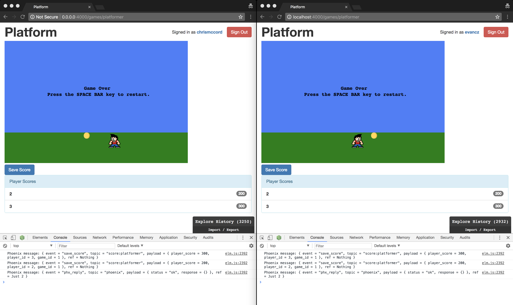

# Socket Authentication

In the previous chapters, we've gotten our Phoenix channel configured and it's
now up and running. We're able to send data over the socket, but we currently
don't have a way to differentiate between players.

In this chapter, we're going to make some key changes to the way our Elixir and
Elm applications are configured. It will be worth it at the end, becuase we'll
be able to have multiple players play a game at the same time, and they'll all
be able to see score changes getting broadcast over the socket to each other!

## Phoenix.Token

In the Phoenix authentication chapter, we looked at how to handle user
authentication for the players on our platform. For our channel features, we'll
be taking a similar approach, but we'll use
[`Phoenix.Token`](https://hexdocs.pm/phoenix/Phoenix.Token.html) for
authentication.

There are several steps involved to getting this working, but at the end we'll
be able to access the current user over the socket.

## User Tokens

Let's open up our `router.ex` file in the `lib/platform_web` folder. We can
create a new private function at the bottom of the file called
`put_user_token/2`, which will check if there's a user currently signed in. If
the user is not authenticated, we simply return the connection with `conn`.
Otherwise, we create a new token with
[`Phoenix.Token.sign/4`](https://hexdocs.pm/phoenix/Phoenix.Token.html#sign/4)
and assign it to the connection so we can access it elsewhere.

```elixir
defp put_user_token(conn, _) do
  if current_user = conn.assigns[:current_user] do
    token = Phoenix.Token.sign(conn, "user socket", current_user.id)
    assign(conn, :user_token, token)
  else
    conn
  end
end
```

At the top of the `router.ex` file, we'll include this as a `plug` in our
browser `pipeline`.

```elixir
pipeline :browser do
  plug :accepts, ["html"]
  plug :fetch_session
  plug :fetch_flash
  plug :protect_from_forgery
  plug :put_secure_browser_headers
  plug PlatformWeb.PlayerAuthController, repo: Platform.Repo
  plug :put_user_token
end
```

## Passing the Token to JavaScript

To make this token available throughout our platform application, we'll add it
to the bottom of our layout template.
Let's open our `lib/platform_web/templates/layout/app.html.eex` file, and we'll
add a new `<script>` tag **above** the existing one in the `<body>`.

```embedded_elixir
    <!-- ... -->
    </div> <!-- /container -->
    <script>window.userToken = encodeURIComponent("<%= assigns[:user_token] %>");</script>
    <script src="<%= static_path(@conn, "/js/app.js") %>"></script>
  </body>
</html>
```

Note that the order of the `<script>` tags here is important. If you set the
`window.userToken` in the wrong order, it won't be available to the Elm
application when we need it.

This will take the token we created in our router and assigned to the `conn`,
and it will encode it before storing it in the `window.userToken` variable.
Now, when we have authenticated users accessing games, we'll be able to use
`window.userToken` to identify them.

## Verifying the Token

Next, we'll verify the token when user's connect to the socket. Let's open up
the `lib/platform_web/channels/user_socket.ex` file and take a look.

We'll create a new clause for our `connect/2` function that works when there's
a token present.

```elixir
def connect(%{"token" => token}, socket) do
  case Phoenix.Token.verify(socket, "user socket", token, max_age: 1209600) do
    {:ok, current_user_id} ->
      socket = assign(socket, :player_id, current_user_id)
      {:ok, socket}
    {:error, _} ->
      :error
  end
end

def connect(_params, socket) do
  {:ok, socket}
end
```

With this code, we're using the
[`Phoenix.Token.verify/4`](https://hexdocs.pm/phoenix/Phoenix.Token.html#verify/4)
function to check the user's token. Also, keep in mind that this is admittedly
overwhelming at first, but the Phoenix documentation is really useful for
checking out other examples. What's happening here is that we're deconstructing
the `token` value when one is present, and when we successfully verify the token,
we us that to assign the `current_user_id` to the `player_id` in the socket. We
also fall back to the original `connect/2` clause for anonymous users.

This works out great, because we already assigned the `game_id` to the socket
in our `score_channel.ex` file. And now we're able to assign the `player_id`
to the socket with the code above.

## Sending the Token to Elm

This part can be a little tedious since we're going to change the format of our
Elm application. But it's more tedious than difficult, and at the end we'll be
able to test out multiple users playing our game simultaneously.

To send our user token to the `Platformer` Elm application, let's open up the
`assets/js/app.js` file. We're going to update the line at the bottom to pass
along the `window.userToken`:

```javascript
// Elm
import Elm from "./elm";

const elmContainer = document.querySelector("#elm-container");
const platformer = document.querySelector("#platformer");

if (elmContainer) Elm.Main.embed(elmContainer);
if (platformer) Elm.Platformer.embed(platformer, { token: window.userToken });
```

If you're still running the Phoenix server, you'll notice that the Elm
application for our game no longer works. Let's open our
`assets/elm/Platformer.elm` file and fix things up.

## ProgramWithFlags

At the top of our `Platformer.elm` file, we've been using `Html.program` in our
`main` function. We're going to make a slight change to our application by
converting it to `programWithFlags` and adding a new type alias above:

```elm
type alias Flags =
    { token : String
    }


main : Program Flags Model Msg
main =
    Html.programWithFlags
        { init = init
        , view = view
        , update = update
        , subscriptions = subscriptions
        }
```

Flags allow JavaScript and Elm to communicate. When we're embedding our Elm
application on the page with JavaScript, we're passing along some data that
we'll need to use. In this case, we're sending our `window.userToken` value
to the Elm application, where we'll be able to access it as a `token` string.

## Configuring Flags

Now, we just need to update our existing functions to work with our `Flags`.
We'll start by updating our `init` function with the following:

```elm
init : Flags -> ( Model, Cmd Msg )
init flags =
    ( initialModel flags, Cmd.map PhoenixMsg (initialSocketCommand flags) )
```

We'll also need to pass our flags through the `initialModel` as well:

```elm
initialModel : Flags -> Model
initialModel flags =
    { characterDirection = Right
    , characterPositionX = 50
    , characterPositionY = 300
    , gameplays = []
    , gameState = StartScreen
    , itemPositionX = 500
    , itemPositionY = 300
    , itemsCollected = 0
    , phxSocket = initialSocketJoin flags
    , playerScore = 0
    , timeRemaining = 10
    }
```

Then, we can update our `initialSocketJoin` and `initialSocketCommand`
function:

```elm
initialSocketJoin : Flags -> Phoenix.Socket.Socket Msg
initialSocketJoin flags =
    initialSocket flags
        |> Tuple.first


initialSocketCommand : Flags -> Cmd (Phoenix.Socket.Msg Msg)
initialSocketCommand flags =
    initialSocket flags
        |> Tuple.second
```

Lastly, we update our `initialSocket` function with the key changes. We're
going to take the value from `flags.token`, and append it to the URL for the
WebSocket server.

```elm
initialSocket : Flags -> ( Phoenix.Socket.Socket Msg, Cmd (Phoenix.Socket.Msg Msg) )
initialSocket flags =
    let
        devSocketServer =
            "ws://localhost:4000/socket/websocket?token=" ++ flags.token
    in
        Phoenix.Socket.init devSocketServer
            |> Phoenix.Socket.withDebug
            |> Phoenix.Socket.on "save_score" "score:platformer" SaveScore
            |> Phoenix.Socket.on "save_score" "score:platformer" ReceiveScoreChanges
            |> Phoenix.Socket.join initialChannel
```

We're done with the updates to our Elm application! Now, when players connect
to the socket, the channel will be able to identify the current user by their
token.

## Finishing the Score Channel

Let's go back to our `score_channel.ex` file in the `lib/platform_web/channels`
folder, and we'll remove the hard-coded value for our `player_id`.

Update the `handle_in/3` function with the following, which takes the
`player_id` value from `socket.assigns.player_id`:

```elixir
def handle_in("save_score", %{"player_score" => player_score} = payload, socket) do
  payload = %{
    player_score: player_score,
    game_id: socket.assigns.game_id,
    player_id: socket.assigns.player_id
  }

  Platform.Products.create_gameplay(payload)
  broadcast(socket, "save_score", payload)
  {:noreply, socket}
end
```

This means we are now successfully constructing the `payload` with all the data
we need for our scores! We're tracking the `player_score` from our game, and
the `player_id` and `game_id` are being assigned to the socket.

We can finally reload our game in the browser and test things out. As a
demonstration, we can open two separate incognito windows in Google Chrome, and
authenticate with a different user in each window. In the screenshot below, we
see that `chrismccord` is logged in on the left, and `evancz` is logged in on
the right. Each player collects a few coins and saves their score, and the
scores are displayed on each other's screens in real-time!



## Summary

We've finally managed to accomplish our goal of syncing our player scores over
Phoenix channels. Our Phoenix back-end and Elm front-end are now able to talk
to each other. We're now able to identify the current users for our channel
features. That means we could coneivably have dozens of users all playing a
game at the same time, and the scores would all be tracked in real-time.

In the next chapter, we'll go over some of the features that didn't make it
into the v1 release for this book. Readers are encouraged to tinker with the
foundation we've set, and there's plenty of room to create new features!
