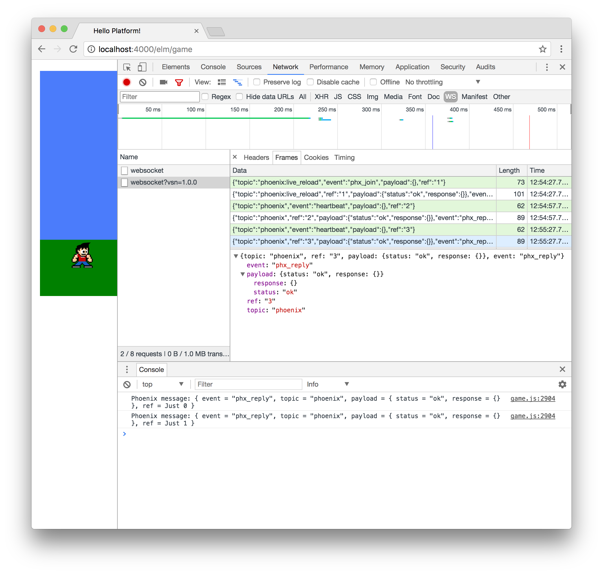

# Syncing Score Data

We have our game platform up and running where users can log in and play a
simple Elm game that tracks a score. Now let's work towards syncing the Elm
front-end of our application with the Phoenix back-end. We'll learn about
Phoenix channels with the goal of being able to communicate the score from
games back to a player's account in real-time.


## Phoenix Channels

Let's get started by using the Phoenix generator to create a new channel. Open
up your Terminal so we can run the following shell command:

```shell
mix phx.gen.channel Score
```

This command will create a `lib/platform/web/channels/score_channel.ex` file
along with a test file for us too.

The idea is that Phoenix channels will allow us to communicate over a WebSocket
so that we can sync our `playerScore` field from our Elm application to the
player's `score` field in our Phoenix application.

When we run the generator mentioned above, we should see the following output:

```shell
$ mix phx.gen.channel Score
* creating web/channels/score_channel.ex
* creating test/channels/score_channel_test.exs

Add the channel to your `web/channels/user_socket.ex` handler, for example:

    channel "score:lobby", Platform.ScoreChannel
```

Let's go ahead and follow the instructions and add our new channel to the
`user_socket.ex` file. Here's the full `user_socket.ex` file with our new
channel (with most comments removed for brevity's sake):

```elixir
defmodule Platform.Web.UserSocket do
  use Phoenix.Socket

  ## Channels
  channel "score:lobby", Platform.ScoreChannel

  ## Transports
  transport :websocket, Phoenix.Transports.WebSocket

  def connect(_params, socket) do
    {:ok, socket}
  end
1
  def id(_socket), do: nil
end
```

We can also go ahead and run our Phoenix tests to make sure everything is still
working as intended:

```shell
$ mix test
Compiling 2 files (.ex)
Generated platform app
......................................

Finished in 0.5 seconds
38 tests, 0 failures
```

## elm-phoenix-socket

The channel features come bundled with the Phoenix framework, but we'll need to
import a new library on the Elm side. To enable communication between the
front-end and back-end, let's use
[elm-phoenix-socket](https://github.com/fbonetti/elm-phoenix-socket).

To get started let's move to the `lib/platform/web/elm` folder in our project
and run the following command to install the package:

```shell
$ elm-package install fbonetti/elm-phoenix-socket
```

This will also import the `elm-lang/websocket` package, and we should see the
following output:

```shell
$ elm-package install fbonetti/elm-phoenix-socket
To install fbonetti/elm-phoenix-socket I would like to add the following
dependency to elm-package.json:

    "fbonetti/elm-phoenix-socket": "2.2.0 <= v < 3.0.0"

May I add that to elm-package.json for you? [Y/n] Y

  Install:
    elm-lang/websocket 1.0.2
    fbonetti/elm-phoenix-socket 2.2.0

Do you approve of this plan? [Y/n] Y
Starting downloads...

  ● elm-lang/websocket 1.0.2
  ● fbonetti/elm-phoenix-socket 2.2.0

Packages configured successfully!
```

## Configuring elm-phoenix-socket

Now, we can work through the
[elm-phoenix-socket README](https://github.com/fbonetti/elm-phoenix-socket/blob/master/README.md)
to configure everything on the Elm side of our application. We'll start by
importing the necessary modules. Let's update the imports at the top of our
`Game.elm` file to include three new `Phoenix` modules:

```elm
import AnimationFrame exposing (diffs)
import Html exposing (Html, div)
import Keyboard exposing (KeyCode, downs, ups)
import Phoenix.Channel
import Phoenix.Push
import Phoenix.Socket
import Random
import Svg exposing (..)
import Svg.Attributes exposing (..)
import Time exposing (Time, every, second)
```

Next, we can add a `phxSocket` field to our model. We'll update our `Model`
type first, and then provide an initial value in our `initialModel` that points
to a new function we'll create called `initPhxSocket`.

```elm
type alias Model =
    { gameState : GameState
    , characterPositionX : Float
    , characterPositionY : Float
    , characterVelocity : Float
    , characterDirection : Direction
    , itemPositionX : Int
    , itemPositionY : Int
    , itemsCollected : Int
    , phxSocket : Phoenix.Socket.Socket Msg
    , playerScore : Int
    , timeRemaining : Int
    }


initialModel : Model
initialModel =
    { gameState = StartScreen
    , characterPositionX = 50.0
    , characterPositionY = 300.0
    , characterVelocity = 0.0
    , characterDirection = Right
    , itemPositionX = 500
    , itemPositionY = 300
    , itemsCollected = 0
    , phxSocket = initPhxSocket
    , playerScore = 0
    , timeRemaining = 10
    }


initPhxSocket : Phoenix.Socket.Socket Msg
initPhxSocket =
    Phoenix.Socket.init "ws://localhost:4000/socket/websocket"
        |> Phoenix.Socket.withDebug
```

In our `initPhxSocket` function, we use the default websocket server for
Phoenix, which is `"ws://localhost:4000/socket/websocket"`. And then we
pipe the results to `Phoenix.Socket.withDebug` so we can take a look at the
DevTools Console once we get things up and running and we'll be able to
inspect the data being passed around.

Before we have a working socket connection, we'll need to add a new message
to our update section. Still following along with the elm-phoenix-socket README
file, we see that we can create a new message type at the bottom to handle
Phoenix socket messages with `PhoenixMsg`.

```elm
type Msg
    = NoOp
    | KeyDown KeyCode
    | KeyUp KeyCode
    | TimeUpdate Time
    | CountdownTimer Time
    | SetNewItemPositionX Int
    | MoveCharacter Time
    | ChangeDirection Time
    | PhoenixMsg (Phoenix.Socket.Msg Msg)
```

And we can add the following case at the bottom of our `update` function:

```elm
PhoenixMsg msg ->
  let
    ( phxSocket, phxCmd ) = Phoenix.Socket.update msg model.phxSocket
  in
    ( { model | phxSocket = phxSocket }
    , Cmd.map PhoenixMsg phxCmd
    )
```

This enables us to track changes in state using the `phxSocket` field in our
model.

Lastly, we can add to our `subscriptions` function to subscribe to changes over
time.

```elm
subscriptions : Model -> Sub Msg
subscriptions model =
    Sub.batch
        [ downs KeyDown
        , ups KeyUp
        , diffs TimeUpdate
        , diffs MoveCharacter
        , diffs ChangeDirection
        , every second CountdownTimer
        , Phoenix.Socket.listen model.phxSocket PhoenixMsg
        ]
```

At this point we should have a working socket connection when we visit the
`http://localhost:4000/elm/game` route in our application. You may need to
restart your local Phoenix server to get things up and running, but if you
load the page and wait a few moment, you should be able to see a "heartbeat"
of websocket messages in the DevTools Console.

If you're not familiar with the Chrome DevTools, you should be able to press
`Command + Option + J` on your keyboard to pull up the JavaScript Console that
displays the messages we're looking for. Another good way to inspect these
is to use the **Network** tab in the Chrome DevTools and click the **WS**
option to only view websocket communication. Here's a screenshot of what it
would look like if you're interested in taking a look:

