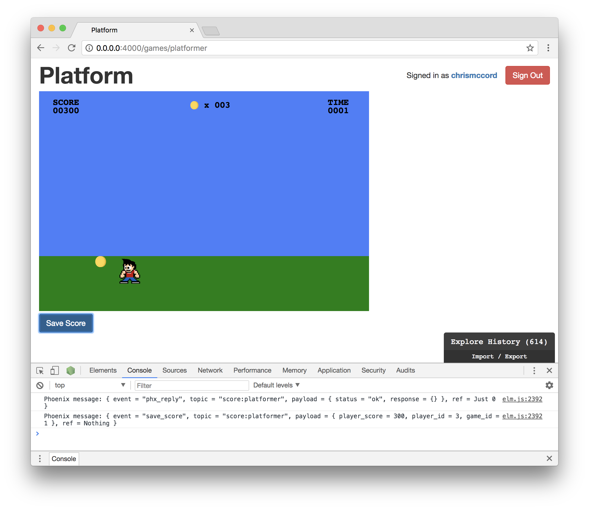
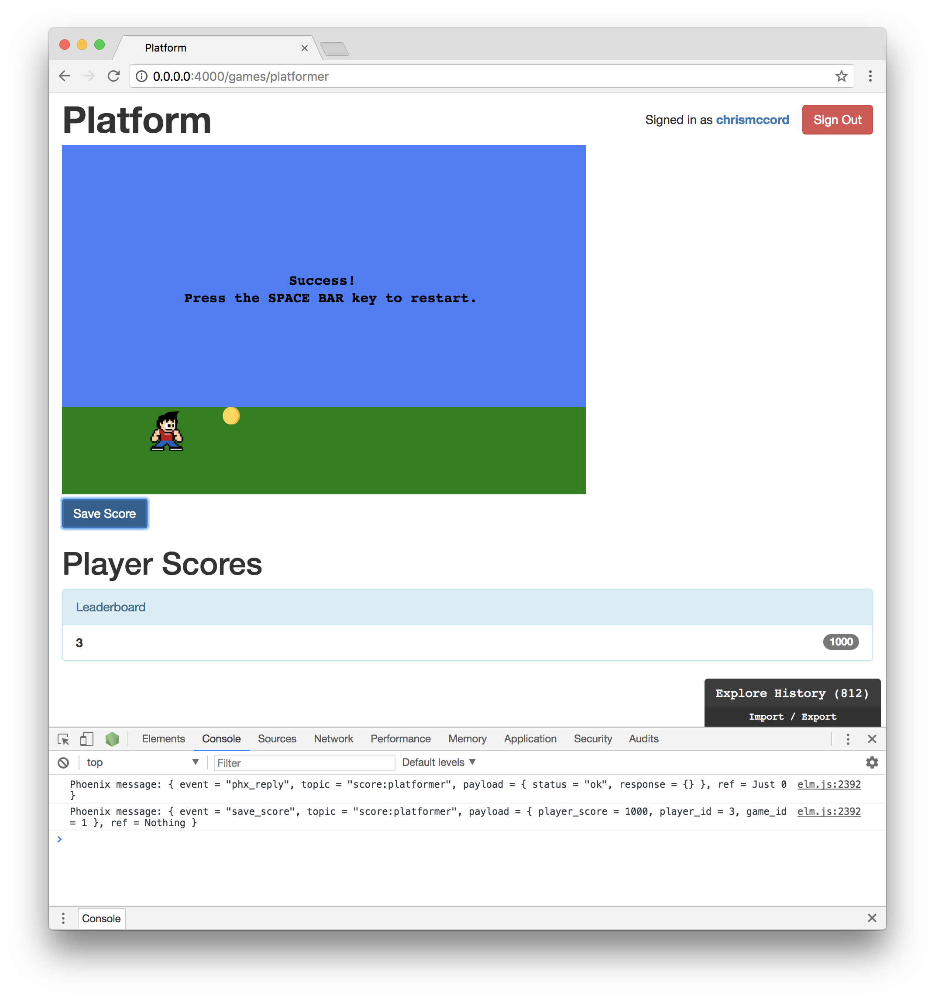

# Syncing Score Data

We created our `ScoreChannel` and set up elm-phoenix-socket in the last
chapter, but we haven't really worked with Phoenix channels much outside of the
initial configuration. In this chapter, we'll take that data from our Elm
front-end game, and find a good way to handle it with our Phoenix back-end.

## Planning Out Our Approach

Our game is tracking a `playerScore` field on the Elm side as the character
collects items. And we managed to configure elm-phoenix-socket in the last
chapter, so we have the score being sent over the `ScoreChannel` as the
`payload` value. But we'd like to display player score updates in real-time,
and be able to save scores to the database as `Gameplay` records.

We'll use the "Save Score" button to save our player scores to the database,
and to broadcast score changes to all players connected to the socket.
When we create new new database records for the score, we'll need to include
the `game_id`, the `player_id`, and the `player_score` values.

Then, we can work towards displaying recent player scores below the game.

## Updating our ScoreChannel

Let's make some changes to our `lib/platform_web/channels/score_channel.ex`
file. This is what we have so far:

```elixir
defmodule PlatformWeb.ScoreChannel do
  use PlatformWeb, :channel

  def join("score:platformer", _payload, socket) do
    {:ok, socket}
  end

  def handle_in("save_score", payload, socket) do
    broadcast(socket, "save_score", payload)
    {:noreply, socket}
  end
end
```

Instead of manually coding the name of the game in our topic, we'll destructure
the slug by pattern matching with the `<>` string concatenation operator.

```elixir
def join("score:" <> game_slug, _payload, socket) do
  {:ok, socket}
end
```

Our `Platformer.elm` file is already set up to join the `"score:platformer"`
topic. But this change means that we'll be able to use this same channel for
other games in the future, and the slug field will allow us to differentiate
between the games.

The reason this is important is that we need to know which game is being
played and the current player in order to save their score.

## Tracking Data Over the Socket

Let's make some additional changes to the `join/3` function we worked with in
the last section. We're going to learn how to assign values to the `socket`
that we can use to work with data in our channel.

Now, we can find the game that's currently being played, and assign the
`game_id` as a value we can work with in the socket. In our `join/3` function,
let's make the following changes:

```elixir
def join("score:" <> game_slug, _payload, socket) do
  game = Platform.Products.get_game_by_slug!(game_slug)
  socket = assign(socket, :game_id, game.id)
  {:ok, socket}
end
```

The `Products.get_game_by_slug!/1` function is something we created in the
**Game Setup** chapter. We can use it here to find the game record, and then
find the `game.id`.

Then, we use the `assign(socket, :game_id, game.id)` syntax to assign that
value and make it accessible when working with our `socket`. In other words,
we'll be able to use `socket.assigns.game_id` to access this value in any of
our handle functions now. This will be useful in the next section.

## Creating the Payload

In order to save our score records to the database, we'll also need to grab the
`player_score` value. Let's deconstruct that value from the `payload` argument
in our `handle_in/3` function.

```elixir
def handle_in("save_score", %{"player_score" => player_score} = payload, socket) do
  broadcast(socket, "save_score", payload)
  {:noreply, socket}
end
```

We're pattern matching the `player_score` from the `payload` so the value is
accessible inside our function.

Now, let's construct our `payload` and create our new `Gameplay` record inside
this function. We have the `player_score` value available, and the `game_id` is
accessible in the `socket`.

We're also going to hard-code the `player_id` value (using `3` for the
`chrismccord` account we've been seeing in all the screenshots) for now. We'll
take a look at socket authentication and tracking the current user in our
channel soon.

```elixir
def handle_in("save_score", %{"player_score" => player_score} = payload, socket) do
  payload = %{
    player_score: player_score,
    game_id: socket.assigns.game_id,
    player_id: 3
  }

  Platform.Products.create_gameplay(payload)
  broadcast(socket, "save_score", payload)
  {:noreply, socket}
end
```

## Creating Gameplays

Our channel features should now work using the `create_gameplay/1` function
from our `lib/platform/products.ex` file. To save new records in our
`"gameplays"` table, we'll be passing a `game_id`, a `player_id`, and a
`player_score` to `create_gameplay/1`.

```elixir
def create_gameplay(attrs \\ %{}) do
  %Gameplay{}
  |> Gameplay.changeset(attrs)
  |> Repo.insert()
end
```

When we load our game in the browser, we should now be able to click the "Save
Score" button and create records in the database.

For the output and screenshot below, we collected a few coins and then clicked
the "Save Score" button. We can see that the `"save_score"` message was
triggered for the `"score:platformer"` topic. And the `payload` contains the
data we set up in the `handle_in/3` function from our `ScoreChannel`.

We have the `player_score` field being tracked from the game, and we're taking
the `game_id` from the value we grabbed in the `join/3` function. We can also
see the hard-coded value of `3` that we set for the `player_id` field, and
we'll take care of socket authentication soon.

```shell
Phoenix message: { event = "save_score", topic = "score:platformer", payload = { player_score = 300, player_id = 3, game_id = 1 }, ref = Nothing }
```



## Viewing Gameplay Records

At this point, we should have a working button to save our player scores to the
database. But we don't have any way of viewing them yet. Let's add a list of
all the existing `Gameplay` records below the game.

In our `Platformer.elm` file, we'll start out by adding a new type alias for
our `Gameplay`s:

```elm
type alias Gameplay =
    { gameId : Int
    , playerId : Int
    , playerScore : Int
    }
```

Then, we can update our `Model` and `initialModel` to start out with an empty
list of `Gameplay` records:

```elm
type alias Model =
    { characterDirection : Direction
    , characterPositionX : Int
    , characterPositionY : Int
    , gameplays : List Gameplay
    , gameState : GameState
    , itemPositionX : Int
    , itemPositionY : Int
    , itemsCollected : Int
    , phxSocket : Phoenix.Socket.Socket Msg
    , playerScore : Int
    , timeRemaining : Int
    }


initialModel : Model
initialModel =
    { characterDirection = Right
    , characterPositionX = 50
    , characterPositionY = 300
    , gameplays = []
    , gameState = StartScreen
    , itemPositionX = 500
    , itemPositionY = 300
    , itemsCollected = 0
    , phxSocket = initialSocketJoin
    , playerScore = 0
    , timeRemaining = 10
    }
```

Now, we can reuse some of the view functions we created in the `Main.elm` file
to view the `Gameplay` records being shared over the socket.

We'll start out by updating the `import` statements at the top of the file for
the `Html` modules. Keep in mind that we have to be pretty specific with the
way we refer to our `Html` functions, because we did a global import for `Svg`
that could cause collisions. Update the imports at the top of the file with the
following:

```elm
import Html exposing (Html, button, div, li, span, strong, ul)
import Html.Attributes
```

We can now add our view functions below the `viewSaveScoreButton` we added
previously. We'll start with a `viewGameplaysIndex` function that allows us
to render our `model.gameplays` if any exist:

```elm
viewGameplaysIndex : Model -> Html Msg
viewGameplaysIndex model =
    if List.isEmpty model.gameplays then
        div [] []
    else
        div [ Html.Attributes.class "players-index" ]
            [ viewGameplaysList model.gameplays
            ]
```

Next, we'll add a `viewGameplaysList` function that renders the panel component
we got from Bootstrap. And we'll use this to display our list of player scores:

```elm
viewGameplaysList : List Gameplay -> Html Msg
viewGameplaysList gameplays =
    div [ Html.Attributes.class "players-list panel panel-info" ]
        [ div [ Html.Attributes.class "panel-heading" ] [ text "Player Scores" ]
        , ul [ Html.Attributes.class "list-group" ] (List.map viewGameplayItem gameplays)
        ]
```

Then, we can add our inidividual gameplays as list items with a
`viewGameplayItem` function. Each gameplay record will be displayed with the
`playerId` field and the corresponding `playerScore`:

```elm
viewGameplayItem : Gameplay -> Html Msg
viewGameplayItem gameplay =
    li [ Html.Attributes.class "player-item list-group-item" ]
        [ strong [] [ text (toString gameplay.playerId) ]
        , span [ Html.Attributes.class "badge" ] [ text (toString gameplay.playerScore) ]
        ]
```

Finally, we can add this to our main `view` function:

```elm
view : Model -> Html Msg
view model =
    div []
        [ viewGame model
        , viewSaveScoreButton
        , viewGameplaysIndex model
        ]
```

Our view is all set, but we won't see anything rendering in the browser yet,
because we still need to decode the gameplays into our Elm application. In
other words, we're successfully sending our gameplays over the socket when we
click the "Save Score" button, but we're not receiving score changes yet.

## Receiving and Rendering Score Changes

To display gameplays, we'll start by adding a new case to our `update`
function. First, we'll add the `ReceiveScoreChanges` type to our update
messages:

```elm
type Msg
    = NoOp
    | CountdownTimer Time
    | KeyDown KeyCode
    | PhoenixMsg (Phoenix.Socket.Msg Msg)
    | ReceiveScoreChanges Encode.Value
    | SaveScore Encode.Value
    | SaveScoreError Encode.Value
    | SaveScoreRequest
    | SetNewItemPositionX Int
    | TimeUpdate Time
```

We can now add the following case to decode score changes and append them to
the model. When a gameplay is successfully decoded (with an `Ok` response),
we're taking that value and using the cons operator `::` to add it to the list
of gameplays stored in `model.gameplays`.

```elm
ReceiveScoreChanges raw ->
    case Decode.decodeValue gameplayDecoder raw of
        Ok scoreChange ->
            ( { model | gameplays = scoreChange :: model.gameplays }, Cmd.none )

        Err message ->
            Debug.log "Error receiving score changes."
                ( model, Cmd.none )
```

Note that this will require us to add another `import` at the top of our file
to go along with our JSON encoder:

```elm
import Json.Decode as Decode
import Json.Encode as Encode
```

Just like we did with our decoders in the `Main.elm` file, we'll add a decoder
for our `Gameplay` type:

```elm
gameplayDecoder : Decode.Decoder Gameplay
gameplayDecoder =
    Decode.map3 Gameplay
        (Decode.field "game_id" Decode.int)
        (Decode.field "player_id" Decode.int)
        (Decode.field "player_score" Decode.int)
```

We were previously able to construct a payload that we were sending over the
socket with our score data using `Json.Encode`. Now, we're also able to decode
data that comes from the socket and add it to our Elm application.

## Displaying the Results

We now have everything we need to display the scores that are being saved. To
get this working, let's update our `initialSocket` function with the
`ReceiveScoreChanges` message so that we can start receiving score changes when
the socket is initialized:

```elm
initialSocket : ( Phoenix.Socket.Socket Msg, Cmd (Phoenix.Socket.Msg Msg) )
initialSocket =
    let
        devSocketServer =
            "ws://localhost:4000/socket/websocket"
    in
        Phoenix.Socket.init devSocketServer
            |> Phoenix.Socket.withDebug
            |> Phoenix.Socket.on "save_score" "score:platformer" SaveScore
            |> Phoenix.Socket.on "save_score" "score:platformer" ReceiveScoreChanges
            |> Phoenix.Socket.join initialChannel
```

We should now be able to reload the game in the browser and try things out.
We'll move the character around to collect a few coins, and then click the
"Save Score" button to send the data over the channel. Not only will we be
creating database records for our gameplays, we're also broadcasting the data
over the socket and displaying it at the bottom of the page!



In the screenshot above, we can see that the player was able to successfully
collect ten coins, click the "Save Score" button, and then see the score
rendered on the page with the `playerId` and `playerScore`.

## Summary

In the last two chapters, we've managed to successfully configure our Phoenix
channel, save records to the database, send data over the socket, and render
the results.

But one of the key features for our games will be to track scores for
individual players. Remember that we hard-coded the `player_id` value in our
`ScoreChannel`, so we're storing all of our `Gameplay` records for a single
player. In the next chapter, we'll tackle socket authentication, which will
allow us to track scores for different players as they join the channel.
