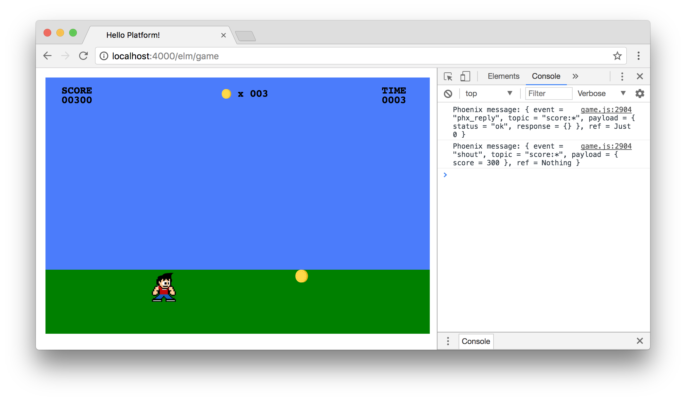

# Syncing Score Data

*This chapter is a work in progress!*

We have our game platform up and running, where users can sign in and play a
simple Elm game that tracks a score. Now let's work towards syncing the Elm
front-end of our application with the Phoenix back-end. We'll learn about
Phoenix channels with the goal of being able to communicate the score from
games back to a player's account in real-time.

## Phoenix Channels

Let's get started by using the Phoenix generator to create a new `Score`
channel. Open up your Terminal so we can run the following shell command:

```shell
$ mix phx.gen.channel Score
```

This command will create a `lib/platform_web/channels/score_channel.ex` file
along with a test file for us too.

The idea is that Phoenix channels will allow us to communicate over a WebSocket
so that we can sync our `playerScore` field from our Elm application to the
player's `score` field in our Phoenix application.

When we run the generator mentioned above, we should see the following output:

```shell
$ mix phx.gen.channel Score
* creating lib/platform_web/channels/score_channel.ex
* creating test/platform_web/channels/score_channel_test.exs

Add the channel to your `lib/platform_web/channels/user_socket.ex` handler, for example:

    channel "score:lobby", PlatformWeb.ScoreChannel
```

## Updating the UserSocket

Let's go ahead and follow the instructions and add our new channel to the
`user_socket.ex` file. Here's the full `user_socket.ex` file with our new
channel (with most comments removed for brevity's sake):

```elixir
defmodule Platform.Web.UserSocket do
  use Phoenix.Socket

  ## Channels
  channel "score:*", PlatformWeb.ScoreChannel

  ## Transports
  transport :websocket, Phoenix.Transports.WebSocket

  def connect(_params, socket) do
    {:ok, socket}
  end

  def id(_socket), do: nil
end
```

## elm-phoenix-socket

The channel features come bundled with the Phoenix framework, but we'll need to
import a new library on the Elm side. To enable communication between the
front-end and back-end, let's use
[elm-phoenix-socket](https://github.com/fbonetti/elm-phoenix-socket).

To get started, let's move to the `assets` folder in our project, and run the
following command to install the package:

```shell
$ elm-package install fbonetti/elm-phoenix-socket
```

This will also import the `elm-lang/websocket` package, and we should see the
following output:

```shell
$ elm-package install fbonetti/elm-phoenix-socket
To install fbonetti/elm-phoenix-socket I would like to add the following
dependency to elm-package.json:

    "fbonetti/elm-phoenix-socket": "2.2.0 <= v < 3.0.0"

May I add that to elm-package.json for you? [Y/n] Y

  Install:
    elm-lang/websocket 1.0.2
    fbonetti/elm-phoenix-socket 2.2.0

Do you approve of this plan? [Y/n] Y
Starting downloads...

  ● elm-lang/websocket 1.0.2
  ● fbonetti/elm-phoenix-socket 2.2.0

Packages configured successfully!
```

## Configuring elm-phoenix-socket

Now, we can work through the elm-phoenix-socket
[README](https://github.com/fbonetti/elm-phoenix-socket/blob/master/README.md)
to configure everything on the Elm side of our application. We'll start by
importing the necessary modules. Let's update the imports at the top of our
`Platformer.elm` file to include three new `Phoenix` modules:

```elm
module Platformer exposing (..)

import AnimationFrame exposing (diffs)
import Html exposing (Html, div)
import Keyboard exposing (KeyCode, downs)
import Phoenix.Channel
import Phoenix.Push
import Phoenix.Socket
import Random
import Svg exposing (..)
import Svg.Attributes exposing (..)
import Time exposing (Time, every, second)
```

Next, we can add a `phxSocket` field to our model. We'll update our `Model`
type first, and then provide an initial value in our `initialModel` that points
to a new function we'll create called `initialSocket`.

```elm
type alias Model =
    { gameState : GameState
    , characterPositionX : Int
    , characterPositionY : Int
    , itemPositionX : Int
    , itemPositionY : Int
    , itemsCollected : Int
    , phxSocket : Phoenix.Socket.Socket Msg
    , playerScore : Int
    , timeRemaining : Int
    }


initialModel : Model
initialModel =
    { gameState = StartScreen
    , characterPositionX = 50
    , characterPositionY = 300
    , phxSocket = initialSocket
    , itemPositionX = 150
    , itemPositionY = 300
    , itemsCollected = 0
    , playerScore = 0
    , timeRemaining = 10
    }


initialSocket : Phoenix.Socket.Socket Msg
initialSocket =
    let
        devSocketServer =
            "ws://localhost:4000/socket/websocket"
    in
        Phoenix.Socket.init devSocketServer
            |> Phoenix.Socket.withDebug
```

In our `initialSocket` function, we use a `let` expression to set up the
default WebSocket server for the Phoenix development environment, which is
`"ws://localhost:4000/socket/websocket"`. And then we pipe the results to
`Phoenix.Socket.withDebug` so we can take a look at the DevTools Console and
inspect the data once we get things up and running.

## The Update Function

Before we have a working socket connection, we'll need to add a new message
to our update section. Still following along with the elm-phoenix-socket README
file, we see that we can create a new message type at the bottom to handle
Phoenix socket messages with `PhoenixMsg`.

```elm
type Msg
    = NoOp
    | CountdownTimer Time
    | KeyDown KeyCode
    | PhoenixMsg (Phoenix.Socket.Msg Msg)
    | SetNewItemPositionX Int
    | TimeUpdate Time
```

And we can add the following inside the `case` expression of our `update`
function:

```elm
PhoenixMsg msg ->
  let
    ( phxSocket, phxCmd ) = Phoenix.Socket.update msg model.phxSocket
  in
    ( { model | phxSocket = phxSocket }
    , Cmd.map PhoenixMsg phxCmd
    )
```

This enables us to track changes in state using the `phxSocket` field in our
model.

## Socket Subscription

Lastly, we can add to our `subscriptions` function to subscribe to changes over
time.

```elm
subscriptions : Model -> Sub Msg
subscriptions model =
    Sub.batch
        [ downs KeyDown
        , diffs TimeUpdate
        , every second CountdownTimer
        , Phoenix.Socket.listen model.phxSocket PhoenixMsg
        ]
```

At this point, we should have a working socket connection when we visit the
`http://0.0.0.0:4000/games/platformer` route in our application. You may need to
restart your local Phoenix server to get things up and running, but if you
load the page and wait a few moments, you should be able to see a "heartbeat"
of websocket messages in the DevTools Console.

## Using the DevTools

If you're not familiar with the Chrome DevTools, you should be able to press
`Command + Option + J` on your keyboard to pull up the JavaScript Console that
displays the messages we're looking for. Another good way to inspect these
is to use the **Network** tab in the Chrome DevTools and click the **WS**
option to only view WebSocket communication. Here's a screenshot of what it
should look like if you're interested in taking a look:


For now, our `payload` is empty since we haven't explicitly sent any data yet,
but we can tell that it's working with the `status = "ok"` indicator and see
that it changes over time because it increments the `Just <number>` indicator.
This is what the messages should look like in the DevTools Console:

```shell
Phoenix message: { event = "phx_reply", topic = "phoenix", payload = { status = "ok", response = {} }, ref = Just 0 }
Phoenix message: { event = "phx_reply", topic = "phoenix", payload = { status = "ok", response = {} }, ref = Just 1 }
Phoenix message: { event = "phx_reply", topic = "phoenix", payload = { status = "ok", response = {} }, ref = Just 2 }
```

## Sending Data Over the Socket

Now that we have an initial setup, we can start sending data. We want to send
the score that we already have available in the Elm model over the socket to
the Phoenix back-end. We can start by adding a new message to our update
section. Add `SendScoreRequest` to our `Msg` type:

```elm
type Msg
    = NoOp
    | CountdownTimer Time
    | KeyDown KeyCode
    | PhoenixMsg (Phoenix.Socket.Msg Msg)
    | SendScoreRequest
    | SetNewItemPositionX Int
    | TimeUpdate Time
```

Then, let's add the following to our `update` function:

```elm
SendScoreRequest ->
    let
        payload =
            Encode.object [ ( "player_score", Encode.int model.playerScore ) ]
    in
        ( model, Cmd.none )
```

We'll need to import Elm's JSON encoding package, so add this to the imports
at the top of the file:

```elm
import Json.Encode as Encode
```

With `SendScoreRequest`, we're starting to construct a `payload` that we'll use
to send our Elm data. We take the `playerScore` that's part of our Elm model
and we encode is as a JSON integer with `Encode.int`. Then, we wrap that up in
a JSON object that we can use to send it to the Phoenix back-end. Keep in mind
that we're still using `(model, Cmd.none)` so far, so we're not actually
pushing data over the socket yet.

## Phoenix.Push

To continue, we'll use the `Phoenix.Push` module that we imported at the top of
our file. We want to initialize using the `"score:lobby"` channel that we
created on the Phoenix side, and we'll use the `payload` we constructed to send
along the relevant data. We'll also use the pipe operator to pass data along
and handle the success and failure cases.

```elm
SendScoreRequest ->
    let
        payload =
            Encode.object [ ( "player_score", Encode.int model.playerScore ) ]

        phxPush =
            Phoenix.Push.init "shout" "score:lobby"
                |> Phoenix.Push.withPayload payload
                |> Phoenix.Push.onOk SendScore
                |> Phoenix.Push.onError SendScoreError
    in
        ( model, Cmd.none )
```

We'll need to scaffold out new messages for `SendScore` and
`SendScoreError` for the success and failure cases, respectively. We can add
these to our `Msg` type first, and they'll both take an `Encode.Value` as an
argument:

```elm
type Msg
    = NoOp
    | CountdownTimer Time
    | KeyDown KeyCode
    | PhoenixMsg (Phoenix.Socket.Msg Msg)
    | SendScore Encode.Value
    | SendScoreError Encode.Value
    | SendScoreRequest
    | SetNewItemPositionX Int
    | TimeUpdate Time
```

And we can add cases at the bottom of our `update` function to get our code
back to a state with no errors, and we're one step closer to connecting our
front-end with our back-end.

```elm
SendScore value ->
    ( model, Cmd.none )

SendScoreError message ->
    Debug.log "Error sending score over socket."
        ( model, Cmd.none )
```

## Executing the Push

In our `SendScore` case, we're going to connect everything together by sending
data over the `phxSocket`.

```elm
SendScoreRequest ->
    let
        payload =
            Encode.object [ ( "player_score", Encode.int model.playerScore ) ]

        phxPush =
            Phoenix.Push.init "shout" "score:lobby"
                |> Phoenix.Push.withPayload payload
                |> Phoenix.Push.onOk SendScore
                |> Phoenix.Push.onError SendScoreError

        ( phxSocket, phxCmd ) =
            Phoenix.Socket.push phxPush model.phxSocket
    in
        ( { model | phxSocket = phxSocket }
        , Cmd.map PhoenixMsg phxCmd
        )
```

## Joining the Channel

Now we can join the `"score:lobby"` channel and broadcast the player's score.
Below our `initialSocket` function, let's create a new function called
`initialChannel`.

```elm
initialChannel : Phoenix.Channel.Channel msg
initialChannel =
    Phoenix.Channel.init "score:lobby"
```

We're going to adjust the `initialSocket` function so that it returns a tuple.
The first item in that tuple is what we'll use for the `phxSocket` field in our
`initialModel`, and then second item in the tuple will be used as the initial
command in our `init` function.

Here is the full code for our `initialModel`, `initPhxSocket`, and `init`
functions:

```elm
initialSocket : ( Phoenix.Socket.Socket Msg, Cmd (Phoenix.Socket.Msg Msg) )
initialSocket =
    let
        devSocketServer =
            "ws://localhost:4000/socket/websocket"
    in
        Phoenix.Socket.init devSocketServer
            |> Phoenix.Socket.withDebug
            |> Phoenix.Socket.on "shout" "score:lobby" SendScore
            |> Phoenix.Socket.join initialChannel
```

We can create two new functions to identify which parts of the tuple we need:

```elm
initialSocketJoin : Phoenix.Socket.Socket Msg
initialSocketJoin =
    initialSocket
        |> Tuple.first


initialSocketCommand : Cmd (Phoenix.Socket.Msg Msg)
initialSocketCommand =
    initialSocket
        |> Tuple.second
```

Now, we can set the `phxSocket` field in our `initialModel` to
`initialSocketJoin`:

```elm
initialModel : Model
initialModel =
    { gameState = StartScreen
    , characterPositionX = 50
    , characterPositionY = 300
    , phxSocket = initialSocketJoin
    , itemPositionX = 150
    , itemPositionY = 300
    , itemsCollected = 0
    , playerScore = 0
    , timeRemaining = 10
    }
```

And we can update our `init` function with the `initialSocketCommand` to get
things up and running:

```elm
init : ( Model, Cmd Msg )
init =
    ( initialModel, Cmd.map PhoenixMsg initialSocketCommand )
```

This is a lot to process, but let's keep moving for now so we can get things
working, and we'll work towards a deeper understanding as we gain more
familiarity with the code we're working with.

## Triggering SendScore

Finally, we just need to trigger the `SendScoreRequest` message whenever we
want to send our score over the socket. We'll find a good time to continuously
update our score, but for now we want to set up a manual trigger so we can test
things out. We'll set it up so that we can click a button, and then check the
DevTools console to view the `payload` that's being sent over the socket.

At the top of our file, let's import the `onClick` functionality from
`Html.Events`. While we're here, we also want to make a quick change to the
`Html` import so we can use the `button` element. Here are the `Html` imports:

```elm
import Html exposing (Html, button, div)
import Html.Events exposing (onClick)
```

## Adding a Button to the View

Now, we can create a new `viewSendScoreButton` function and add it to our main
`view` to trigger the `SendScoreRequest` message.

```elm
view : Model -> Html Msg
view model =
    div []
        [ viewGame model
        , viewSendScoreButton
        ]


viewSendScoreButton : Html Msg
viewSendScoreButton =
    div []
        [ button
            [ onClick SendScoreRequest
            , class "btn btn-primary"
            ]
            [ text "Send Score" ]
        ]
```

## Testing Out the Socket

We've got everything configured, and we should be able to test out our working
socket payload. Start the Phoenix server with `mix phx.server` and load the
game in the browser. Collect a few coins to increment the player's score, and
then click the new "Send Score" button.

The DevTools console will show an initial message when the page loads, and this
let's us know that our `"score:lobby"` topic was initialized with an `"ok"`
status.

```shell
Phoenix message: { event = "phx_reply", topic = "score:lobby", payload = { status = "ok", response = {} }, ref = Just 0 }
```

We also see a message triggered in the DevTools console when we click the score
text. It shows that we triggered a `"shout"` event, which means we can
broadcast the data over the socket. This is the behavior we want, because we'll
want all the player scores to be visible and update in real-time on the Phoenix
page where we list out all the players. In this example, you can see that we
collected three coins for a score of `300`, and that is reflected in the
payload with `{ score = 300 }`.

```shell
Phoenix message: { event = "shout", topic = "score:lobby", payload = { player_score = 300 }, ref = Nothing }
```



## Summary

We made it a _long_ way in this chapter, but we still haven't accomplished our
goal of syncing data between the Elm front-end and Phoenix back-end.

We created a new Phoenix channel, we installed elm-phoenix-socket, and we
configured our game to send a payload. But we still need to handle the data
that's being sent from the front-end. Let's take a look at these topics in the
next chapter.
